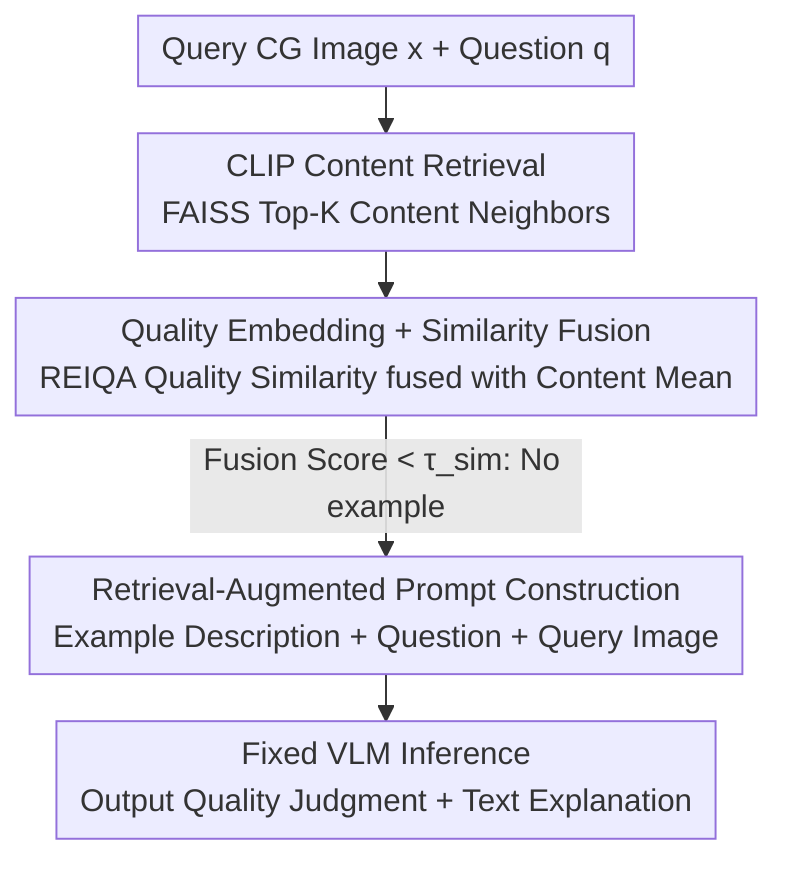

# R4-CGQA: Retrieval-based Vision Language Models for Computer Graphics Image Quality Assessment

**Conference**: CVPR 2026  
**Paper**: [CVF Open Access](https://openaccess.thecvf.com/content/CVPR2026/html/Li_R4-CGQA_Retrieval-based_Vision_Language_Models_for_Computer_Graphics_Image_Quality_CVPR_2026_paper.html)  
**Code**: https://github.com/lizhuangzi/R4-CGQA  
**Area**: Multimodal VLM  
**Keywords**: Computer Graphics, Image Quality Assessment, Retrieval-Augmented Generation, Vision Language Models, Content-Quality Dual-Stream Retrieval

## TL;DR
Addressing the issues of "Computer Graphics (CG) image quality assessment lacking explainable text descriptions" and "VLMs being inaccurate in direct CG quality judgment," R4-CGQA first constructs the first 3.5K CG dataset with six-dimensional quality descriptions. It then proposes a **content-quality dual-stream retrieval** framework. By feeding quality descriptions of visually similar CG images as examples to VLMs without fine-tuning, it consistently improves the CG quality assessment capabilities of models like LLaVA, Llama 3.2-V, and Qwen2.5-VL.

## Background & Motivation
**Background**: CG rendering (games, 3D animation, visual effects) demands extremely high image quality. Industry practitioners require intelligent algorithms to evaluate and guide CG content rendering quality.

**Limitations of Prior Work**: ① Existing CG datasets only provide scalar Mean Opinion Scores (MOS) without explaining "why a score was given," failing to guide rendering improvements. ② Directly applying Natural Image Quality Assessment (IQA) methods to CG is inappropriate, as CG is entirely simulated (objects, textures, light sources, camera views), with distortion and perceptual characteristics significantly different from natural images. ③ Although VLMs possess quality description capabilities, they are prone to hallucinations in knowledge-uncertain domains like CG Quality Assessment (CGQA). Fine-tuning VLMs requires massive computation and data and makes it difficult to keep knowledge updated.

**Key Challenge**: Effective CGQA must provide **explainable quality reasons** (to guide improvement) without relying on expensive fine-tuning; however, direct zero-shot quality judgment by VLMs lacks precision.

**Goal**: ① Create a dataset that systematically describes CG quality dimensions. ② Design a tuning-free, universal CGQA framework capable of directly enhancing existing VLMs.

**Key Insight**: The authors made a crucial observation (Fig. 2): providing VLMs with **quality descriptions of visually similar CG images** as references significantly improves their accuracy in answering target CG quality questions, whereas irrelevant descriptions are harmful. This inspires the use of Retrieval-Augmented Generation (RAG) for CGQA.

**Core Idea**: Use "content similarity + quality similarity" dual-stream retrieval to select the most suitable example descriptions from a CG database and concatenate them into the prompt for the VLM, unlocking the VLM's CGQA potential without fine-tuning.

## Method

### Overall Architecture
R4-CGQA is a RAG-style two-stage retrieval + VLM inference pipeline. The input consists of a query CG image $x$ and a natural language question $q$ regarding its quality. The system first retrieves the most similar image from a CG database $D=\{(x_i,t_i)\}_{i=1}^N$ containing manual quality descriptions, retrieves its description $t_{I^\star}$, and then concatenates the "example description + question + query image" into a retrieval-augmented prompt for a fixed-parameter VLM. The output includes a scalar quality judgment (e.g., "Excellent quality") and a free-text explanation. Retrieval is conducted in two stages: **Stage 1** uses CLIP content embeddings for coarse filtering, using FAISS global indexing to obtain Top-K content neighbors; **Stage 2** calculates quality similarity using REIQA quality embeddings among these K candidates, combines it with content similarity, and selects the final example. The framework does not modify VLM weights, only injecting retrieved descriptions during inference.

### Key Designs

**1. Six-dimensional CG Quality Description Dataset: Encoding "Why" into Annotations**

Existing CG datasets only contain MOS scalar scores, have low resolution, and provide no reasons for scores, failing to support intelligent assessment via multimodal LLMs. The authors consulted CG practitioners to abstract **6 CG quality dimensions**: lighting quality, material quality, color quality, mood, realism, and space. Fifteen annotators with gaming or CG backgrounds were recruited (trained on a unified scoring scale) and required to describe quality from at least the 3 most prominent dimensions and provide an overall conclusion. Annotations underwent cross-verification and dispute re-labeling. The final dataset contains **3.5K high-resolution CG images** (1080p–4K, covering medieval/modern/dark realism, fantasy, cartoon styles, etc., from Wallpaper Engine, game screenshots, CGIQA-6K subsets, etc.). Most descriptions exceed 1000 characters and are rich in detail. Data is split into a base set (3190 images for training/fine-tuning/retrieval), validation (90 images), and testing (220 images). The latter two use GPT-4o to generate three types of questions: multiple-choice, yes-or-no, and general Q&A (each $\ge$ 5 questions), totaling >5K QA pairs as a benchmark. This is the first dataset to systematically explain CG image quality.

**2. Content-Quality Dual-Stream Retrieval: Selecting Examples "Mirroring Content and Quality"**

Prior works only used content similarity retrieval, but **CG images with identical content can vary greatly in quality**, and CLIP is relatively insensitive to image degradation. If "similar" images have large quality discrepancies, feeding them to a VLM may be misleading. Thus, dual-stream is introduced: for any image $z$, content embedding $f_c(z)$ is computed using CLIP and quality embedding $f_q(z)$ using REIQA, both $\ell_2$ normalized. **Stage 1 Content Retrieval**: Calculate the content cosine similarity $s_c(x,x_i)=\hat f_c(x)^\top\hat f_c(x_i)$ and use FAISS global indexing to obtain Top-K candidates $S_K(x)$. **Stage 2 Quality Fusion**: Calculate quality similarity $s_q(x,x_i)=\hat f_q(x)^\top\hat f_q(x_i)$ only for these K candidates and fuse it with content similarity via simple averaging:

$$S(x,x_i)=\tfrac{1}{2}s_c(x,x_i)+\tfrac{1}{2}s_q(x,x_i),\quad i\in S_K(x)$$

The candidate with the highest fusion score $I^\star(x)=\arg\max_{i\in S_K(x)}S(x,x_i)$ is chosen as the example. This "coarse content filtering followed by fine quality ranking" design ensures examples are both content-relevant and quality-proximate, proving more robust than single-branch approaches.

**3. Threshold Gated Prompt Construction and VLM Inference: Conservative Example Injection**

Retrieved descriptions are not always reliable. If the database lacks a sufficiently similar image, forcing an irrelevant description acts as noise and harms VLM judgment. A threshold $\tau_\text{sim}$ is established: if $\max_{i\in S_K(x)}S(x,x_i)<\tau_\text{sim}$, **no example description is injected**, and the VLM answers based only on the query image and question. Once transition $I^\star$ is selected, the fixed template $\text{FORMAT}(q,t_{I^\star})$ presents the example description first, followed by the question. The image and text prompt are fed into the VLM to obtain a scalar judgment and text explanation. This "use only if similar enough" gating is a critical insurance policy against retrieval noise.

## Key Experimental Results

### Main Results
Contrasts were performed on the testing set across 10 representative VLMs ("Original" = VLM direct answer, "R4-CGQA" = adding proposed retrieval; Choice/Yes-or-no use accuracy, Q&A uses GPT-4o-mini scoring on a 5-point scale). R4-CGQA brings improvements to every model on every metric:

| VLM | Choice (Orig→R4) | Yes-or-no (Orig→R4) | Q&A (Orig→R4) |
|-----|------|------|------|
| LLaVA 1.6-7B | 51.70→58.06 (+6.36) | 49.73→58.84 (+9.11) | 2.20→2.50 |
| LLaVA 1.6-13B | 53.96→61.43 (+7.47) | 51.34→60.37 (+9.03) | 2.22→2.56 |
| Llama 3.2-V-11B | 64.59→67.28 (+2.69) | 56.87→67.26 (+10.39) | 1.93→2.31 |
| MiniCPM-V-8B | 60.05→67.63 (+7.58) | 53.47→61.98 (+8.51) | 1.92→2.34 |
| BakLLaVA-7B | 43.72→55.97 (+12.25) | 52.85→61.17 (+8.32) | 1.67→1.96 |
| Qwen 2.5-VL-32B | 77.71→79.21 (+1.50) | 67.50→70.24 (+2.74) | 2.79→2.87 |

Average absolute gain in Choice is 4.26%, Yes-or-no gain is 6.94%, and Q&A gain is +0.32 points (6.40% of the total score). Gains are **most significant for smaller, weaker models** (e.g., BakLLaVA Choice +12.25%), but non-trivial improvements are seen for strong models (Qwen 32B, LLaVA-NeXT-32B). On LLaVA 1.6-13B, this method only introduces 4.5% runtime overhead and an additional 1748 MB VRAM.

### Ablation Study
Ablation of content/quality dual-stream retrieval ("w/o." = removing a branch):

| Configuration | LLaVA 1.6-7B Choice / Yes-or-no | Llama 3.2-V-11B Choice / Yes-or-no |
|------|------|------|
| Base (No Retrieval) | 50.1% / 48.8% | 65.3% / 55.8% |
| w/o. quality | 56.8% / 59.0% | 61.0% / 68.3% |
| w/o. content | 57.0% / 60.4% | 65.2% / 68.9% |
| **Full (Dual-stream)** | **59.8% / 59.9%** | **66.7% / 69.0%** |

Full dual-stream relative to Base shows +9.7%/+11.1% gain in Choice/Yes-or-no on LLaVA-7B and +13.2% in Yes-or-no on Llama. All "Full" configurations achieve the highest Q&A scores, proving dual-stream is more robust than either single branch.

### Key Findings
- **Optimal K Value**: For LLaVA 1.6-7B (T=0.8), accuracy rises as K increases from 1 to 5 (Choice/Yes-or-no reaching 59.8%/59.9%) and drops as K increases further. Small candidate sets lack good examples, while large ones introduce noise; a medium neighborhood is best.
- **Role of Threshold T**: Accuracy is stable between T=0.7–0.9, with K=5 being more stable than K=7. At T=1.0 (no examples selected), Yes-or-no accuracy drops sharply, validating the value of example descriptions.
- **Multi-image input is not a good alternative**: On Pixtral (which handles multi-images), directly feeding similar images and the query image (Multi-image only) decreased Choice accuracy by 2.3%. Even with this method, it remained 2.5% lower than R4-CGQA alone, indicating VLMs struggle with multi-image comparative analysis. "Retrieval descriptions as text context" is superior to "direct multi-image injection."

## Highlights & Insights
- **"Quality Must Also Match" is the Core Insight**: CLIP is insensitive to degradation; retrieving solely by content might select images with similar content but vastly different quality, misleading the VLM. Introducing the REIQA quality embedding as the second stream is the sophisticated leap over naive RAG-IQA.
- **Tuning-free, Plug-and-play**: Improves LLaVA/Llama/Qwen universally without changing VLM weights—minimal overhead (4.5% runtime, 1.7GB VRAM) makes it industrial-friendly.
- **Gating mechanism reflects "Quality over Quantity"**: The biggest risk of RAG is noise injection. Using a similarity threshold to "actively abandon injection when no sufficiently similar example exists" is a generally applicable lesson for RAG methods.
- **First Explainable CG Quality Dataset**: The six-dimension + long-text descriptions clarify "why this quality," moving CGQA from mere "scoring" toward "explanation + rendering guidance."

## Limitations & Future Work
- **Retrieval Failures Inject Noise**: As discussed by the authors (Fig. 9), when retrieved images do not match the query semantics, the injected quality descriptions mismatch the question, causing misguidance—threshold gating only mitigates, not eliminates, this.
- **Dependency on External Encoders**: Dual-stream retrieval quality is limited by the transferability of REIQA (quality) and CLIP (content) in the CG domain. Whether their embeddings are sufficiently discriminative given the distribution gap between CG and natural images remains an open question.
- **Data Scale and Coverage**: 3.5K images/6 dimensions is a first, but still small compared to natural image IQA datasets. Style/rendering engine coverage is limited, and benchmark questions generated by GPT-4o may carry model bias.
- **Future Directions**: Exploring dedicated CG quality embeddings (rather than using REIQA), learnable content-quality fusion weights (currently fixed at 0.5/0.5), and finer-grained per-dimension retrieval.

## Related Work & Insights
- **vs. Traditional/Deep CGQA (e.g., Wang et al., Zhang et al.)**: These only produce scalar MOS scores without explanation. Ours provides six-dimensional text descriptions + explainable judgment and utilizes them via retrieval.
- **vs. Q-series VLM-IQA (Q-Bench / Q-Instruct / Q-Adapt)**: These works mostly rely on fine-tuning VLMs or constructing large-scale QA pairs to align low-level vision. R4-CGQA is tuning-free, injecting examples via RAG to save computation and facilitate knowledge updates.
- **vs. CLIP Zero-shot IQA**: Relying purely on CLIP text-image similarity as a quality proxy fails to detect CG degradation. This work introduces an additional REIQA quality stream to cover CLIP's quality blind spots.

## Rating
- Novelty: ⭐⭐⭐⭐ Dual-stream retrieval + threshold gating for tuning-free CGQA with the first explainable CG dataset.
- Experimental Thoroughness: ⭐⭐⭐⭐ 10 VLMs covered + dual-stream ablation + K/T/multi-image analysis. Dataset scale is slightly small.
- Writing Quality: ⭐⭐⭐⭐ Clear motivation/method; formal equations; minor potential typos in individual table descriptions.
- Value: ⭐⭐⭐⭐ Tuning-free, plug-and-play, high gain for small models; open-source dataset/code; practical for CGQA.

<!-- RELATED:START -->

## Related Papers

- [\[CVPR 2026\] UARE: A Unified Vision-Language Model for Image Quality Assessment, Restoration, and Enhancement](uare_a_unified_vision-language_model_for_image_quality_assessment_restoration_an.md)
- [\[CVPR 2026\] Probabilistic Prompt Adaptation for Unified Image Aesthetics and Quality Assessment](probabilistic_prompt_adaptation_for_unified_image_aesthetics_and_quality_assessm.md)
- [\[ICLR 2026\] Self-Evolving Vision-Language Models for Image Quality Assessment via Voting and Ranking](../../ICLR2026/multimodal_vlm/self-evolving_vision-language_models_for_image_quality_assessment_via_voting_and.md)
- [\[CVPR 2026\] R4: Retrieval-Augmented Reasoning for Vision-Language Models in 4D Spatio-Temporal Space](r4_retrieval-augmented_reasoning_for_vision-language_models_in_4d_spatio-tempora.md)
- [\[ICLR 2026\] Grounding-IQA: Grounding Multimodal Language Models for Image Quality Assessment](../../ICLR2026/multimodal_vlm/grounding-iqa_grounding_multimodal_language_model_for_image_quality_assessment.md)

<!-- RELATED:END -->
