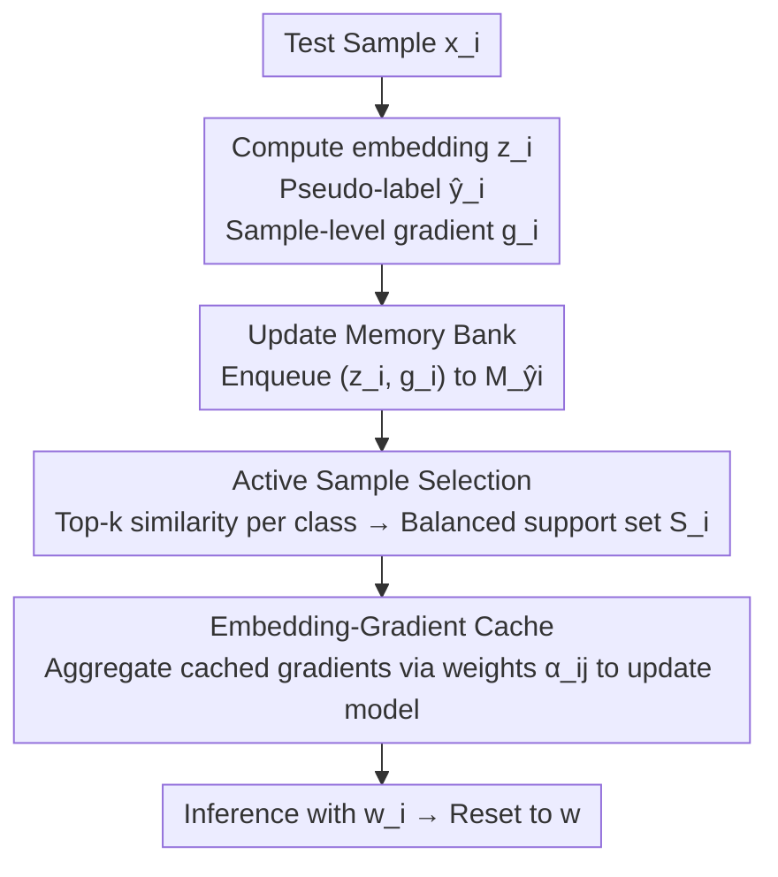

# Ramen: Robust Test-Time Adaptation of Vision-Language Models with Active Sample Selection

**Conference**: CVPR 2026  
**arXiv**: [2604.21728](https://arxiv.org/abs/2604.21728)  
**Code**: https://github.com/baowenxuan/Ramen  
**Area**: Multimodal VLM / Test-Time Adaptation  
**Keywords**: CLIP, Test-Time Adaptation, Mixed-domain, Active Sample Selection, Embedding-Gradient Cache

## TL;DR
To address the degradation of CLIP adaptation when the test stream contains mixed domains, Ramen retrieves a "domain-consistent + class-balanced" support set for each test sample from historical data to perform single-sample customized updates. By utilizing an embedding-gradient cache, the overhead of retrieval-based updates is reduced to nearly zero additional forward/backward passes, achieving stable leads in mixed-domain settings across multiple corruption and domain-shift benchmarks.

## Background & Motivation
**Background**: Vision-language models (VLMs) like CLIP exhibit strong zero-shot generalization, but their accuracy drops significantly when encountering image corruption (noise/blur/weather) and domain shifts. Test-Time Adaptation (TTA) tunes the model during the inference stage without accessing source data or labels (typically updating only the affine parameters of normalization layers, <0.05% of parameters for ViT-B/16), serving as a practical tool to extend VLM performance. The mainstream self-supervised objective is entropy minimization, which aligns distributions by reducing the prediction entropy of a batch of test samples.

**Limitations of Prior Work**: Nearly all TTA methods assume the test samples come from a "single, consistent domain." However, in real-world scenarios, test streams are mixed-domain—photos in a mobile album may span different weather conditions, lighting, and source platforms, or even samples within a single batch may originate from different domains. In such cases, the accuracy of methods like Tent, SAR, and Mint declines noticeably (validated in Figure 2: new methods performing well in single-domain settings fail significantly under mixed-domain conditions).

**Key Challenge**: The root cause is that a "single model is forced to adapt to multiple highly diverse domains simultaneously." The model cannot specialize for each domain and instead converges to an "average domain representation" that is suboptimal for all. Existing patches either rely on sharpness-aware or weight ensembles to prevent collapse (SAR, ROID, but still a single model for all domains) or modify BatchNorm to maintain multiple statistics (UnMix-TNS, which is only valid for BN, whereas BN is generally not recommended for mixed domains).

**Goal**: Without knowing domain labels or the total number of domains, enable CLIP to perform "targeted" adaptation for each sample in a mixed test stream, preventing it from being diluted by the average.

**Key Insight**: The authors observe that CLIP's image embeddings implicitly contain domain information (closer embeddings indicate a higher probability of belonging to the same domain, empirically shown in the appendix). Since explicit domain labels are unavailable, embedding similarity is used as a proxy for domains.

**Core Idea**: Instead of passively updating a model on a mixed stream, an "optimally relevant small support set" is actively constructed for each test sample to perform a dedicated update. The support set must satisfy two criteria: **Domain Consistency** (samples from similar domains) and **Prediction Balance** (balanced sample counts per category to prevent the adaptation from being biased by dominant classes).

## Method

### Overall Architecture
Ramen modifies the standard TTA "single model for a whole batch" approach to "each test sample $\bm{x}_i$ uses exclusive weights $\bm{w}_i$ for inference," i.e., $\hat{y}_i=\mathrm{CLIP}(\bm{x}_i;\bm{w}_i),\ \bm{w}_i=\mathrm{TTA}(\bm{w};\mathbb{S}_i)$. For each incoming sample, a customized support set $\mathbb{S}_i$ is retrieved from historical samples, and one step of entropy minimization is performed on the pre-trained weights $\bm{w}$ to obtain $\bm{w}_i$. After inference, the model is **reset to $\bm{w}$** (no cumulative contamination). The challenges are: (a) how to select a "domain-consistent + balanced" support set without domain labels; (b) recalculating gradients for each sample's support set would multiply the overhead by $C\cdot k$ (where $C$ is the number of classes and $k$ samples per class), which is unsustainable in online scenarios.

To solve this, Ramen maintains a **category-split memory bank** to implement selection criteria and uses an **embedding-gradient cache** to transform "retrieval-based updates" into a "weighted sum of cached gradients." The pipeline requires only one forward + one backward pass per new sample. The sample-level process is shown in the five steps below:

### Key Designs

**1. Active Sample Selection: Using "Domain Consistency + Prediction Balance" as criteria**

This is the core of Ramen, directly addressing the pain point where a single model is biased by average domains. The authors set two criteria: **Domain Consistency** requires support set samples to be in the same or similar domain as $\bm{x}_i$—using inner-product similarity of image embeddings as a proxy; **Prediction Balance** requires balanced class representation in the support set to avoid introducing prediction bias toward dominant classes.

In implementation, a category-split memory bank $\mathbb{M}=\{\mathbb{M}_1,\cdots,\mathbb{M}_C\}$ is maintained, with each class having a FIFO queue of capacity $K$ storing recent samples predicted as that class by the zero-shot classifier. For sample $\bm{x}_i$ with embedding $\bm{z}_i$, the top-$k$ most similar samples are retrieved from **each** class queue, and these are combined into $\mathbb{S}_i$:

$$\mathbb{S}_i=\bigcup_{c=1}^{C}\mathbb{S}_{ic},\quad \mathbb{S}_{ic}=\underset{j\in\mathbb{M}_c}{\mathrm{Top\text{-}}k}\left(\bm{z}_i^\top\bm{z}_j\right).$$

The "top-$k$ per class" step satisfies both criteria: top-$k$ similarity ensures domain consistency, while equal amounts per class ensure prediction balance. Figure 3 shows that, on average, 40.9% of samples in the support set share the same domain as the query, far higher than the 6.7% of random selection.

**2. Embedding-Gradient Cache: Reducing retrieval update overhead by $C\cdot k$ times**

While active selection is effective, a naive implementation would recalculate gradients for $C\cdot k$ support samples, which is unacceptable for online inference. The authors exploit the fact that common TTA objectives (like entropy loss) are **point-wise additive**—the gradient of a batch is the weighted sum of individual sample gradients:

$$H(\mathbb{S}_i)=\sum_{j\in\mathbb{S}_i}\alpha_{ij}H(\bm{x}_j),\qquad \nabla_{\bm{w}}H(\mathbb{S}_i)=\sum_{j\in\mathbb{S}_i}\alpha_{ij}\bm{g}_j,\ \ \bm{g}_j=\nabla_{\bm{w}}H(\bm{x}_j).$$

Since the support set gradient is a weighted sum of sample-level gradients $\bm{g}_j$, the **sample-level gradient $\bm{g}_j$ is cached alongside the embedding** in the memory bank. Once a support set is retrieved, no extra forward/backward passes are needed; the cached $\bm{g}_j$ are simply aggregated. Each sample calculates its $\bm{g}_i$ only once upon entering the bank, resulting in only one forward and one backward pass overall. This enables "retrieval-based customized updates" online—tests show 14m08s with caching vs. 115h42m without, a **490× speedup** with identical accuracy.

**3. Gradient Aggregation Weights: Entropy x Similarity weights**

The aggregation weight $\alpha_{ij}$ is not uniform but merges two common TTA strategies:

$$\alpha_{ij}=\exp(-H(\bm{x}_j))\cdot\exp(-\beta\cdot\|\bm{z}_i-\bm{z}_j\|_2).$$

**Entropy weight** $\exp(-H(\bm{x}_j))$ gives higher weight to low-entropy (more reliable) samples; **Similarity weight** $\exp(-\beta\|\bm{z}_i-\bm{z}_j\|_2)$ gives higher weight to samples closer to the query in embedding space. This soft weighting within the already selected support set further refines the adaptation direction.

### Loss & Training
The objective remains prediction entropy minimization $H(\bm{x}_i)=-\sum_c p_{ic}\log p_{ic}$, **updating only affine parameters of normalization layers** (parameter-efficient and resistant to catastrophic forgetting). The model is reset to the pre-trained weights $\bm{w}$ immediately after each sample update to prevent mutual contamination. Theory (Theorem 4.1) provides a closed-form change for post-update feature importance $r_h=\frac{|w_h|}{\sum_l|w_l|}$: entropy minimization amplifies features where $(t_{1h}-t_{0h})^2\cdot M_{hh}$ is higher than average, where $M_{hh}=\mathbb{E}_{j\in\mathbb{S}}[(p_{j0}p_{j1})\cdot v_{jh}^2]$ is the probability-weighted second moment. In mixed domains, domain-related features also have large $M_{hh}$ and are mistakenly amplified; **Domain Consistency** makes domain-related features more consistent within the support set, reducing $M_{hh}$ to suppress them, while **Prediction Balance** maintains large variance for class-related features to ensure they are amplified.

## Key Experimental Results

### Main Results
Mixed-domain setting: Test samples from multiple domains are interleaved. Accuracy is reported per domain and then averaged. Ramen ranks first across all datasets and architectures.

| Dataset (Architecture) | Metric | Ramen | Prev. SOTA | Gain |
|--------|------|------|----------|------|
| CIFAR-10-C (ViT-B/32) | Avg Acc | 72.7 | 71.4 (RoTTA) | +1.3 |
| CIFAR-100-C (ViT-B/16) | Avg Acc | 46.1 | 42.7 (SAR) | +3.4 |
| ImageNet-C (ViT-L/14) | Avg Acc | 49.2 | 46.7 (Tent) | +2.5 |
| DomainNet (ViT-B/32) | Avg Acc | 57.1 | 56.5 (NOTE) | +0.6 |

Efficiency (CIFAR-100-C, 150k images, Table 3):

| Method | Test Time | Acc (%) | Gain |
|------|----------|---------|------|
| CLIP (Zero-shot) | 5m27s | 35.8 | - |
| Tent | 9m27s | 41.2 | +5.4 |
| SAR | 15m50s | 42.7 | +6.9 |
| WATT-S | 18h54m | 42.2 | +6.4 |
| **Ramen** | **14m08s** | **46.1** | **+10.3** |
| Ramen (w/o Cache) | 115h42m | 46.1 | +10.3 |

Ramen's time is comparable to standard update-based TTA, but accuracy is significantly higher; caching provides a 490× speedup.

### Ablation Study
DC = Domain Consistency, PB = Prediction Balance (Figure 5).

| Configuration | Key Performance | Description |
|------|---------|------|
| Full (DC + PB) | Stable in single/mixed domains | Full model |
| w/o PB | Performance drop | Used single queue; lost class balance |
| w/o DC | Inconsistent single/mixed results | Random retrieval in queue; lost domain consistency |
| w/o PB & DC | Degrades to random hist. retrieval | Both criteria removed |

### Key Findings
- **Cache is for feasibility, not accuracy**: Accuracy is identical without the cache (46.1), but time increases from 14 mins to 115 hours, proving it is an engineering-equivalent acceleration.
- **Criteria roles**: DC ensures consistent performance between single and mixed domains, while PB provides stable gains in both settings.
- **Domain consistency works**: 40.9% same-domain samples vs. 6.7% random proves CLIP embeddings serve as domain proxies.
- **Robustness**: Ramen is stable across a wide range of hyperparameters; while large $K$ yields diminishing returns, and extreme values for $k$ or $\beta$ can introduce noise, it consistently outperforms vanilla entropy minimization.

## Highlights & Insights
- **Point-wise additivity as a leverage point**: The property that batch gradients are weighted sums of sample gradients is utilized to cache and reuse calculations, making per-sample retrieval updates viable.
- **Similarity as a "label-free domain proxy"**: Embedding similarity implicitly captures domain info, a clean approach supported by empirical evidence.
- **"Dedicated weights + immediate reset"**: Avoids error accumulation and model collapse by treating TTA as a localized, retrieval-based micro-fine-tuning.
- **Theory-Mechanism Loop**: Theorem 4.1 explains *why* mixed domains mistakenly amplify domain features and how the two criteria correct this, providing mechanism support for empirical observations.

## Limitations & Future Work
- Theoretical analysis is limited to a simplified "single-layer norm + binary class" setting; qualitative extrapolation to multi-layer/multi-class settings lacks strict proof.
- Reliance on pseudo-labels means performance is bounded by zero-shot quality; categories with extremely poor zero-shot performance (e.g., DomainNet quickdraw at 12.8%) show limited gains.
- Memory overhead scales linearly with category count $C$ and capacity $K$, and sample-level gradients must be cached; costs for extreme class counts (e.g., thousands) require further evaluation.
- Domain consistency assumes domains are distinguishable in embedding space; if domains are highly entangled, the proxy may fail.

## Related Work & Insights
- **vs SAR / ROID**: These methods adapt a single model to all domains using sharpness-aware/weight ensembles; Ramen provides exclusive support sets to avoid the "average domain" issue, yielding higher gains.
- **vs UnMix-TNS**: UnMix-TNS relies on BN statistics, whereas Ramen updates general affine parameters and is not tied to a specific normalization structure.
- **vs TDA / DMN-ZS**: These use memory banks to **correct predictions** without model updates; Ramen uses the bank to **retrieve support sets for updates**, incorporating explicit domain and balance criteria.
- **vs Continual TTA (RoTTA)**: RoTTA assumes temporal domain continuity; Ramen is designed for mixed batches where even adjacent samples may differ, relying on retrieval rather than temporal sequence.

## Rating
- Novelty: ⭐⭐⭐⭐ The combination of "Active Sample Selection + Embedding-Gradient Cache" is clean and effective, though the base objective is still entropy-based.
- Experimental Thoroughness: ⭐⭐⭐⭐ Covers 3 corruption datasets + DomainNet, multiple architectures, and efficiency/hyperparameter sensitivity analysis.
- Writing Quality: ⭐⭐⭐⭐⭐ Clear five-step pipeline, theory directly maps to criteria, and the motivation-mechanism-effect loop is closed.
- Value: ⭐⭐⭐⭐ Mixed domains are a real-world pain point for VLM deployment; the 490× speedup makes the method practical.

<!-- RELATED:START -->

## Related Papers

- [\[CVPR 2026\] Dynamic Logits Adjustment and Exploration for Test-Time Adaptation in Vision Language Models](dynamic_logits_adjustment_and_exploration_for_test-time_adaptation_in_vision_lan.md)
- [\[CVPR 2026\] STAR: Test-Time Adaptation Can Enhance Universal Prompt Learning for Vision-Language Models](star_test-time_adaptation_can_enhance_universal_prompt_learning_for_vision-langu.md)
- [\[CVPR 2026\] Test-Time Distillation for Continual Model Adaptation](test-time_distillation_for_continual_model_adaptation.md)
- [\[AAAI 2026\] Panda: Test-Time Adaptation with Negative Data Augmentation](../../AAAI2026/multimodal_vlm/panda_test-time_adaptation_with_negative_data_augmentation.md)
- [\[CVPR 2026\] TTL: Test-time Textual Learning for OOD Detection with Pretrained Vision-Language Models](ttl_test-time_textual_learning_for_ood_detection_with_pretrained_vision-language.md)

<!-- RELATED:END -->
