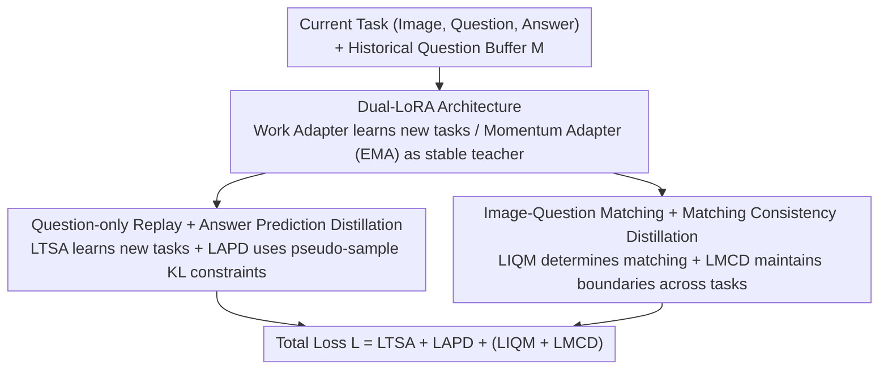

# Re-evaluating Continual VQA: Toward Fair and Robust Evaluation for Multimodal Continual Learning

**Conference**: CVPR 2026  
**Paper**: [CVF Open Access](https://openaccess.thecvf.com/content/CVPR2026/html/Gao_Re-evaluating_Continual_VQA_Toward_Fair_and_Robust_Evaluation_for_Multimodal_CVPR_2026_paper.html)  
**Code**: https://github.com/Zi-Jian-Gao/MaDQ  
**Area**: Multimodal VLM  
**Keywords**: Continual Learning, Visual Question Answering, Benchmark Debiasing, Knowledge Distillation, Parameter-Efficient

## TL;DR
This paper identifies two structural flaws in existing Continual VQA benchmarks: "cross-task shared answer vocabularies" and "identical in-task train/test answer distributions," which lead to overestimating anti-forgetting capabilities. Consequently, the authors reconstruct the UCo-VQA benchmark, which enforces token-wise mutually exclusive answer spaces and introduces in-task distribution shifts. Simultaneously, they propose MaDQ—a parameter-efficient method that replays only historical questions combined with dual-layer distillation and image-text matching regularization—achieving SOTA results in these debiased and more challenging settings.

## Background & Motivation
**Background**: Continual Visual Question Answering (Continual VQA) requires pre-trained vision-language models to incrementally learn new skills over a sequence of tasks (e.g., Location → Color → Count …) without catastrophic forgetting of previous tasks. Mainstream evaluations adapt task sequences from VQA v2 / GQA, using an accuracy matrix between task pairs to measure forgetting.

**Limitations of Prior Work**: The authors identify two "deceptive" flaws in this evaluation setup. First, **cross-task shared answer vocabularies**: answers from early tasks (yes/no, 2, red, left) recur in subsequent tasks, allowing models to "pretend" to remember old tasks by relying on high-frequency answer priors, creating spurious anti-forgetting. An intuitive example shows that SFT accuracy on a Location task fluctuates wildly between `38.44 → 1.28 → 34.13 → … → 41.58` during training; this recovery is not due to genuine memory but to answer overlap with later tasks. Second, **identical in-task train/test answer distributions** mask model vulnerability under distribution shifts—models merely learn shortcuts from question prefixes to frequent answers (e.g., "how many → 2", "what color → white").

**Key Challenge**: Evaluation aims to measure "true visual-semantic grounding and anti-forgetting," yet benchmark statistics allow models to achieve high scores via "answer memorization + linguistic shortcuts." Consequently, measured forgetting is systematically underestimated, and robustness is never truly assessed. The authors quantify the inter-task answer distribution overlap matrix $S$ using skewed KL divergence and prove it is highly correlated with the accuracy matrix $A$ via Spearman rank correlation (SFT/EWC corr=0.73/0.69, $p<0.001$), confirming that high scores primarily stem from answer sharing rather than knowledge retention.

**Goal**: (1) Construct a fair benchmark that prevents model "cheating"; (2) Develop a method that is both anti-forgetting and robust to distribution shifts, while remaining memory-efficient and privacy-preserving.

**Key Insight**: The authors observe a strong correlation between anti-forgetting and robustness: models with better visual grounding generalize more stably under distribution shifts and exhibit less forgetting. Thus, "enhancing robustness" is treated as a mechanism to "mitigate forgetting."

**Core Idea**: On the evaluation side, "token-wise mutually exclusive answer spaces + in-task train-test distribution shifts" are used to eliminate cheating (UCo-VQA). On the methodology side, "question-only replay + dual-layer distillation + image-text matching" is employed to preserve knowledge and enhance grounding (MaDQ) without storing original images or answers.

## Method

### Overall Architecture
This paper follows two main lines: the **UCo-VQA benchmark** and the **MaDQ continual learning method**.

**Evaluation (UCo-VQA)**: Reconstructed based on VQA v2 and GQA. First, to address answer sharing, datasets are transformed into VQA v3 / GQA v2 with token-wise mutually exclusive answers. Binary answers (yes/no) are replaced by task-specific 3-digit octal codes (e.g., $T_1$ uses 000/001, $T_2$ uses 002/003, totaling up to 512 unique tokens that do not overlap with Count digits). Open-ended answers use "dynamic prefix transformation" to systematically rewrite templates (`it's [answer]` → `that's [answer]` → `there's [answer]`), preserving semantics while removing surface-level overlap. Second, for robustness, the PS (Proposed Splits) setting is introduced: in-task train/test answer distributions are **intentionally varied**, creating controlled distribution shifts. The SS (Standard Splits), with identical distributions, serves as a control. VQA v3 (8 tasks) + GQA v2 (7 tasks) × {SS, PS} constitute the UCo-VQA suite.

**Mechanism (MaDQ = Matching and Distillation with Question replay)**: Dual-LoRA is injected into a frozen BLIP backbone (a trainable work adapter for new tasks and a momentum adapter via EMA as a stable teacher). The training objective consists of four layered losses: task learning $L_{TSA}$, answer prediction distillation $L_{APD}$ (anti-forgetting), image-question matching $L_{IQM}$, and matching consistency distillation $L_{MCD}$ (robustness), formulated as $L = L_{TSA} + L_{APD} + (L_{IQM} + L_{MCD})$. The key innovation is replaying **only historical questions** without images or answers, pairing historical questions with current task images to form (mostly semantically mismatched) pseudo-samples to evoke old knowledge.

### Key Designs

**1. UCo-VQA Benchmark: Token-wise Mutually Exclusive Answer Space + In-task Distribution Shift**

This design directly addresses "spurious anti-forgetting caused by shared vocabularies" and "masked vulnerability due to identical train-test distributions." The authors use skewed KL divergence $-D_{KL}(p \,\|\, (1-\alpha)p + \alpha q)$ ($\alpha=0.99$, using a smoothed mixture to avoid numerical instability from zero probabilities in $q$) to calculate the answer overlap matrix $S$, proving its significant rank correlation with accuracy matrix $A$. To fix this, they map binary/high-frequency/numerical answers to task-specific octal codes and apply dynamic prefix transformations to open answers (VQA v3 / GQA v2). They also construct PS splits where train/test distributions differ. Under PS, most methods drop significantly, and the previously rebounding curves become monotonically degrading, revealing that SFT/LwF rely on shortcuts rather than true grounding.

**2. Dual-LoRA Architecture: Work Adapter for Learning + Momentum Adapter for Teaching**

Distillation-based anti-forgetting requires a "previous model" for supervision, but saving all historical models is expensive. This design injects LoRA into Q/K/V, FFN, and token embedding layers of the image encoder $f_\nu$, question encoder $f_\tau$, and answer decoder $f_\omega$, reparameterizing weights as $W = W_0 + BA$. Only the work adapter LoRA-w $\{A, B\}$ is updated during training; the momentum adapter LoRA-m $\{\bar{A}, \bar{B}\}$ is updated after each epoch via Exponential Moving Average: $\bar{A} \leftarrow \alpha\bar{A} + (1-\alpha)A$, $\bar{B} \leftarrow \alpha\bar{B} + (1-\alpha)B$ ($\alpha$ initialized at 0.85). $W_t = W_0 + \bar{B}\bar{A}$ acts as a smoothly evolving teacher for $L_{APD}$, $L_{MCD}$, and inference.

**3. Question-only Replay + Answer Prediction Distillation: Anti-forgetting without Images or Answers**

Replay methods typically require (Image, Question, Answer) triplets, which consume memory and pose privacy risks. This design saves **only historical questions** in buffer $M$, pairing them with current images $x^t$ to create pseudo-samples $(x^t, q_i)$. Even if semantically mismatched, these questions serve as effective cues to evoke task-specific knowledge. Anti-forgetting is achieved via KL consistency between the current model and the EMA teacher: $L_{APD} = \frac{1}{|X^t||M|}\sum_{x^t \in X^t, q_i \in M} L_{KL}(\phi^t(x^t, q_i), \phi^{t-1}(x^t, q_i))$. MaDQ stores only 300–400 questions per task (0.01 MB), whereas ER/CLS-ER require dozens of MBs for triplets.

**4. Image-Question Matching + Matching Consistency Distillation: Correcting Linguistic Shortcuts**

In the PS setting, models relying on "question prefix → high-frequency answer" shortcuts fail. This design adds a binary matching head $h_{IQM}$ to judge semantic alignment: positive samples are current $(x^t, q^t)$, while negative samples pair current images with replayed questions $(x^t, q_i)$. Loss $L_{IQM} = \frac{1}{|X^t||Q^t \cup M|}\sum L_{CE}(\psi^t(x^t, q_j), y)$ forces the model to align vision and language. Matching consistency distillation $L_{MCD}$ then uses KL divergence to preserve "negative sample rejection boundaries" and "newly learned positive associations" across tasks.

## Key Experimental Results

**Metrics**:
- **FAA** (Final Average Accuracy): Average accuracy on all tasks after the final task.
- **CAA** (Cumulative Average Accuracy): Average of $AA_i$ throughout the training process.
- **FFM** (Final Forgetting Measure): Average accuracy drop on old tasks after the final task.

### Main Results
In the more challenging PS (distribution shift) setting, MaDQ achieves the highest FAA/CAA and lowest FFM:

| Method | VQA v3·PS FAA↑ | CAA↑ | FFM↓ | GQA v2·PS FAA↑ | CAA↑ | FFM↓ |
|------|------|------|------|------|------|------|
| SFT | 7.41 | 14.74 | 37.99 | 5.48 | 15.88 | 45.63 |
| LwF | 7.58 | 11.85 | 29.28 | 9.09 | 14.68 | 10.76 |
| GAB | 13.15 | 27.94 | 29.94 | 17.82 | 24.31 | 29.98 |
| ER (Triplets) | 32.24 | 33.64 | 9.27 | 39.45 | 42.93 | 13.40 |
| **MaDQ (Questions only)** | **36.15** | **37.82** | **4.54** | **40.72** | **45.18** | **9.37** |

### Ablation Study
Gradual addition of loss terms (on VQA v3·PS):

| Configuration | FAA↑ | CAA↑ | FFM↓ | Note |
|------|------|------|------|------|
| Baseline | 6.56 | 13.41 | 37.75 | Near random without distillation |
| + $L_{IQM}$ only | 6.75 | 13.12 | 36.33 | Matching alone is ineffective |
| + $L_{APD}$ only | 31.81 | 32.74 | 10.34 | Distillation is the primary engine |
| **Full (MaDQ)** | **36.15** | **37.82** | **4.54** | Full model achieves lowest FFM |

### Key Findings
- **Distillation ($L_{APD}$) is the engine of anti-forgetting**: Without it, performance is near-random. Adding $L_{APD}$ improves VQA v3·PS FAA from 6.56 to 31.81.
- **Robustness aids anti-forgetting**: Adding $L_{IQM}$ as a plug-and-play term to LwF/ER/CLS-ER consistently reduces FFM, validating the hypothesis that "better grounding → more stable generalization → less forgetting."
- **Debiased benchmarks are more honest**: On original GQA, methods showed inflated FAA; on GQA v2 (SS), performance dropped, exposing biases in previous benchmarks.

## Highlights & Insights
- **Statistical reveal of "spurious anti-forgetting"**: Instead of vague criticisms, the authors use skewed KL matrices and Spearman correlation to quantify how high scores result from answer overlap, then plug these leaks with octal codes and prefix templates.
- **Privacy-preserving "question-only" replay**: The counter-intuitive discovery that semantically mismatched questions are still useful cues allows for massive memory savings (0.01 MB).
- **Robustness as a lever for anti-forgetting**: The plug-and-play nature of $L_{IQM}$ demonstrates that improving grounding directly helps preserve old knowledge.

## Limitations & Future Work
- **Adaptation to LLM-based LVLMs**: Models like BLIP2 struggle with generated structured answers; how to migrate matching distillation to frozen LLM decoders remains an open question.
- **Manual answer coding**: The construction of UCo-VQA relies on human-designed templates; whether "semantic-invariant but surface-dissimilar" transforms introduce new biases is not fully analyzed.
- **Evaluation of large-scale backbones**: Large models appear harder to adapt in this debiased setting, suggesting a need for more efficient tuning methods.

## Related Work & Insights
- **vs VQACL**: VQACL was the first CVQA benchmark but suffered from answer overlap; UCo-VQA fixes this with mutually exclusive answer spaces.
- **vs VQA-CP / GQA-OOD**: These address robustness in static settings; this work unifies robustness and anti-forgetting in a continual setting.
- **vs ER / CLS-ER**: MaDQ achieves better results in PS settings with significantly lower storage (0.01 MB vs dozens of MBs).

## Rating
- Novelty: ⭐⭐⭐⭐⭐ (Quantifying and fixing benchmark cheating pathways is a major contribution.)
- Experimental Thoroughness: ⭐⭐⭐⭐ (Extensive ablations and cross-dataset testing, though some table OCR issues were noted.)
- Writing Quality: ⭐⭐⭐⭐ (Clear motivation and logical derivation.)
- Value: ⭐⭐⭐⭐⭐ (Provides a more honest yardstick for the field.)

<!-- RELATED:START -->

## Related Papers

- [\[CVPR 2026\] Towards Dynamic Modality Alignment in Multimodal Continual Learning](towards_dynamic_modality_alignment_in_multimodal_continual_learning.md)
- [\[CVPR 2026\] Octopus: History-Free Gradient Orthogonalization for Continual Learning in Multimodal Large Language Models](octopus_history-free_gradient_orthogonalization_for_continual_learning_in_multim.md)
- [\[CVPR 2026\] Enhancing Continual Learning of Vision-Language Models via Dynamic Prefix Weighting](enhancing_continual_learning_of_vision-language_models_via_dynamic_prefix_weight.md)
- [\[CVPR 2026\] PACT: Phase-Like Transition Constraints in Adapter-Based Continual Learning of Vision-Language Models](pact_phase-like_transition_constraints_in_adapter-based_continual_learning_of_vi.md)
- [\[NeurIPS 2025\] Continual Multimodal Contrastive Learning](../../NeurIPS2025/multimodal_vlm/continual_multimodal_contrastive_learning.md)

<!-- RELATED:END -->
## Related Papers

- [\[CVPR 2026\] Towards Dynamic Modality Alignment in Multimodal Continual Learning](towards_dynamic_modality_alignment_in_multimodal_continual_learning.md)
- [\[CVPR 2026\] Octopus: History-Free Gradient Orthogonalization for Continual Learning in Multimodal Large Language Models](octopus_history-free_gradient_orthogonalization_for_continual_learning_in_multim.md)
- [\[CVPR 2026\] Enhancing Continual Learning of Vision-Language Models via Dynamic Prefix Weighting](enhancing_continual_learning_of_vision-language_models_via_dynamic_prefix_weight.md)
- [\[CVPR 2026\] Test-Time Distillation for Continual Model Adaptation](test-time_distillation_for_continual_model_adaptation.md)
- [\[CVPR 2026\] PACT: Phase-Like Transition Constraints in Adapter-Based Continual Learning of Vision-Language Models](pact_phase-like_transition_constraints_in_adapter-based_continual_learning_of_vi.md)

<!-- RELATED:END -->
