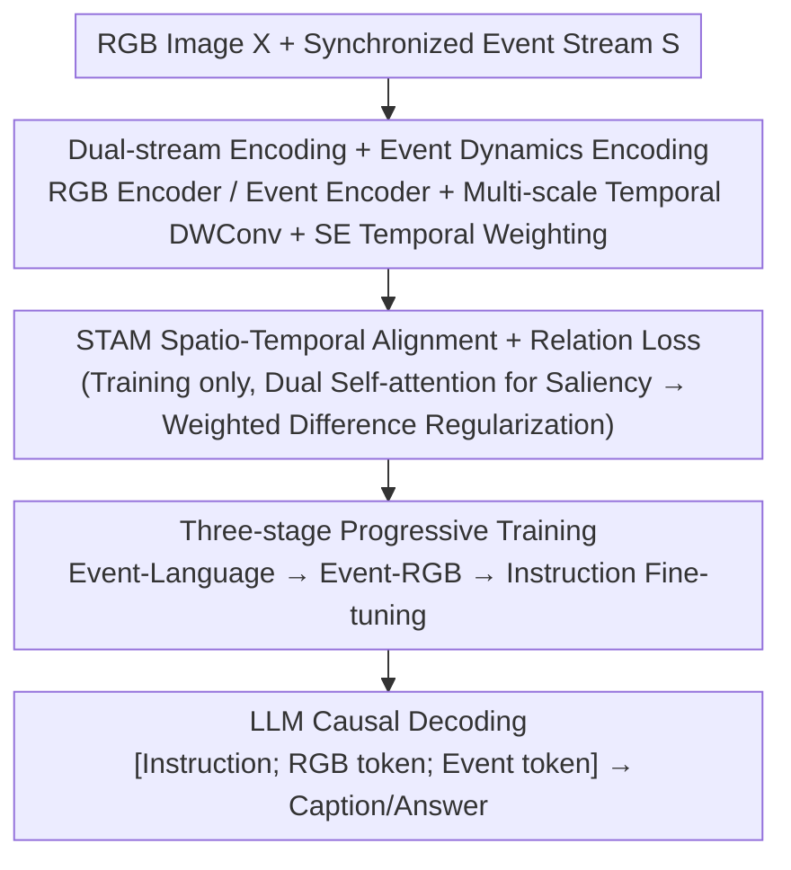

# RE-VLM: Event-Augmented Vision-Language Model for Scene Understanding

**Conference**: CVPR 2026  
**Paper**: [CVF Open Access](https://openaccess.thecvf.com/content/CVPR2026/html/Liu_RE-VLM_Event-Augmented_Vision-Language_Model_for_Scene_Understanding_CVPR_2026_paper.html)  
**Code**: https://github.com/bupt-ai-cz/RE-VLM  
**Area**: Multimodal VLM  
**Keywords**: Event camera, RGB-Event fusion, Vision-Language Model, Scene graph data generation, Adverse lighting

## TL;DR
Addressing the limitations where conventional RGB degrades in low-light, high-dynamic, or fast-motion scenarios, and pure event streams lack color/texture, this paper proposes RE-VLM, the first dual-stream RGB-Event Vision-Language Model. It utilizes parallel RGB/event encoders and a three-stage progressive alignment to map heterogeneous visual features into language space. Furthermore, a graph-driven, degradation-adaptive data pipeline is introduced to convert synchronized RGB-event streams into verifiable scene graphs for large-scale synthesis of captions and Q&A pairs. RE-VLM outperforms RGB-only and event-only models of comparable or larger sizes in image captioning and VQA, especially under adverse lighting.

## Background & Motivation
**Background**: Vision-Language Models (VLMs) like LLaVA, InternVL, Qwen2.5-VL, and GPT-4V have achieved rapid progress in image captioning and VQA, but most are built upon high-quality RGB images.

**Limitations of Prior Work**: RGB suffers severe degradation in extreme low-light, overexposure, high-dynamic range transitions, or high-speed motion (motion blur). Even SOTA RGB-only VLMs fail to describe scenes accurately in such cases. Event cameras offer complementarity by asynchronously recording per-pixel intensity changes with microsecond latency and high dynamic range, preserving motion and structural cues where RGB fails. However, event-only VLMs (e.g., EventGPT) have inherent weaknesses: events only record "changes" without explicit color, and static scene details are sparse. They can describe motion and structures but fail to identify appearance attributes like color or texture. A typical example in Figure 1 shows that RGB-only fails to detect pedestrians in low light, while event-only captures movement but cannot determine traffic light states; only fusion provides a complete description.

**Key Challenge**: RGB excels in appearance (color/texture) but is weak in adverse conditions; events excel in dynamics/HDR but lack appearance information. The two are naturally complementary, yet there is a lack of **large-scale RGB-Event-Text triple-modality supervised data**. Moreover, existing pipelines that synthesize Event-Text data from RGB fail when the source RGB is already degraded.

**Goal**: (1) Develop an RGB-Event dual-stream VLM robust in both normal and adverse conditions; (2) Solve the RGB-Event-Text data scarcity by making the data generation process resilient to RGB degradation.

**Key Insight**: Utilize a verifiable intermediate representation—the Scene Graph—to organize facts from both modalities and explicitly use "degradation labels" for modality arbitration during fusion. This allows events to serve as the anchor when RGB degrades, generating reliable supervision.

**Core Idea**: On the model side, use dual-stream encoding + STAM spatio-temporal alignment + three-stage progressive training to align events to language and then to RGB. On the data side, use a "graph-driven, degradation-adaptive" pipeline to convert synchronized RGB-event streams into fused scene graphs for synthesizing captions/VQA.

## Method

### Overall Architecture
RE-VLM consists of two parts: a **data generation pipeline** and a **dual-stream model**.

**Data Side (Graph-driven, Degradation-adaptive Pipeline)**: For each RGB keyframe, a corresponding event window of $N \times 33\text{ms}$ ($N{=}4$) is taken. An event reconstruction network (e.g., NER-Net) reconstructs this into $N$ grayscale frames, stacked as a "video-like" tensor for a captioning VLM to generate descriptions constrained by observed facts. These are parsed by an LLM into an **event graph** $G_e$ (nodes are primitive argument tuples, e.g., `Move(subject=car, motion=forward, place=lane center)`). Simultaneously, an **RGB graph** $G_r$ focus on appearance/static structure is built with explicit degradation labels (low-light, overexposure, etc.). Then, an LLM performs **degradation-adaptive fusion**: motion and temporal facts are anchored to $G_e$, while color and text are taken from $G_r$ (provided it is not severely degraded). Geometric fields take the consensus or prioritize $G_r$. Finally, captions and VQA pairs are synthesized. This yields two datasets: PEOD-Chat (11k, adverse lighting) and RGBE-Chat (113.7k, general scenes).

**Model Side (Dual-stream + STAM + Three-stage)**: Given an RGB frame $X$ and event stream $S$, encoders produce $F_i = f_{rgb}(X)$ and $F_e = f_{event}(S)$. The event branch uses multi-scale temporal DWConv and SE-style weighting to get $\tilde{F}_e$. Both are mapped via adapters to the LLM space as $T_i = g_i(F_i)$ and $T_e = g_e(\tilde{F}_e)$. For training, a lightweight Spatio-Temporal Alignment Module (STAM) calculates alignment signals and relation loss.

### Key Designs

**1. Graph-driven, Degradation-adaptive Data Pipeline: Verifiable Scene Graphs + Degradation Arbitration**

This addresses the scarcity of RGB-Event-Text data and the failure of RGB-to-event synthesis under degradation. Instead of direct VLM generation, each modality is parsed into a structured scene graph ($G_e$ for motion, $G_r$ for appearance with degradation labels). **Field-level arbitration** is applied: dynamics are anchored to events, color/text to non-degraded RGB. If RGB is degraded, its conclusions are treated as low-confidence candidates. Scene graphs also facilitate manual correction.

**2. Dual-stream Encoding + Event Dynamics Encoding: Modeling High Temporal Resolution**

Raw events $e_j = (x_j, y_j, t_j, p_j)$ are divided into $N_w{=}3$ slices and accumulated into two-channel images $E_t$. A ViT event encoder extracts features $F^e = \{F^e_t\}_{t=1}^{N_w} \in \mathbb{R}^{N_w \times H \times W \times D}$. To capture motion across scales, **multi-scale 1D DWConvs** are applied along the temporal axis, followed by **SE-style temporal weighting** to emphasize salient motion slices and suppress backgrounds.

**3. STAM Spatio-Temporal Alignment + Relation Loss: Training-time Feature Alignment**

STAM works only during training to align heterogeneous features. RGB and event features ($\tilde{R}, \tilde{E}$) are resampled to a shared grid and L2-normalized. Intra-modal self-attention matrices $P_r, P_e$ are calculated, and their row sums (degree) serve as token saliency. A unified importance map $w^{(t)}$ is derived. The spatial inner product of the importance map and the per-frame channel difference map $D^{(t)}$ forms the alignment penalty $L_{CA\text{-}WTD} = \frac{1}{T_c}\sum_{t=1}^{T_c} \langle w^{(t)}, D^{(t)}\rangle$. This module is discarded at inference, adding zero overhead.

**4. Three-stage Progressive Training: Aligning Heterogeneous Modalities**

**Stage 1 (Event-Language Alignment)**: Freeze LLM and RGB branches; train event encoder and adapter on Event-Text pairs. **Stage 2 (Event-RGB Alignment)**: Use paired RGB-Event data to optimize the event encoder and STAM with relation loss, aligning the event branch to the frozen RGB branch. **Stage 3 (Instruction Fine-tuning)**: Freeze visual branches; fine-tune LLM using LoRA on caption/VQA instruction data.

### Loss & Training
Total loss: $L = L_{LLM} + \lambda L_{CA\text{-}WTD}$ with $\lambda{=}0.1$. Backbone: Qwen2.5-VL-3B. Training on 8×RTX 4090s. Stage 1: 1.3M pairs, lr=1e-4. Stage 2: 6M pairs, lr=1e-4. Stage 3: 120k samples, lr=2e-4.

## Key Experimental Results

**Metrics (LLM-as-a-judge, 0–5 scale)**:
- **CI** (Correctness of Information), **DO** (Detail Orientation), **CU** (Contextual Understanding) for captions.
- **Ave**: Average LLM score for VQA answers.
- **Acc**: Attribute-level VQA accuracy.

### Main Results
On PEOD-Chat (adverse) and RGBE-Chat (general), RE-VLM (4B) leads consistently:

| Input | Model | Param | PEOD CI | PEOD DO | PEOD CU | PEOD Ave | PEOD Acc | RGBE Acc |
|------|------|------|------|------|------|------|------|------|
| RGB-only | Qwen2.5-VL | 3B | 2.47 | 2.03 | 3.04 | 3.47 | 0.52 | 0.66 |
| RGB-only | DeepSeek2-VL | 7B | 3.25 | 2.42 | 3.73 | 3.37 | 0.50 | 0.52 |
| RGB-only | Qwen2.5-VL* (FT) | 3B | 3.23 | 2.74 | 3.51 | 3.61 | 0.55 | 0.65 |
| Event-only | EventGPT | 7B | 2.51 | 2.06 | 2.65 | 3.04 | 0.40 | 0.39 |
| **RGB+Event** | **RE-VLM** | **4B** | **3.68** | **3.12** | **3.95** | **3.82** | **0.63** | **0.75** |

RE-VLM outperforms 7B models with fewer parameters, validating the synergy of RGB-Event fusion.

### Ablation Study
Ablation of modalities and STAM (PEOD-Chat):

| Input | STAM | CI | DO | CU | Ave | Acc |
|------|------|------|------|------|------|------|
| RGB only | — | 3.05 | 2.51 | 3.32 | 3.63 | 0.57 |
| RGB+Event | ✗ (Concat) | 3.62 | 3.08 | 3.91 | 3.79 | 0.61 |
| RGB+Event | ✓ (STAM) | 3.68 | 3.12 | 3.95 | 3.82 | 0.63 |

### Key Findings
- **Dual-stream > Single-stream**: RGB+Event consistently outperforms single modalities, especially in adverse conditions.
- **STAM provides zero-overhead gains**: Improving alignment during training enhances results (e.g., Acc 0.61 $\rightarrow$ 0.63) without inference cost.
- **Data Pipeline is foundational**: The manual audit shows a 18.1% correction rate compared to 54.2% for RGB-only generation, proving the reliability of the fused supervision.

## Highlights & Insights
- **Scene Graphs as Verifiable Intermediaries**: Converting data generation into a structured, auditable process solves "who to trust" when RGB degrades.
- **STAM (Train-time enhanced, Inference-free)**: Using saliency to weight cross-modal alignment prevents any single modality from dominating without adding compute load during deployment.
- **Curriculum Alignment**: Decomposing triple-modality alignment into manageable stages provides a blueprint for adding new modalities to existing VLMs.

## Limitations & Future Work
- The pipeline depends on event reconstruction networks (NER-Net); reconstruction artifacts might propagate to the supervision.
- Evaluation relies heavily on LLM-as-a-judge, which may lack the granularity of human expert evaluation.
- Domain gap between simulated and real events was not extensively analyzed.

## Related Work & Insights
- **vs EventGPT**: EventGPT is event-only; RE-VLM adds RGB for appearance/color, providing a more holistic understanding.
- **vs EventCLIP**: RE-VLM integrates an LLM for free-form dialogue and scene understanding, whereas CLIP-based models are limited to classification/retrieval.
- **vs RGB-only VLMs**: RE-VLM uses the event branch as a "safety net" for cases where high-performance RGB VLMs fail due to imaging conditions.

## Rating
- **Novelty**: ⭐⭐⭐⭐⭐ First dual-stream RGB-Event VLM with adaptive graph fusion.
- **Experimental Thoroughness**: ⭐⭐⭐⭐ Solid comparisons and ablations, though human evaluation is missing.
- **Writing Quality**: ⭐⭐⭐⭐ Clear motivation and technical breakdown.
- **Value**: ⭐⭐⭐⭐⭐ Provides a robust baseline for event-augmented VLM and two valuable datasets.

<!-- RELATED:START -->

## Related Papers

- [\[CVPR 2026\] Scene-VLM: Multimodal Video Scene Segmentation via Vision-Language Models](scene-vlm_multimodal_video_scene_segmentation_via_vision-language_models.md)
- [\[CVPR 2026\] µVLM: A Vision Language Model for µNPUs](mvlm_a_vision_language_model_for_mnpus.md)
- [\[CVPR 2026\] VLM-3R: Vision-Language Models Augmented with Instruction-Aligned 3D Reconstruction](vlm-3r_vision-language_models_augmented_with_instruction-aligned_3d_reconstructi.md)
- [\[CVPR 2026\] HOG-Layout: Hierarchical 3D Scene Generation, Optimization and Editing via Vision-Language Models](hog_layout_hierarchical_3d_scene_generation_optimization_and_editing.md)
- [\[CVPR 2026\] Learning to See through Illumination Extremes with Event Streaming in Multimodal Large Language Models](learning_to_see_through_illumination_extremes_with_event_streaming_in_multimodal.md)

<!-- RELATED:END -->
