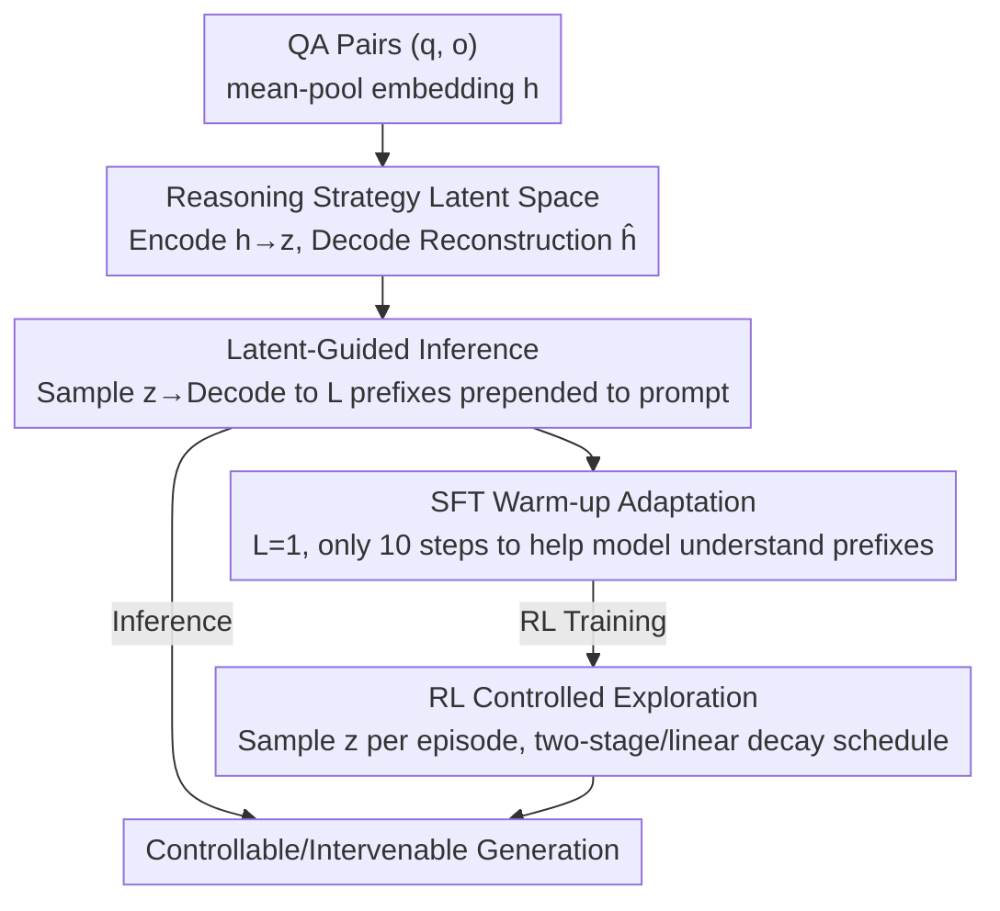

# Reasoning Palette: Modulating Reasoning via Latent Contextualization for Controllable Exploration for (V)LMs

**Conference**: CVPR 2026  
**Paper**: [CVF Open Access](https://openaccess.thecvf.com/content/CVPR2026/html/Long_Reasoning_Palette_Modulating_Reasoning_via_Latent_Contextualization_for_Controllable_Exploration_CVPR_2026_paper.html)  
**Code**: None  
**Area**: Multimodal VLM / LLM Reasoning  
**Keywords**: Controllable Exploration, Latent Variable Modulation, VAE, Prefix Injection, Reinforcement Learning

## TL;DR
A VAE is used to learn a continuous latent space of "reasoning strategies." Each sampled latent variable is decoded into a learnable prefix prepended to the prompt, enabling (V)LMs to perform sampling at the "strategy level" before generating the first token. This upgrades RL/inference exploration from token-level stochasticity to structured strategy-level diversity, achieving stable performance gains in mathematical reasoning and visual grounding.

## Background & Motivation
**Background**: Reinforcement Learning from Verifiable Rewards (RLVR) has become a mainstream paradigm for post-training Large Language/Vision-Language Models. Models generate a sequence of intermediate reasoning tokens followed by a final answer, with rewards provided by rule-based correctness checks. Training relies on sampling (temperature/nucleus sampling) to generate diverse rollouts for advantage estimation.

**Limitations of Prior Work**: Standard sampling schemes frequently yield trajectories that are very close to one another, where diversity is only reflected in "different phrasing" while strategies and planning structures remain nearly identical. Existing remedies, such as entropy regularization, only encourage local token-level diversity and lack a mechanism to reshape the model's "internal planning." Consequently, the model explores similar paths with different surface forms rather than truly distinct strategic patterns.

**Key Challenge**: Discovering effective reasoning strategies requires **high-level diversity** (e.g., using arithmetic, algebraic derivation, or multi-hop retrieval), whereas token-level sampling provides **low-level diversity**. This mismatch limits the efficiency and robustness of RL training.

**Key Insight**: The authors observe a counter-intuitive phenomenon (Fig.1 in the paper): prepending **only one random Gaussian noise token** to the prompt embeddings of Qwen-4B-Base significantly improves pass@k, even when using greedy decoding for each candidate (e.g., pass@32 on GSM8K jumps from 52.9% to 85.3%). This indicates that the gain stems from **strategy-level perturbations** introduced by the prefix rather than token-level randomness. However, directly prepending raw noise often leads to performance degradation due to misalignment with the model's native embedding distribution.

**Core Idea**: Use a VAE to learn a "reasoning palette" within the model's own token embedding space. Each sampled latent variable is decoded into a short prefix to modulate the model's internal planning before generation begins—transforming exploration from token-level randomness into structured, pre-generative sampling of reasoning strategies.

## Method

### Overall Architecture
The Reasoning Palette follows a three-step process: First, a VAE is trained to map "question-answer pair semantics" to a continuous Gaussian latent space $\mathcal{Z}$, where different regions correspond to different reasoning styles. During inference/training, a latent variable $z$ is sampled from this space and decoded into $L$ continuous prefix embeddings prepended to the prompt. A brief SFT phase is conducted to teach the base model to "understand" these prefixes. Finally, in RL, $z$ acts as an auxiliary control signal for each episode, transitioning from exploration to exploitation via a scheduling strategy. The key lies in the fact that the **prefixes are not random noise but are decoded from a semantically structured latent space**, ensuring both diversity and alignment with the model's embedding distribution.

### Key Designs

**1. Reasoning Strategy Latent Space: Compressing "How to Think" into a Sampleable Continuous Coordinate**

To represent "strategies," the authors train a VAE on high-quality reasoning trajectories $D=\{(q^{(i)},o^{(i)})\}$ covering math, QA, and code. For each pair, $[q;o]$ is concatenated, and **mean-pooling is performed on the frozen token embedding layer $E(\cdot)$** to obtain a fixed-length summary $h=\frac{1}{N}\sum_{i=1}^{N}E([q;o]_i)\in\mathbb{R}^d$. This is critical: $h$ resides in the same space as individual token embeddings, so the reconstructed $\hat h$ naturally functions as a "pseudo-token" aligned with the input distribution. Mean-pooling removes surface differences in token order, ensuring $h$ represents "reasoning style" rather than verbatim output. The encoder $E_\phi$ (MLP) maps $h$ to diagonal Gaussian parameters $\mu,\sigma=E_\phi(h)$, where $z\sim\mathcal{N}(\mu,\mathrm{diag}(\sigma^2))$. The decoder $D_\psi$ reconstructs $\hat h=D_\psi(z)$. Training minimizes the ELBO:

$$\mathcal{L}_{\text{VAE}}=\mathbb{E}_{z\sim q_\phi(z|h)}\big[\lVert h-\hat h\rVert^2\big]+\beta\cdot\mathrm{KL}\big(q_\phi(z|h)\,\Vert\,p(z)\big)$$

Where the prior $p(z)=\mathcal{N}(0,I)$ and $\beta$ balances reconstruction fidelity with latent manifold smoothness. A well-tuned $\beta$ ensures that nearby latent variables correspond to similar reasoning patterns, while distant ones induce qualitatively different strategies. t-SNE/PCA visualizations confirm that math, code, and QA cluster into separable groups based on reasoning domains.

**2. Latent-Guided Inference + Adjustable Control Strength: Sampling z to Decode a Prefix and Change the "Train of Thought"**

With the latent space defined, inference involves sampling $z\sim\mathcal{N}(0,I)$ from the prior and decoding it into $L$ prefix embeddings $p_z=(D_\psi(z^{(1)}),\dots,D_\psi(z^{(L)}))\in\mathbb{R}^{L\times d}$, prepended directly to the prompt: $\tilde q=[p_z;E(q)]$. The policy then generates $o\sim\pi_\theta(\cdot\mid\tilde q)$ autoregressively. The prefix length $L$ acts as a tunable knob: larger $L$ provides stronger, more structured guidance (suitable for complex multi-step tasks), while smaller $L$ offers lightweight intervention with low overhead. Since the VAE is frozen after SFT, the latent space provides a **stable and interpretable coordinate system**. One can cluster high-reward latent variables post-hoc or encode trajectories from a specific domain (e.g., math) to calculate the domain mean and covariance, then sample only from that region during inference to achieve **targeted intervention**.

**3. Minimal SFT Warm-up: Learning to "Read the Prefix" without "Memorizing Answers"**

Injecting unfamiliar prefixes into a base model might cause it to ignore them or be misled. A lightweight SFT phase makes the model sensitive to latent signals. Two key details: First, SFT data does **not** encode ground-truth samples into latents; instead, $z\sim\mathcal{N}(0,I)$ is sampled from the prior, decoded into prefix $p=D_\psi(z)$, and paired with the original $(q,o)$. Since the posterior $q_\phi(z|h)$ deviates from the prior, training must align with the prior used during inference to avoid generalization decay. Second, **SFT duration is strictly limited (usually 10 steps) with $L=1$**. The training objective is standard language modeling:

$$\mathcal{L}_{\text{SFT}}=-\mathbb{E}_{(p,q,o)\sim D_{\text{SFT}}}\big[\log p_\theta(o\mid[p;E(q)])\big]$$

The "short and minimal" approach prevents the model from down-weighting the prefix or overfitting to fixed answer patterns, thereby preserving the diversity induced by different $z$. Prefix length $L$ can then be increased (e.g., to 4 or 8) during inference and RL for richer compositional guidance.

**4. RL Controlled Exploration + Dual-axis Scheduling: Treating z as an Episode-level Control Variable**

In RL, each episode samples $z\sim\mathcal{N}(0,I)$ to decode a prefix conditioning the policy: $\pi_\theta(o\mid q,z)=\prod_{t}p_\theta(o_t\mid[p;E(q)],o_{<t})$. The objective is expanded to $\max_\theta\mathbb{E}_{z\sim p(z)}\mathbb{E}_{q,o}[r(o;q)]$. This allows for multi-granularity exploration control along two complementary axes: **Temporal Scheduling** (transitioning latent guidance from exploration to exploitation over training) and **In-group Diversity Control** (adjusting the ratio of rollouts receiving latent prefixes within each GRPO group). The hybrid objective is defined as:

$$J_{\text{sched}}(\theta)=\mathbb{E}_\tau\mathbb{E}_{q}\big[\rho(\tau)\cdot\mathcal{L}_{\text{PPO}}(\theta;q,z)+(1-\rho(\tau))\cdot\mathcal{L}_{\text{PPO}}(\theta;q)\big]$$

Where $\tau\in[0,1]$ is the normalized training progress and $\rho(\tau)$ is the proportion of rollouts with latent guidance at that step. Two schedules: **Two-stage**—using $L=8$ prefixes for the first 50% to maximize diversity, then turning it off ($L=0$) for the second 50%; **Linear Decay**—$\rho(\tau)=1-\tau$, smoothly transitioning from "diversity-driven trajectories" to "high-confidence generation." Both achieve the classical exploration-exploitation tradeoff at the "reasoning architecture" level rather than through token randomness.

## Key Experimental Results

### Main Results
Training with GRPO / RLOO on DeepMath and evaluating pass@1 across five math benchmarks shows gains across three backbone scales:

| Backbone / Algorithm | Config | MATH500 | OlympiadBench | AMC23 | GSM8K | MinervaMath | Average |
|------|------|---------|---------------|-------|-------|-------------|------|
| Qwen3-4B / GRPO | baseline | 68.65 | 41.32 | 50.94 | 91.05 | 39.39 | 58.27 |
| Qwen3-4B / GRPO | + Linear Decay | 72.67 | 45.29 | 47.50 | 92.64 | 42.53 | 60.12 (+1.85) |
| Qwen3-8B / RLOO | baseline | 69.53 | 43.76 | 55.00 | 91.82 | 39.48 | 59.91 |
| Qwen3-8B / RLOO | + Linear Decay | 72.20 | 46.61 | 59.38 | 93.03 | 43.77 | 63.00 (+3.09) |

Largest gains occur in complex domains (e.g., +4.38 on AMC23 for Qwen3-8B+RLOO). Linear decay generally performs better than the two-stage approach.

Latent guidance during inference (pass@8) confirms the **effectiveness of targeted intervention**:

| Latent Source | MATH500 | Olympiad | GSM8K |
|------|---------|----------|-------|
| codeparrot (Code) | 70.8 | 42.95 | 94.47 |
| MetaMathQA (Math) | **72.4** | **46.11** | **95.0** |
| ShareGPT Vicuna (QA) | 71.0 | 45.47 | 93.63 |

### Ablation Study
VLM grounding (referring expression comprehension, IoU≥0.5, pass@32, Qwen2.5VL-3B):

| Config | RefCOCO | RefCOCO+ | RefCOCOg | Note |
|------|---------|----------|----------|------|
| Baseline (greedy) | 2.0 | 2.0 | 4.67 | Low score due to format errors |
| Baseline + Sampling | 65.07 | 62.57 | 72.0 | Token-level randomness only |
| Latent-guided (greedy) | 72.07 | 73.07 | 73.1 | Latent prefix only |
| Latent-guided + Sampling | **87.53** | **86.03** | **85.7** | Optimal combined |

Key takeaway: The gain from latent guidance alone (greedy → latent-greedy) **exceeds** that of sampling alone, proving structured pre-generative exploration is more valuable. Note: For VLM, a **randomly initialized, untrained GPT-style decoder** was used instead of a VAE decoder; raw noise injection failed, but passing through this random decoder worked significantly better.

### Key Findings
- **Strategy-level perturbation** is the core source of gain: Under greedy decoding, changing only the prefix raises GSM8K pass@32 from 52.9% to 85.3%.
- **Impact on exploration-exploitation**: Latent guidance starts slower but eventually surpasses the baseline by exposing the model to better regions of the behavior space.
- **Decoupled Latent Space**: t-SNE shows clustering by domain; competition_math and PRM800K overlap significantly (formal math), while MetaMathQA is slightly separated (step-by-step pedagogical style).
- **Prefix Length $L$**: Positively correlated with control strength and allows for a free trade-off between controllability and overhead.

## Highlights & Insights
- **Shifting "Exploration" from Output to Input**: Instead of modifying sampling temperature, injecting a prefix sampled from a semantic latent space allows the model to "decide its strategy before speaking." This "pre-generative sampling" perspective is highly effective.
- **Mean-pooling in Token Embedding Space**: This trick ensures the injected prefix is well-absorbed by the frozen model, avoiding OOD (Out-of-Distribution) issues common with raw noise.
- **Minimal SFT (10 steps)**: Counter-intuitively, "under-training" preserves diversity. This design choice is a notable feature.
- **Interpretable Interface**: The frozen latent space provides a clean interface for "controllable/diagnosable reasoning" through post-hoc clustering and targeted sampling.

## Limitations & Future Work
- RL evaluation is mostly focused on **mathematical reasoning** due to its clear reward structure; efficacy in code or agentic domains is not fully verified.
- The VLM side utilizes a **random untrained decoder** while the LLM side uses a trained VAE, leaving a gap in the unified theoretical explanation for why raw noise fails but decoded noise succeeds.
- **Schedule variance**: Optimal scheduling (two-stage vs linear decay) varies by backbone and algorithm, requiring per-setup tuning.
- **Overhead**: Performance gains (+1~3 points) come with the cost of VAE training and SFT warm-up.

## Related Work & Insights
- **vs. Entropy Regularization/Temperature Sampling**: These encourage local diversity but fail to reshape internal planning. Ours provides strategy-level diversity (how to think vs. how to phrase).
- **vs. Prefix-tuning/Soft Prompt Tuning**: Those learn fixed prefixes to steer behavior; ours samples prefixes dynamically from a VAE latent space to induce exploration and support intervention.
- **vs. Soft Chain-of-Thought**: The latter replaces discrete traces with continuous ones for efficiency; ours modulates the full discrete reasoning process by providing a "strategy context" beforehand.

## Rating
- Novelty: ⭐⭐⭐⭐ Relocates RL exploration to the strategy level in VAE latent space.
- Experimental Thoroughness: ⭐⭐⭐ Verified across scales and (V)LMs, but RL experiments are narrow (math-heavy).
- Writing Quality: ⭐⭐⭐⭐ Clear logical flow from motivation to method.
- Value: ⭐⭐⭐⭐ Provides a lightweight, interpretable interface for controlled reasoning.

<!-- RELATED:START -->

## Related Papers

- [\[CVPR 2026\] Monet: Reasoning in Latent Visual Space Beyond Image and Language](monet_reasoning_in_latent_visual_space_beyond_image_and_language.md)
- [\[CVPR 2026\] LASAR: Towards Spatio-temporal Reasoning with Latent Cognitive Map](lasar_towards_spatio-temporal_reasoning_with_latent_cognitive_map.md)
- [\[CVPR 2026\] Controllable Federated Prompt Learning at Test Time](controllable_federated_prompt_learning_at_test_time.md)
- [\[CVPR 2026\] VisMem: Latent Vision Memory Unlocks Potential of Vision-Language Models](vismem_latent_vision_memory_unlocks_potential_of_vision-language_models.md)
- [\[ACL 2026\] Forest Before Trees: Latent Superposition for Efficient Visual Reasoning](../../ACL2026/multimodal_vlm/forest_before_trees_latent_superposition_for_efficient_visual_reasoning.md)

<!-- RELATED:END -->
