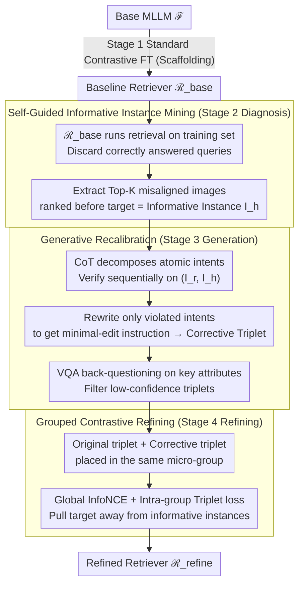

# ReCALL: Recalibrating Capability Degradation for MLLM-based Composed Image Retrieval

**Conference**: CVPR 2026  
**arXiv**: [2602.01639](https://arxiv.org/abs/2602.01639)  
**Code**: [https://github.com/RemRico/Recall](https://github.com/RemRico/Recall)  
**Area**: Multimodal Retrieval  
**Keywords**: Composed Image Retrieval, Capability Degradation, MLLM Self-Improvement, Contrastive Learning, Diagnosis-Generation-Refinement

## TL;DR
This work reveals the "Capability Degradation" phenomenon when adapting generative MLLMs into discriminative retrievers. It proposes the ReCALL framework, a three-stage pipeline (Diagnosis of retriever blind spots → Generation of corrective triplets via base MLLM CoT reasoning → Grouped Contrastive Refining), to effectively restore degraded fine-grained compositional reasoning. ReCALL achieves 55.52% R@1 on CIRR and 57.04% R@10 on FashionIQ.

## Background & Motivation

**Background**: Composed Image Retrieval (CIR) aims to retrieve a target image based on a query consisting of a reference image and a modification text. Early dual-tower VLM methods struggled with fine-grained compositional reasoning due to shallow cross-modal alignment. Recently, researchers have begun adapting MLLMs as retrievers, leveraging their deep fusion and instruction-following capabilities through contrastive fine-tuning.

**Limitations of Prior Work**: Compressing a generative MLLM (focused on step-by-step reasoning) into a single-embedding discriminative retriever (focused on vector similarity) introduces a **paradigm conflict**. Experiments show that fine-tuning leads to the degradation of a model's native fine-grained reasoning abilities (e.g., fine-grained localization, relation understanding). For 1k samples where the base MLLM correctly answers via VQA, the fine-tuned retriever achieves only 62.33% R@1 (CIRR) and 55.80% (FashionIQ), proving significant capability loss during adaptation.

**Key Challenge**: The fundamental conflict between the generative paradigm (sequential reasoning, attention distributed per token) and the discriminative paradigm (semantics compressed into a single embedding vector). A single embedding cannot carry the fine-grained distinctions that MLLMs originally achieve through multi-step reasoning.

**Goal**: To restore the compositional reasoning capabilities degraded during fine-tuning while maintaining the retrieval format (essential single embedding).

**Key Insight**: Instead of changing the retrieval paradigm, this work uses native reasoning signals from the base MLLM to supervise the retriever's embedding space—effectively "distilling reasoning capability from the MLLM into the retrieval space."

**Core Idea**: Identify retriever failures, use the base MLLM to generate minimal-edit corrective instructions for those failures to form new triplets, and internalize these fine-grained distinctions into the retriever via grouped contrastive learning.

## Method

### Overall Architecture
ReCALL addresses the limitation where MLLMs lose fine-grained reasoning when squeezed into a single retrieval embedding. It reconstructs these capabilities from the base MLLM $\mathcal{F}$ to feed the retriever. The pipeline consists of four steps: First, a baseline retriever $\mathcal{R}_{\text{base}}$ is trained using standard contrastive learning from the base MLLM (scaffolding). Second, $\mathcal{R}_{\text{base}}$ is run over the training set to identify failures (Diagnosis). Third, $\mathcal{F}$ performs CoT reasoning to write "corrective" instructions for these failures, forming and filtering new triplets (Generation). Finally, original and corrective triplets are placed in the same micro-groups for further contrastive training to obtain the refined $\mathcal{R}_{\text{refine}}$ (Refining). The framework is backbone-agnostic.

### Key Designs

**1. Self-Guided Informative Instance Mining (Stage 2 Diagnosis): Focused Generation Budget**

Blindly synthesizing large amounts of data wastes resources on samples the model already handles correctly. ReCALL executes $\mathcal{R}_{\text{base}}$ on the training set and discards successful queries. For failed cases, it extracts images ranked above the ground truth as "informative instances" $\{I_h\}$. These images are highly informative because they differ from the true target by only subtle visual/semantic details that the retriever failed to capture. This focuses the generation budget on actual model blind spots.

**2. Generative Recalibration (Stage 3 Generation): Minimal-Edit Corrective Instructions**

After mining informative instances, $\mathcal{F}$ generates reliable supervision signals in two steps. First, CoT-assisted generation: for each $I_h$, the original modification instruction $T_m$ is decomposed into atomic intents. Each is verified against the pair $(I_r, I_h)$. Consistent intents are kept; violated ones are rewritten to create a corrective instruction $\tilde{T}_m$. This ensures that the text difference between $T_m$ and $\tilde{T}_m$ mirrors the visual difference between the target $I_t$ and the informative instance $I_h$. Second, VQA quality control: $\mathcal{F}$ answers questions about key attributes in $\tilde{T}_m$ to filter out low-confidence or inconsistent triplets.

**3. Grouped Contrastive Refining (Stage 4 Refining): Embedding Space Partitioning**

To internalize this discriminative capability, ReCALL constructs a "micro-group" for each query containing both the original triplet $(I_r, T_m, I_t)$ and the corrective triplet $(I_r, \tilde{T}_m, I_h)$. The model is optimized with a dual objective: InfoNCE for global alignment and an intra-group triplet margin loss to explicitly separate targets from confounding instances:

$$\mathcal{L}_{\text{triplet}} = \max\big(0,\ s(z_q, z_{t^-}) - s(z_q, z_{t^+}) + m\big),\qquad \mathcal{L}_{\text{total}} = \mathcal{L}_{\text{infoNCE}} + \lambda\mathcal{L}_{\text{triplet}}$$

where $z_{t^+}$ is the target and $z_{t^-}$ is the confounding informative instance. Presenting nearly identical instructions with distinct targets in the same batch forces the model to resolve the most difficult ambiguities in a single update.

### Example
For a FashionIQ query: reference image is a short-sleeved dress, $T_m$= "change to long sleeves, change neckline to round neck." **Diagnosis**: $\mathcal{R}_{\text{base}}$ ranks a "long-sleeved V-neck" dress above the ground truth (long-sleeved round-neck). This V-neck dress is the informative instance $I_h$. **Generation**: $\mathcal{F}$ decomposes $T_m$ into "long sleeves" and "round neck." It verifies that $I_h$ satisfies "long sleeves" but not "round neck," so it rewrites only the violation to get $\tilde{T}_m$= "change to long sleeves, change neckline to V-neck." **Refining**: $(I_r, T_m, I_t)$ and $(I_r, \tilde{T}_m, I_h)$ are trained in a micro-group. The model learns that despite both having "long sleeves," the "round neck" instruction must point to $I_t$ and "V-neck" to $I_h$, separating these details in the embedding space.

### Loss & Training
Backbone: Qwen2.5-VL-7B with LoRA (rank=16). FashionIQ: lr=$4\times10^{-5}$, $\tau=0.03$, batch=512, Stage 1 (200 steps) + Stage 4 (250 steps). CIRR: lr=$2\times10^{-5}$, $\tau=0.02$, Stage 1 (300 steps) + Stage 4 (350 steps). Triplet margin $m=0.05$, $\lambda$=0.30 (FashionIQ) / 0.25 (CIRR).

## Key Experimental Results

### Main Results

| Dataset | Metric | ReCALL | Prev. SOTA (CIR-LVLM) | $\mathcal{R}_{\text{base}}$ | Gain (vs base) |
|--------|------|------|----------|------|------|
| CIRR test | R@1 | **55.52%** | 53.64% | 51.23% | +8.38% |
| CIRR test | R@5 | 84.07% | 83.76% | 82.15% | +2.34% |
| CIRR test | R_subset@1 | **81.49%** | 79.12% | 77.57% | +5.06% |
| FashionIQ val | Avg R@10 | **57.04%** | 56.21% | 53.23% | +7.16% |
| FashionIQ val | Avg R@50 | **76.42%** | 76.14% | 74.37% | +2.76% |
| FashionIQ Dress | R@10 | 51.81% | 50.42% | 46.80% | **+10.71%** |

### Ablation Study

| Configuration | Avg R@10 | Avg R@50 | Description |
|------|---------|------|------|
| $\mathcal{R}_{\text{base}}$ | 53.23% | 74.37% | Baseline retriever |
| + CG (CoT Gen) | 55.41% | 75.17% | +2.18%, CoT supervision effective |
| + VC (VQA QC) | 56.13% | 76.04% | +0.72%, Noise filtering effective |
| + GR (Grouped Refine) | **57.04%** | **76.42%** | +0.91%, Structured batching critical |

| Mining Strategy | Avg R@10 | Description |
|------|---------|------|
| Random Mining | 53.80±0.20 | Blind synthesis yields only +0.57 |
| Self-Guided Mining | **57.04** | Precise mining yields +3.81 |

### Key Findings
- **Self-Guided vs. Random Mining**: Random mining improves results by only 0.57% for the same data volume, whereas self-guided mining provides 3.81%. This proves *where* data is generated is more important than *how much*.
- **Component Contributions**: CG (+2.18%) > GR (+0.91%) > VC (+0.72%). CoT-assisted generation is the primary driver.
- **Max Gain in Dresses (+10.71%)**: Fine-grained differences in apparel (sleeve length, neckline, patterns) are where capability degradation was most severe.
- **Backbone Generalization**: ReCALL remains effective on stronger models like Qwen3-VL-8B (CIRR R@1: 55.93% → 57.09%), proving capability degradation is a paradigm conflict rather than a specific model defect.

## Highlights & Insights
- **Conceptual Innovation**: The identification and quantitative verification of "Capability Degradation" is the core contribution. By using the $\mathcal{F}$-solvable subset (where $\mathcal{F}$ yields 100% R@1 via VQA but $\mathcal{R}_{\text{base}}$ achieves only 62.33%), the work clearly quantifies the loss during the generative-to-discriminative shift.
- **Minimal-Edit Strategy**: Mirroring text differences with visual differences between targets and confounders creates a symmetric "vision $\leftrightarrow$ text" supervision signal.
- **Universal Framework**: The Diagnosis-Generation-Refinement pipeline is a general model self-improvement paradigm applicable to any MLLM-to-discriminative adaptation task (e.g., classification, reranking).

## Limitations & Future Work
- The current pipeline is single-pass; iterative execution (Diagnosis → Refine → Re-Diagnosis) could potentially yield further gains.
- The method depends on the base MLLM's CoT quality; if the base model cannot perceive certain fine-grained differences, it cannot generate corrective signals.
- VQA quality control is currently limited to consistency checks; finer verification (e.g., checking semantic distance between $\tilde{T}_m$ and $T_m$) could improve data quality.
- Training requires very few steps (200-350), indicating high data efficiency but suggesting room for deeper training exploration.

## Related Work & Insights
- **vs. CIR-LVLM**: Unlike CIR-LVLM, which uses single-stage static fine-tuning, ReCALL addresses capability degradation via a self-improvement loop.
- **vs. TME/CCIN**: While recent works achieve ~53.4% R@1 on CIRR, ReCALL reaches 55.52% by explicitly distilling reasoning from the base model.
- **vs. STaR/Self-Refine**: While existing self-improvement methods focus on generative tasks, ReCALL bridges the gap between generative reasoning and discriminative retrieval spaces.

## Rating
- Novelty: ⭐⭐⭐⭐⭐ Discovery of "Capability Degradation" and the D-G-R approach are original.
- Experimental Thoroughness: ⭐⭐⭐⭐⭐ SOTA on major benchmarks, detailed ablations, and cross-backbone validation.
- Writing Quality: ⭐⭐⭐⭐⭐ Clear motivation, rigorous design, and illustrative figures.
- Value: ⭐⭐⭐⭐⭐ Provides fundamental insights into MLLM retrieval adaptation with a highly general framework.

<!-- RELATED:START -->

## Related Papers

- [\[CVPR 2026\] Self-guided Semantic Inspection for Zero-Shot Composed Image Retrieval](self-guided_semantic_inspection_for_zero-shot_composed_image_retrieval.md)
- [\[CVPR 2026\] ConeSep: Cone-based Robust Noise-Unlearning Compositional Network for Composed Image Retrieval](conesep_cone-based_robust_noise-unlearning_compositional_network_for_composed_im.md)
- [\[CVPR 2026\] STiTch: Semantic Transition and Transportation in Collaboration for Training-Free Zero-Shot Composed Image Retrieval](stitch_semantic_transition_and_transportation_in_collaboration_for_training-free.md)
- [\[CVPR 2026\] Air-Know: Arbiter-Calibrated Knowledge-Internalizing Robust Network for Composed Image Retrieval](air-know_arbiter-calibrated_knowledge-internalizing_robust_network_for_composed_.md)
- [\[ACL 2026\] TEMA: Anchor the Image, Follow the Text for Multi-Modification Composed Image Retrieval](../../ACL2026/multimodal_vlm/tema_anchor_the_image_follow_the_text_for_multi-modification_composed_image_retr.md)

<!-- RELATED:END -->
