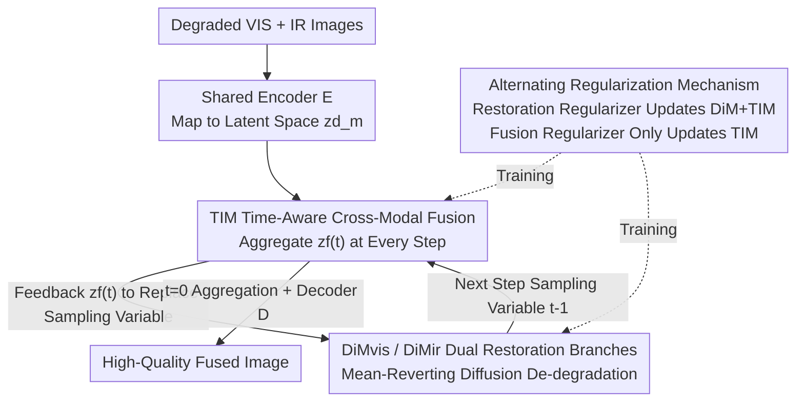

# ReCoFuse: Ultra-Robust Image Fusion via Restorative Multi-Modal Diffusion Reciprocal Coupling

**Conference**: CVPR 2026  
**Paper**: [CVF Open Access](https://openaccess.thecvf.com/content/CVPR2026/html/Zhang_ReCoFuse_Ultra-Robust_Image_Fusion_via_Restorative_Multi-Modal_Diffusion_Reciprocal_Coupling_CVPR_2026_paper.html)  
**Code**: https://github.com/HaoZhang1018/ReCoFuse  
**Area**: Image Fusion / Image Restoration / Diffusion Models  
**Keywords**: Infrared and Visible Image Fusion, Robust Image Fusion, Diffusion Models, Cross-Modal Restoration, Reciprocal Coupling

## TL;DR
ReCoFuse redefines the relationship between "information restoration" and "information fusion" in infrared-visible image fusion as a mutually reinforcing process. It utilizes a Diffusion Module (DiM) for dual-branch restoration and a Time-aware cross-modal Fusion Module (TIM) to bridge the two branches at each sampling step to aggregate a fused representation. This approach ensures clean and high-fidelity fused images even under complex degradations like low light, haze, noise, and stripes.

## Background & Motivation

**Background**: The goal of multi-modal image fusion is to integrate the texture/color of visible light (VIS) and the thermal target details of infrared (IR) into a more comprehensive scene representation, which is widely utilized in autonomous driving and intelligent security. In recent years, deep learning has continuously pushed the performance boundaries of image fusion.

**Limitations of Prior Work**: Real-world source images often suffer from various degradations—visible images are prone to low light, haze, and noise, while infrared images are prone to low contrast, stripes, and noise. Once the source images are degraded, most methods fail to distinguish "effective information" from "degradation factors" at the feature layer, causing the fusion results to directly inherit the degradation and suffer from poor image quality. When both modalities are severely degraded and their complementarity declines, mainstream methods focusing solely on "fusion" may even fail completely.

**Key Challenge**: The core issue lies in **how to define the relationship between "information restoration" and "information fusion"**. Existing robust fusion methods follow two main approaches, each with its own bottleneck:
- **Integrated Hard Regression Paradigm** (MRFS, Text-IF, ControlFusion): These methods use an end-to-end model to implicitly learn "de-degradation + fusion" simultaneously, relying on clean reference images for hard supervision. However, implicitly learning cross-domain mappings of multiple degradations while adapting to highly heterogeneous information preservation needs across scenes is extremely difficult. As a result, the output often retains residual degradation and incomplete scene representations.
- **Decoupled Optimization Paradigm** (OmniFuse, BA-Fusion, DDBF): These methods separate restoration and fusion into two independent modules for sequential optimization. The issue is that during the restoration stage, each modality operates independently and **fails to leverage complementary cues from the other modality** to eliminate severe degradations. Additionally, the separation between modules leads to poor alignment between restoration and fusion, creating a performance bottleneck.

**Goal**: To break the barrier between restoration and fusion, allowing them to be deeply coupled across both the "cross-task" and "cross-modal" dimensions.

**Key Insight**: The authors propose treating restoration and fusion as **mutually reinforcing**—cross-modal information aggregated by fusion helps each restoration branch perform better de-degradation, while cleaner restored branches enable the fusion module to generate better outputs.

**Core Idea**: To propose a **reciprocal coupling optimization paradigm**, using a bridging module (TIM) that operates at each diffusion sampling step to weave dual-branch diffusion restoration and cross-modal fusion into the same feedback loop, making "restoration" and "fusion" mutual inputs for each other.

## Method

### Overall Architecture

ReCoFuse establishes a reciprocal coupling mechanism of "diffusion restoration + cross-modal fusion" in the latent space. First, a **shared encoder $E$** is utilized to map the degraded source images $I^d_m$ (where $m$ denotes modality and $d$ represents degradation type) into latent features and intermediate features $\{z^d_m, h_m\}=E(I^d_m)$. It follows the cross-modal feature reorganization mechanism of OmniFuse, concentrating main scene information and degradation attributes into the latent features $z^d_m$. Subsequently, two **Diffusion Modules (DiM)** (DiMvis / DiMir) are employed in the latent space to model the restoration priors for the two modalities respectively.

The key lies in the fact that single-modality diffusion loses substantial scene information under severe and complex degradations, limiting its restoration capability. Therefore, the authors insert a **TIM (Time-aware cross-modal fusion module)** at **every sampling timestep** of DiM, merging the current sampling variables of the two branches into an aggregated variable $z^d_f(t)$. This aggregated variable serves dual purposes: on the one hand, it is **fed back** to the two restoration branches to replace their respective sampling variables for the next step of noise estimation (leveraging cross-modal complementarity to enhance de-degradation); on the other hand, at $t=0$, it is decoded into the final high-quality fused image. Finally, an **alternating regularization mechanism** is employed to alternately optimize DiM and TIM along the gradient paths, ensuring stable synergy between restoration and fusion.

### Key Designs

**1. Reciprocal Coupling Optimization Paradigm: Shifting Restoration and Fusion from "Sequential/Parallel" to an "Interleaved Input" Loop**

This is a paradigm-level innovation that addresses the key weaknesses of hard regression (excessive learning difficulty) and decoupling (isolated operations). At each timestep $t$, TIM first fuses the sampling variables of the two branches into an aggregated variable $z^d_f(t)=\text{TIM}(z^d_{vis}(t), z^d_{ir}(t), t)$. Then, two actions are performed: first, **the original sampling variables are replaced by $z^d_f(t)$** and fed back to the two branches to estimate the next step, i.e., $\{z^d_{vis}(t-1), z^d_{ir}(t-1)\}=\{\text{DiM}_{vis}(z^d_f(t),t), \text{DiM}_{ir}(z^d_f(t),t)\}$. This implies that each branch utilizes shared information from the opposing modality during denoising, directly injecting complementarity into the de-degradation process. Second, at $t=0$, the aggregated variable is mapped back to the fused image $I_f=D(z^d_f(t), h_f),\ t=0$.

The reason this is effective is that it provides a brand-new perspective on "information fusion": **it is precisely the cross-modal complementarity necessary for restoration that drives the generation of high-quality fused images**. TIM serves as a bridge, connecting the two tasks into a mutually reinforcing closed loop—fusion helps restoration see more scene information, and restoration provides cleaner inputs to fusion, with both mutually elevating each other step-by-step during the sampling process.

**2. TIM (Time-Aware Cross-Modal Fusion): Bridging Dual Branches and Correcting Reverse Trajectories at Every Diffusion Step**

This is the concrete implementation of the paradigm, which addresses the issue of "how to fuse in real-time during diffusion without disrupting restoration trajectories." DiM itself models restoration using the mean-reverting stochastic differential equation of IR-SDE: the forward process is $dz^d_m=\theta_t(\mu_m - z^d_m)\,dt + \sigma_t\,d\omega$, where the system converges to a Gaussian distribution centered on the degraded image $\mu_m$ over time; the reverse process adds a score term to guide samples back to high-density regions. Under the setting $\sigma_t^2/\theta_t = 2\lambda^2$, the marginal distribution has a closed-form Gaussian solution, and the conditional score can be reparameterized as $\nabla \log p_t = -\epsilon_t / \sqrt{v_t}$. Thus, the denoiser $DN_m$ is trained to estimate target noise as $\hat\epsilon_{mt}=DN_m(z^d_f(t), t)$.

TIM's approach is to first generate two time-varying weights to fuse the sampling variables through weighted summation: $z^d_f(t)=w_{vis}(t)\odot z^d_{vis}(t) + w_{ir}(t)\odot z^d_{ir}(t)$, where the weights reflect the relative importance of the two modalities at each timestep. A crucial innovation is that it **modifies the reverse drift term of the standard SDE**, ensuring that a single-step Euler integration starting from the aggregated variable can precisely hit the ideal targets of each modality:

$$\text{Drift}_{f\to m}(z^d_f(t), \hat\epsilon_{mt}) = \underbrace{\theta_t(\mu_m - z^d_f(t))}_{\text{Baseline Drift}} + \underbrace{\sigma_t^2 \frac{\hat\epsilon_{mt}}{\sqrt{v_t}}}_{\text{Cross-Modal Correction}}$$

The first term is the baseline drift (treating $z^d_f(t)$ as an approximation of the current state of modality $m$), and the second term is the **cross-modal correction term**, ensuring that the single-step integration starting from $z^d_f(t)$ lands on the ideal target $\tilde z^d_m(t-1)$. The next state is obtained by a single Euler integration: $z^d_m(t-1)=z^d_f(t) - \text{Drift}_{f\to m}\cdot \Delta t$. Structurally (as shown in Fig. 3 of the original paper), TIM is implemented using an attention computer + CBAM + Fourier time embedding. The time embedding allows the fusion weights to self-adapt as the sampling progresses—which explains why Model III in the ablation study drops in performance when the time embedding is removed.

**3. Alternating Regularization Mechanism: Divide-and-Conquer with Synergy to Approach the Ideal Robust Fusion Function**

The gradient flows of the restoration regularizer and the fusion regularizer converge at TIM; if left unchecked, the two objectives would interfere with each other. The authors design two regularization terms to optimize alternately:
- **Information Restoration Regularization** $L^{I2R}_m$: The ideal next-step state $\tilde z^d_m(t-1)$ is computed from the Bayesian posterior (Eq.13 provides a closed-form solution for the maximum likelihood estimation), forcing the predicted value to converge to it: $L^{I2R}_m = \sum_t \mathbb{E}\big[\lVert z^d_f(t) - \text{Drift}_{f\to m}\cdot\Delta t - \tilde z^d_m(t-1)\rVert\big]$. This step simultaneously updates the parameters of both DiM and TIM, ensuring that the aggregated variable is sufficient to support accurate reverse inference in each branch.
- **Information Fusion Regularization** $L_F = L_{texture} + L_{contrast} + L_{color}$: The texture term takes the pixel-wise maximum gradient of both modalities, the contrast term takes the pixel-wise maximum luminance, and the color term aligns Cb/Cr with those of the clean VIS/IR images. During the application of this regularizer, **only TIM is trainable, and DiM is frozen**.

Why this is effective: The authors demonstrate from an optimization perspective (Fig. 5) that the ideal robust fusion function $g^*=\arg\min_g L_{RIF}$ is overly complex and hard to solve via hard regression paradigms. Meanwhile, decoupled paradigms can only solve $r^*$ and $f^*$ separately and assemble them as $g^*=\langle r^*, f^*\rangle$, but sub-task optimality does not guarantee global optimality. Alternating regularization **simplifies** optimization by utilizing priors from both sub-tasks while allowing them to **synergize** through the shared TIM, thereby approaching $g^*$ more closely than decoupling.

### Loss & Training
Training is performed using the Lion optimizer with an initial learning rate of $3\times 10^{-5}$ on two NVIDIA Tesla P100-PCIE-16GB GPUs. The dataset merges three public infrared-visible datasets: MFNet, FMB, and LLVIP. Each scene contains a pair of degraded IR/VIS images and their clean references (for supervision), yielding 1,980 training pairs and 100 test pairs per dataset. The overall loss consists of the aforementioned restoration and fusion regularizers, which are applied alternately according to the alternating regularization mechanism.

## Key Experimental Results

### Main Results
The proposed method is compared against 9 SOTA fusion methods (U2Fusion, LRRNet, Diff-IF, SHIP, CrossFuse, DCEvo, MRFS, Text-IF, OmniFuse) on three datasets: MFNet, FMB, and LLVIP, using six objective metrics: SD, MI, EN, CC, SCD, and VIF. Two evaluation settings are used: ext. (external restoration networks such as InstructIR/ASCNet/Restormer are attached before the fusion-only methods) and re. (retraining on the same dataset used in this paper). The table below extracts representative results on MFNet:

| MFNet Metric | ReCoFuse | Diff-IF(ext.) | DCEvo(ext.) | Text-IF(re.) | OmniFuse(ext.) |
|------|----------|---------------|-------------|--------------|----------------|
| SD↑ | **48.473** | 46.662 | 47.524 | 46.640 | 27.226 |
| MI↑ | **3.114** | 2.884 | 2.814 | 2.464 | 2.144 |
| EN↑ | **7.305** | 7.191 | 7.239 | 7.277 | 6.568 |
| CC↑ | **0.527** | 0.482 | 0.490 | 0.525 | 0.457 |
| SCD↑ | **1.381** | 1.131 | 1.181 | 1.345 | 0.846 |
| VIF↑ | 0.660 | 0.764 | 0.744 | 0.788 | 0.448 |

ReCoFuse achieves optimal or sub-optimal results on most metrics across all three datasets. Qualitatively (Fig. 6/Fig. 7), even when the comparison methods are pre-enhanced, they still suffer from residual degradation and weaker thermal targets under complex degradations. In contrast, ReCoFuse cleanly removes degradations and fully exploits cross-modal complementarity. The authors also highlight that even with clean labels, simple regression without targeted designs still fails to achieve robust fusion.

**Generalization**: Tested on 20 image pairs from the real-degradation dataset AWMM-100k (snow and fog scenes) (Table 2), ReCoFuse leads in SD (44.469), EN (7.296), and VIF (0.650), successfully removing fog while preserving distant and near thermal pedestrians.

### Ablation Study
The ablation results are shown in Table 3, divided into restoration and fusion parts. Model I completely removes TIM and retains only DiM for separate restoration; Models II–VIII sequentially replace key designs of the fusion module:

| Configuration | Key Metrics | Description |
|------|---------|------|
| Full Model (Re. VIS) | PSNR 25.205 / FID 19.226 | Full model restoring visible light |
| Model I (DiM only, Re. VIS) | PSNR 24.512 / FID 19.916 | TIM removed, missing cross-modal complementarity, restoration degrades |
| Full Model (Re. IR) | PSNR 33.294 / FID 25.074 | Full model restoring infrared |
| Model I (DiM only, Re. IR) | PSNR 33.084 / FID 39.190 | IR FID significantly deteriorates |
| Full Model (Fus.) | SD 48.473 / MI 3.114 / SCD 1.381 | Full model |
| Model II (Late Fusion) | SD 48.321 / MI 3.083 | TIM moved out of sampling steps; fusion is trained independently post-sampling |
| Model III (TIM w/o Time Embedding) | MI 2.464 / CC 0.523 | MI drops significantly |
| Model IV (Separated Optimization) | CC 0.485 / SCD 1.145 | Restore first, then freeze DiM to tune TIM |
| Model V (Joint Optimization) | SD 46.684 / MI 2.972 | DiM+TIM jointly trained with restoration + fusion losses |
| Model VI (Decoupled Alternating Optimization) | SD 41.005 / MI 2.000 / VIF 0.428 | Freeze one and update another, content severely damaged |
| Model VII (Contrast Loss Replaced) | MI 2.436 | Abnormal lighting shadows appear in the sky |
| Model VIII (Texture Loss Replaced) | SD 46.215 / MI 2.458 | Loss of detail and reduced saliency |

### Key Findings
- **TIM is the Source of Restoration Gain**: Removing TIM (Model I) deteriorates restoration in both modalities, particularly for IR where the FID surges from 25.074 to 39.190, vindicating the core argument that "cross-modal complementarity enhances de-degradation capacity."
- **Time Embedding is Crucial**: Disabling the time embedding in Model III drops the MI from 3.114 to 2.464, demonstrating that fusion weights need to adapt to the sampling progress.
- **Alternating Regularization is Irreplaceable**: Both joint optimization (Model V) and decoupled alternating optimization (Model VI) perform significantly worse than the full model. Model VI even sees its SD drop to 41.005 and VIF to only 0.428, validating the value of the "divide-and-conquer + shared TIM synergy" design.
- **Downstream Semantic Gain**: For object detection (Table 4), ReCoFuse achieves the best performance with a Precision of 0.983, mAP@.75 of 0.718, and mAP@.5:.95 of 0.625. For semantic segmentation (Table 5), it obtains the highest mIoU of 57.67, indicating that the fused images preserve highly useful semantic information.

## Highlights & Insights
- **Paradigm Redefinition Holds the Highest Value**: Upgrading the "restoration vs. fusion" relationship from "sequential or auxiliary" to a "closed loop of reciprocal inputs" is a major breakthrough at the conceptual level, rather than just stacking modules. Reusing a single aggregated variable to both feedback into restoration and generate fusion is an elegant design.
- **Clever Integration of Cross-Modal Correction into Reverse Diffusion Drift**: It couples two IR-SDE branches by adding a cross-modal correction to the standard drift without disrupting the mean-reverting structure. This guarantees that a single-step integration starting from the fused state still converges to the ideal trajectory of each modality—a key mathematical trick to couple multi-tasking in diffusion that can scale to other multi-branch diffusion sharing scenarios.
- **Exquisite Freezing Strategy**: The restoration regularizer updates both modules, while the fusion regularizer only updates TIM. This allows DiM to focus on restoration while TIM manages both bridging and fusion, preventing the fusion loss from biasing the restoration branches. This training approach of "staged unfreezing along the gradient path" is a highly referable practice.

## Limitations & Future Work
- **Sampling Cost**: The method runs TIM and performs dual-branch denoising at every diffusion timestep, which likely incurs higher inference overhead compared to single-forward fusion networks. The paper does not provide inference speed or memory footprint comparisons, leaving practical deployment costs uncertain.
- **Dependency on Clean Reference**: Training requires clean IR/VIS reference images for supervision in each scene. Such paired clean labels are difficult to obtain in the real world, limiting scalability to scenarios lacking paired clean training data.
- **Limited Degradation Types**: The experiments focus on low light, haze, noise, low contrast, and stripes. Robustness to combined degradations such as motion blur, compression artifacts, and sensor distortion remains unverified.
- **Occasional Disadvantage in VIF**: The VIF (0.660) on MFNet is lower than some competing methods, indicating that there is still a trade-off regarding "visual information fidelity," and reciprocal coupling does not dominate strictly across all metrics.

## Related Work & Insights
- **vs. Integrated Hard Regression (MRFS / Text-IF / ControlFusion)**: These methods use a single end-to-end model to implicitly learn restoration and fusion simultaneously under the hard supervision of clean ground truths. This is extremely challenging and prone to residual degradations. ReCoFuse replaces "implicit difficulty" with "explicit coupling" by explicitly modeling restoration via diffusion and bridging fusion with TIM.
- **vs. Decoupled Optimization (OmniFuse / BA-Fusion / DDBF)**: These methods split restoration and fusion into two sequential stages, rendering restoration unable to benefit from cross-modal complementarity. ReCoFuse adopts the feature reorganization and diffusion purification of OmniFuse but restructures "restoration first, then fusion" into "step-by-step reciprocal coupling," enabling complementary information to enter the de-degradation process directly. This is the most fundamental difference from OmniFuse.
- **vs. IR-SDE**: ReCoFuse directly employs its mean-reverting SDE as the denoising core of DiM. The innovation lies not in the diffusion itself, but in using the cross-modal drift correction of TIM to couple the two IR-SDE branches.

## Rating
- Novelty: ⭐⭐⭐⭐⭐ First to define the "restoration-fusion" relationship in image fusion as a reciprocal coupling process. This is a paradigm-level innovation seamlessly integrated into the specific mathematics of the diffusion drift term.
- Experimental Thoroughness: ⭐⭐⭐⭐ Extensive evaluation across three datasets, using two evaluation strategies, looking at generalization performance, and downstream detection/segmentation tasks with 8 detailed ablations. However, it lacks inference computational cost comparisons.
- Writing Quality: ⭐⭐⭐⭐ Paradigm comparisons and optimization analyses are clear, with complete mathematical derivations. Some formulas are slightly dense.
- Value: ⭐⭐⭐⭐ Robust fusion under complex degradations holds significant practical value for autonomous driving and security systems, and the core methodology can scale to other multi-branch diffusion coupling tasks.

<!-- RELATED:START -->

## Related Papers

- [\[CVPR 2026\] Multi-Modal Image Fusion via Intervention-Stable Feature Learning](multi-modal_image_fusion_via_intervention-stable_feature_learning.md)
- [\[CVPR 2026\] CICA: Coupling Confidence-Aware Pretraining with Confidence-Informed Attention for Robust Multimodal Sentiment Analysis](cica_coupling_confidence-aware_pretraining_with_confidence-informed_attention_fo.md)
- [\[CVPR 2026\] Multi-Hierarchical Contrastive Spectral Fusion for Multi-View Clustering](multi-hierarchical_contrastive_spectral_fusion_for_multi-view_clustering.md)
- [\[CVPR 2026\] VideoFusion: A Spatio-Temporal Collaborative Network for Multi-modal Video Fusion](videofusion_a_spatio-temporal_collaborative_network_for_multi-modal_video_fusion.md)
- [\[CVPR 2026\] Beyond Sequential Tools: A Unified VLM Agent System for Photographic Post-Processing via Dynamic Multi-Expert Fusion](beyond_sequential_tools_a_unified_vlm_agent_system_for_photographic_post-process.md)

<!-- RELATED:END -->
