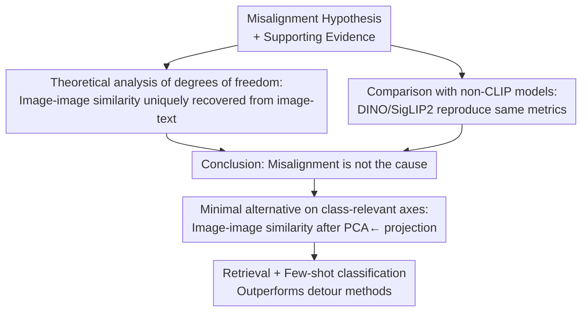

# Reevaluating the Intra-Modal Misalignment Hypothesis in CLIP

**Conference**: CVPR 2026  
**论文**: [CVF Open Access](https://openaccess.thecvf.com/content/CVPR2026/html/Herzog_Reevaluating_the_Intra-Modal_Misalignment_Hypothesis_in_CLIP_CVPR_2026_paper.html)  
**Code**: [Project Page](https://vision-kek.github.io/IsCLIP-Really-Misaligned)  
**Area**: Multimodal VLM  
**Keywords**: CLIP, Intra-modal alignment, image retrieval, few-shot classification, representation geometry

## TL;DR
This paper systematically refutes the popular "intra-modal misalignment in CLIP image embeddings" hypothesis. Theoretically, it proves that image-image similarity is fully determined by image-text similarity without additional degrees of freedom. Empirically, it reproduces the so-called "misalignment metrics" in non-CLIP models like DINO and SigLIP2, demonstrating that these metrics are artifacts of the measurement process rather than defects in CLIP's objectives. Finally, a minimal PCA projection method is shown to outperform complex methods specifically designed to "fix" misalignment in retrieval and few-shot classification tasks.

## Background & Motivation

**Background**: Contrastive Language-Image Pre-training (CLIP) embeds images and text into a shared space for comparison via cosine similarity, underpinning the success of open-vocabulary zero-shot classification, detection, and segmentation. However, its most basic application—directly comparing two image embeddings (image-image similarity for retrieval and few-shot classification)—has been questioned by recent works.

**Limitations of Prior Work**: The "intra-modal misalignment hypothesis" claims that CLIP's contrastive loss only optimizes cross-modal (image-text) alignment while ignoring intra-modal (image-image) alignment, resulting in "poorly calibrated" distances between image embeddings. A common illustration (Fig. 1) shows cat images being closer to a dog image than to another cat ($d_{\neq} < d_{=}$). Based on this, methods like Tip-X, OTI, and CODER advocate for avoiding direct image-image comparisons, instead using cross-modal similarity as a bridge (e.g., inverting an image into a pseudo-text token).

**Key Challenge**: The authors point out a tension within this narrative. Many works achieve strong results in classification, generation, and retrieval using only the CLIP image encoder, with some even reporting that image-image retrieval outperforms image-text retrieval—results inexplicable if embeddings were "severely misaligned." Furthermore, the two pillars of the misalignment hypothesis—theoretical "degrees of freedom" arguments and empirical "misalignment metrics" (cosine similarity histograms, modality gaps, retrieval performance)—appear structurally weak.

**Goal**: To dismantle these pillars one by one: (1) Does the theoretical degree-of-freedom argument hold? (2) Do misalignment metrics only appear in models lacking intra-modal loss? (3) Does the performance gain of detour methods truly come from "fixing misalignment"?

**Key Insight**: A critical controlled experiment is to replace CLIP with a purely visual model never trained with language supervision (DINO) or a model that includes image-image self-supervision (SigLIP2). If the same "misalignment metrics" appear in these models, they cannot be caused by CLIP's "lack of intra-modal loss."

**Core Idea**: Intra-modal similarity is not "free-floating" but a necessary consequence of the image-text structure. So-called misalignment metrics are normal manifestations of open-vocabulary models preserving rich semantics/style and have been misread as defects. Instead of "fixing" image-image distance, it should be measured along task-relevant semantic axes.

## Method

This is an analytical/refutational paper; the "Method" refers to the **research design for reevaluating the hypothesis** rather than a new model architecture. The authors design three lines of inquiry corresponding to the pillars of the misalignment hypothesis: theoretical deconstruction, controlled empirical comparison, and a minimal alternative method to explain why detour methods work.

### Overall Architecture

The study follows a three-stage logical chain: "falsify theory, falsify metrics, and provide a simpler explanation." The input is the misalignment hypothesis and its supporting evidence; the output is the conclusion that "misalignment is not the cause of observed phenomena" and a simple alternative method, PCA←.

### Key Designs

**1. Theoretical Deconstruction: Image-image similarity uniquely recovered from image-text**

The theoretical basis of the misalignment hypothesis (Fig. 4a-c) suggests that given a fixed distance $r$ from an image to a "cat" text, the image embedding can lie anywhere on a circle, allowing image-image distances to be arbitrarily misaligned. The authors argue this flaw stems from **anchoring images to a single text**. Once expanded to sufficient text anchors, the degrees of freedom vanish.

Formally: In a pre-training set with $n_T$ texts and $n_I$ images, given a fixed cross-modal cosine similarity matrix $S_{inter}\in\mathbb{R}^{n_T\times n_I}$, is there room for "misaligned" intra-modal similarity $S_{intra}\in\mathbb{R}^{n_I\times n_I}$? The authors prove that in a $d$-dimensional space, sampling only $d$ text anchors (row index set $J$, $|J|=d$) allows for a unique solution for all image embeddings via a system of linear equations:

$$S_{inter}[J] = X_T[J]\cdot X_I^\top \;\Rightarrow\; X_I = (X_T[J])^{-1}\cdot S_{inter}[J]$$

Since each row of $X_T$ is a unique unit vector, sampling $d$ texts ensures $X_T[J]$ is invertible. Given $n_T, n_I \gg d$, very few anchors are needed. Consequently, $S_{intra} = X_I X_I^\top$ is completely determined with no remaining degrees of freedom. In other words, the intra-modal structure is a direct consequence of the learned image-text structure.

**2. Comparison with non-CLIP models: Metrics are artifacts, not training defects**

The authors test if empirical indicators (overlapping class histograms, modality gaps) are specific to models lacking intra-modal loss. They compare models with only cross-modal loss (CLIP, SigLIP) against those with image-image self-supervision (DINO, SigLIP2).

Results (Fig. 5, Tab. 2) show these metrics are nearly indistinguishable between SigLIP and SigLIP2. High overlap in intra-class vs. inter-class histograms and the separation of image-image and image-text distributions exist in both. Crucially, these "misalignment signals" also appear in DINO, which has never seen language supervision. This proves they are **artifacts of the measurement logic** rather than consequences of the training objective.

**3. PCA←: A minimal alternative on class-relevant axes**

Methods like OTI invert images into pseudo-text tokens in "a photo of $v^*$" to bypass misalignment. The authors propose an alternative explanation: these work by **forcing image information to collapse into a word-level token**, effectively asking "what single word best describes this image?", which naturally correlates with test set categories.

The authors replace this inversion with a linear projection: take $n$ ImageNet class names, generate "a photo of x" text embeddings, and perform PCA to extract the top $d/2$ principal components. All test image embeddings are projected into this subspace before measuring cosine similarity (denoted as PCA←). This is **independent of the downstream dataset** but filters out non-dominant details.

### Loss & Training
No new models are trained. All experiments use frozen pre-trained encoders (CLIP/SigLIP/SigLIP2/SLIP/DINOv2/DINOv3, mostly ViT-B). PCA← requires a one-time offline PCA with no gradient training. Few-shot classification uses prototypes (class means) or LDA classifiers.

## Key Experimental Results

### Main Results

**Dogs vs Cats Preliminary Experiment (Tab. 1)**: Reproducing the OTI experiment. If CLIP were misaligned, a vision-only encoder like DINO should perform better. Instead, CLIP performs best, suggesting low metrics stem from task ambiguity rather than misalignment.

| Model | Retrieval I-I | Classification I-I (1-shot) | Classification I-I (16-shot) |
|------|---------|-------------------|--------------------|
| CLIP ViT-B/16 | **87.1** | **84.2** | **99.7** |
| DINOv2 ViT-B/14 | 81.8 | 76.2 | 97.3 |
| DINOv3 ViT-L/16 | 84.3 | 80.2 | 97.8 |

**Few-shot Classification (Tab. 2, Average of 11 datasets)**: Direct test of image embedding quality without text prompts. Results in parentheses utilize PCA← projection.

| Model | Classifier | 1-shot | 4-shot | 16-shot |
|------|--------|--------|--------|---------|
| CLIP | Prototype | 43.4 (50.7) | 63.8 (69.7) | 73.5 (77.5) |
| SigLIP (Cross-modal only) | Prototype | 57.3 (62.1) | 76.3 (78.5) | 82.5 (83.7) |
| SigLIP2 (Cross+Intra) | Prototype | 58.0 (63.4) | 77.0 (79.4) | 83.0 (84.5) |
| DINOv2 (Image only) | Prototype | 59.6 | 71.8 | 78.2 |
| SigLIP | LDA | 2.3 | 79.0 | 85.3 |
| SigLIP2 | LDA | 2.3 | 80.5 | **86.5** |

Key point: SigLIP (cross-modal) **outperforms** DINOv2 on image-image tasks, proving language-image training produces highly aligned image embeddings.

**Image-Image Retrieval (Tab. 3, Average mAP of 13 datasets)**: PCA← consistently outperforms OTI across models.

| Model | Original ⟨I,I⟩ | OTI ⟨T,I⟩ | PCA← ⟨I←,I←⟩ |
|------|----------------|-----------|---------------|
| CLIP B/32 | 41.6 | 42.9 | **49.0** |
| CLIP L/14 | 53.7 | 57.0 | **61.3** |
| SigLIP B/16 | 57.2 | 60.0 | **62.8** |
| SigLIP2 B/16 | 58.6 | — | **64.4** |

### Ablation Study

| Configuration | Key Findings |
|------|---------|
| SigLIP vs SigLIP2 | Only 1.2 mAP difference in retrieval, suggesting intra-modal loss doesn't "fix" a fundamental flaw. |
| PCA← Gain | Gains are similar across models with or without intra-modal training, indicating the benefit is unrelated to training misalignment. |
| PCA← on BDD100k | mAP drops for weather (-2.3%) and time (-1.0%), where labels do not correspond to the image's dominant concept. |

### Key Findings
- **Metric reproduction in non-CLIP models** is the strongest counter-evidence: histogram overlap and modality gaps exist in DINO/SigLIP2, so they cannot originate from CLIP's training gaps.
- **PCA← only works for dominant concepts**: The drop in BDD100k proves its gain comes from discarding non-dominant information, not fixing a general misalignment.
- **Modality gap is not an issue**: Precise modal alignment is often theoretically sub-optimal; image and text embeddings occupying separate manifolds is reasonable.

## Highlights & Insights
- **"Model replacement as control"** is a clean causal isolation tool, using DINO/SigLIP2 as a control group to break the link between observed metrics and training objectives.
- **Strong linear algebra proof**: The $d$-anchor proof refutes the intuitive "degrees of freedom" argument effectively.
- **Dimensionality reduction of complex methods**: By showing that OTI's benefits can be replicated with a simple PCA projection, the authors provide a more parsimonious explanation for why such "detours" work.
- **Honest boundary statements**: The authors admit they haven't "disproved" misalignment absolutely but have shown that everything previously cited as evidence is invalid.

## Limitations & Future Work
- **Does not disprove the hypothesis itself**: Experiments show misalignment is not the *cause* of observed trends, not that it *cannot* exist.
- **Limited task scope**: Primarily focuses on retrieval and few-shot classification; segmentation or VQA tasks were not tested.
- **Confounding factors in cross-model comparisons**: Differences between SigLIP and DINOv2 might be influenced by training data, making it hard to isolate the effect of the loss function alone.

## Related Work & Insights
- **vs OTI (Mistretta et al.)**: OTI assumes misalignment and inverts images; this paper proves inversion is unnecessary and PCA← is more effective.
- **vs Tip-X / CODER**: These avoid image-image similarity; this paper shows they are outperformed by direct image-space discrimination like LDA or APE.
- **vs Modality Gap papers**: While others view the gap as a problem to solve, this paper argues for utilizing the pre-trained intra-modal geometry.

## Rating
- Novelty: ⭐⭐⭐⭐ Refuting a popular hypothesis with rigorous theory and controlled experiments is highly novel.
- Experimental Thoroughness: ⭐⭐⭐⭐ Validated across 6 models and 13 datasets with clear counter-examples like BDD100k.
- Writing Quality: ⭐⭐⭐⭐⭐ Extremely clear logical flow and disciplined argumentation.
- Value: ⭐⭐⭐⭐ Significant for practitioners using CLIP/SigLIP, discouraging unnecessary "patches" for non-existent problems.

<!-- RELATED:START -->

## Related Papers

- [\[CVPR 2026\] IsoCLIP: Decomposing CLIP Projectors for Efficient Intra-modal Alignment](isoclip_decomposing_clip_projectors_for_efficient_intramodal_alignment.md)
- [\[CVPR 2026\] Intra-class Distribution-guided Generative Hashing with Neighbor Refinement for Cross-modal Retrieval](intra-class_distribution-guided_generative_hashing_with_neighbor_refinement_for_.md)
- [\[CVPR 2026\] Explaining CLIP Zero-shot Predictions Through Concepts](explaining_clip_zero-shot_predictions_through_concepts.md)
- [\[CVPR 2026\] CAPT: Confusion-Aware Prompt Tuning for Reducing Vision-Language Misalignment](capt_confusion-aware_prompt_tuning_for_reducing_vision-language_misalignment.md)
- [\[CVPR 2026\] Multi-Modal Representation Learning via Semi-Supervised Rate Reduction for Generalized Category Discovery](multi-modal_representation_learning_via_semi-supervised_rate_reduction_for_gener.md)

<!-- RELATED:END -->
