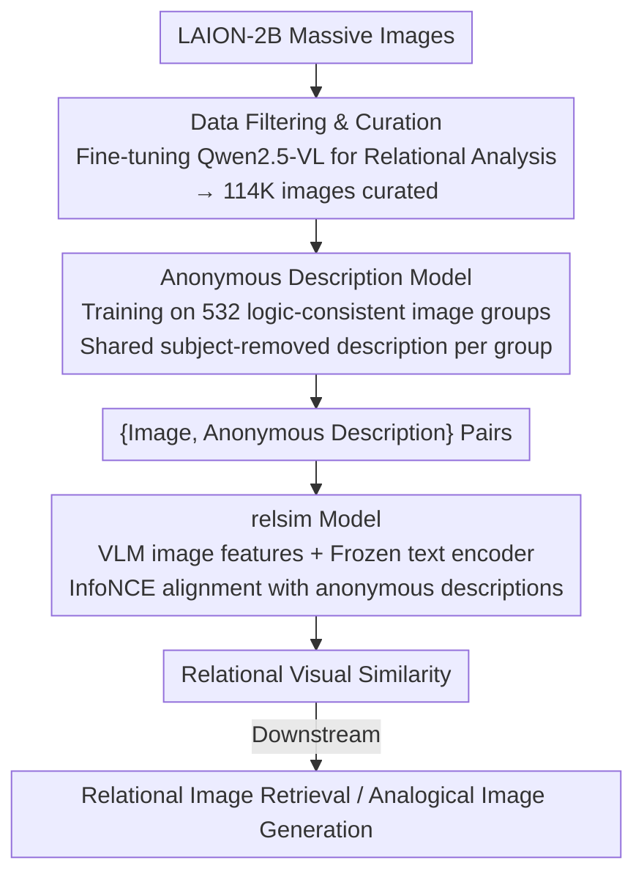

# Relational Visual Similarity

**Conference**: CVPR 2026  
**arXiv**: [2512.07833](https://arxiv.org/abs/2512.07833)  
**Code**: [https://thaoshibe.github.io/relsim](https://thaoshibe.github.io/relsim)  
**Area**: Multimodal VLM  
**Keywords**: Relational Similarity, Visual Analogy, Anonymous Descriptions, Cognitive Science, Image Retrieval

## TL;DR
This paper formally defines the problem of relational visual similarity—logical or functional correspondence between two images rather than surface attribute similarity. It constructs a dataset of 114K anonymous descriptions and trains the `relsim` model, revealing fundamental flaws in existing similarity metrics (e.g., CLIP, DINO) in capturing relational structures.

## Background & Motivation
1. **Background**: Visual similarity is a foundational capability in computer vision. Existing methods (LPIPS, CLIP, DINO, etc.) focus on attribute similarity, emphasizing pixel-level, semantic-level, or descriptive matching.
2. **Limitations of Prior Work**: These methods fail to recognize relational similarity—for instance, the burning stages of a matchstick and the ripening stages of a banana share the same "temporal progression" logic, despite being entirely different in attributes.
3. **Key Challenge**: Cognitive science posits that attribute similarity and relational similarity are the two core pillars of human perception, yet visual computing has largely ignored the latter. Relational similarity is considered a key cognitive ability distinguishing humans from other species.
4. **Goal**: Formalize relational visual similarity as a measurable problem and build models capable of capturing relational structures.
5. **Key Insight**: Inspired by cognitive science, humans identify relational similarity through conceptual abstraction via language or prior knowledge. Thus, "anonymous descriptions" (describing internal logic rather than specific objects) are introduced as a bridge to connect relationally similar images.
6. **Core Idea**: Define anonymous descriptions (e.g., "transformation of {subject} over time"), train models to generate these descriptions, and use them to pull together images sharing the same relational logic in a representation space.

## Method

### Overall Architecture
The paper aims to enable models to judge similarity based on "relational logic" rather than "surface attributes." For example, matchstick burning and banana ripening both involve "gradual change over time"—they have no attribute relationship but share an isomorphic internal structure. Since relations are abstract and cannot be directly extracted from pixels or semantic labels, the authors adopt a mechanism from cognitive science: humans abstract images into concepts through language before comparing relations. This "linguistic bridge" is implemented in a three-step pipeline: filtering 114K images that carry relational structures from LAION-2B, training a model to write an "anonymous description" for each image (focusing on logic, excluding specific objects), and finally using these descriptions as supervision to align relationally isomorphic images, resulting in the `relsim` model.

### Key Designs

**1. Data Filtering & Curation: Removing non-relational images**

The vast majority of images in LAION-2B are product photos or selfies containing little relational information. Training on such data would treat noise as signal. The authors first perform filtering: using 1.3K positive and 11K negative manual annotations, they fine-tune a Qwen2.5-VL discriminator to answer, "Does this image contain a transferable relational pattern or structure?" This discriminator achieves 93% agreement with human judgment. It is then used to scan LAION-2B to extract 114K images likely carrying relational patterns like temporal sequences, structural analogies, or functional correspondences. This step ensures that the subsequent "relations" learned are grounded.

**2. Anonymous Description Model: Explicitly capturing relations without subjects**

The core contradiction of relational similarity is that it is hidden at the conceptual layer. The authors train a specialized description model that takes an image and outputs an **anonymous description**—deliberately omitting specific visible objects while retaining the relational logic. For example, for a burning matchstick, the description is "transformation of {subject} over time" instead of "burning matchsticks." By abstracting the subject into a placeholder `{subject}`, matchstick burning and banana ripening converge on the same description, which acts as the "glue" connecting relationally isomorphic images.

A key training technique is utilized: it is difficult to extract relational logic from a single image (as structure is not always obvious), but structure emerges when images sharing the same logic are grouped. The authors curated **532 image groups** (2-10 images per group). These groups are fed to a frozen VLM to produce a **single** anonymous description, manually verified, and **assigned to every image in the group**. The description model is then fine-tuned on these {image group, description} pairs. Once trained, it is applied to the 114K curated images to generate individual anonymous descriptions, turning the cognitive concept of "abstraction" into a computable signal.

**3. relsim Model: VLM backbone with anonymous description supervision**

Standard vision-language contrastive learning (like CLIP) aligns images with their **specific descriptions**, naturally biasing the model toward attribute similarity. `relsim` replaces the supervision signal with the generated anonymous descriptions. An image encoder $f_V$ and a frozen text encoder $f_T$ (all-MiniLM) encode the image and its anonymous description, respectively. The InfoNCE loss is used to pull "image-anonymous description" pairs together and push others apart, ensuring that images with the same relational abstraction are closer in the feature space.

Crucially, **the backbone is changed**. The authors found that pure visual encoders (CLIP/DINO) fail to learn relational similarity because their representations inherently emphasize visual attributes. Relational reasoning requires high-level semantics and world knowledge present in Large Language Models. Therefore, $f_V$ is chosen as a **VLM (Qwen2.5-VL-7B)**. A learnable query token is appended to the image and fed into the LLM, and its feature from the final layer is extracted as the relational feature via LoRA fine-tuning. The combination of a VLM backbone and anonymous description supervision shifts the optimization goal from "visual appearance" to "logical structure."

### Loss & Training
The model employs a standard vision-language contrastive loss, with the critical distinction of replacing conventional captions with anonymous descriptions as positive pairs.

## Key Experimental Results

### Main Results

| Model | Attribute Similarity | Relational Similarity | Description |
|------|----------|----------|------|
| CLIP | High | Low | Captures attributes only |
| DINO | High | Low | Captures attributes only |
| LPIPS | High | Very Low | Pixel-level |
| relsim | Mid-High | High | Relation-aware |

### Ablation Study

| Configuration | Key Metric | Description |
|------|---------|------|
| Full relsim | Optimal | Trained with anonymous descriptions |
| Conventional Caption Training | Poor Relational Sim | Attribute descriptions cannot encode relations |
| w/o Data Filtering | Decrease | Noise interference |

### Key Findings
- All mainstream visual similarity metrics perform poorly on relational similarity, highlighting a major blind spot in visual computing.
- Anonymous descriptions serve as an effective intermediary for connecting relationally similar images.
- `relsim` demonstrates practical utility in applications such as relational image retrieval and analogical image generation.

## Highlights & Insights
- **Opening a new dimension of visual understanding**: Shifting from attributes to relations represents a conceptual breakthrough.
- **Anonymous Descriptions** is an elegant concept: removing specific objects to retain only abstract logic.
- The interdisciplinary integration of cognitive science and computer vision is noteworthy.

## Limitations & Future Work
- Evaluating relational similarity lacks clear ground truth and involves significant subjectivity.
- The quality of generated anonymous descriptions still has room for improvement.
- Future work could explore more applications in reasoning and creative generation.

## Related Work & Insights
- **vs CLIP/DINO**: These focus on attribute-level semantic matching and cannot capture relational similarity. `relsim` fills this gap through anonymous description training.
- **vs NIGHTS**: Focuses on mid-level perceptual similarity, which remains attribute-driven.

## Rating
- Novelty: ⭐⭐⭐⭐⭐ New problem definition with a unique interdisciplinary perspective.
- Experimental Thoroughness: ⭐⭐⭐⭐ Extensive model comparisons and applications, though large-scale user studies are limited.
- Writing Quality: ⭐⭐⭐⭐⭐ Engaging narrative with rich cognitive science background.
- Value: ⭐⭐⭐⭐⭐ Deeply impactful by revealing a fundamental blind spot in visual AI.

<!-- RELATED:START -->

## Related Papers

- [\[ICML 2026\] Gated Relational Alignment via Confidence-based Distillation for Efficient VLMs](../../ICML2026/multimodal_vlm/gated_relational_alignment_via_confidence-based_distillation_for_efficient_vlms.md)
- [\[ACL 2026\] Structured and Abstractive Reasoning on Multi-modal Relational Knowledge Images](../../ACL2026/multimodal_vlm/structured_and_abstractive_reasoning_on_multi-modal_relational_knowledge_images.md)
- [\[CVPR 2026\] Similarity-as-Evidence: Calibrating Overconfident VLMs for Interpretable and Label-Efficient Medical Active Learning](similarity-as-evidence_calibrating_overconfident_vlms_for_interpretable_and_labe.md)
- [\[AAAI 2026\] The Triangle of Similarity: A Multi-Faceted Framework for Comparing Neural Network Representations](../../AAAI2026/multimodal_vlm/the_triangle_of_similarity_a_multi-faceted_framework_for_comparing_neural_networ.md)
- [\[CVPR 2026\] VQ-VA World: Towards High-Quality Visual Question-Visual Answering](vq-va_world_towards_high-quality_visual_question-visual_answering.md)

<!-- RELATED:END -->
