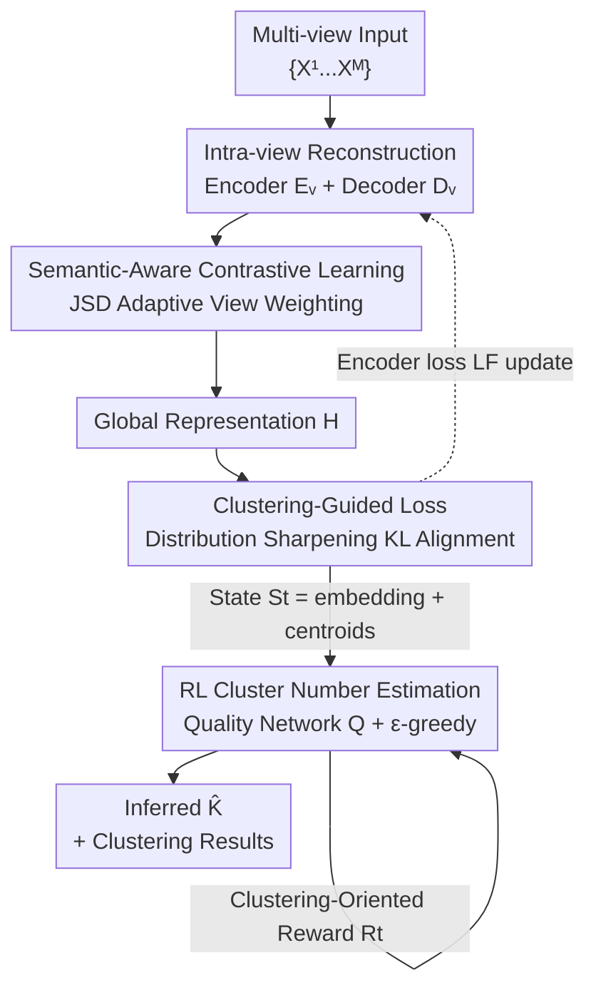

# Reliable Clustering Number Estimation for Contrastive Multi-View Clustering

**Conference**: CVPR 2026  
**Paper**: [CVF Open Access](https://openaccess.thecvf.com/content/CVPR2026/html/Zhu_Reliable_Clustering_Number_Estimation_for_Contrastive_Multi_View_Clustering_CVPR_2026_paper.html)  
**Code**: None  
**Area**: Multi-view Clustering  
**Keywords**: Contrastive Multi-view Clustering, Clustering Number Estimation, Reinforcement Learning, Representation Degeneration, JSD View Weighting

## TL;DR
RCNMC utilizes a semantic-aware contrastive module with JSD adaptive weighting to mitigate representation degeneration—where low-quality views degrade high-quality ones. By modeling the "estimation of cluster number $K$" as a Markov Decision Process (MDP) and using Reinforcement Learning (RL) to automatically infer $K$ within a single training session, the method achieves or exceeds the performance of contrastive methods using ground-truth $K$ across 9 multi-view datasets without pre-setting $K$ or relying on labels.

## Background & Motivation
**Background**: The mainstream approach in contrastive multi-view clustering (MVC) involves equipping each view with an encoder for feature extraction, using contrastive learning to align features of different views as positive/negative pairs for fusion into a global discriminative representation, and finally clustering with algorithms like K-means based on a pre-set cluster number $K$. These deep methods have significantly outperformed traditional methods on multiple benchmarks.

**Limitations of Prior Work**: This pipeline has two widely ignored fatal flaws. First, it assumes the true cluster number $K$ is known a priori—yet in reality, $K$ is often unknown or even ill-defined (e.g., in clinical multi-view data where the number of disease types is unknown). Early works attempted to circumvent this by running clustering repeatedly with different $K$ and selecting the best via unsupervised metrics, but in deep multi-view scenarios, retraining for every $K$ is computationally prohibitive. Second, the quality of multiple views is often uneven. When certain views are noisy or low-quality, emphasizing "inter-view consistency alignment" backfires: high-quality views are forced to align with low-quality ones, weakening their own representation capabilities—a phenomenon the authors term **representation degeneration**.

**Key Challenge**: There is a conflict between the "alignment consistency" of contrastive learning and the "preservation of high-quality view discriminability" when view quality is unbalanced. Additionally, "clustering requires a pre-set $K$" conflicts with "unknown $K$ in reality." Existing methods either address only one issue or treat them in isolation.

**Goal**: Under completely unsupervised conditions without ground-truth $K$, simultaneously (1) suppress representation degeneration caused by contrastive learning and (2) reliably estimate the cluster number $K$ automatically.

**Key Insight**: The authors observe that the "distribution difference" between a view and the global representation can be stably measured using Jensen–Shannon Divergence (JSD). A small difference indicates high quality and semantic consistency, warranting higher weight in contrastive alignment. Meanwhile, finding the "optimal $K$" is essentially a sequential decision-making problem that can be handled by Reinforcement Learning through exploration during training, using clustering cohesion/separation as rewards to avoid retraining for each candidate $K$.

**Core Idea**: Use JSD adaptive view-weighted contrastive learning to treat "representation degeneration" and use Reinforcement Learning to model cluster number estimation as an MDP to address "unknown $K$." These two modules are complementary within a unified framework.

## Method

### Overall Architecture
The input to RCNMC consists of $M$ views $\{X^v\}_{v=1}^M$, and the output includes clustering results without pre-set $K$ and the automatically inferred cluster number $\hat{K}$. The pipeline consists of two major parts: The **representation side** encodes each view into a shared latent space, preserves individual view information via intra-view reconstruction, and fuses them into a global representation $H$ via Semantic-Aware Contrastive Learning (SACL) with JSD dynamic weighting. The **decision side** treats "selecting the number of clusters" as an action in RL on this evolving representation, evaluates each candidate $K$ using a quality network $Q$ driven by clustering-oriented rewards, and eventually converges to a reliable $\hat{K}$. The two components are coupled through representation updates (encoder loss) and state transitions (changes in embeddings/centroids): each encoder optimization step triggers a state transition from $S_t$ to $S_{t+1}$, corresponding to the MDP transition.

### Key Designs

**1. Semantic-Aware Contrastive Learning (SACL): Weighting views by JSD to let high-quality views dominate alignment**

Addressing representation degeneration, SACL replaces "equal-weight alignment of all views" with "quality-weighted alignment." A nonlinear fusion MLP $F$ fuses view features $\{Z_i^v\}$ into a global representation $H_i$. The standard contrastive loss $l_{cl}(Z_i^v, H_i)$ pulls global and view features closer using cosine similarity. The key modification is multiplying each view term by an adaptive weight: $L_{sacl}=\sum_{v=1}^{M} W^v\, l_{cl}(Z_i^v, H_i)$. The weight $W^v$ is derived by measuring the distribution difference between $Z_i^v$ and $H_i$ via JSD: $D_{JSD}(Z_i^v, H_i)=\tfrac12 KL(P\|M)+\tfrac12 KL(Q\|M)$ ($M=\tfrac12(P+Q)$). A smaller difference suggests the view is closer to the consensus and semantically reliable. Weights are obtained by normalizing negative differences via Softmax: $W^v = \frac{e^{1-D_{JSD}(Z_i^v,H_i)}-1}{\sum_j e^{1-D_{JSD}(Z_i^j,H_i)}-1}$ (refer to original text for the exact exponential form). Thus, high-quality views receive larger weights and are strengthened, while low-quality views are weakened, preventing degeneration from "forced alignment with noisy views." In experiments on Synthetic3d, weights clearly favor high-quality View 1 initially and converge as semantic gaps bridge.

**2. Clustering-Guided Loss: Using sharpened distributions for self-distillation to enhance intra-cluster cohesion**

To improve discriminability, a clustering-guided loss pushes representations to be more "clustered." Clustering (default K-Means) on $H_i$ yields centroids $C\in\mathbb{R}^{K\times d}$ and soft assignments $G_{ij}=\frac{(1+\|H_i-C_j\|^2)^{-1}}{\sum_{j'}(1+\|H_i-C_{j'}\|^2)^{-1}}$ using a Student-t kernel. A "sharpened" target distribution is constructed: $X_{ij}=\frac{G_{ij}^2/\sum_i G_{ij}}{\sum_j G_{ij}^2/\sum_i G_{ij}}$. Current assignments are aligned to the sharpened distribution via KL divergence: $L_{clu}=KL(G\|X)=\sum_i\sum_j G_{ij}\log\frac{G_{ij}}{X_{ij}}$. Sharpening amplifies high-confidence assignments and suppresses ambiguous ones, effectively "staking" on certain samples to improve intra-cluster compactness. The total encoder loss is $L_F=L_{clu}+L_{sacl}+L_{rec}$, where $L_{rec}$ is the intra-view reconstruction loss.

**3. RL-based Cluster Number Estimation: Modeling "selecting K" as an MDP for single-training inference**

This module addresses "unknown $K$" by modeling the selection as an MDP, enabling inference in one training run. The four elements are: **State** $S_t=\{Z_t, C_t\}$ includes both embeddings and centroids to capture local and global structures; **Transition** occurs as $L_F$ optimizes the encoder, naturally leading to $S_t\to S_{t+1}$; **Action** involves the quality network scoring each candidate $\hat{K}_t$ with $q_t=Q(S_t)$, using $\epsilon$-greedy for selection (probability $\epsilon$ for $\arg\max q_t$, otherwise random exploration; $\epsilon$ increases during training); **Reward** is clustering-oriented:

$$R_t = -\frac{1}{N}\sum_i \min_j M(Z_t[i], C_t[j]) + \frac{1}{\hat{K}_t^2}\sum_i\sum_j M(C_t[i], C_t[j])$$

The first term (negative distance to nearest centroid) encourages intra-cluster compactness, while the second (inter-centroid distance) encourages separation. Training uses experience replay, minimizing the temporal difference (TD) RL loss: $L_Q=\frac{1}{t_e-t_s}\sum_t\big(R_t+\gamma\max Q(S_{t+1})-Q(S_t)[\hat{K}_t]\big)^2$. This allows $Q$ to learn the quality of different cluster numbers and converge to an optimal $\hat{K}$ without retraining.

### Loss & Training
The encoder $F$ is trained for 400 epochs by minimizing $L_F=L_{clu}+L_{sacl}+L_{rec}$. Once the experience buffer is full, the quality network $Q$ is trained for 30 epochs with a fixed learning rate of $1e^{-3}$ to minimize $L_Q$. $F$ learning rates are selected from $\{1e^{-5}, 1e^{-4}, 1e^{-3}\}$, buffer size from $\{30, 40, 50\}$, and initial $\epsilon \in \{0.3, 0.5, 0.7\}$. The discount factor $\gamma=0.1$, and K-Means is used as the base clustering algorithm.

## Key Experimental Results

### Main Results
On 9 multi-view datasets (MNIST-USPS, BDGP, Prokaryotic, Synthetic3d, CCV, Fashion, Cifar10, Cifar100, Caltech-XV), RCNMC was compared against 8 SOTA deep clustering methods using ACC/NMI/PUR. **Key caveat**: Comparison methods like ICMVC, MGBCC, and DIVIDE were provided with the **ground-truth $K$**, whereas RCNMC was not. Despite this disadvantage, RCNMC achieved or outperformed them.

| Dataset | Metric | RCNMC (No GT K) | ICMVC (With GT K) | MGBCC (With GT K) |
|--------|------|------|------|------|
| MNIST-USPS | ACC / NMI | 0.981 / 0.955 | 0.922 / 0.910 | 0.879 / 0.876 |
| BDGP | ACC / NMI | 0.992 / 0.938 | 0.988 / 0.963 | 0.970 / 0.912 |
| Prokaryotic | ACC / NMI | 0.706 / 0.432 | 0.632 / 0.278 | 0.691 / 0.379 |
| Fashion | ACC / NMI | 0.995 / 0.978 | 0.895 / 0.955 | 0.634 / 0.725 |
| Cifar100 | ACC / NMI | 0.948 / 0.984 | 0.852 / 0.967 | 0.933 / 0.955 |
| Caltech-4V | ACC / NMI | 0.855 / 0.755 | 0.823 / 0.726 | 0.523 / 0.459 |

### Comparison with Traditional Methods & K Estimation Accuracy
Compared with parametric (K-Means, GMM, requires pre-set $K$) and non-parametric (DBSCAN, DPCA, automatic $K$ estimation) methods, RCNMC leads in clustering metrics and provides **more accurate $K$ estimations**:

| Dataset | Ground-Truth K | RCNMC Estimated K | DBSCAN Estimated K | DPCA Estimated K |
|--------|--------|------|------|------|
| MNIST-USPS | 10 | **10** | 7 | 5 |
| BDGP | 5 | **5** | 8 | 4 |
| Synthetic3d | 3 | **3** | 5 | 6 |
| Fashion | 10 | 11 | 7 | 6 |
| Cifar10 | 10 | **10** | 14 | 12 |
| Cifar100 | 100 | 101 | 82 | 91 |

Non-parametric methods like DBSCAN/DPCA show large biases on deep/graph-structured representations, while RCNMC closely matches the ground-truth.

### Ablation Study
Ablation was performed on MNIST-USPS, BDGP, Prokaryotic, and Synthetic3d (the RL module is central and not removed):

| Configuration | MNIST-USPS NMI | BDGP NMI | Note |
|------|------|------|------|
| $L_{rec}$ only | 0.498 | 0.542 | Only reconstruction; weak representation |
| $L_{rec}+L_{sacl}$ | 0.914 | 0.905 | w/o clustering loss $L_{clu}$ |
| $L_{rec}+L_{clu}$ | 0.875 | 0.912 | w/o semantic contrastive $L_{sacl}$ |
| Full Model | **0.955** | **0.938** | All three components |

### Key Findings
- **$L_{sacl}$ is more critical than $L_{clu}$**: On MNIST-USPS, removing $L_{clu}$ dropped NMI by 4.15%, while removing $L_{sacl}$ dropped it by 8%, indicating SACL's higher contribution to suppressing degeneration.
- **High cost of incorrect $K$**: Setting $K=2$ instead of 5 on BDGP resulted in only 39.91% ACC, underscoring the value of automatic estimation.
- **Unreliability of Elbow Method**: On Synthetic3d, the WSS curve lacks a clear elbow, potentially misleading users, whereas RL estimation stably hits the ground-truth.
- **Efficiency Advantage**: Unlike the Elbow method, RCNMC infers $K$ within a single training session via RL, significantly reducing training time.

## Highlights & Insights
- **Turning "Hyperparameter Tuning K" into "Policy Learning"**: The most ingenious part is treating the cluster number as something a $Q$-network learns to evaluate via MDP rather than an external hyperparameter to be searched. The reward is constructed using clustering cohesion and separation, which is unsupervised and motivated by clustering logic. This "using RL to replace grid search" strategy is transferable to other tasks requiring discrete structural hyperparameters.
- **JSD Weighting for Degeneration**: Using the JSD difference between view and global representations as a quality proxy normalized via Softmax is a lightweight yet effective design. It converts the difficult unsupervised problem of "which view is reliable" into a calculable distribution distance.
- **Honest "Unfair" Comparison**: The authors' proactive mention of comparing against methods using ground-truth $K$ makes the fact that they "still outperformed" them more persuasive.

## Limitations & Future Work
- **Reward Bias toward Spherical Clusters**: The reward based on Euclidean distance for cohesion/separation may not favor non-spherical or manifold-structured clusters (a strength of DBSCAN-like methods).
- **Search range of $K$**: The efficiency of exploration for large $K$ (e.g., Cifar100) and the sensitivity to the search range $[2, N_K]$ were not fully analyzed.
- **Training Complexity**: The RL module introduces several hyperparameters ($\epsilon$-greedy, discount factor, etc.). Systematic robustness analysis regarding the $\epsilon$ schedule and buffer size across datasets is missing.
- **Improvement Ideas**: The Euclidean-based reward could be replaced with density/connectivity measures for non-convex clusters, and JSD weights could be integrated into the RL state.

## Related Work & Insights
- **vs. Repeated Clustering (Elbow/t-SNE)**: These require retraining deep models for each candidate $K$, which is expensive and dependent on manual interpretation; RCNMC is faster and automatic.
- **vs. Non-parametric Clustering (DBSCAN, DeepDPM)**: These are often single-view and biased on deep representations; RCNMC is multi-view oriented and more accurate in $K$ estimation.
- **vs. Standard Contrastive MVC**: Prior works align all views with equal weight, ignoring degeneration and relying on ground-truth $K$; RCNMC suppresses degeneration via JSD weighting and self-learns $K$.

## Rating
- Novelty: ⭐⭐⭐⭐ Combining degeneration suppression with cluster number estimation in an RL framework with JSD weighting is novel and addresses two concurrent problems.
- Experimental Thoroughness: ⭐⭐⭐⭐ 9 datasets with multidimensional comparisons, ablation, and $K$ accuracy analysis; could be improved with non-convex cluster analysis.
- Writing Quality: ⭐⭐⭐ Clear logic and formulas, though some notation (e.g., $W^v$ exponential form) requires cross-referencing for clarity.
- Value: ⭐⭐⭐⭐ "Multi-view clustering without pre-set K" is highly relevant for real-world scenarios like medical diagnosis.

<!-- RELATED:START -->

## Related Papers

- [\[CVPR 2026\] Multi-Hierarchical Contrastive Spectral Fusion for Multi-View Clustering](multi-hierarchical_contrastive_spectral_fusion_for_multi-view_clustering.md)
- [\[CVPR 2026\] Anti-Degradation Lifelong Multi-View Clustering](anti-degradation_lifelong_multi-view_clustering.md)
- [\[CVPR 2026\] Cluster-aware Anchor Learning for Multi-View Clustering](cluster-aware_anchor_learning_for_multi-view_clustering.md)
- [\[CVPR 2026\] Imbalanced View Contribution Evaluation and Refinement for Deep Incomplete Multi-View Clustering](imbalanced_view_contribution_evaluation_and_refinement_for_deep_incomplete_multi.md)
- [\[CVPR 2026\] Scalable Multi-View Subspace Clustering with Tensorized Anchor Guidance](scalable_multi-view_subspace_clustering_with_tensorized_anchor_guidance.md)

<!-- RELATED:END -->
