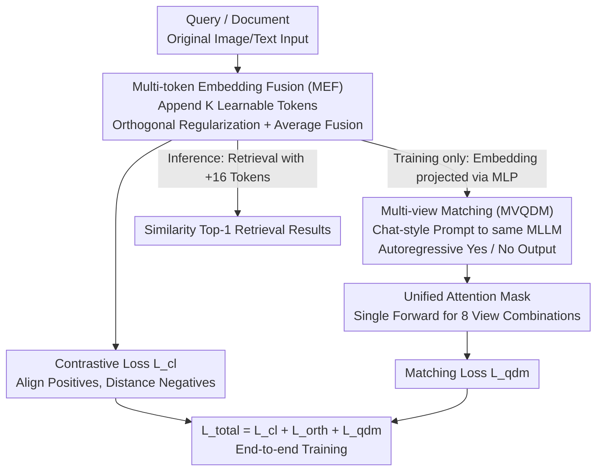

# ReMatch: Boosting Representation through Matching for Multimodal Retrieval

**Conference**: CVPR 2026  
**Paper**: [CVF Open Access](https://openaccess.thecvf.com/content/CVPR2026/html/Liu_ReMatch_Boosting_Representation_through_Matching_for_Multimodal_Retrieval_CVPR_2026_paper.html)  
**Code**: https://github.com/FireRedTeam/ReMatch  
**Area**: Multimodal VLM  
**Keywords**: Multimodal retrieval, MLLM embedding, generative matching, learnable tokens, contrastive learning  

## TL;DR
ReMatch fine-tunes Multi-modal Large Language Models (MLLMs) as embedding models by appending a "chat-style Yes/No matching" task and a "multi-learnable token" representation. This allows generative capabilities to provide instance-level discriminative signals for retrieval embeddings, achieving a new SOTA on MMEB with almost zero additional inference cost.

## Background & Motivation
**Background**: Multimodal retrieval (Image-to-Text, Text-to-Image, VQA, Visual Grounding) relies on mapping heterogeneous inputs into a shared representation space. Dual-encoder architectures like CLIP, BLIP, and SigLIP are mainstream but feature shallow cross-modal interactions. Recently, research has shifted toward MLLMs, where the last-layer hidden state of the `[EOS]` (or final token) is used as an embedding, optimized via contrastive learning (InfoNCE) to align positive samples and distance negatives. VLM2Vec is a representative of this paradigm.

**Limitations of Prior Work**: Treating an MLLM solely as a "single-vector encoder" is inefficient. The paper identifies two specific issues: (1) The `[EOS]` hidden state is designed for **predicting vocabulary logits** during pre-training and does not naturally preserve semantic structure. Compressing an entire query or document into a single vector fails to capture fine-grained information, especially for high-dimensional image modalities, and disrupts the MLLM's original fine-grained grounding (Attention maps in Figure 1 show that VLM2Vec scatters this alignment). (2) Relying exclusively on a global contrastive loss optimizes overall distances between embeddings but struggles to capture fine-grained cross-modal correspondences, weakening the **compositional reasoning** capabilities learned during pre-training.

**Key Challenge**: The strength of MLLMs lies in "autoregressive generation + compositional reasoning + world knowledge," yet existing methods reduce them to static encoders, wasting their generative power. Furthermore, the gradient of contrastive loss for hard negatives is relatively weak, leading to negative sampling bias.

**Goal**: Reactivate the generative discriminative capability of MLLMs to supervise embedding learning without abandoning contrastive learning or significantly increasing inference costs.

**Key Insight**: Since the same MLLM is already capable of judging "is this text relevant to this image?", it should be trained to **autoregressively output Yes/No in a chat format**. This instance-level discriminative signal serves as a supplement to the contrastive loss. Simultaneously, multiple learnable tokens are used instead of a single `[EOS]` to distribute information storage.

**Core Idea**: By combining "generative matching" and "multi-token representation," the MLLM's generative nature is end-to-end integrated with retrieval embedding learning. The matching stage occurs only during training; during testing, only 16 additional tokens are used, resulting in near-zero extra overhead.

## Method

### Overall Architecture
ReMatch follows the "Input → MLLM → Embedding → Similarity Retrieval" framework but introduces two modifications to the single-vector paradigm and adds a training-only matching branch. Specifically: For each input (query or document), $K$ learnable tokens are appended. The last-layer hidden states at these token positions form a multi-vector representation. After **orthogonal regularization**, these are **averagely fused** into a single embedding supervised by contrastive loss (**MEF**). Meanwhile, the original query–document pairs, along with their respective embeddings (projected back to the MLLM input distribution via an MLP), are concatenated into a chat-style prompt and fed back into the **same** MLLM. The model is trained to generate "Yes"/"No" autoregressively, providing instance-level relative relevance supervision (**MVQDM**). To compute 8 query/document view combinations in one pass, the authors designed a **unified attention mask**. The three losses $\mathcal{L}=\mathcal{L}_{cl}+w_{orth}\mathcal{L}_{orth}+w_{qdm}\mathcal{L}_{qdm}$ are optimized jointly ($w_{orth}=0.5$, $w_{qdm}=0.1$).

### Key Designs

**1. Multi-token Embedding Fusion (MEF): Distributing Information Across Learnable Tokens**

To address the bottleneck where a single `[EOS]` cannot store fine-grained info and disrupts grounding, the authors append $K$ learnable tokens to each input sequence ($L_q\in\mathbb{R}^{K\times d}$ for queries, $L_d\in\mathbb{R}^{K\times d}$ for documents). These tokens are learned independently of the MLLM vocabulary, decoupling them from generative output. The Transformer processes $z^{(0)}=[m;L_q;L_d]$, and the hidden states at these positions form $ME_q=[e_1,\dots,e_K]$. To prevent these $K$ tokens from collapsing into the same direction, a **soft orthogonal constraint** is applied. The hard constraint $e_i^\top e_j=0$ is replaced with a differentiable penalty on paired inner products after L2 normalization $\tilde e_i=e_i/\lVert e_i\rVert_2$:

$$\mathcal{L}_{orth}=\frac{2}{K(K-1)}\sum_{1\le i<j\le K}\left(\tilde e_i^\top \tilde e_j\right)^2.$$

After regularization, the vectors are fused via simple averaging $E^*=\frac{1}{K}\sum_{i=1}^K e_i$ for the contrastive loss. The key advantage is that during inference, this only adds $K$ (experimentally set to 16) tokens compared to the single-vector baseline, maintaining efficiency while preserving fine-grained expressiveness. Ablations show that averaging without orthogonality leads to fluctuating gains; adding the constraint results in **monotonic improvements**, reaching +0.9% gain at $K{=}64$.

**2. Multi-view Query–Document Matching (MVQDM): Generative Yes/No Discrimination**

To address the limitations of global contrastive loss and weak gradients for hard negatives, MVQDM adds a generative discriminative branch. Each training sample is a triplet $(q_i,d_i^+,d_i^-)$. While $\mathcal{L}_{cl}$ remains standard InfoNCE using similarity $\Phi(a,b)=\exp(\cos(a,b)/\tau)$, MVQDM uses a chat template ("Determine if `<DOC>` is related to `<QUERY>`, answer only Yes or No") to train the MLLM to generate relevance labels:

$$\mathcal{L}_{qdm}=-\log p\big(l\mid P(\tilde q,\tilde d)\big),$$

where $l$ is "Yes" for $d^+$ and "No" for $d^-$. Unlike BLIP's external binary classifier, this forces the MLLM to **self-generate** tokens, reusing its generative pre-training paradigm. "Multi-view" means $\tilde q, \tilde d$ can be either raw data $(q,d)$ or projected embeddings $Z^*=\mathrm{MLP}(E^*)$. This allows the model to capture both fine-grained signals from embeddings and global context from raw data, while forcing embeddings to be "readable" by the same MLLM.

**3. Unified Attention Mask: Reducing Computational Overhead**

To solve the engineering challenge of high training costs from multiple MLLM forward passes, the authors designed a unified attention mask. Each training sample includes a positive $d^+$ and a negative $d^-$, coupled with their projected embeddings, resulting in $\{q,Z_q\}\times(\{d^+,Z_{d^+}\}+\{d^-,Z_{d^-}\})$ (8 combinations). The mask ensures each answer token **only** attends to its corresponding query–document pair and prompt. This allows all 8 combinations to be computed in a **single forward pass** while maintaining standard next-token prediction behavior. To prevent position leakage, $d^+$ is randomly assigned to one of two slots ($d_1, d_2$).

### Loss & Training
The model is optimized end-to-end: $\mathcal{L}=\mathcal{L}_{cl}+w_{orth}\mathcal{L}_{orth}+w_{qdm}\mathcal{L}_{qdm}$ with fixed weights $w_{orth}=0.5$ and $w_{qdm}=0.1$. Training was conducted for 2500 steps on 8×H800 with a global batch size of 1024. LoRA ($r{=}32, \alpha{=}64$) was used with a learning rate of $10^{-4}$ (cosine decay) and a fixed contrastive temperature of 0.02. The training set included MMEB-train plus explicit hard negatives.

## Key Experimental Results

### Main Results (MMEB, Hit@1 %)
MMEB contains 36 tasks across Classification (CLS), VQA, Retrieval (RET), and Visual Grounding (VG). ReMatch achieved the highest overall scores across various model sizes.

| Model | Backbone | Size | CLS | VQA | RET | VG | Overall |
|------|----------|------|-----|-----|-----|-----|---------|
| VLM2Vec | Qwen2-VL | 2B | 59.0 | 49.4 | 65.4 | 73.4 | 59.3 |
| B3++ | Qwen2-VL | 2B | 67.0 | 61.2 | 70.9 | 79.9 | 68.1 |
| **Ours** | Qwen2-VL | 2B | 65.8 | 65.9 | 70.1 | 83.3 | **69.2** |
| MoCa | Qwen2.5-VL | 3B | 59.8 | 62.9 | 70.6 | 88.6 | 67.5 |
| **Ours** | Qwen2.5-VL | 3B | 62.4 | 69.6 | 70.0 | 92.0 | **70.2** |
| QQMM | LLaVA-OV | 7B | 69.9 | 70.0 | 72.1 | 86.0 | 72.5 |
| mmE5 | Llama-3.2-V | 11B | 67.6 | 62.7 | 71.0 | 89.7 | 69.8 |
| **Ours** | Qwen2.5-VL | 7B | 65.8 | 73.6 | 74.1 | 92.5 | **73.7** |

Ours outperformed benchmarks of similar size by +1.1% (B3++-2B), +2.7% (MoCa-3B), and +1.2% (QQMM-7B). The most significant gains were in VQA tasks (+4.7% for 2B, +3.6% for 7B), confirming that generative matching leverages MLLM world knowledge.

### Ablation Study (ReMatch-2B, Qwen2-VL, MMEB Overall %)

| Configuration | Overall | Note |
|------|---------|------|
| Baseline (VLM2Vec) | 59.7 | Single `[EOS]` + Contrastive Loss |
| + Training Tuning | 65.5 | LoRA/LR/Temp Tuning (+5.8) |
| + Target Instruction | 67.3 | Task Instruction Decoupling (+1.8) |
| + Hard Negative | 67.9 | Explicit Hard Negatives (+0.6) |
| Exp3 + MVQDM | 68.4 | Multi-view Matching (+0.5) |
| Exp3 + MVQDM++ | 68.8 | Matching + Chat Template Alignment (+0.9) |
| Exp3 + MEF | 68.7 | Multi-token Fusion (+0.8) |
| **ReMatch-2B (Full)** | **69.2** | +9.5 vs. Baseline |

### Key Findings
- **Generative matching benefits VQA most**: MVQDM activates MLLM world knowledge, leading to VQA gains significantly higher than other tasks (e.g., correctly retrieving "State Capital of Mississippi" where baselines fail).
- **Orthogonal regularization is critical for scaling**: Without it, multi-token gains fluctuate; with it, gains scale monotonically with $K$.
- **Base model weaknesses transfer directly**: ReMatch initialized with Qwen2-VL is strong in CLS but weaker in VQA/grounding than the Qwen2.5-VL version.
- **Negligible inference cost**: Matching occurs only during training. Testing uses only 16 tokens, matching VLM2Vec's efficiency.

## Highlights & Insights
- **Generative Discriminant**: Instead of a binary classification head, the MLLM autoregressively generates "Yes/No," maximizing the reuse of generative pre-training.
- **Embedding Feedback**: Projecting retrieval embeddings back into the MLLM's input space forces the model to generate embeddings it can "understand" itself, creating a self-consistent loop.
- **Unified Attention Mask**: Designing a mask to fit 8 view combinations into a single forward pass is a vital engineering trick for making multi-view training feasible.
- **Multi-vector Power, Single-vector Cost**: Orthogonal fusion retains the richness of multiple vectors while maintaining the speed of single-vector retrieval.

## Limitations & Future Work
- Base MLLM domain weaknesses transfer to the embedding model; the method does not fundamentally "fix" shortcomings of the backbone.
- ⚠️ Training cost: Even with the unified mask, MVQDM's 8 combinations and multi-token processing increase training overhead compared to pure contrastive learning.
- Evaluation was primarily on text–image retrieval; performance on higher-dimensional modalities (video) or extremely long candidate sets requires validation.

## Related Work & Insights
- **vs. VLM2Vec (Single-vector MLLM)**: VLM2Vec uses `[EOS]` and pure contrastive loss. Ours adds multi-token info and generative matching, yielding significant gains (+9.9%~10.4%).
- **vs. MetaEmbed (ColBERT-style)**: MetaEmbed uses late-interaction which is slow at inference; Ours fuses vectors during training to maintain single-vector efficiency.
- **vs. LamRA / UniME-V2 (Two-stage Rerankers)**: Those methods treat matching as a separate reranking step; Ours integrates matching as an **auxiliary supervision signal** during embedding training, requiring no extra reranking at test time.

## Rating
- Novelty: ⭐⭐⭐⭐ The closed-loop design of generative matching and self-feeding embeddings is innovative, though components like multi-tokens draw from existing concepts.
- Experimental Thoroughness: ⭐⭐⭐⭐⭐ 36 MMEB tasks, 5 zero-shot datasets, multiple sizes, and comprehensive ablations.
- Writing Quality: ⭐⭐⭐⭐ Clear motivation and illustrations.
- Value: ⭐⭐⭐⭐⭐ High practical value due to SOTA performance on MMEB with zero inference overhead and open-source code.

<!-- RELATED:START -->

## Related Papers

- [\[CVPR 2026\] Tackling Alignment Ambiguity in Person Retrieval through Conversational Attribute Mining](tackling_alignment_ambiguity_in_person_retrieval_through_conversational_attribut.md)
- [\[CVPR 2026\] Multimodal Distribution Matching for Vision-Language Dataset Distillation](multimodal_distribution_matching_for_vision-language_dataset_distillation.md)
- [\[CVPR 2026\] MOON2.0: Dynamic Modality-balanced Multimodal Representation Learning for E-commerce Product Understanding](moon20_dynamic_modality-balanced_multimodal_representation_learning_for_e-commer.md)
- [\[ACL 2025\] Maximal Matching Matters: Preventing Representation Collapse for Robust Cross-Modal Retrieval](../../ACL2025/multimodal_vlm/maximal_matching_matters_preventing_representation_collapse_for_robust_cross-mod.md)
- [\[CVPR 2026\] Guiding Diffusion-based Reconstruction with Contrastive Signals for Balanced Visual Representation](guiding_diffusion-based_reconstruction_with_contrastive_signals_for_balanced_vis.md)

<!-- RELATED:END -->
