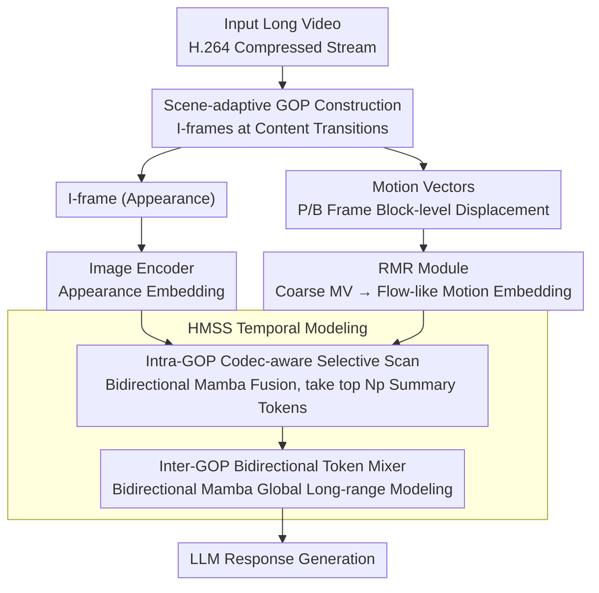

# ReMoRa: Multimodal Large Language Model based on Refined Motion Representation for Long-Video Understanding

**Conference**: CVPR 2026  
**arXiv**: [2602.16412](https://arxiv.org/abs/2602.16412)  
**Code**: None  
**Area**: Multimodal VLM  
**Keywords**: Long-video understanding, compressed video representation, motion vectors, state space models, optical flow refinement.

## TL;DR
The authors propose ReMoRa, which directly operates on compressed video representations (I-frames + motion vectors). Through the Refined Motion Representation (RMR) module, coarse block-level motion vectors are refined into fine-grained motion representations similar to optical flow. A Hierarchical Motion State Space (HMSS) module is then utilized for linear-time long-range temporal modeling, surpassing baselines on benchmarks such as LongVideoBench, NExT-QA, and MLVU.

## Background & Motivation
**Background**: Video MLLMs have achieved significant progress on short videos, but long-video understanding (ranging from minutes to hours) remains a major challenge.

**Limitations of Prior Work**:
   - Uniform frame sampling faces an inherent trade-off: sparse sampling misses key events, while dense sampling is computationally infeasible due to quadratic attention complexity.
   - Frame-based methods repeatedly encode redundant content (such as static backgrounds), which is extremely inefficient.
   - Token compression (pooling/reduction) after dense sampling blurs fine-grained details and motion cues.

**Key Challenge**: Long videos require dense temporal coverage to capture brief but important events, yet the computational cost of dense frame processing is prohibitive.

**Goal**: Leverage the natural appearance-motion decomposition in compressed video formats (H.264) to achieve dense temporal coverage at extremely low cost.

**Key Insight**: Modern video coding already performs keyframe selection and motion compensation. Motion vectors serve as inexpensive approximations of optical flow that can be utilized directly without decoding all frames.

**Core Idea**: Retain a small number of I-frames for appearance and replace intermediate frames with motion vectors for temporal dynamics, while compensating for the noise and coarseness of motion vectors via the RMR module.

## Method

### Overall Architecture
ReMoRa aims to achieve dense temporal coverage without decoding all frames by directly consuming two components present in H.264 compressed streams: a few I-frames for appearance and a large sequence of motion vectors for temporal dynamics. The video is first segmented into Groups of Pictures (GOPs) in a scene-adaptive manner. For each GOP, one I-frame and the block-level motion vector sequences of subsequent P/B frames are extracted. The I-frame is processed by a standard Image Encoder for appearance embeddings, while the motion vectors are refined by the RMR module into fine-grained motion embeddings similar to optical flow. Subsequently, the HMSS module first fuses appearance and motion within each GOP and compresses them into a few summary tokens, followed by global long-range modeling across GOPs. Finally, all summary tokens are fed into the LLM to generate responses. No step in the pipeline requires decoding intermediate frames into RGB, which is the fundamental reason it maintains low costs for minute-to-hour-long videos.

### Key Designs

**1. Scene-adaptive GOP Construction: Placing I-frames where content actually changes**

Fixed-interval GOP segmentation might place I-frames in the middle of continuous content while missing keyframes at scene transitions. ReMoRa uses ffmpeg's scene-adaptive detection to re-encode the video, dynamically inserting I-frames at visual discontinuities to align GOP boundaries with actual content structures. This acts as an implicit keyframe extraction—appearance within each GOP is maximized for consistency, making the secondary refinement of motion vectors more stable. This step occurs at the very front of the pipeline and determines how the I-frame appearance and motion vector sequences are partitioned.

**2. Refined Motion Representation (RMR): Refining cheap but coarse motion vectors into flow-like motion cues**

Motion vectors are byproducts calculated by codecs for compression and are available at near-zero cost. However, they are organized by macroblocks and are sparse, noisy, and temporally inconsistent, making them poor motion features if used directly. The RMR approach involves pre-training a module to learn the mapping from these coarse motion vectors to dense optical flow fields. The supervision signal uses dense flow generated by Co-Tracker3 on the same video, targeting an $L_2$ reconstruction loss. Once pre-trained, this module serves as a motion feature encoder during the fine-tuning stage, outputting a motion embedding for the $t$-th moment in the $k$-th GOP:

$$E_M^{(k,t)} \in \mathbb{R}^{N_m \times d_s}.$$

In this way, the model gains information density close to optical flow while completely bypassing the expensive overhead of online optical flow computation—optical flow only appears once as a "teacher" during pre-training and is not needed during inference.

**3. Hierarchical Motion State Space (HMSS): Capturing intra- and inter-GOP temporal structures in linear time using two-layer Mamba**

Flattening long videos often results in sequences exceeding 100k tokens, which is infeasible for quadratic-complexity attention. HMSS bypasses this through a two-layer design mirroring the GOP hierarchy. The first layer is the Intra-GOP Codec-aware Selective Scan: it concatenates the I-frame appearance embedding with the motion embeddings from RMR to form a complete sequence $Z^{(k)}$, processes it with a bidirectional Mamba for fusion, and then selects the first $N_p$ tokens (the I-frame patch tokens enriched with motion information) as the motion-enhanced summary for that GOP. The second layer is the Inter-GOP Bidirectional Token Mixer: it serializes the summary vectors from all GOPs and passes them through another bidirectional Mamba for global long-range modeling. Due to the compression in the first layer, the sequence length for global modeling is reduced by approximately $L_g/N_p$ times (where $L_g$ is the number of tokens in a GOP). Consequently, the entire pipeline maintains linear time complexity while preserving context across both local (fine-grained intra-GOP dynamics) and global (long-range cross-GOP dependencies) levels.

### A Complete Example
Consider a ten-minute video: after H.264 encoding, it is adaptively segmented into GOPs, each with a maximum length of 32 frames containing one I-frame and up to 31 P/B frames. For a specific GOP, the I-frame is encoded by SigLIP to obtain appearance embeddings. The block-level motion vectors (with 4×4 macroblocks and high resolution) for the 31 P/B frames are extracted directly from the bitstream and sent to the RMR, where they are refined into dense motion embeddings $E_M$. The first layer of HMSS fuses these two streams using bidirectional Mamba, retaining only the first $N_p$ tokens. Thus, a GOP that originally spanned dozens of frames is compressed into a few summary tokens. After processing all GOPs, their summaries are concatenated into a much shorter sequence. The second layer of HMSS performs another bidirectional scan to obtain a global temporal representation, which is finally given to the LLM to answer questions requiring fine-grained motion understanding, such as "how does a specific action evolve in the video"—all without ever decoding an intermediate RGB frame.

### Loss & Training
The RMR module is first pre-trained independently using an $L_2$ optical flow reconstruction loss to align with Co-Tracker3's dense flow. The overall model is then instruction-tuned using standard cross-entropy. LoRA is applied to the LLM backbone while the vision encoder is frozen, ensuring high parameter efficiency.

## Key Experimental Results

### Main Results

| Method | LLM | LongVideoBench | NExT-QA | MLVU | VideoMME | Avg |
|------|-----|:---------:|:-------:|:----:|:--------:|:---:|
| LLaVA-OneVision | Qwen2-7B | 56.5 | 79.4 | 64.7 | 58.2 | 63.2 |
| BIMBA | Qwen2-7B | 59.5 | 83.2 | 70.6 | 63.1 | 68.9 |
| LLaVA-Video | Qwen2-7B | 58.2 | 83.2 | 70.8 | 63.3 | 68.7 |
| **ReMoRa** | **Qwen2-7B** | **60.8** | **84.2** | **72.1** | **64.4** | **69.8** |

### Open-ended VideoQA

| Method | ActivityNet-QA Acc | ActivityNet-QA Score |
|------|:---------:|:---------:|
| EMA | 52.1 | 3.5 |
| **ReMoRa** | **60.5** | **3.7** |

### Key Findings
- ReMoRa achieves state-of-the-art results on LongVideoBench (+1.3), NExT-QA (+1.0), and MLVU (+1.3).
- On ActivityNet-QA, the accuracy exceeds the second-best by 8.4 percentage points, demonstrating the critical role of refined motion representation in temporal reasoning.
- Compared to EMA, which uses the same codec information, the RMR module's motion refinement brings significant gains.
- Qualitative analysis shows ReMoRa significantly outperforms LLaVA-Video on questions requiring fine-grained action understanding.

## Highlights & Insights
- **Leveraging natural video compression structures**: Directly operating in the compressed domain without decoding all frames breaks the paradigm of "mandatory uniform RGB frame sampling." Although motion vectors are low quality, they provide high density; when combined with a refinement module, they become high-quality temporal cues.
- **Ingenious RMR module design**: Learning the "coarse motion → dense flow" mapping during pre-training and acting as a feature encoder during fine-tuning allows the model to enjoy the information density of optical flow without its computational cost.
- **Hierarchical HMSS design**: Intra-GOP fusion (similar to segment-level attention) followed by inter-GOP modeling (similar to video-level attention) perfectly matches the encoding structure and maintains linear complexity.

## Limitations & Future Work
- Dependent on the H.264 encoder; adaptability to other formats (HEVC, AV1) has not been verified.
- The maximum GOP length is fixed at 32 frames; extremely long static scenes might lead to sparse motion information.
- RMR pre-training requires optical flow supervision from Co-Tracker3, increasing data preparation costs.
- Not optimal on VideoMME (64.4 vs 65.1), suggesting that motion information may not be the critical factor in certain scenarios.

## Related Work & Insights
- **vs Video-LaVIT**: Also uses codec information but only performs simple appearance-motion tokenization, lacking motion refinement and hierarchical modeling.
- **vs EMA**: EMA introduces a GOP encoder but does not refine motion vectors; ReMoRa's RMR module fills this quality gap.
- **vs LongVU (token pruning)**: LongVU still processes RGB frames and merely reduces token counts; ReMoRa avoids processing redundant frames at the source.

## Supplemental Analysis
- ReMoRa uses 200K instruction-tuning data points from the LLaVA-Video-178K dataset, covering open-ended QA, multiple-choice, and captioning tasks.
- Scene-adaptive GOP construction: ffmpeg's scene-adaptive detection automatically inserts I-frames at scene cuts, which is more reasonable than fixed-interval GOPs.
- Maximum GOP length is 32 frames with a 4×4 macroblock size to ensure fine-grained motion vector resolution.
- Vision encoder utilizes SigLIP ViT-SO (frozen), and the LLM backbone is fine-tuned with LoRA for parameter efficiency.
- The 8.4 percentage point lead in ActivityNet-QA accuracy over the runner-up (EMA) is primarily because action understanding over long durations in ActivityNet relies more heavily on fine-grained motion information.

## Rating
- Novelty: ⭐⭐⭐⭐ Video MLLM leveraging compressed domain information is a promising direction.
- Experimental Thoroughness: ⭐⭐⭐⭐ Comprehensive evaluation across 6 benchmarks.
- Writing Quality: ⭐⭐⭐⭐ Thorough background and clear methodology description.
- Value: ⭐⭐⭐⭐ Provides a highly efficient new paradigm for long-video MLLMs.

<!-- RELATED:START -->

## Related Papers

- [\[CVPR 2026\] TimeViper: A Hybrid Mamba-Transformer Vision-Language Model for Efficient Long Video Understanding](timeviper_a_hybrid_mamba-transformer_vision-language_model_for_efficient_long_vi.md)
- [\[CVPR 2026\] Scaling the Long Video Understanding of Multimodal Large Language Models via Visual Memory Mechanism](scaling_the_long_video_understanding_of_multimodal_large_language_models_via_vis.md)
- [\[CVPR 2026\] REVISOR: Beyond Textual Reflection, Towards Multimodal Introspective Reasoning in Long-Form Video Understanding](revisor_beyond_textual_reflection_towards_multimodal_introspective_reasoning_in_.md)
- [\[CVPR 2026\] MSJoE: Jointly Evolving MLLM and Sampler for Efficient Long-Form Video Understanding](msjoe_jointly_evolving_mllm_and_sampler_for_efficient_long-form_video_understand.md)
- [\[CVPR 2025\] Video-XL: Extra-Long Vision Language Model for Hour-Scale Video Understanding](../../CVPR2025/multimodal_vlm/video-xl_extra-long_vision_language_model_for_hour-scale_video_understanding.md)

<!-- RELATED:END -->
