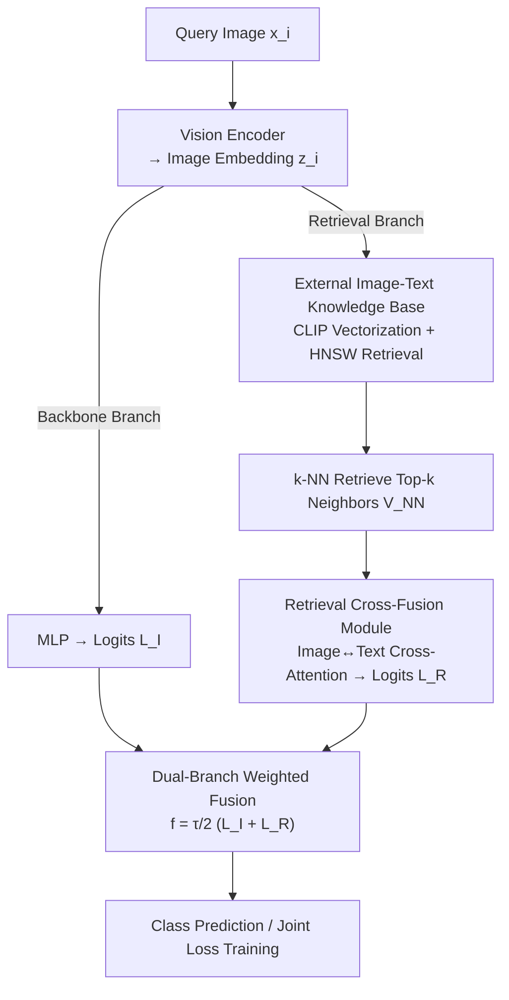

# RetFormer: Multimodal Retrieval for Enhancing Image Recognition

**Conference**: CVPR 2026  
**Paper**: [CVF Open Access](https://openaccess.thecvf.com/content/CVPR2026/html/Yu_RetFormer_Multimodal_Retrieval_for_Enhancing_Image_Recognition_CVPR_2026_paper.html)  
**Code**: None  
**Area**: Multimodal VLM  
**Keywords**: Retrieval-Augmented Classification, Image-Text Multimodal, Long-tail Recognition, Noisy Labels, Cross-attention

## TL;DR
RetFormer shifts world knowledge from "compressed model weights" to an "external image-text knowledge base." It performs k-NN retrieval for query images, calculates the contribution of each neighbor using an image-text cross-fusion attention module, and merges this with the backbone branch. This approach improves the overall accuracy on ImageNet-LT from 78.3% to 81.9% in long-tail recognition and noisy label learning.

## Background & Motivation

**Background**: Large-scale Transformers combined with massive pre-training data (LAION, DataComp) have achieved SOTA in vision and NLP. The dominant paradigm involves implicitly "encoding world knowledge into model parameters" and then fine-tuning on downstream tasks.

**Limitations of Prior Work**: This "parameters-as-knowledge" paradigm is problematic in real-world scenarios due to catastrophic forgetting, difficulty in model updates, poor explainability, and limited scalability. Furthermore, real-world data naturally follows a long-tail distribution and often contains noisy labels. Tail classes suffer from insufficient samples, making it nearly impossible for models to learn stable representations, while noisy labels further contaminate the estimation of the true distribution. These issues frequently co-occur.

**Key Challenge**: Previous methods for long-tail/noise (re-weighting, noise filtering, representation calibration, etc.) are almost entirely **image-centered**. They focus on the image modality and rely on increasing parameters or adjusting sampling to "brute-force" data scarcity. However, the bottleneck for tail classes is not insufficient model capacity, but rather the **lack of effective information seen by those classes**. Simply adding parameters cannot create samples for tail classes out of thin air.

**Key Insight**: It is observed that during k-NN retrieval for a query image, **the image modality of neighbors provides low-level invariant features (shape/color/texture), while the text modality provides high-level abstract semantics**. Even neighbors from different categories may share transferable knowledge across modalities. When the image itself has noisy labels, text descriptions can provide "prior" error-correction information. In short, external image-text knowledge bases contain a wealth of "free" information to remedy tail classes and noisy labels; the key is how to retrieve and utilize it.

**Core Idea**: A "semi-parametric" paradigm replaces the pure parametric paradigm. World knowledge is stored in an external image-text knowledge base. During training, the most relevant image-text pairs are retrieved. A cross-fusion attention module models the "Query $\leftrightarrow$ Neighbor" relationship and calculates their respective contributions. The logits from the retrieval branch and the backbone branch are then fused via weighted addition, enhancing predictions for tail classes and noisy samples with almost no additional parameters.

## Method

### Overall Architecture
RetFormer addresses image classification under "long-tail + noise" conditions. Its core modification is adding a **parallel retrieval path** to the traditional "image encoder $\to$ classifier" single path. The query image first passes through a vision encoder to obtain an embedding $z_i$, which then branches: the first branch is a standard MLP backbone producing logits $L_I$; the second branch performs k-NN retrieval in an external database, retrieves top-k neighbors, and feeds them into a **Retrieval Cross-Fusion Module** to model cross-modal relationships and generate retrieval logits $L_R$. Both logits are combined via weighted summation and trained with the same loss function:

$$f(x_i) = \frac{\tau}{2}\big(L_I + L_R\big) = \frac{\tau}{2}\big(\text{MLP}(z_i) + h(r(z_i, V_{NN}(z_i; V_D)))\big)$$

Where $\tau$ is a coefficient balancing the contributions, $V_{NN}$ represents the top-k neighbor embeddings from the database feature set $V_D$, and $r(\cdot,\cdot)$ is the cross-fusion module. Database entries are vectorized using two **frozen** CLIP encoders $\varepsilon_I, \varepsilon_T$, and retrieval is performed using Faiss HNSW. The pipeline is as follows:

### Key Designs

**1. Dual-branch Retrieval-Augmented Classification: Paralleling External Knowledge into Decisions**
To address forgetting and data scarcity, RetFormer introduces an **external knowledge base $D=\{(I_i,T_i)\}_{i=1}^L$ independent of the training set $S$**. The final logits are a fusion of the backbone $L_I = \text{MLP}(z_i)$ and the retrieval branch $L_R$. This allows the knowledge base to be updated without retraining the model (semi-parametric property). Tail classes can "borrow" information from neighbors even if their own samples are scarce.

**2. Retrieval Cross-Fusion Module: Weighting Neighbors via Cross-Modal Attention**
Retrieved neighbors are a mix of multiple classes and modalities. To avoid noise from irrelevant neighbors, the query embedding $z_i$ and neighbors are formed into image matrices $E^I_{NN}$ and text matrices $E^T_{NN}$. **The query's own text embedding is zeroed out to prevent data leakage**. The module performs **cross-modal attention**:

$$r(z_i, V_{NN}) = \big[\,\text{Att}(Q^T, K^I, V^I) + E^I_{NN},\ \text{Att}(Q^I, K^T, V^T) + E^T_{NN}\,\big]$$

Text queries attend to image keys/values while image queries attend to text keys/values. This "text querying image, image querying text" design models complementary relationships: text provides semantics/priors, while images provide invariant features.

**3. Knowledge Base Construction: Billions of Pairs via Frozen CLIP**
Three sources are used: the downstream dataset, a 1.4B subset of DataComp, and a combined "All" set. To ensure efficiency, **frozen CLIP encoders** pre-vectorize the database. Faiss HNSW provides approximate k-NN with $O(\log N)$ complexity, enabling millisecond-level queries for 1B samples.

**4. Mechanism: Retrieval as Data-Dependent Virtual Sample Augmentation**
The authors provide a gradient-based explanation. Without retrieval, gradients only propagate one-to-one between samples and classes. With retrieval, the gradient for query $x_0$ becomes:

$$\frac{\partial L_0}{\partial x_0} := \frac{\partial L_0}{\partial x_0} + \sum_{i=1}^{2k}\frac{\partial L_i}{\partial x_0}$$

Neighbors act as "virtual samples" for label $y_i$. Thus, retrieval is a **data-dependent augmentation** that supplements tail classes with missing information, which explains its effectiveness in few-shot scenarios.

### Loss & Training
Both branches are trained using a supervised loss (Cross-Entropy or LACE for imbalance). Training lasts 25 epochs with a learning rate of 0.0005, batch size 256, 1-epoch warmup, cosine decay, Adam optimizer (weight decay 0.1), label smoothing, and Mixup. The default $k=32$ neighbors are used with $L=4$ attention layers.

## Key Experimental Results

Evaluation was conducted on CIFAR-100-LT, ImageNet-LT, Places-LT, iNaturalist 2018, and WebVision (noise). The backbone used was ViT-B/16 pre-trained on DataComp-1B.

### Main Results

Top-1 Accuracy on ImageNet-LT and Places-LT:

| Dataset | Method | Many | Med | Few | Overall |
|---------|--------|------|-----|-----|---------|
| ImageNet-LT | LIFT | 81.3 | 77.4 | 73.4 | 78.3 |
| ImageNet-LT | RAC (Image Only) | 80.9 | 76.0 | 67.5 | 76.7 |
| ImageNet-LT | MAM (Image Only) | 80.6 | 77.5 | 74.5 | 78.3 |
| ImageNet-LT | **Ours** | **85.0** | **80.9** | **76.8** | **81.9** |
| Places-LT | LIFT | 51.3 | 52.2 | 50.5 | 51.5 |
| Places-LT | **Ours** | 52.7 | 52.1 | **51.9** | **52.3** |

RetFormer leads in all metrics, particularly improving ImageNet-LT overall by +3.6 points and Few-shot from 74.5 to 76.8.

### Ablation Study

Modality Ablation (ImageNet-LT):

| Configuration | Many | Med | Few | Overall | Note |
|---------------|------|-----|-----|---------|------|
| CLIP Zero-shot | 69.2 | 67.6 | 67.7 | 68.3 | No tuning |
| CLIP Full FT | 84.3 | 73.1 | 52.9 | 74.6 | Tail collapse |
| Ours w/o text | 81.3 | 74.8 | 65.9 | 76.0 | Image only |
| Ours w/o image | 83.1 | 76.9 | 68.4 | 78.1 | Text only |
| **Ours (Full)** | **85.0** | **80.9** | **76.8** | **81.9** | Image-Text |

### Key Findings
- **Text modality contributes more than image modality**: Removing text drops accuracy to 76.0, while removing images only drops it to 78.1. Abstract semantics are more critical for the tail.
- **The duality of $k$**: Accuracy saturates at $k=32$. Many-shot performance actually decreases with very large $k$ due to noise, while Few-shot continues to benefit.
- **Places-LT is a bottleneck**: There is a mismatch between object-centric knowledge bases and scene classification, weakening the synergy between retrieved text and scene images.

## Highlights & Insights
- **Semi-parametric visual recognition**: Shifting world knowledge to an external DB allows updates without retraining, addressing the "information scarcity" in long-tail/noise scenarios.
- **Cross-modal attention with leakage prevention**: Explicitly modeling complementary relationships while zeroing out query text is a clean and reproducible design.
- **Gradient perspective interpretation**: Explaining "retrieved neighbors = virtual samples" provides a theoretical foundation for why tail classes benefit most.
- **Engineering feasibility**: Proving that 1B-scale retrieval can be done in milliseconds with HNSW while maintaining accuracy holds significant practical value.

## Limitations & Future Work
- **Performance on scene tasks**: Mismatch in Places-LT shows that building appropriate knowledge bases for scenes/relationships remains an open problem.
- **Storage and Pre-processing costs**: Although queries are fast, storing embeddings for 1B samples requires significant disk space (~30GB for ImageNet-LT).
- **CLIP dependency**: The performance ceiling is tied to the alignment quality of the frozen CLIP encoders.
- **Over-correction risk**: Large $k$ can degrade many-shot performance; the system lacks an adaptive mechanism for $k$ or $\tau$.

## Related Work & Insights
- **vs. RAC / MAM**: These focus only on the **image modality**. RetFormer utilizes **both modalities** and significantly outperforms them in tail classes.
- **vs. BatchFormer**: BatchFormer explores relations within a mini-batch, whereas RetFormer extends this to a **global external knowledge base**.
- **vs. Long-tail Reweighting**: RetFormer provides **external information (virtual samples)** rather than just adjusting internal data, making it orthogonal and stackable with loss-based methods like LACE.

## Rating
- **Novelty**: ⭐⭐⭐⭐ Introduces semi-parametric retrieval + cross-modal attention to long-tail recognition with a unified gradient explanation.
- **Experimental Thoroughness**: ⭐⭐⭐⭐ Extensive testing across five datasets and multiple ablation categories.
- **Writing Quality**: ⭐⭐⭐⭐ Clear logic from motivation to theory and experiments.
- **Value**: ⭐⭐⭐⭐ Provides an engineering-ready paradigm for information-scarce scenarios.

<!-- RELATED:START -->

## Related Papers

- [\[CVPR 2026\] Camouflage-aware Image-Text Retrieval via Expert Collaboration](camouflage-aware_image-text_retrieval_via_expert_collaboration.md)
- [\[CVPR 2026\] Adapting In-context Generation for Enhanced Composed Image Retrieval](adapting_in-context_generation_for_enhanced_composed_image_retrieval.md)
- [\[CVPR 2026\] Rethinking BCE Loss for Multi-Label Image Recognition with Fine-Tuning](rethinking_bce_loss_for_multi-label_image_recognition_with_fine-tuning.md)
- [\[CVPR 2026\] ReCALL: Recalibrating Capability Degradation for MLLM-based Composed Image Retrieval](recall_recalibrating_capability_degradation_for_mllm-based_composed_image_retrie.md)
- [\[CVPR 2026\] CodeMMR: Bridging Natural Language, Code, and Image for Unified Retrieval](codemmr_bridging_natural_language_code_and_image_for_unified_retrieval.md)

<!-- RELATED:END -->
