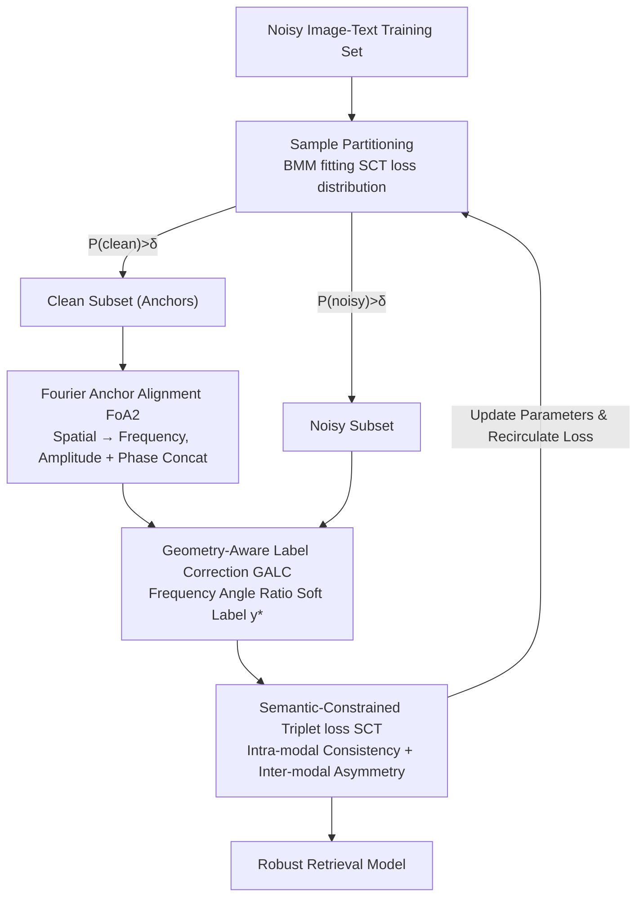

# Rethinking Cross-Modal Anchor Alignment for Mitigating Error Accumulation

**Conference**: CVPR 2026  
**Paper**: [CVF Open Access](https://openaccess.thecvf.com/content/CVPR2026/html/Liu_Rethinking_Cross-Modal_Anchor_Alignment_for_Mitigating_Error_Accumulation_CVPR_2026_paper.html)  
**Code**: None  
**Area**: Multi-modal VLM / Cross-modal Retrieval / Noisy Correspondence Learning  
**Keywords**: Noisy Correspondence, Anchor Alignment, Fourier Transform, Soft Label Correction, Triplet Loss

## TL;DR
Addressing a long-ignored error source in "noisy correspondence learning" for image-text retrieval—where clean anchor pairs themselves exhibit cross-modal inconsistency (anchor correlation discrepancy)—this paper uses Fourier Transform to align anchor representations in the frequency domain. Based on this, it performs geometry-aware soft label correction combined with a Semantic-Constrained Triplet loss to suppress error accumulation, consistently achieving SOTA retrieval accuracy across three datasets.

## Background & Motivation
**Background**: Cross-modal matching typically assumes training data consists of perfectly aligned positive/negative pairs. However, large-scale web-crawled data, such as Conceptual Captions, contains many mismatched image-text pairs, known as "noisy correspondence." Mainstream approaches first partition samples into clean/noisy subsets and then estimate a "soft correspondence label" (0–1) for noisy samples as reliable supervision.

**Limitations of Prior Work**: This workflow suffers from "error accumulation"—once a sample is mis-partitioned or a soft label is biased, the incorrect supervision is amplified in subsequent iterations. Existing works largely attribute error accumulation to the "errors in noisy sample pairs themselves," attempting to fix this through finer partitioning, robust losses, or more accurate label correction. The label correction branch relies on "anchors" (reference samples partitioned as clean) to infer labels for noisy samples via cross-modal geometric consistency.

**Key Challenge**: This paper identifies a new, ignored error source—**even for clean anchor pairs, image modal similarity and text modal similarity do not align perfectly**. The authors define this as anchor correlation discrepancy $\Delta d = |S_V - S_T|$, where $S_V, S_T$ are the similarities within the image and text modalities, respectively. The root cause is that features extracted from the spatial domain mix high-level semantics with significant **local detail components**. Since local details in images are far richer than in text, this asymmetry distorts "ideal geometric consistency" (Fig 1a) into a "real geometric structure" (Fig 1b). Empirically, on Flickr30K (noise rate 0.2), ~23% of samples exhibit $\Delta d > 0.3$. This distorted geometry directly pollutes all anchor-based label correction methods.

**Goal**: (1) Align anchor representations across modalities by pruning inconsistencies caused by local details; (2) Re-estimate soft labels on a cleaner geometric structure; (3) Upgrade sample partitioning from "loss-magnitude only" to discriminative partitioning with semantic constraints.

**Key Insight**: Move anchor alignment and label correction from the heavily perturbed **spatial domain to the frequency domain**. Fourier Transform naturally decouples "global semantics (phase)" and "local texture (amplitude)," allowing controllable suppression of the dependency on local details. Subsequently, stable angular consistency in the frequency domain is used to correct soft labels, while a Semantic-Constrained Triplet loss stabilizes sample partitioning.

## Method

### Overall Architecture
GSL (Geometric-Semantic Learning) is an end-to-end noisy correspondence learning framework. It takes a noisy image-text training set as input and outputs a robust retrieval model. Each training round is decoupled into four sequential steps: "Partition, Align, Correct, and Update." It uses the SCT loss from the previous round to split samples into clean/noisy subsets via a Beta Mixture Model (BMM). For anchors in the clean subset, Fourier Anchor Alignment (FoA2) is used to suppress local detail discrepancies, obtaining frequency-domain anchor representations. In this frequency space, Geometry-Aware Label Correction (GALC) calculates new soft correspondence labels for noisy samples. Finally, the corrected full set is fed into the Semantic-Constrained Triplet (SCT) loss to update the model.

### Key Designs

**1. Fourier Anchor Alignment (FoA2): Moving alignment to the frequency domain to control local details**

This step directly addresses "anchor correlation discrepancy." The pain point is that local detail components in spatial features (especially in images) cause intra-modal similarities of anchors to mismatch. FoA2 first uses a Beta Mixture Model (BMM) for anchor selection. Based on the "memorization effect" of deep networks (clean samples have lower loss early in training), it fits a BMM to the SCT loss: $P(\ell|\gamma,\beta)=\frac{\Gamma(\gamma+\beta)}{\Gamma(\gamma)\Gamma(\beta)}{\ell}^{\gamma-1}(1-\ell)^{\beta-1}$. The clean subset $\tilde{D}_c$ is selected using a posterior probability $P(k|{\ell}_i)$ threshold $\delta=0.5$.

Selected features $x\in\mathbb{R}^{B\times D}$ (image $D{=}2048$, text $D{=}1024$) undergo a Discrete Fourier Transform $F(x)[m]=\sum_{d=0}^{D-1}x[d]\cdot e^{-2j\pi\frac{d}{D}m}$. The extracted amplitude and phase are concatenated into a joint frequency-domain representation. The key lies in frequency-domain decoupling: **phase encodes global structure and high-level semantics, while amplitude characterizes local texture and low-level modal properties**. By concatenating them, the model adaptively reduces its dependency on local details during optimization. Mean-centering is then applied to offset energy drift from modal heterogeneity. These steps reduce $\Delta d$, and all subsequent label corrections are performed in this consistent frequency space.

**2. Geometry-Aware Label Correction (GALC): Using frequency-domain angle ratios to re-estimate soft labels**

With aligned anchors, soft labels for noisy samples can be calculated reliably. The core hypothesis is that for clean pairs, the geometric structure formed by "query image $\leftrightarrow$ visual anchors" should be consistent with "query text $\leftrightarrow$ textual anchors." For a noisy pair $(I_i^n, T_i^n)$, the most and second-most similar image anchors $I_i^{a1}, I_i^{a2}$ are selected from the clean set. Intra-modal similarity ratios are calculated: $R_I=\frac{S_I^{n\to a1}}{S_I^{n\to a2}}$ and $R_T=\frac{S_T^{n\to a1}}{S_T^{n\to a2}}$.

Cross-modal geometric consistency is measured by the ratio of these ratios: $S_{I2T}=\frac{R_I}{R_T}$ and $S_{T2I}=\frac{R_T}{R_I}$. The final soft label is the bidirectional average $y_i^*=(S_{I2T}+S_{T2I})/2$. If the angular structure relative to anchors is consistent across modalities, $y^*$ approaches 1 (true pair). Computing this ratio in the frequency domain avoids geometric structures polluted by local details.

**3. Semantic-Constrained Triplet loss (SCT): Injecting semantic signals into partitioning and optimization**

Standard triplet loss's sensitivity to different noise types varies, making loss-based partitioning unstable. SCT adds two explicit semantic regularizations. **Intra-modal semantic consistency** $L_{intra}=\|M_I-M_T\|_2^2=\sum_{i}\sum_{j}(S(I_i,I_j)-S(T_i,T_j))^2$: intra-batch similarities between different images should be proportional to similarities between their corresponding texts. **Inter-modal semantic asymmetry** $L_{inter}=-\|M_{IT}-M_{TI}\|_2^2=-\sum_{i}\sum_{j}(S(I_i,T_j)-S(I_j,T_i))^2$: this constrains the asymmetric relationship between off-diagonal elements (mismatched pairs) to improve robustness.

The total loss is $L_{SCT}=L_w+\zeta L_{intra}+\eta L_{inter}$, where $L_w=[\hat\alpha-S(I_i,T_i)+S(I_i,\hat T_i)]_+ + [\hat\alpha-S(I_i,T_i)+S(\hat I_i,T_i)]_+$, with $\hat I_i, \hat T_i$ being the hardest negative samples and $\hat\alpha$ the soft margin. This loss serves both as the basis for sample partitioning and parameter updates.

### Loss & Training
Adam optimizer, initial learning rate $2\times10^{-4}$, batch size 128, word embedding dimension 300, joint space 2048, soft margin $\hat\alpha=0.2$. Regularization weights $\zeta=1.0, \eta=0.1$. Warmup for 10 epochs (using only $L_w$), followed by 40 epochs with $L_{SCT}$.

## Key Experimental Results

### Main Results
Evaluated on Flickr30K, MS-COCO, and CC152K using R@1/5/10 and RSum. Results for RSum (Ours vs Prev. SOTA):

| Dataset / Noise | Metric | Ours | Prev. SOTA | Gain |
|-----------------|--------|------|-------------|------|
| Flickr30K / 0.2 | RSum   | 507.5| 504.7 (BiCro)| +2.8 |
| Flickr30K / 0.4 | RSum   | 498.6| 493.8 (PC2)  | +4.8 |
| Flickr30K / 0.6 | RSum   | 484.1| 477.1 (ESC)  | +7.0 |
| MS-COCO / 0.2   | RSum   | 525.1| 524.7 (L2RM) | +0.4 |
| MS-COCO / 0.4   | RSum   | 520.9| 518.9 (SPS)  | +2.0 |
| MS-COCO / 0.6   | RSum   | 513.2| 511.3 (SPS)  | +1.9 |
| CC152K (Real)   | RSum   | 379.6| 374.2 (L2RM) | +5.4 |

Gains increase with noise levels (Flickr30K +3.0 → +7.0), indicating GSL's robustness in stabilizing supervision signals on "dirty" data.

### Ablation Study
On Flickr30K with 40% noise:

| Configuration | RSum | Note |
|---------------|------|------|
| GALC Only     | 488.4| Geometric label correction only |
| GALC + FoA2   | 495.8| Adding frequency anchor alignment, +7.4 |
| GALC + FoA2 + SCT (Full) | 498.6| Adding semantic constrained loss, +2.8 |

### Key Findings
- **FoA2 contributes the most**: Adding frequency anchor alignment on top of GALC provides a +7.4 RSum gain, far exceeding SCT (+2.8). This validates that "anchor correlation discrepancy" is the primary cause of error accumulation.
- **Hyperparameter Stability**: Optimal results occur at $\zeta=1.0, \eta=0.1$. The smaller weight for $L_{inter}$ suggests intra-modal consistency is the primary constraint.
- **Visualization**: Frequency alignment significantly narrows the distribution of anchor correlation discrepancy $\Delta d$ on Flickr30K.

## Highlights & Insights
- **Redefining Error Sources**: Unlike previous works assuming clean anchors are perfectly aligned, this paper identifies intra-modal geometric inconsistency in clean pairs and provides a quantifiable $\Delta d$.
- **Elegant Frequency Decoupling**: Leverages the properties of phase (semantics) and amplitude (texture) to suppress local detail dependency through simple concatenate and mean-center operations.
- **Angular Ratio for Labels**: The use of $S_{I2T}=R_I/R_T$ is a lightweight, parameter-free soft label estimator that can be integrated into other anchor-based frameworks.

## Limitations & Future Work
- The frequency domain assumptions (phase for semantics, amplitude for texture) are validated for image-text but might not hold for other modalities like video or audio.
- The negative sign in $L_{inter}$ to "encourage asymmetric differences" requires more explicit causal explanation regarding its link to robustness.
- The reliance on the memorization effect for BMM partitioning might be less stable at extreme noise levels (>60%) or on backbones where the effect is less pronounced.

## Related Work & Insights
- **vs NCR / DECL / BiCro**: These methods attribute error accumulation only to noisy samples. GSL identifies **cross-modal inconsistency of clean anchors** as a deeper root cause.
- **vs GSC / Anchor-based Correction**: Earlier methods operate in the spatial domain and are susceptible to local detail noise. GSL aligns anchors in the frequency domain first.
- **vs L2RM / PC2 / SPS**: GSL consistently leads across multiple noise levels, with the advantage becoming more pronounced as noise increases.

## Rating
- Novelty: ⭐⭐⭐⭐⭐ (Identifies a new error source; novel frequency domain approach)
- Experimental Thoroughness: ⭐⭐⭐⭐ (Extensive noise levels and datasets, though missing high-noise stress tests)
- Writing Quality: ⭐⭐⭐⭐ (Clear motivation and formulas)
- Value: ⭐⭐⭐⭐ (Practical frequency alignment/angle-ratio correction modules)

<!-- RELATED:START -->

## Related Papers

- [\[CVPR 2026\] DeepAlign: Mitigating Modality Conflict through Modality-Specific Alignment](deepalign_mitigating_modality_conflict_through_modality-specific_alignment.md)
- [\[CVPR 2026\] Anchor-Guided Gradient Alignment for Incomplete Multimodal Learning](anchor-guided_gradient_alignment_for_incomplete_multimodal_learning.md)
- [\[AAAI 2026\] Rethinking Visual Token Reduction in LVLMs under Cross-Modal Misalignment](../../AAAI2026/multimodal_vlm/rethinking_visual_token_reduction_in_lvlms_under_cross-modal_misalignment.md)
- [\[CVPR 2026\] CoV-Align: Efficient Fine-grained Cross-Modal Alignment with Cohesive Visual Semantics Priority](cov-align_efficient_fine-grained_cross-modal_alignment_with_cohesive_visual_sema.md)
- [\[CVPR 2026\] Decoupled and Reusable Adaptation for Efficient Cross-Modal Transfer](decoupled_and_reusable_adaptation_for_efficient_cross-modal_transfer.md)

<!-- RELATED:END -->
