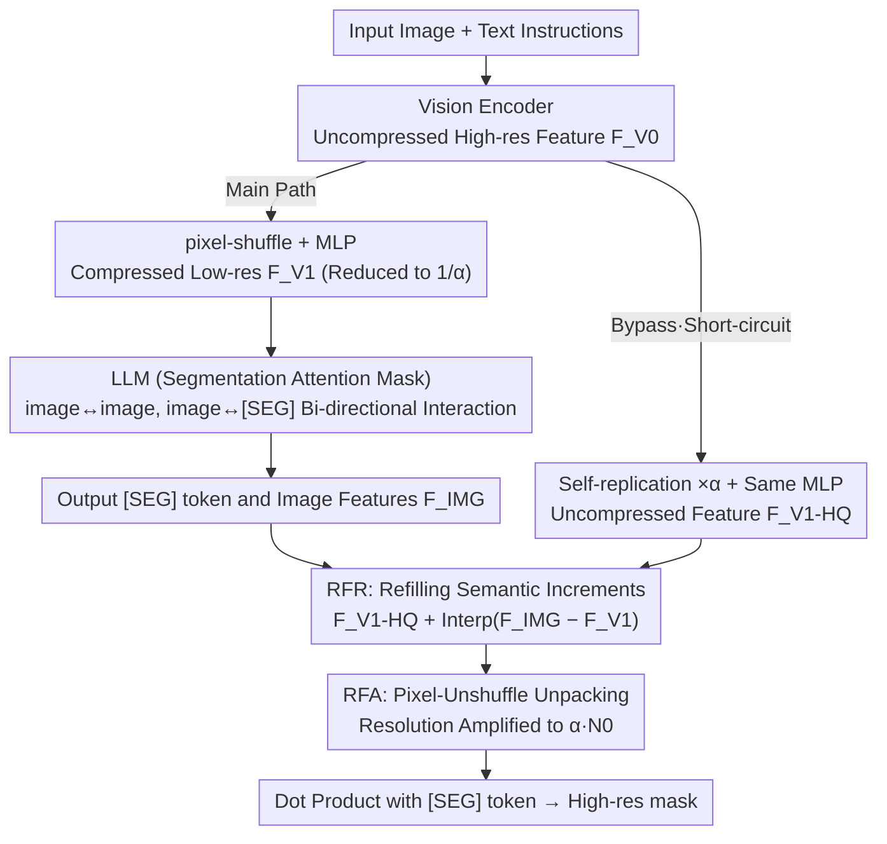

# Rethinking MLLM Itself as a Segmenter with a Single Segmentation Token

**Conference**: CVPR 2026  
**arXiv**: [2603.19026](https://arxiv.org/abs/2603.19026)  
**Code**: [https://github.com/ANDYZAQ/SELF1E](https://github.com/ANDYZAQ/SELF1E)  
**Area**: Multimodal VLM  
**Keywords**: MLLM Segmentation, Decoder-free Segmentation, Single-token Segmentation, Pixel-Unshuffle, Feature Refinement

## TL;DR
This paper proposes SELF1E, the first MLLM segmentation method that operates without a dedicated mask decoder and uses only a single [SEG] token. By employing Residual Features Refilling (RFR) and Residual Features Amplifier (RFA), the approach restores resolution loss caused by pixel-shuffle compression, achieving performance competitive with decoder-based methods across multiple segmentation tasks.

## Background & Motivation
**Background**: Existing MLLM segmentation methods (e.g., LISA, GSVA, OMG-LLaVA) primarily generate masks by attaching specialized mask decoders (such as SAM or Mask2Former) to the MLLM.

**Limitations of Prior Work**:
   - Specialized decoders introduce extra parameters and structural complexity, breaking the simplicity of the architecture and creating dependencies on external foundation models.
   - UFO attempted a decoder-free solution but required 16 [SEG] tokens to compensate for resolution loss, increasing computational costs.
   - Root cause: Pixel-shuffle downsampling in modern MLLMs significantly reduces visual feature resolution (e.g., 4x compression), losing fine-grained spatial information essential for segmentation.

**Key Challenge**: While pixel-shuffle compression is necessary for efficient MLLM processing, the resulting loss of spatial information represents the fundamental bottleneck for decoder-free segmentation.

**Goal**: To demonstrate that a single [SEG] token is sufficient for high-quality segmentation and that the bottleneck lies in feature resolution rather than token count.

**Key Insight**: Pre-compression features from the image encoder retain full resolution, while features processed by the LLM possess higher semantic discriminability; these two sources are complementary.

**Core Idea**: Retain uncompressed features from the encoder + collect and upsample residual features from various LLM layers + further enhance resolution via Pixel-Unshuffle.

## Method

### Overall Architecture
SELF1E aims to answer a counter-intuitive question: Is MLLM segmentation limited by token quantity or resolution? Previous decoder-free solutions (UFO) assumed a single [SEG] token lacked expressiveness and used 16 tokens instead. This paper targets the internal pixel-shuffle downsampling of MLLMs—which compresses visual features to $1/\alpha$ of their original size ($\alpha$ is typically 4 in the InternVL series). Fine-grained spatial information is lost before entering the LLM, a deficit that extra tokens cannot recover.

The pipeline utilizes two parallel branches. The main branch follows the standard path: images pass through a Vision Encoder, are compressed via pixel-shuffle + MLP into low-resolution visual tokens, and are fed into the LLM alongside text. The LLM outputs a [SEG] token and a set of image features $F_{IMG}$ re-encoded by the LLM. The bypass branch intercepts high-resolution features from the encoder before compression. These paths converge after the LLM: **RFR** "refills" semantic increments learned by the LLM back into the high-resolution features, and **RFA** further amplifies resolution via Pixel-Unshuffle. Finally, the amplified image features and the processed [SEG] token generate high-resolution masks via a dot product—entirely bypassing external segmentation models. Internally, causal attention is replaced with a **segmentation-specific attention mask**, enabling the [SEG] token to see the full image bi-directionally.

### Key Designs

**1. Residual Features Refilling (RFR): Refilling Semantic Increments into Uncompressed Features**

Since pixel-shuffle is the source of the resolution bottleneck, the cleanest solution is to bypass it by retaining pre-compression high-resolution features. However, while encoder features are sharp, they lack the semantic alignment provided by the LLM to determine if a pixel belongs to a referred object. Conversely, the LLM output $F_{IMG}$ has high semantic discriminability but collapsed resolution. RFR combines the strengths of both: using high-resolution features as a base and superimposing the **semantic increments** provided by the LLM.

Specifically, an uncompressed high-resolution feature $F_{V_1}^{HQ}\in\mathbb{R}^{N_0\times d}$ is constructed by self-replicating each pixel feature $\alpha$ times and passing it through the same MLP, simulating the arrangement of neighboring pixels before pixel-shuffle. The difference between the LLM output and input is taken as a residual, characterizing "what the LLM changed":

$$F_R = F_{IMG} - F_{V_1}$$

This low-resolution residual is upsampled back to high resolution and added to the base:

$$F_{IMG}' = F_{V_1}^{HQ} + \mathcal{I}(F_R)$$

where $\mathcal{I}(\cdot)$ denotes interpolation upsampling. The resulting features preserve spatial details from the encoder while injecting fine-grained semantic discriminability from the LLM.

**2. Residual Features Amplifier (RFA): Recovering Hidden Pixels via Pixel-Unshuffle**

RFR relies on interpolation, which does not create new high-frequency information. RFA takes it a step further: each compressed embedding actually **implicitly contains $\alpha$ pixels' information** packed into the channel dimension. Pixel-Unshuffle (the inverse of pixel-shuffle) can unpack this channel information back into the spatial dimension, effectively "losslessly unpacking" the folded resolution.

MLP + Pixel-Unshuffle are applied to both the pre-LLM $F_{V_1}$ and post-LLM $F_{IMG}$, and the residual is calculated in the amplified space:

$$F_{RFA} = f_{PUS}'(F_{IMG}) - f_{PUS}(F_{V_1})$$

This is finally fused with the unpackaged high-resolution features from the self-replicated base, raising resolution to $\alpha N_0\times d$:

$$F_{IMG}' = f_{PUS}(F_{V_1}^{HQ}) + \mathcal{I}(F_{RFA})$$

The [SEG] token undergoes the same Pixel-Unshuffle and is averaged $F_{SEG}' = \text{mean}(f_{PUS}'(F_{SEG}))$ to ensure both dot product operands share the same representation space.

**3. Segmentation Attention Mask: A Bi-directional Path for the [SEG] Token**

Standard causal attention in LLMs is unidirectional. This is problematic for segmentation, where the [SEG] token must perceive **all** image positions to determine pixel membership. Unidirectional attention prevents the token from seeing image tokens placed after it.

The methodology modifies the attention mask into two bi-perceptual paths: image-to-image (bi-directional interaction between image tokens to capture spatial relations) and image-to-segmentation (bi-directional interaction between image tokens and [SEG] tokens to allow semantic queries to reach every pixel). This provides more sufficient interaction compared to standard causal attention at the cost of modifying LLM attention calculation.

### Loss & Training
Training is based on the InternVL series. The two Pixel-Unshuffle MLPs in RFA are newly added trainable parameters.

## Key Experimental Results

### Main Results (Referring Expression Segmentation)

| Method | Decoder-free | Single-token | RefCOCO val | RefCOCO+ val | RefCOCOg val |
|------|:----------:|:------:|:-----------:|:------------:|:------------:|
| LISA-7B | ✗ | ✓ | 74.9 | 65.1 | 67.9 |
| u-LLaVA | ✗ | ✓ | 83.0 | 77.1 | 77.1 |
| UFO (16-token) | ✓ | ✗ | - | - | - |
| **SELF1E** | **✓** | **✓** | **~80+** | **~73+** | **~75+** |

### Ablation Study

| Configuration | Key Effect |
|------|---------|
| Direct prediction at compressed res | Significantly lower IoU (~10+% drop) |
| + RFR (Residual Refilling only) | Substantial IoU gain, proving value of high-res + semantic residuals |
| + RFA (Residual Amp) | Further 2-3% improvement; Pixel-Unshuffle recovers hidden info |
| + Seg Attention Mask | Additional 1-2% gain from bi-directional interaction |

### Key Findings
- Proves for the first time that MLLM segmentation with a single token and no dedicated decoder is feasible, with performance approaching SAM/Mask2Former-based methods.
- RFR provides the largest contribution: recovering high-resolution features is the key, not increasing the number of [SEG] tokens.
- MLLMs maintain general VQA performance even after segmentation training.
- Pixel-shuffle compression, rather than token count, is the primary source of the resolution bottleneck.

## Highlights & Insights
- **Challenge to the "Decoder-Required" Paradigm**: Demonstrates that MLLMs possess inherent segmentation capabilities if compressed spatial information is restored.
- **Philosophy of RFR/RFA**: Instead of adding heavy modules, these designs leverage existing info (encoder features, LLM residuals, and inverse pixel-shuffle) to recover lost data via "subtraction and addition."
- **Insight into MLLM Architecture**: While pixel-shuffle is VQA-friendly, it is a fundamental obstacle for pixel-level tasks; future MLLM designs should consider preserving spatial information during compression.

## Limitations & Future Work
- Current performance remains slightly lower than the strongest decoder-based methods (e.g., u-LLaVA).
- The Pixel-Unshuffle MLPs in RFA introduce additional trainable parameters.
- Modifying the LLM attention mask prevents the method from being entirely plug-and-play.
- Open-vocabulary segmentation remains challenging due to the ambiguity of category labels.

## Related Work & Insights
- **vs LISA / GLaMM**: These feed the [SEG] token into a SAM decoder, relying on external model capabilities. SELF1E is entirely self-sufficient.
- **vs UFO**: UFO removes the decoder but requires 16 tokens, essentially trading token quantity for resolution. SELF1E addresses the resolution issue directly, requiring only one token.

## Rating
- Novelty: ⭐⭐⭐⭐⭐ Challenges the status quo with single-token decoder-free segmentation.
- Experimental Thoroughness: ⭐⭐⭐⭐ Multi-task verification and robust ablations.
- Writing Quality: ⭐⭐⭐⭐ Clear motivation and intuitive diagrams.
- Value: ⭐⭐⭐⭐ Simplifies the MLLM segmentation pipeline and informs future architecture design.

<!-- RELATED:START -->

## Related Papers

- [\[CVPR 2026\] Better, Stronger, Faster: Tackling the Trilemma in MLLM-based Segmentation with Simultaneous Textual Mask Prediction](better_stronger_faster_tackling_the_trilemma_in_mllm-based_segmentation_with_sim.md)
- [\[CVPR 2026\] SPOT: Spatiotemporal Prompt Optimization for Motion-Stabilized MLLM-Guided Video Segmentation](spot_spatiotemporal_prompt_optimization_for_motion-stabilized_mllm-guided_video_.md)
- [\[CVPR 2026\] CaptionQA: Is Your Caption as Useful as the Image Itself?](captionqa_is_your_caption_as_useful_as_the_image_itself.md)
- [\[ICML 2026\] RESTORE: 通过矫正失真改进视觉 Token 缩减以提升 MLLM 推理效率](../../ICML2026/multimodal_vlm/improving_visual_token_reduction_via_rectifying_distortions_for_efficient_multim.md)
- [\[AAAI 2026\] Rethinking Visual Token Reduction in LVLMs under Cross-Modal Misalignment](../../AAAI2026/multimodal_vlm/rethinking_visual_token_reduction_in_lvlms_under_cross-modal_misalignment.md)

<!-- RELATED:END -->
