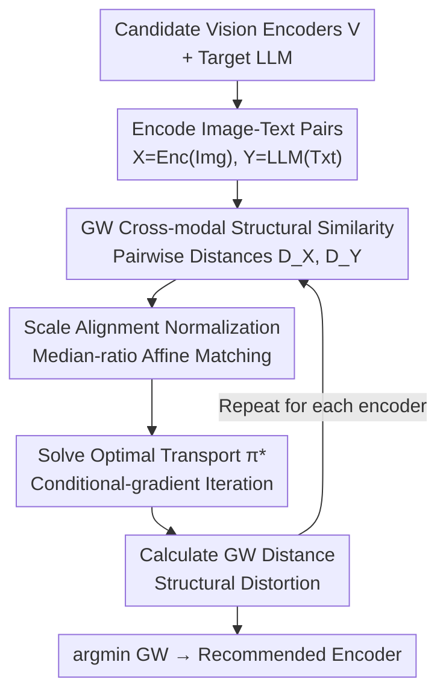

# Rethinking Model Selection in VLM Through the Lens of Gromov-Wasserstein Distance

**Conference**: CVPR 2026 (Highlight)  
**arXiv**: [2605.01325](https://arxiv.org/abs/2605.01325)  
**Code**: None (Not provided by the paper)  
**Area**: Multimodal VLM  
**Keywords**: Visual Encoder Selection, Gromov-Wasserstein Distance, Cross-modal Structural Similarity, Training-free Evaluation, Optimal Transport

## TL;DR
Addressing the perennial challenge of "which vision encoder to choose for VLM," this paper systematically validates that traditional intuitions—selecting the largest model or the one with the highest zero-shot accuracy—are nearly uncorrelated with final VLM performance. Instead, it proposes using **Gromov-Wasserstein (GW) distance** to measure the "structural similarity" between visual representations and LLM text representations as a **training-free, inference-only** proxy metric. Theoretically, the paper proves that GW distance bounds the Lipschitz constant (learnability) of the cross-modal projector. Experimentally, across 60+ full VLM training runs, this metric correlates more strongly with final performance than all baseline indicators, enabling the prediction of the optimal encoder within 1 minute before full training.

## Background & Motivation
**Background**: Current SOTA VLMs largely follow the "pre-training then fine-tuning" paradigm established by LLaVA—first training a projector to align the representation spaces of the vision encoder and the LLM, followed by joint fine-tuning of both towers. While the community has explored numerous "Vision Encoder × LLM" combinations, encoder selection still relies on naive heuristics: either picking the one with the most parameters or the highest ImageNet zero-shot accuracy.

**Limitations of Prior Work**: By conducting full visual instruction tuning on 18 SOTA vision encoders, this paper finds that these heuristics **fail systematically**. Neither the largest nor the most accurate zero-shot models consistently yield the optimal VLM. More strikingly, correlation analysis reveals that the unimodal capabilities of vision encoders (accuracy, size) have **almost no statistically significant correlation** with final VLM performance (Pearson $|r|$ is only around 0.46, with Spearman being even weaker).

**Key Challenge**: If the encoder's own visual capability cannot explain VLM quality, what is the truly decisive factor? The authors hypothesize that, beyond "raw visual ability," there exists a **compatibility** between the vision encoder and the LLM. The visual representations produced by an encoder may be more homogeneous or heterogeneous relative to the LLM's representation space, directly determining the difficulty of alignment. An encoder with strong zero-shot performance but that is "structurally incompatible" with the LLM will still perform poorly after fine-tuning.

**Goal**: To formalize this compatibility as "structural similarity" between the representation distributions of two modalities and to find a proxy metric that can be computed without actual training.

**Key Insight**: A fundamental obstacle in cross-modal comparison is that visual and text representations reside in **different measure-metric spaces (mm-space)**: they have different dimensions and are generated by different measurable functions, making "direct distance calculation" between representations physically meaningless. The authors turn to **Gromov-Wasserstein distance**, which does not compare absolute point positions but rather evaluates whether the **internal pairwise distance structures** of the two spaces are consistent (invariant under isometric transformations). This makes it naturally suited for measuring structural similarity across heterogeneous spaces.

**Core Idea**: Use the "GW distance between the visual representation space and the LLM text representation space" as the encoder selection metric. A smaller GW distance indicates higher structural compatibility, easier cross-modal mapping, and ultimately a stronger VLM.

## Method

### Overall Architecture
The method is essentially a **training-free scoring and ranking pipeline**: given a pool of candidate vision encoders and a target LLM, for each encoder, a set of images is encoded into visual representations $X$, and the corresponding text is encoded by the LLM into text representations $Y$. The **pairwise distance matrices** $D^X, D^Y$ (using angular distance) are calculated for each space. After **scale alignment normalization** to eliminate unit differences, an **optimal transport (OT) problem** is solved to find the cross-space correspondence $\pi^*$, from which the GW distance is computed. Finally, the encoder with the **minimum GW distance** is recommended (Algorithm 1). The entire process is inference-only, zero-gradient, typically samples only 1,000 image-text pairs, and completes within approximately 1 minute.

### Key Designs

**1. GW Distance as a Structural Similarity Proxy: Comparison "up to Isometry" across Different mm-spaces**

This design specifically targets the issue where representations reside in different metric spaces, making direct distance calculations meaningless. GW distance ignores absolute coordinates and focuses on whether the **internal geometry** of the two spaces is consistent. Given a cross-space correspondence (coupling) $\pi$, if a pair of points $(x,x')$ in space $X$ is matched to $(y,y')$ in $Y$, GW checks whether $d_X(x,x')$ equals $d_Y(y,y')$ and accumulates this "structural distortion." Formally, the distortion is:

$$E(\pi)=\sum_{x,x',y,y'} L\big(d_X(x,x'),\,d_Y(y,y')\big)\,\pi_{x,y}\,\pi_{x',y'},$$

where $\ell\text{-}1$ distance is used as the penalty function $L$. The GW distance is the infimum over all feasible couplings: $\mathrm{GW}=\inf_{\pi\in\Pi} E(\pi)^{1/2}$. The distance functions $d_X, d_Y$ are unified as **angular distance**: $d_X(x,x')=\cos^{-1}\!\frac{x\cdot x'}{\|x\|\|x'\|}$. The advantage is its invariance to the specific choice of metric/measure (isometric invariance), allowing for comparison of spaces with different dimensions and generation methods—something metrics like zero-shot accuracy or CCA cannot achieve. The paper also compares this to the MutualNN metric from the Platonic Representation Hypothesis; while both use internal distances, GW seeks a global optimal coupling and weighted pairwise differences, providing a more granular characterization than local neighbor overlap.

**2. Cross-modal Scale Alignment (Median-ratio Matching): Aligning Pairwise Distances to the Same Scale**

GW penalty functions ($\ell\text{-}1$/$\ell\text{-}2$) are sensitive to the **unit scale** of different domains. Since the magnitudes of pairwise distances in visual and text spaces are naturally different, direct computation would be contaminated by scale variance. This paper applies a **strict affine transformation** to scale the visual pairwise distance matrix to the same magnitude as the text side, using the scaling factor:

$$s=\frac{\mathrm{med}(D^Y)}{\mathrm{med}(D^X)},\qquad D^X \leftarrow s\cdot D^X,$$

where $\mathrm{med}(\cdot)$ denotes the median of the non-diagonal elements of the matrix. Median ratio is used over the mean for robustness to outliers. Since the transformation is strictly affine, it **preserves semantic structural information** while unifying the scale. The normalized $D^X$ is what is used for GW calculation.

**3. Solving Optimal Transport Coupling $\pi^*$ via Conditional Gradient: GW as a Quadratic Functional on the Transport Polytope**

Calculating the GW distance requires solving for the optimal coupling $\pi^*=\arg\min_{\pi\in\Pi}E(\pi)$, which is a quadratic problem. The paper adopts the conditional gradient (Frank-Wolfe) scheme from Peyré et al. Starting from an initial coupling $\pi^0$, at each step, the gradient of the GW objective $C^t=\nabla_\pi E(\pi^t)$ is computed, and a **linear OT subproblem** is solved: $\tilde\pi^t=\arg\min_{\pi\in\Pi}\langle C^t,\pi\rangle$ (standard linear optimal transport with cost matrix $C^t$). Finally, the coupling is updated via convex combination with step size $\tau_t$: $\pi^{t+1}=(1-\tau_t)\pi^t+\tau_t\tilde\pi^t$. On the transport polytope (a compact convex set), this converges to a stationary point of the GW objective. Implementation uses the Python Optimal Transport (POT) library with 1,000 iterations by default.

**4. Theoretical Guarantee: GW Distance Bounds the Lipschitz Constant (Learnability) of the Optimal Projector**

This point explains "why a smaller GW leads to easier learning." The authors define the realizable error of the Bayes optimal cross-modal mapping $g^*$ as $R^*(D)=\inf_g \mathbb{E}_{(x,y)\sim D}\,d_Y(g(x),y)$ and prove (Theorem 1) that on the visual point set $S_X$ within the support of the optimal coupling, $g^*$ is $L_{g^*}$-Lipschitz with:

$$L_{g^*}\le 1+r^{-1}\big(2\epsilon_\pi^*+\mathrm{GW}_\infty\big),$$

where $\mathrm{GW}_\infty$ is the 1-norm ($\infty$-norm) GW distance—the **maximum gap** of pairwise distance distortion under the optimal coupling, $r$ is the minimum spacing between points in $S_X$, and $\epsilon_\pi^*$ is the worst-case Bayes error. Intuitively, this means that the more compatible two mm-spaces are in the GW sense (smaller $\mathrm{GW}_\infty$), the more the Bayes optimal projector can be realized with a **smaller Lipschitz constant (lower function complexity)**. Since PAC generalization bounds for modern neural networks typically depend on the Lipschitz constant (spectral norm) of the predictor, this bound directly links GW distance to the **learnability** of cross-modal alignment. ⚠️ Please refer to the original text for exact constants and notation.

### Loss & Training
The proposed method **does not involve training** (the metric is training-free and calculated via inference). The VLMs used for validation follow the LLaVA-1.5 two-stage recipe: Stage 1 trains only the MLP projector (lr=2e-3, batch=256, cosine, warmup 0.03), and Stage 2 performs full-parameter fine-tuning of both the vision encoder and LLM (lr=2e-5, batch=128). Pre-training uses 595K image-text pairs (LAION/CC/SBU re-captioned by BLIP), and instruction tuning uses the LLaVA-1.5 665K set. All models were trained on 8×GH200. GW estimation samples 1,000 image-text pairs by default, using the last-layer CLS token for visual features and the penultimate hidden representations for text features.

## Key Experimental Results

### Main Results
Settings: 18 SOTA vision encoders categorized into Small (<500M) and Large (≥500M) groups respectively (selection is most difficult when capacities are comparable); two base LLMs (Qwen-2.5-7B-Instruct, LLaMa-3.1-8B-Instruct); average scores across 9 benchmarks; 60+ full VLM training cycles. The table below shows the average scores for the Qwen-2.5-7B "Large" group (where the encoder chosen by GW matches the Optimal):

| Metrics | Average | Hits Optimal? | Description |
|--------|------|------|------|
| Worst | 60.17 | — | Performance floor due to poor selection |
| Accuracy (zero-shot) | 64.63 | No | Biased toward DFN5B-ViT-H-378 |
| RSA | 62.92 | No | Rigid 1-1 correspondence, lacks flexibility |
| CCA | 61.39 | No | Projects to joint space, loses structure |
| MutualNN | 64.63 | No | Same selection as Accuracy, missed |
| **GW (Ours)** | **66.43** | **Yes** | Selected Siglip-SO400M-384 |
| Optimal (Upper Bound) | 66.43 | — | GW matches this |

In the Large group, zero-shot Accuracy and MutualNN favored DFN5B, whereas GW identified SigLIP-SO400M-384 as having the most similar structure to the LLM (despite it not having the highest zero-shot accuracy). Results proved GW correct. In the Small group, GW tied with Accuracy; however, Accuracy's performance was inconsistent across groups (failing in the Large group), implying that if all models were pooled together, Accuracy would be significantly inferior to GW. With LLaMa-3.1-8B, CCA accidentally picked the optimal in the Large group, but its correlation with VLM performance was extremely weak (see below), making it a "lucky" rather than reliable indicator.

**Correlation Analysis** (Qwen-2.5-7B, 14 comparable encoders; some non-CLIP encoders were excluded as zero-shot accuracy could not be directly computed):

| Metrics | \|Pearson r\| | \|Spearman ρ\| | R² |
|------|------|------|------|
| Accuracy | 0.4629 | 0.3934 | 0.2142 |
| RSA | 0.4759 | 0.430 | 0.265 |
| CCA | 0.0430 | 0.072 | 0.018 |
| MutualNN | 0.6081 | 0.1780 | 0.3697 |
| **GW (Ours)** | **0.6568** | **0.5341** | **0.4314** |

GW is the **only** metric where both Pearson and Spearman correlation coefficients exceed 0.5; a simple linear fit explains 43% of the variance. While MutualNN's Pearson coefficient looks high (>0.6), its Spearman/R² values are significantly weaker, and its correlation direction was **negative** (it should be positive), suggesting its high correlation is spurious.

### Ablation Study
The paper does not use traditional "component on/off" ablations but rather relies on **robustness and generalization experiments** to support the metric's validity:

| Configuration | Key Result | Description |
|------|---------|------|
| Base LLM (Qwen ↔ LLaMa) | Encoder rankings are highly consistent | Encoder "compatibility" is largely LLM-agnostic; selection generalizes across LLMs |
| Pre-training Data (LCS-558k → CC3M-595k) | GW still hits Optimal (Qwen Large 65.94, Small 65.56) | Correlation does not depend on specific pre-training datasets |
| Efficiency (GW vs. Full Training) | GW ≈ 1 min vs. Training ≈ 8.5 hrs / 68 GPU-hours | Reliable prediction before training; runtime scales linearly with sample size |

### Key Findings
- **Unimodal Capability ≈ Irrelevant**: Encoder size and zero-shot accuracy have almost no statistical correlation with final VLM performance; traditional selection experience fails systematically.
- **Structural Compatibility is the Key Variable**: GW distance is the only metric with stable correlation (both coefficients >0.5, R²=0.43). The encoders it selects (e.g., SigLIP-SO400M) often differ from and outperform "highest accuracy" candidates (e.g., DFN5B).
- **LLM-agnostic + Data-independent**: Encoder rankings are stable across different LLMs and pre-training datasets, meaning selection results are reusable.
- **Extremely Low Cost**: minute-level inference provides a reliable prediction, replacing 68 GPU-hours of training, offering extremely high cost-efficiency.

## Highlights & Insights
- **Turning "Encoder Selection" from Alchemy to Quantifiable Geometry**: The core insight is that an encoder's value depends on its **structural isomorphism** with the LLM representation space, not just its standalone strength. This is a counter-intuitive yet data-supported shift in perspective.
- **Perfect Application of GW Distance**: GW's ability to compare internal geometries regardless of dimensionality or absolute distances makes it perfectly suited for cross-modal comparison where base metrics are undefined. The "median-ratio" affine normalization elegantly solves the scale discrepancy problem.
- **Theory-Practice Loop**: Beyond empirical correlation, the paper proves that GW bounds the Lipschitz constant of the optimal projector. This bridges "structural similarity" and "learnability" via generalization bounds, providing a framework that could extend to other modality pairings or transfer learning selection tasks.
- **Training-free NAS Logic**: 1 minute of selection vs. 68 GPU-hours of training. This "filter via structural similarity, then train" paradigm is highly practical for VLM development under compute constraints.

## Limitations & Future Work
- **Author Acknowledgement**: This is preliminary work. A larger model pool (more SOTA encoders) would increase persuasiveness. Currently, only image-text modality pairs have been validated; while the framework is modality-agnostic, other pairings like audio/video remain untested.
- **Observation-based Limitations**: Although the correlation is the strongest, an R² of 0.43 means there is still a gap before "perfect prediction." GW acts more as a powerful prior filter than a perfect oracle. Experiments were limited to the LLaVA-1.5 recipe and LLMs ≤8B; its validity for larger models or different alignment paradigms (e.g., complex projectors, multi-resolution tokens) is unknown.
- **Future Directions**: Combining GW distance with lightweight probe training for two-stage selection; extending the metric to joint selection of "Encoder + Projector architecture"; exploring variants like Entropic GW for improved estimation smoothness and scalability.

## Related Work & Insights
- **vs. Zero-shot Accuracy / Model Size**: Traditional heuristics focus on unimodal ability. This paper proves these have almost no correlation with VLM performance, whereas GW's focus on structural compatibility is significantly stronger.
- **vs. MutualNN (Platonic Representation Hypothesis)**: Both calculate internal distances before cross-domain comparison. However, MutualNN only considers local neighbor overlap and showed spurious negative correlation in these experiments. GW seeks a global optimal coupling and provides a more reliable characterization.
- **vs. RSA (Representational Similarity Analysis)**: RSA also compares pairwise distance matrices but assumes a fixed, hard 1-1 correspondence, making it less flexible than GW's "soft" optimal transport.
- **vs. CCA (Canonical Correlation Analysis)**: CCA seeks linear projections to maximize correlation in a joint space. While this handles metric mismatch, it **discards structural information** and fails to capture the geometric similarity of heterogeneous spaces, leading to near-zero correlation in this study (R²=0.018).

## Rating
- Novelty: ⭐⭐⭐⭐⭐ Reframes encoder selection as a structural similarity problem and provides a training-free proxy with GW distance and learnability theory.
- Experimental Thoroughness: ⭐⭐⭐⭐ Covers 60+ full training runs, 2 LLMs, 9 benchmarks, and dataset robustness. However, the model pool is limited to 18, and R² remains relatively low.
- Writing Quality: ⭐⭐⭐⭐ Clear motivation, excellent problem formulation, and good bridging of theory and experiments. Heavy notation and lack of open-source code are minor negatives.
- Value: ⭐⭐⭐⭐⭐ Extremely high practical value for VLM R&D by replacing 68 GPU-hours of training with 1 minute of reliable prediction.

> ⚠️ The abstract mentions "19 encoders" while the body says "18"; this note follows the "18" in the body. Correlation analysis is limited to 14 comparable encoders. Refer to the original paper for exact values and theorem details.

<!-- RELATED:START -->

## Related Papers

- [\[ICLR 2026\] Through the Lens of Contrast: Self-Improving Visual Reasoning in VLMs](../../ICLR2026/multimodal_vlm/through_the_lens_of_contrast_self-improving_visual_reasoning_in_vlms.md)
- [\[CVPR 2026\] µVLM: A Vision Language Model for µNPUs](mvlm_a_vision_language_model_for_mnpus.md)
- [\[CVPR 2026\] RE-VLM: Event-Augmented Vision-Language Model for Scene Understanding](re-vlm_event-augmented_vision-language_model_for_scene_understanding.md)
- [\[CVPR 2026\] Beyond Graph Model: Reliable VLM Fine-Tuning via Random Graph Adapter](beyond_graph_model_reliable_vlm_fine-tuning_via_random_graph_adapter.md)
- [\[NeurIPS 2025\] Metacognitive Sensitivity for Test-Time Dynamic Model Selection](../../NeurIPS2025/multimodal_vlm/metacognitive_sensitivity_for_test-time_dynamic_model_selection.md)

<!-- RELATED:END -->
