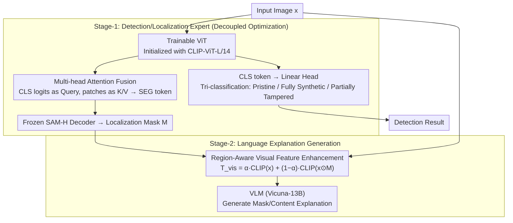

# Rethinking VLMs for Image Forgery Detection and Localization

**Conference**: CVPR 2026  
**arXiv**: [2603.12930](https://arxiv.org/abs/2603.12930)  
**Code**: [sha0fengGuo/IFDL-VLM](https://github.com/sha0fengGuo/IFDL-VLM)  
**Area**: Multimodal VLM  
**Keywords**: Image forgery detection, Vision-Language Models, Forgery localization, Interpretability, AIGC security

## TL;DR

The IFDL-VLM framework is proposed based on the discovery that the inherent semantic plausibility bias (rather than authenticity) of VLMs hinders forgery detection. The framework decouples detection/localization from linguistic explanation into two-stage optimization and utilizes localization masks as auxiliary VLM inputs to enhance interpretability, achieving SOTA across 9 benchmarks.

## Background & Motivation

With the advancement of AIGC technologies (Diffusion Models, GANs, Autoregressive Transformers), image manipulation has become extremely convenient, posing severe challenges for Image Forgery Detection and Localization (IFDL). Existing methods attempt to introduce VLMs (e.g., CLIP + LLM + SAM) into IFDL to enhance interpretability, but the authors identified two major issues:

**Semantic Plausibility vs. Authenticity**: VLMs like CLIP are optimized during pre-training for alignment between high-level semantics and language. Consequently, even if objects in a tampered image are replaced/added, the visual token representations remain highly similar to the original image (cosine similarity as high as 96-98%), rendering the VLM unable to distinguish real from fake.

**Coupling Issues in Existing Pipelines**: Methods such as SIDA and FakeShield jointly optimize detection, localization, and linguistic explanation within a single VLM. However, VLMs lack prior knowledge of forgery-related concepts, which instead degrades detection/localization performance.

Key Insight: The localization mask itself explicitly encodes the concept of forgery and can be used as an additional prior for the VLM, simplifying its training and optimization.

## Method

### Overall Architecture

The core challenge this paper addresses is that VLMs are naturally adept at judging if an image is "semantically plausible" but poor at judging if it "has been tampered" — the latter being the actual requirement for forgery detection. Previous methods (SIDA, FakeShield) tasked a single VLM with detection, localization, and explanation generation, where the VLM's semantic bias negatively impacted detection/localization. The strategy of IFDL-VLM is to split the tasks into two stages. Stage-1 trains a visual expert without a language model — combining a trainable ViT with a frozen SAM-H — to precisely determine "if the image is fake and where it is tampered." Stage-2 feeds the localization mask produced in the first stage back to the VLM as an explicit "forgery clue," allowing the VLM to focus on its strength: explaining the tampered regions and content in natural language. The pipeline follows: "Image → Expert Model Detection/Localization → Mask-enhanced Visual Features → VLM Explanation."

### Key Designs

**1. Decoupled Optimization: Stripping Detection/Localization from VLM Semantic Bias**

The authors observed that VLMs like CLIP align high-level semantics during pre-training. Even when objects are replaced in tampered images, the cosine similarity of visual tokens to the original remains at 96–98%. This "semantic plausibility priority" instinct directly interferes with the identification of low-level forgery traces. Thus, IFDL-VLM excludes the VLM from detection and localization. Stage-1 uses a trainable ViT initialized with CLIP-ViT-L/14 to extract a $\langle\text{SEG}\rangle$ token, which is fed into a frozen SAM-H decoder to produce the localization mask. Simultaneously, it uses a global $\langle\text{CLS}\rangle$ token for tri-classification (Pristine / Fully Synthetic / Partially Tampered). Both detection and localization are completed within this pure visual expert, free from VLM bias.

**2. Multi-head Attention Feature Fusion: One ViT for Two Task Heads**

The ViT in Stage-1 does not train separate models for each task; it uses the same patch-level features for two outputs. The global $\langle\text{CLS}\rangle$ token passes through a linear head for image-level tri-classification. Meanwhile, the classification logits serve as the Query, and the patch tokens serve as Key/Value pairs, which are fused via multi-head attention into a $\langle\text{SEG}\rangle$ token. This token acts as the prompt embedding for the frozen SAM-H to decode the pixel-level localization mask. Sharing one set of features ensures consistency between localization and detection regarding "what is suspicious" while saving parameters.

**3. Region-Aware Visual Feature Enhancement: Using Localization Masks as VLM Priors**

This is the core innovation of Stage-2 and the "feedback" following "decoupling." While conventional methods feed the whole image to the VLM to implicitly learn "what was changed," VLMs struggle without forgery priors. IFDL-VLM performs element-wise multiplication of the Stage-1 localization mask $M$ and the original image $x$ to extract the forged region. This region and the original image are encoded via CLIP and combined with weighted fusion:

$$T_{vis} = \alpha \cdot \text{CLIP}(x) + (1 - \alpha) \cdot \text{CLIP}(x \odot M)$$

where $\alpha = 0.5$. The resulting visual features consist of half global context and half highlighted forgery region, explicitly embedding "forgery concepts" into the VLM input. During inference, the predicted $\hat{M}$ from Stage-1 is used. For example, if a face is partially swapped, Stage-1 highlights the chin area, and Stage-2 uses the enhanced feature of that region to help the VLM describe "replacement of the mandibular contour."

### Loss & Training

**Stage-1 Loss**:

$$\mathcal{L}_{st\text{-}1} = \mathcal{L}_{det} + \mathcal{L}_{loc} = \lambda_{det}\mathcal{L}_{ce}(\hat{D}, D) + \lambda_{bce}\mathcal{L}_{bce}(\hat{M}, M) + \lambda_{dice}\mathcal{L}_{dice}(\hat{M}, M)$$

where $\lambda_{bce} = \lambda_{dice} = \lambda_{det} = 1.0$.

**Stage-2 Loss**:

$$\mathcal{L}_{st\text{-}2} = \mathcal{L}_{ce}(\hat{y}_{des}, y_{des})$$

This is the autoregressive cross-entropy loss for the LLM's linguistic explanation. The LLM backbone is Vicuna-13B.

Training details: AdamW optimizer, learning rate 1e-5, linear warmup-decay, batch size 4 with gradient accumulation 10, FP16/BF16 mixed precision.

## Key Experimental Results

### Main Results

**Detection Performance on SID-Set**:

| Method | Overall Acc | Overall F1 | Description |
|------|---------|---------|------|
| SIDA-13B | 0.94 | 0.94 | Prev. SOTA |
| UnivFD | 0.65 | 0.80 | Traditional method |
| **IFDL-VLM** | **0.997** | **0.998** | Near perfect |

**Localization Performance on SID-Set**:

| Method | AUC | F1 | IoU | Gain |
|------|-----|----|----|------|
| SIDA-7B | 0.87 | 0.74 | 0.44 | - |
| **IFDL-VLM** | **0.99** | **0.87** | **0.65** | +21% IoU |

**Cross-dataset Generalization (Average over 8 datasets)**:

| Method | Avg IoU | Avg F1 | Gain |
|------|---------|---------|------|
| FakeShield | 0.39 | 0.45 | - |
| SIDA-13B* | 0.38 | 0.45 | - |
| **IFDL-VLM** | **0.47** | **0.58** | +13% IoU, +19% F1 |

### Ablation Study

**Interpretability Evaluation (GPT-5 Auto-scoring, 0-5 scale)**:

| Dimension | SIDA-13B | IFDL-VLM | Description |
|------|----------|----------|------|
| Mask | 1.22 | **2.28** | Localization mask quality |
| Tampered Content | 1.14 | **1.98** | Tampered content description |
| Overall | 1.44 | **2.36** | +63.9% improvement |

**CSS Semantic Similarity Evaluation**:

| Dimension | SIDA-13B | IFDL-VLM | Description |
|------|----------|----------|------|
| Areas | 0.61 | **0.67** | Tampered region |
| Tampered Content | 0.44 | **0.49** | Tampered content |
| CSS(weighted) | 0.57 | **0.62** | +8.8% weighted gain |

### Key Findings

- **VLM Priors are Unhelpful for Detection/Localization**: CLIP visual features have a cosine similarity of 96-98% between real and fake images, making them nearly indistinguishable. Decoupling significantly improves performance.
- **Localization Mask as VLM Auxiliary**: Using the mask as an explicit forgery concept input for the VLM significantly enhances interpretability (GPT-5 score +63.9%, CSS +8.8%).
- **Human Evaluation**: 65.2% of 50 evaluators preferred IFDL-VLM explanations, compared to only 11.3% for SIDA-13B.
- **Cross-dataset Generalization**: Achieved optimal performance on 7 out of 8 cross-domain datasets, verifying framework robustness.

## Highlights & Insights

- Deeply reveals the negative impact of VLM "semantic plausibility bias" on forgery detection — a counter-intuitive but valuable finding.
- The "decoupling + enhancement" design philosophy is elegant: training an expert model for detection/localization first, then using those results to assist the VLM's high-level interpretation.
- The approach is concise yet effective — Stage-1 only adds a ViT + frozen SAM decoder, and Stage-2 only modifies visual inputs without complex architectural changes.

## Limitations & Future Work

- Stage-2 depends on the quality of Stage-1 localization masks; localization failure directly impacts the explanation (cascading error).
- Evaluations were limited to Vicuna-13B; it remains to be seen if larger LLMs can further enhance interpretability.
- Performance on IMD2020 did not surpass FakeShield in globalization experiments; specific datasets still have room for improvement.
- Computational efficiency was not discussed — the inference latency of a two-stage pipeline.

## Related Work & Insights

- **SIDA / FakeShield**: Representatives of coupled CLIP + LLM + SAM training; this paper proves decoupling is superior for IFDL.
- **MVSS-Net / CAT-Net**: Traditional methods relying on manual priors (BayarConv, DCT) for low-level anomaly detection.
- **SAM**: This work freezes the SAM-H image encoder and fine-tunes the mask decoder, effectively leveraging its segmentation capabilities.
- Insight: For multimodal auxiliary tasks, letting an expert model handle fundamental decisions before feeding results to a large model for high-level understanding may be a better paradigm.

## Rating

- Novelty: ⭐⭐⭐⭐ (Analysis of VLM bias + decoupling/enhancement design, deep insights)
- Experimental Thoroughness: ⭐⭐⭐⭐⭐ (9 benchmarks + 3D evaluation of detection/localization/interpretability + human study)
- Writing Quality: ⭐⭐⭐⭐⭐ (Clear motivation, rigorous derivation from observation to solution)
- Value: ⭐⭐⭐⭐⭐ (Paradigm-level contribution to the IFDL field)

<!-- RELATED:START -->

## Related Papers

- [\[CVPR 2026\] UNI-OOD: Unified Object- and Image-level Out-of-Distribution Detection via Cross-Context Attentive Vision-Language Modeling](uni-ood_unified_object-_and_image-level_out-of-distribution_detection_via_cross-.md)
- [\[CVPR 2026\] Bias Is a Subspace, Not a Coordinate: A Geometric Rethinking of Post-hoc Debiasing in Vision-Language Models](bias_is_a_subspace_not_a_coordinate_a_geometric_rethinking_of_post-hoc_debiasing.md)
- [\[CVPR 2026\] AXG-Reasoner: Error Detection and Explanation in Long Task Videos with Vision-Language Models](axg-reasoner_error_detection_and_explanation_in_long_task_videos_with_vision-lan.md)
- [\[CVPR 2026\] Activation Matters: Test-time Activated Negative Labels for OOD Detection with Vision-Language Models](activation_matters_test-time_activated_negative_labels_for_ood_detection_with_vi.md)
- [\[CVPR 2026\] Do Vision Language Models Need to Process Image Tokens?](do_vision_language_models_need_to_process_image_tokens.md)

<!-- RELATED:END -->
