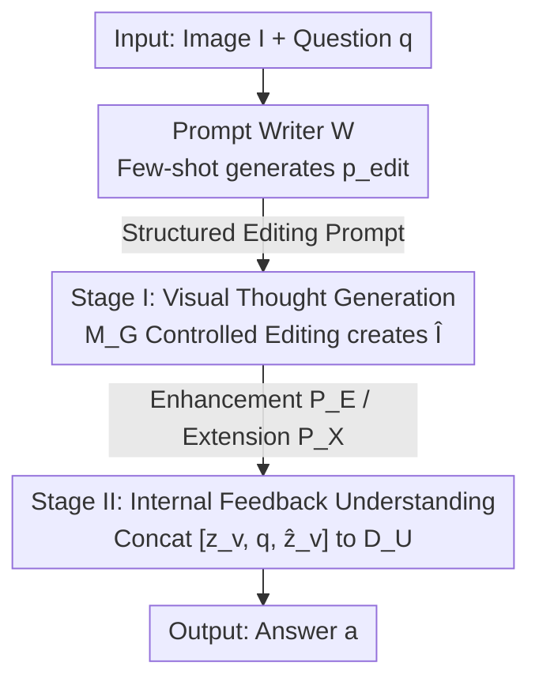

# Reversing the Flow: Generation-to-Understanding Synergy in Large Multimodal Models

**Conference**: CVPR 2026  
**arXiv**: [2605.15792](https://arxiv.org/abs/2605.15792)  
**Code**: TBD  
**Area**: Multimodal VMM (Unified Understanding-Generation Model)  
**Keywords**: Unified Multimodal Models, Generation-Augmented Understanding, Visual Thinking, Zero-Shot Prompting, BAGEL

## TL;DR
This paper reverses the unidirectional "understanding $\to$ generation" flow in unified multimodal models, proposing "Generation-to-Understanding" (G$\to$U) synergy. The model first uses its own generation capability to perform controlled editing (deblurring, outpainting, view changing, etc.) on the input image to create a "visual thought" image, which is then fed back to assist in reasoning. This approach achieves stable improvements in multimodal understanding across 12 benchmarks without training or external tools, revealing that generation fidelity serves as the upper bound for understanding gains and that models "can imagine but do not know what they should imagine."

## Background & Motivation
**Background**: Unified multimodal models (e.g., BAGEL, Janus, BLIP3-o, Show-o) integrate autoregressive reasoning and diffusion-based generation within the same Transformer, claiming the ability to both "see" and "draw." Ideally, this forms a closed loop where understanding guides generation and generation validates understanding.

**Limitations of Prior Work**: In reality, this "unification" remains **unidirectional**. Existing systems follow a pipeline where the vision/language backbone understands first, then conditions a decoder to generate an image (the U$\to$G paradigm). Generation is always the **endpoint** of reasoning and never feeds back into understanding. Furthermore, continuous training to enhance generation often comes at the cost of **weakening the original understanding capabilities**. Thus, even if reasoning and synthesis share parameters, their interaction is essentially a one-way street.

**Key Challenge**: While unified in architecture, there remains a **cognitive asymmetry**—generation benefits from understanding, but understanding gains nothing from generation. The field has spent years teaching models "to generate from understanding," but has seldom asked: "Can generation itself teach understanding?"

**Key Insight**: Humans do not treat imagination merely as an output. When perception is uncertain, humans **reconstruct missing details, imagine alternative perspectives, and simulate context** until the meaning becomes clear—imagination is a means of understanding, not the end. The authors propose: can a model use its **own generative capability** to improve its understanding?

**Core Idea**: By reversing the information flow, a **Generation-to-Understanding (G$\to$U) synergy** is proposed. Visual generation is redefined as an internal analysis step **prior** to reasoning. Given an image and a question, the model first performs controlled generation (enhancing details, expanding context, or visualizing structural relationships) to produce a "visual thought" image, which is then fed back as additional evidence to refine perception. This mechanism is achieved entirely through **two-stage zero-shot prompting, requiring no retraining or external tools**.

## Method

### Overall Architecture
G$\to$U is a **two-stage, self-contained zero-shot loop** operating on a unified model $\mathcal{M}$ that possesses both understanding pathways $\mathcal{M}_U$ and generation pathways $\mathcal{M}_G$ (sharing parameters). Given an image $I$ and a textual question $q$:

$$\hat{I}=\mathcal{M}_G(I,q;p_{edit}),\qquad a=\mathcal{M}_U(I,\hat{I},q)$$

**Stage I (Visual Thought Generation)**: Using the generation pathway $\mathcal{M}_G=\mathcal{D}_G\circ f_v$ guided by a structured editing prompt $p_{edit}$, the original image $I$ is transformed into an auxiliary image $\hat{I}$ (termed *visual thought*). This step is "internal analysis"—it reconstructs or refines visual evidence to aid understanding rather than performing post-hoc synthesis. **Stage II (Internal Feedback Understanding)**: The generated $\hat{I}$ is fed back into the model and concatenated with the original input to form an augmented context $\mathcal{C}=\{I,\hat{I},q\}$. The understanding pathway encodes both images to obtain $z_v=f_v(I)$ and $\hat{z}_v=f_v(\hat{I})$, which are concatenated as $[z_v,q,\hat{z}_v]$ and fed into the reasoning decoder to produce the answer $a=\mathcal{D}_U([z_v,q,\hat{z}_v])$. When $\hat{I}=I$, the process naturally degrades to the standard baseline, ensuring full backward compatibility.

The editing prompt $p_{edit}$ can be manually designed or generated via few-shot learning by a **GPT-4o-mini-based automatic prompt writer**, extending this loop to any new task. The system is instantiated on BAGEL (7B), whose integrated Transformer couples diffusion synthesis and autoregressive reasoning in shared self-attention layers, providing an ideal carrier for bidirectional info-flow between $\mathcal{M}_G$ and $\mathcal{M}_U$.

### Key Designs

**1. Controlled Generation as a Pre-reasoning Step: Placing Generation Before Understanding**

This represents a cognitive restructuring. In traditional U$\to$G, generation is the product of reasoning ($\hat{I}=\mathcal{D}_G(f_v(I),q)$). G$\to$U moves it **before** reasoning, making $\hat{I}$ "additional evidence." Formally, the standard $a=\mathcal{M}_U(I,q)$ is rewritten as a two-step $\{I\to\hat{I}\to a\}$ loop. The effectiveness lies in treating $\hat{I}$ as the model's **internal hypothesis** of what a scene should look like if occlusions or ambiguities were resolved, **externalizing latent world knowledge into visual form**. Prompts are designed to be non-leaking, ensuring gains come from perceptual evidence rather than "cheating."

**2. Dual-Family Editing Prompt Library: Complementary Paths of "Enhancement" and "Extension"**

The prompt library $\mathcal{P}$ is divided into two functional families. **Enhancement Class $\mathcal{P}_E$** (low-level): performs denoising, deblurring, and exposure correction to improve perceptual fidelity, sharpen contours, and restore contrast. This directly benefits tasks relying on local visual evidence (counting, attribute recognition, color reasoning). **Extension Class $\mathcal{P}_X$** (high-level): performs semantic operations such as outpainting, background reconstruction, view transformation, and distractor removal. This invokes the model's internal world model to expand context and simulate counterfactuals, supporting high-level reasoning. Experiments show a **distinct transfer pattern where different prompt families excel at different task types**.

**3. Automatic Prompt Writer: Few-shot In-Context Learning for "Deciding How to Imagine"**

To scale to diverse tasks beyond manual prompts, a GPT-4o-mini-based writer $\mathcal{W}$ is introduced. Given $K$ example triplets $\{(I_i,q_i,p_i)\}_{i=1}^K$, it outputs task-specific prompts $p_{edit}=\mathcal{W}(I,q;\{(I_i,q_i,p_i)\}_{i=1}^K)$. It generalizes editing semantics while preventing answer leakage. Notably, tests using **BAGEL as its own writer (Self-Prompt)** revealed that while it could generate syntactically valid instructions, it lacked task awareness and focused on superficial changes—a key highlight/finding.

### Loss & Training
**Training-free**. The entire framework operates in a zero-shot setting without fine-tuning or additional parameters. BAGEL editing uses default settings: 30 denoising steps, text CFG=4.0, image CFG=1.0. The only "cost" is one additional image generation and one additional visual encoding.

## Key Experimental Results

### Main Results
Evaluation used **VisThink-Bench** (1595 VQA samples across 34 sub-tasks) and 7 standard benchmarks. The table below compares G$\to$U enhanced BAGEL against other 7B-level models:

| Model | MMB | MME-P | MME-S | MMVet | MMStar | KiVA | HallBench | R-Bench |
|------|-----|-------|-------|-------|--------|------|-----------|---------|
| Qwen2.5-VL 7B (Und. Only) | 83.5 | - | 2347 | 67.1 | 63.9 | - | - | - |
| Janus-Pro 7B (Unified) | 79.2 | 1567 | - | 50.0 | - | - | - | - |
| MetaQuery-XL 7B (Unified) | 83.5 | 1685 | - | 66.6 | - | - | - | - |
| **BAGEL (Baseline)** | 83.7 | **1686** | **2320** | 62.7 | 66.7 | 32.9 | 50.9 | 70.1 |
| **BAGEL + G$\to$U (Ours)** | **85.5** | 1662 | 2315 | 62.1 | **67.9** | **35.2** | **55.1** | **71.7** |

Relative to vanilla BAGEL: MMBench +1.8%, MMStar +1.2%, HallusionBench +4.2%, R-Bench +1.6%, KiVA +2.3%. Gains exceeded **10%** in tasks like 3D height estimation and illusion reasoning. However, **symbol-dense tasks (OCR)** saw slight decreases due to the lack of discrete token fidelity in generation.

### Ablation Study
| Configuration | R-Bench | HallBench | MMStar | AVG | Description |
|------|---------|-----------|--------|-----|------|
| BAGEL (Baseline) | 70.1 | 50.9 | 66.7 | 62.6 | Original model |
| BAGEL Textual CoT | 63.6 | 50.4 | 59.4 | 57.8 | Textual CoT drops by 4.8 |
| ① Replace | 70.1 | 50.5 | 67.2 | 62.6 | Replace original with edited image |
| ② Concat (Ours) | 70.9 | 53.1 | 66.5 | **63.5** | Top performance with side-by-side |
| ③ VAE Concat | 69.9 | 42.2 | 65.2 | 59.1 | Feature-level fusion collapses |
| ④ Self-Prompt | 70.1 | 53.3 | 66.8 | 63.4 | Model writes its own prompt |
| ⑥ GPT-4o-mini (Ours) | 71.7 | 55.1 | 67.9 | **64.9** | Best writer |

### Key Findings
- **Generation fidelity is the upper bound for understanding gains**: Quantifying BAGEL's editing quality via VIE metrics shows a statistically significant positive correlation with downstream accuracy ($R^2=0.27, p<0.01$).
- **Visual Thought > Textual Chain-of-Thought**: Textual CoT introduced linguistic bias, dropping accuracy. Visual Thought performs pre-hoc reasoning in **image space**, whereas Textual CoT is post-hoc explanation.
- **Concatenate > Replace >> VAE Fusion**: Concatenation is stable, while VAE feature fusion causes **modal confusion**, where the model fails to distinguish between "generation" and "understanding" states.
- **Models can imagine, but do not know what to imagine**: Self-Prompting results in valid logic but low task alignment and diversity. This exposes a lack of **meta-cognition** in current unified models.

## Highlights & Insights
- **"Reversing Information Flow" is a novel perspective**: While the field focuses on U$\to$G, this work systematically demonstrates how U$\to$G hinders synergy and provides the first operational G$\to$U framework.
- **Zero Training, Pure Prompting**: Unlike methods that textualize everything into long strings or use external OCR/Pythons tools, G$\to$U uses the model's **intrinsic** generative power as a visual thinking mechanism.
- **Valuable Negative Conclusions**: The finding that models "can imagine but don't know what to imagine" pinpoints a cognitive gap—the next step is not necessarily stronger generation, but better **meta-cognition** to decide *what* to imagine.
- **Transferable Trick**: Treating generation as a controllable "evidence synthesizer" and using fidelity metrics (like VIE) to **predict** whether to trust the visual thought is a paradigm applicable to many reasoning tasks.

## Limitations & Future Work
- **Fidelity Ceiling**: When generators fail to faithfully reconstruct fine-grained/symbolic details (text, charts), generation becomes "repetition" rather than "reflection."
- **Circular Reasoning in Abstract Prompts**: High-level prompts like "extract the most salient object" require understanding to generate, creating a self-referential loop where the model cannot generate what it doesn't already understand.
- **Lack of Extrapolative Imagination**: Models are currently **interpolative**. Prompts requiring causal anticipation or temporal simulation (predicting motion) consistently fail, exposing a lack of causal world models.
- **Meta-cognition Gap**: Models cannot reliably judge which "imagination" is useful for a specific task autonomously.

## Related Work & Insights
- **vs. U$\to$G Unified Models**: G$\to$U moves generation from the reasoning endpoint to a pre-processing step, enabling a reciprocal pathway without training.
- **vs. "Thinking with Images" Agentic Routes**: Instead of external tools (detectors, PIL), G$\to$U uses **endogenous** generative capabilities, allowing for freer "imagination" spaces like counterfactual editing.
- **vs. Textual CoT**: Authors argue Textual CoT introduces language bias in visual tasks, whereas image-space reasoning is better aligned with perception.

## Rating
- Novelty: ⭐⭐⭐⭐⭐ First to propose and demonstrate the "Generation $\to$ Understanding" reverse synergy.
- Experimental Thoroughness: ⭐⭐⭐⭐ Extensive benchmarks and ablations, though gains are modest in absolute terms.
- Writing Quality: ⭐⭐⭐⭐⭐ Clear narrative, strong analogies, and honest discussion of findings.
- Value: ⭐⭐⭐⭐ High transferability and identifies crucial meta-cognitive gaps; directional value exceeds numerical gains.

<!-- RELATED:START -->

## Related Papers

- [\[CVPR 2026\] Modeling Cross-vision Synergy for Unified Large Vision Model](modeling_cross-vision_synergy_for_unified_large_vision_model.md)
- [\[CVPR 2026\] UniCompress: Token Compression for Unified Vision-Language Understanding and Generation](unicompress_token_compression_for_unified_vision-language_understanding_and_gene.md)
- [\[CVPR 2026\] VQRAE: Representation Quantization Autoencoders for Multimodal Understanding, Generation and Reconstruction](vqrae_representation_quantization_autoencoders_for_multimodal_understanding_gene.md)
- [\[CVPR 2026\] DuoGen: Towards Autonomous Interleaved Multimodal Generation](duogen_towards_autonomous_interleaved_multimodal_generation.md)
- [\[CVPR 2026\] HBridge: H-Shape Bridging of Heterogeneous Experts for Unified Multimodal Understanding and Generation](hbridge_h-shape_bridging_of_heterogeneous_experts_for_unified_multimodal_underst.md)

<!-- RELATED:END -->
