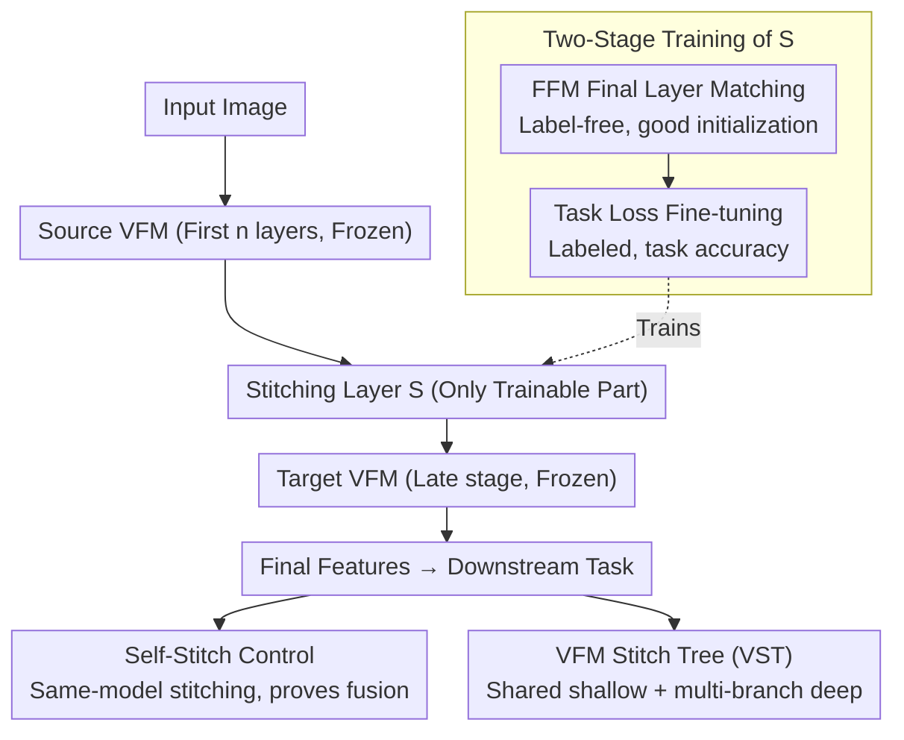

# Revisiting Model Stitching in the Foundation Model Era

**Conference**: CVPR 2026  
**arXiv**: [2603.12433](https://arxiv.org/abs/2603.12433)  
**Code**: None  
**Area**: Multimodal VLM / Model Fusion  
**Keywords**: Model Stitching, Visual Foundation Models, Representation Compatibility, VFM Stitch Tree, Multimodal LLM

## TL;DR
This paper systematically investigates the feasibility of stitching Visual Foundation Models (VFMs). It discovers that traditional stitching methods fail for VFMs and proposes a two-stage training strategy—"Final Feature Matching + Task Loss"—to enable reliable stitching of heterogeneous VFMs. The resulting stitched models can even outperform individual VFMs. Furthermore, the VFM Stitch Tree (VST) architecture is introduced to provide a controllable accuracy-efficiency tradeoff for multi-VFM systems.

## Background & Motivation

1.  **Background**: Visual Foundation Models (e.g., CLIP, DINOv2, SigLIP 2) pre-trained with different objectives, datasets, and modality combinations have become the default backbones for downstream tasks. Multimodal systems (e.g., MoF-LLaVA, Cambrian-1) increasingly utilize multiple VFMs simultaneously to capture complementary visual information.
2.  **Limitations of Prior Work**:
    *   Model stitching serves as a probe for representation compatibility. While studies show that small models trained on the same dataset (e.g., ResNet-18 on CIFAR-10) can be stitched, it remains unknown whether heterogeneous VFMs are stitchable.
    *   Traditional training methods (Layer Feature Matching and Task Loss Training) fail on VFMs. The former suffers from accumulated matching errors that amplify final feature bias in shallow stitches, while the latter faces optimization difficulties due to gradients traversing long chains of frozen layers.
    *   Using multiple VFMs incurs linear increases in computation and memory costs (k VFMs equate to k times the overhead), lacking an efficient sharing mechanism.
3.  **Key Challenge**: VFMs differ significantly across pre-training data (LAION vs. LVD-142M vs. WebLI), objectives (Contrastive vs. Self-supervised Reconstruction), and modality combinations (Vision-only vs. Vision-Language). Bridging their intermediate representations with simple transformations is insufficient.
4.  **Goal**: ① Explore whether heterogeneous VFMs are stitchable; ② Identify reliable stitching training methods; ③ Upgrade stitching from a diagnostic tool to a practical VFM fusion scheme.
5.  **Key Insight**: Systematically analyze reasons for failure (intermediate matching $\neq$ final alignment, gradient decay) and propose a targeted two-stage method.
6.  **Core Idea**: Use Final Feature Matching at the penultimate layer of the target VFM to align features for initialization, followed by Task Loss fine-tuning. This ensures heterogeneous VFMs are reliably stitchable and can fuse complementary knowledge.

## Method

### Overall Architecture
This work addresses a previously unverified question: can two VFMs with disparate objectives, data, and modalities be "stitched" together like identical small models to achieve complementary gains? The approach extracts the first $n$ layers of a source VFM $f_\theta$ and the last $N-n$ layers of a target VFM $f_\phi$ (both being $N$-layer Transformers), inserting a trainable stitching layer $S$ between them. Weights for both source and target are frozen, with only the "stitching joint" being trained. The pipeline is $F(x) = T_\phi^N \circ S \circ R_\theta^n(x)$. The primary challenge lies in training this joint: FFM provides a strong alignment target for initialization, two-stage training ensures optimization, and Self-Stitch serves as a control to prove that gains stem from true knowledge fusion. Finally, single-point stitching is generalized into a VFM Stitch Tree—sharing shallow layers while retaining proprietary deep layers for multiple VFMs.

### Key Designs

**1. Final Feature Matching (FFM): Shifting alignment from the stitch point to the final layer**

Traditional Layer Feature Matching aligns intermediate features at stitch point $n$. While error at the stitch point can be minimized to $10^{-3}$, this tiny error is amplified layer-by-layer through subsequent frozen blocks, leading to severe feature deviation at the final layer—especially for shallow stitches. FFM bypasses intermediate stages and directly minimizes feature discrepancy at the final layer $N$:

$$\mathcal{L}_{FFM} = \frac{1}{M}\sum_{i=1}^M \|T_\phi^N(S(R_\theta^n(x_i))) - T_\phi^N(R_\phi^n(x_i))\|_2^2$$

This forces the "Source prefix + Stitch + Target suffix" output to approximate the "Target model full path" output. Although it optimizes the endpoint, it surprisingly maintains low feature distance at intermediate layers (an implicit local alignment effect), resulting in much lower final feature distance than Layer Feature Matching. Furthermore, this loss is label-free, allowing stitching layers to be pre-trained on unsupervised data.

**2. Two-Stage Training (FFM Init + Task Loss Fine-tuning): Establishing a good starting point then pursuing performance**

Training the stitching layer from scratch using downstream task loss (e.g., cross-entropy) is difficult for shallow stitches; supervision signals from pooled tokens must backpropagate through long frozen chains, leading to a poorly conditioned loss landscape. The proposed two-step solution: Stage 1 uses FFM (label-free) to pre-train the joint to a favorable initialization; Stage 2 applies downstream task loss (labeled) to pursue final accuracy. FFM initialization moves the joint to a better position in the landscape, turning "hard-to-optimize" into "smooth convergence." Results show that DINOv2→SigLIP2 at layer L6 yields only 25.1% using solely Task Loss (lower than linear probing at 46.7% and 53.5%), but jumps to 51.7% with FFM init and 55.8% after fine-tuning.

**3. Self-Stitch Control: Distinguishing "true fusion" from "added parameters"**

To counter the skepticism that performance gains from cross-VFM stitching might simply result from the stitching layer acting as extra trainable parameters adapted to the downstream distribution, this work utilizes Self-Stitch. By stitching a VFM within itself (e.g., SigLIP2→SigLIP2) under identical conditions (joint, stitch point, loss, data), any gap where cross-VFM stitching outperforms self-stitching must be attributed to the fusion of complementary heterogeneous knowledge rather than capacity. Experiments confirm cross-VFM consistency is significantly higher than self-stitching (approx. +2.3% to +2.6%).

**4. VFM Stitch Tree (VST): Scaling single-point stitching to adjustable multi-VFM architectures**

VST operationalizes the finding that heterogeneous VFMs can be reliably stitched. Modern multimodal systems (like MoF-LLaVA using CLIP+DINOv2) capture complementary cues by running multiple VFMs in parallel, which multiplies memory and latency costs. VST allows multiple VFMs to **share a common shallow segment** (run once) and **branch into proprietary deep segments** via stitching layers. This converts the binary choice of "whether to add a second VFM" into a continuous accuracy-efficiency knob. In a MoF-LLaVA (CLIP+DINOv2) + Qwen-3B setup, VST-22 recovers 45% of dual-VFM gains with only 4.3% extra overhead; VST-14 recovers 84% with 39% overhead.

### Loss & Training
- **Stage 1**: FFM loss (unlabeled data); source and target features can be pre-extracted to accelerate training.
- **Stage 2**: Downstream task cross-entropy loss (labeled data).
- **Stitching Layer**: Defaults to a 2-layer MLP with ReLU (similar to the LLaVA-1.5 projector).
- **VFM Pairs Evaluated**: DINOv2-L, SigLIP2-L, CLIP, DINOv3 (all 24-layer Transformers).
- **Stitch Points**: $n \in [2, 6, 10, 14, 18, 22]$.

## Key Experimental Results

### Main Results: Two-Stage Method vs. Vanilla Task Loss Training

| Stitching | Init | L2 | L6 | L10 | L14 | L18 | L22 |
|------|--------|-----|-----|------|------|------|------|
| DINOv2→SigLIP2 | None | 25.1 | 39.4 | 52.6 | 62.3 | 68.6 | 68.6 |
| DINOv2→SigLIP2 | FFM | **51.7** | **55.8** | **59.3** | **68.0** | **72.0** | **71.8** |
| SigLIP2→DINOv2 | None | 38.7 | 56.7 | 58.3 | 64.4 | 70.4 | 70.1 |
| SigLIP2→DINOv2 | FFM | **53.8** | **53.8** | **61.9** | **69.6** | **70.4** | **72.2** |

### Ablation Study: Stitching Layer Type

| Stitching Layer | L2 | L6 | L10 | L14 | L18 | L22 |
|--------|-----|-----|------|------|------|------|
| Linear | 26.1/50.3 | 54.3/56.4 | 59.5/60.0 | 66.5/65.7 | 69.1/69.6 | 69.6/71.9 |
| **MLP** | **51.7/53.8** | **55.8/53.8** | **59.3/61.9** | **68.0/69.6** | **72.0/70.4** | **71.8/72.2** |
| LoRA | 49.1/48.3 | 49.4/56.2 | 57.4/62.4 | 61.7/65.3 | 67.7/66.2 | 67.3/65.0 |

### Key Findings
- FFM initialization shows the most prominent effect on shallow stitches (L2: 25.1→51.7) and provides stable gains even for deep stitches.
- Cross-VFM stitching consistently outperforms self-stitching (+0.7% to +5.5%) across classification and segmentation tasks, confirming true complementary knowledge fusion.
- MLP stitching layers are generally optimal; LoRA, despite higher expressivity, underperforms MLP, suggesting that moderate mismatch might facilitate fusion.
- CLIP performs poorly as a source model (losing task-critical info in its weak encoder) but excels as a target model.
- VST-22 achieves 45% of dual-VFM performance gains with only 4.3% additional resources.

## Highlights & Insights
- **Implicit Local Alignment**: The discovery that FFM (matching only the final layer) implicitly promotes local alignment at the stitch point provides significant insight into representation constraints of deep networks.
- **Rigor of Self-Stitch Baseline**: The experimental design effectively isolates "added capacity" as a factor, serving as a model for responsible experimental methodology.
- **Accuracy-Latency Knob**: The VST concept shifts the paradigm from binary VFM selection to a continuous scale suitable for varied deployment budgets.
- **Utility Shift**: Moving model stitching from a purely diagnostic tool to a practical fusion scheme is a meaningful paradigm shift.

## Limitations & Future Work
- VST evaluation remains in the "early exploration" phase on VQAv2 and MME; expansion to more multimodal benchmarks is required.
- Experiments are restricted to ViT-L scale; scalability to ViT-G or different architectures remains to be verified.
- FFM requires forward inference of both VFMs on unlabeled data, which might be computationally heavy for extremely large models.
- Zero-shot performance of stitching remains unknown as FFM is currently performed on task-related domain data.

## Related Work & Insights
- **vs. SN-Net [35]**: While SN-Net designs stitchability during training for compression, this work post-hoc stitches independently trained heterogeneous VFMs.
- **vs. [2] (Bansal et al.)**: Extending the "Anna Karenina hypothesis" of stitchability from isomorphic small models to heterogeneous VFMs.
- **vs. [7] (Collins et al.)**: Contrary to findings that TLT is superior to LFM, this study finds both problematic for VFMs and proposes FFM as a superior alternative.

## Rating
- Novelty: ⭐⭐⭐⭐ FFM and the two-stage scheme are simple yet effective; VST is a novel application.
- Experimental Thoroughness: ⭐⭐⭐⭐⭐ Comprehensive verification across pairs, datasets, and tasks with rigorous control.
- Writing Quality: ⭐⭐⭐⭐⭐ Logical progression from diagnosis to application.
- Value: ⭐⭐⭐⭐ Significant contribution to understanding VFM compatibility and providing deployment solutions.

<!-- RELATED:START -->

## Related Papers

- [\[CVPR 2026\] Revisiting Visual Corruptions in LVLMs: A Shape-Texture Perspective on Model Failures](revisiting_visual_corruptions_in_lvlms_a_shape-texture_perspective_on_model_fail.md)
- [\[CVPR 2026\] µVLM: A Vision Language Model for µNPUs](mvlm_a_vision_language_model_for_mnpus.md)
- [\[CVPR 2026\] RealBirdID: Benchmarking Bird Species Identification in the Era of MLLMs](realbirdid_benchmarking_bird_species_identification_in_the_era_of_mllms.md)
- [\[CVPR 2026\] Beyond Layer-Wise Merging: Chain-of-Merging for Vision-Language Models](beyond_layer-wise_merging_chain-of-merging_for_vision-language_models.md)
- [\[CVPR 2026\] ProM3E: Probabilistic Masked MultiModal Embedding Model for Ecology](prom3e_probabilistic_masked_multimodal_embedding_model_for_ecology.md)

<!-- RELATED:END -->
