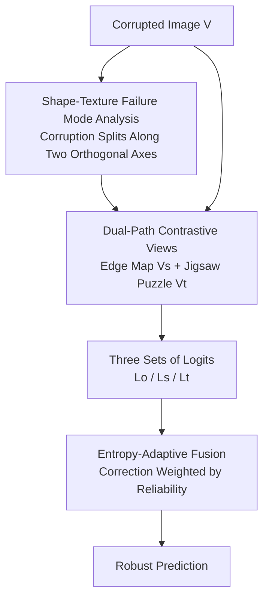

# Revisiting Visual Corruptions in LVLMs: A Shape-Texture Perspective on Model Failures

**Conference**: CVPR 2026  
**Paper**: [CVF Open Access](https://openaccess.thecvf.com/content/CVPR2026/html/Qiu_Revisiting_Visual_Corruptions_in_LVLMs_A_Shape-Texture_Perspective_on_Model_CVPR_2026_paper.html)  
**Code**: https://github.com/EdyQiu/ST-CD  
**Area**: Multimodal VLM  
**Keywords**: Visual Corruption Robustness, Shape-Texture, Contrastive Decoding, Training-Free Inference, Failure Mode Analysis

## TL;DR
Starting from "corruption type heterogeneity," this paper finds that image corruptions disrupt LVLM perception along two complementary dimensions—**shape** and **texture**—inducing two opposite failure modes. Accordingly, a training-free dual-path contrastive decoding framework, ST-CD, is proposed. It utilizes edge maps and jigsaw puzzles as probes to amplify respective biases and adaptively fuses correction signals via entropy, consistently improving robustness against heterogeneous corruptions across multiple LVLMs.

## Background & Motivation
**Background**: LVLMs (e.g., LLaVA-1.5, Qwen-VL, mPLUG-Owl2) demonstrate strong performance in open-ended visual reasoning but rely heavily on the assumption of high-quality input images. Performance drops significantly when images are contaminated by noise, blur, or geometric deformations, which is a critical issue in safety-critical scenarios.

**Limitations of Prior Work**: Previous works attribute performance degradation to "insufficient visual grounding," "over-reliance on language priors," or "misalignment between vision and text representations," designing mitigation methods accordingly. However, they treat corruption as generic "visual noise"—either using a universal perturbation (e.g., VCD with diffusion noise) or averaging random augmentations (e.g., VACoDe aggregating seven augmentations).

**Key Challenge**: Corruptions are actually **heterogeneous**. Different corruptions arise from different degradation mechanisms and interfere with perception in fundamentally different ways. Current methods apply a "one-size-fits-all" universal perturbation, inevitably leading to trade-offs (empirical tests show no single contrastive decoding method dominates across all corruption types).

**Key Insight**: Ours adopts a "corruption-centric" perspective to observe which perceptual dimensions are disrupted. By measuring the shift of LLaVA features in a **shape-texture perceptual subspace**, it is discovered that diverse corruptions naturally cluster into two groups: blur/geometric deformations primarily degrade global structure (shape degradation), while noise/color perturbations primarily degrade local appearance (texture degradation). These two directions are nearly orthogonal. Crucially, these corruptions induce **opposite** failure modes: with shape degradation, models rely more on texture and misclassify into texture-similar categories (e.g., dog $\rightarrow$ bear); with texture degradation, models rely on shape and misclassify into structurally similar categories (e.g., dog $\rightarrow$ wolf).

**Core Idea**: Since failure modes split along shape/texture axes, two contrastive paths are constructed—one emphasizing shape and the other texture—to amplify corresponding biases. These are then adaptively fused based on uncertainty to form a training-free inference framework (ST-CD).

## Method
ST-CD is an inference-time, training-free contrastive decoding framework. It receives a corrupted image and outputs robust predictions by diagnosing and subtracting shape/texture biases through the comparison of three sets of logits: "original image + two contrastive views." The pipeline involves three steps: logit generation, contrastive calibration, and adaptive fusion.

### Overall Architecture
Given a corrupted image $V$, the LVLM first produces base logits $L_o = f(V)$. Then, two semantically grounded contrastive views are constructed: the **edge map** $V_s$ (extracted via Canny, preserving global contours while suppressing fine texture) and the **jigsaw puzzle** $V_t$ (randomly shuffling patches to disrupt global structure while preserving local texture statistics), yielding $L_s = f(V_s)$ and $L_t = f(V_t)$. These paths **amplify** corresponding degradation biases: the edge path amplifies misjudgments caused by shape degradation, and the jigsaw path amplifies those from texture degradation. Finally, correction signals are derived by subtracting these contrastive logits from $L_o$ and are fused back into $L_o$ using entropy-based adaptive weights. The entire process requires no parameter updates.

### Key Designs

**1. Shape-Texture Perceptual Subspace: Reducing Heterogeneous Corruptions to Two Orthogonal Axes**

This analysis serves as the foundation, answering why shape and texture dimensions suffice. Ours uses LLaVA to extract features and calculates mean feature vectors for clean, edge, and jigsaw images ($f_{clean}, f_{edge}, f_{jigsaw}$). Two shift directions are defined: $v_{shape} = f_{edge} - f_{clean}$ (direction of representation shift when shape is emphasized) and $v_{texture} = f_{jigsaw} - f_{clean}$ (shift when texture is emphasized). Gram-Schmidt orthogonalization yields an orthonormal basis $\{u_{shape}, u_{texture}\}$. For any corruption subset $c$, the average shift relative to the clean image $\Delta f_c = f_c - f_{clean}$ is projected onto this basis to obtain coordinates $x_c = \Delta f_c^\top u_{shape}$ and $y_c = \Delta f_c^\top u_{texture}$. The results show that blur and geometric deformations lie on the negative x-axis (shape degradation), while noise and color perturbations lie on the negative y-axis (texture degradation). This compresses dozens of corruptions into an interpretable 2D structure.

**2. Dual-Path Semantic Contrastive Views: Using Edges and Jigsaws as Probes to Amplify Biases**

Knowing the two categories is insufficient; one must explicitly expose these biases during inference. Ours defines shape as the set of contours describing an object's 3D form (captured by 2D Canny edges) and texture as components unrelated to shape (preserved via jigsaw shuffling). These views act as **targeted probes**: feeding the edge map amplifies over-reliance on shape ($L_s$ becomes more extreme for "bear"), allowing $\Delta_s = L_o - L_s$ to capture "shape-degradation-induced bias." Unlike VCD (single-perturbation de-biasing) or VACoDe (averaging seven random augmentations), ST-CD is the first to exploit shape-texture complementarity during **inference**.

**3. Entropy-Adaptive Fusion: Dynamically Weighting Correction Signals by Reliability**

Correction signals from the two paths cannot be added with equal weights. When a contrastive view is unreliable (e.g., elastic transformation + jigsaw shuffling resulting in a nearly uniform distribution for $L_t$), blind fusion introduces noise. Ours uses entropy as an uncertainty proxy: high entropy $E_o$ in the original prediction indicates low confidence and a need for stronger correction, while low entropy $E_s, E_t$ in contrastive logits indicates reliable correction. The fused logits are:

$$\tilde{L} = L_o + \frac{E_o}{E_s}(L_o - L_s) + \frac{E_o}{E_t}(L_o - L_t)$$

The ratios $\frac{E_o}{E_s}$ and $\frac{E_o}{E_t}$ achieve "bi-directional confidence modulation," amplifying correction when the model is uncertain and the contrast is reliable, thus achieving sample-level adaptation.

### Mechanism Example: Correcting a Shape-Degraded Sample
Consider a dog image distorted by elastic transformation (severely damaged shape): the original $L_o$ leans toward the texture-similar "bear." After generating the edge map $V_s$, the preference for "bear" in $L_s$ is further exaggerated, confirming over-reliance on corrupted shape cues. Thus, $\Delta_s = L_o - L_s$ provides meaningful shape correction. Meanwhile, the jigsaw $V_t$ is disrupted by both transformation and shuffling, making $L_t$ nearly uniform. Due to the high entropy of $L_t$, its contribution is automatically downweighted, while the shape correction term is emphasized, pulling the prediction back to the correct category.

## Key Experimental Results

Three LVLMs were evaluated across four robustness benchmarks (ImageNet10-C, MMBench-C, POPE-MSCOCO-C, and real-world RWIC-VQA), compared against VCD, ICD, LCD, and VACoDe.

### Main Results (ImageNet10-C Average Accuracy)

| Model | Baseline | VCD | VACoDe | ST-CD (Ours) |
|------|----------|-----|--------|---------------|
| LLaVA-1.5 | 74.1 | 82.1 | 82.9 | **84.1** |
| mPLUG-Owl2 | 67.6 | 70.8 | 72.1 | **74.1** |
| Qwen-VL | 58.4 | 63.8 | 63.7 | **67.8** |

Averaged across benchmarks, ST-CD improves over the baseline by 10.0% / 6.5% / 8.4% (LLaVA / Qwen / mPLUG) and over standard VCD by 3.2% / 3.1% / 4.7%. Performance on RWIC-VQA confirms generalization to real-world degradation. ST-CD requires only **1.5×** the inference overhead of VCD, whereas VACoDe requires 4.2× yet performs worse.

### Ablation Study: Contrastive View Generation (LLaVA-1.5, Single-path VCD Framework)

| Contrastive View | Blur | Geometry | Noise | Color | Average |
|---------|------|------|------|------|------|
| vanilla (no contrast) | — | — | — | — | 73.9 |
| Diffusion Noise | — | — | — | — | 80.9 |
| Crop | — | — | — | — | 82.5 |
| Blank image | — | — | — | — | 82.7 |
| Canny Edge (Shape Probe) | **Best** | **Best** | — | — | 83.1 |
| Jigsaw Puzzle (Texture Probe) | — | — | **Best** | **Best** | 83.7 |

Edge views excel at shape degradation (blur/geometry), while jigsaw views excel at texture degradation (noise/color), confirming the design of the dual-path approach.

### Key Findings
- Existing contrastive decoding methods are "picky": VCD excels at blur, LCD at color, and VACoDe at noise/geometry. ST-CD achieves stable dominance across types via shape-texture decoupling.
- Among heuristic weights, the entropy strategy performs best (84.1%). A data-driven "Learned" variant is higher (86.3%) but requires 30% corruption validation data, making it less practical for zero-shot scenarios.
- Gains do not come from simply "adding more branches": VACoDe uses 7 views but loses to the 2-path ST-CD, proving that principled decoupling is more valuable than statistical diversity.

## Highlights & Insights
- **Formalizing "corruption heterogeneity" into a measurable 2D subspace**: Using edge/jigsaw shift vectors as a basis to project and diagnose models provides a protocol reusable for analyzing sensitivity to any perturbation.
- **Upgrading contrastive views from "random perturbations" to "targeted probes"**: Moving from generic semantic de-biasing to perception-level correction via shape/texture probes is a significant conceptual shift.
- **Entropy as a reliability gate**: Using high entropy to automatically dial down the influence of non-discriminative paths prevents the model from being misled by uninformative corrections.

## Limitations & Future Work
- While shape/texture are nearly orthogonal, the assumption that they span all visual information is a simplification; mixed or frequency-domain corruptions require further validation.
- The use of manual operators like Canny/jigsaw limits the framework, as probes may fail under extreme degradation or low resolution.
- The 1.5× inference overhead (requiring three forward passes) remains a cost for real-time deployment.
- Closing the gap between the entropy-weighted zero-shot performance and the data-driven "Learned" weighting strategy remains an open problem.

## Related Work & Insights
- **vs. VCD**: VCD uses a single perturbation (e.g., diffusion noise) to suppress language priors. ST-CD uses complementary, semantically grounded views to decouple shape/texture degradation, consistently outperforming VCD in robustness.
- **vs. VACoDe**: VACoDe aggregates random augmentations (4.2× overhead). ST-CD uses a minimal dual-path structure (1.5× overhead) to achieve higher robustness.
- **vs. Shape-Texture Representation Research**: Previous works focus on injecting biases during **training**. ST-CD is the first to exploit this complementarity during **inference decoding** without retraining.

## Rating
- **Novelty**: ⭐⭐⭐⭐⭐ Formalizing corruption heterogeneity in an orthogonal subspace and utilizing this complementarity in inference decoding is highly novel.
- **Experimental Thoroughness**: ⭐⭐⭐⭐ Comprehensive across 3 models and 4 benchmarks; however, mixed/frequency corruption results are relegated to the appendix.
- **Writing Quality**: ⭐⭐⭐⭐⭐ Logical flow from phenomenon analysis to method derivation; intuitive visualizations (Fig. 1/2).
- **Value**: ⭐⭐⭐⭐ Training-free, plug-and-play, with manageable overhead; highly relevant for safety-critical deployments.

<!-- RELATED:START -->

## Related Papers

- [\[CVPR 2026\] Revisiting Model Stitching in the Foundation Model Era](revisiting_model_stitching_in_the_foundation_model.md)
- [\[CVPR 2026\] HBridge: H-Shape Bridging of Heterogeneous Experts for Unified Multimodal Understanding and Generation](hbridge_h-shape_bridging_of_heterogeneous_experts_for_unified_multimodal_underst.md)
- [\[CVPR 2026\] Dr. Seg: Revisiting GRPO Training for Visual Large Language Models through Perception-Oriented Design](dr_seg_revisiting_grpo_training_for_visual_large_language_models_through_percept.md)
- [\[CVPR 2026\] Is the Modality Gap a Bug or a Feature? A Robustness Perspective](is_the_modality_gap_a_bug_or_a_feature_a_robustness_perspective.md)
- [\[CVPR 2026\] SoPE: Spherical Coordinate-Based Positional Embedding for 3D LVLMs](sope_spherical_positional_encoding_3d_lvlm.md)

<!-- RELATED:END -->
