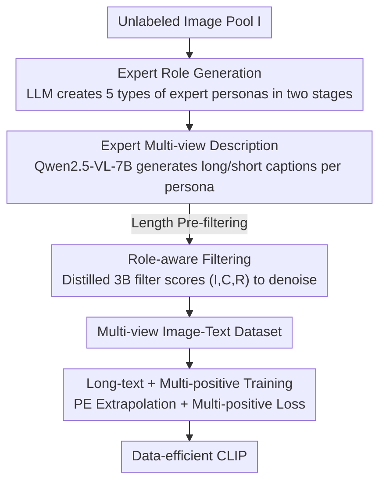

# Role-SynthCLIP: A Role-Play Driven Diverse Synthetic Data Approach

**Conference**: CVPR 2026  
**Paper**: [CVF Open Access](https://openaccess.thecvf.com/content/CVPR2026/html/Huangfu_Role-SynthCLIP_A_Role-Play_Driven_Diverse_Synthetic_Data_Approach_CVPR_2026_paper.html)  
**Code**: https://github.com/huangfu170/Role-SynthCLIP  
**Area**: Multimodal VLM  
**Keywords**: CLIP Pre-training, Synthetic Data, Role-Play Prompting, Multi-view Captioning, Data-efficient  

## TL;DR
Using "multi-expert role-play prompting" to drive MLLMs to generate multiple complementary captions from cognitive perspectives such as composition, narrative, and emotion. After denoising with a distilled role-aware filter, the approach achieves 64.1% Recall@1 on MS-COCO for CLIP-B/16 using only 1M images, surpassing the strongest synthetic data baseline trained on 5M pairs.

## Background & Motivation
**Background**: The capability of Vision-Language Models (VLMs) like CLIP heavily depends on the semantic diversity and quality of training data. Traditional methods rely on crawling millions to billions of image-text pairs, but this "scaling" path is increasingly expensive and inevitably introduces noise, low quality, and redundancy. Consequently, "controllable high-quality synthetic data" has become an alternative—SynthCLIP demonstrated that purely synthetic corpora (up to 30M pairs) can achieve competitive results.

**Limitations of Prior Work**: As the focus shifts from "data scale" to "data quality," a new issue emerges: **semantic impoverishment**. When using generic prompts to describe images via MLLMs, the generated captions often suffer from single perspectives, repetitive phrasing, and semantic redundancy, failing to capture the multifaceted nature of rich visual content. Existing improvements either adjust distribution balance (e.g., SynthCLIP balances entity distribution) or aggregate prompt templates (e.g., FIX-CLIP uses 20 generic prompts; LaCLIP uses LLMs to rewrite original captions), but these ensemble methods **lack cognitive depth**. Their "diversity" is merely surface-level word replacement without introducing truly different interpretive dimensions like composition, context, or emotion.

**Key Challenge**: A single image can be interpreted from many perspectives, but "random/generic prompts" cause models to repeatedly provide the same surface-level description. The bottleneck of diversity lies not in the number of samples, but in the failure of prompts to deliberately activate the model's different cognitive abilities.

**Goal**: To improve semantic diversity and fine-grained alignment of synthetic image-text pairs by assigning multiple semantically complementary and perspective-diverse captions to each image, while keeping the **number of training images fixed**.

**Key Insight**: The authors leverage "role-play prompting," which has been proven effective in LLMs. By assigning an expert identity to the model (e.g., a domain specialist), it stimulates richer and more professional responses without structural changes or additional training. Transferring this paradigm to MLLM caption generation allows for flexible "manipulation" of the model to produce desired semantic diversity.

**Core Idea**: Use "multi-expert role-play prompting" instead of "generic prompts" to enable MLLMs to describe the same image from multiple complementary cognitive perspectives, thereby increasing semantic diversity without increasing the image count.

## Method

### Overall Architecture
Role-SynthCLIP defines the task as: given a batch of **unpaired images** $I=\{I_i\}$, synthesize semantically diverse and accurate image-text pairs for contrastive training. The pipeline consists of three sequential stages: first, **generate expert roles** (creating a set of specialized "labeling personalities"); second, let the MLLM **observe the images as experts** (producing multi-view captions strictly following their personas); third, use a **role-aware filter** to remove hallucinations and data that does not match the role. Finally, the high-quality multi-view image-text pairs are used to train CLIP with objectives tailored for long captions and multiple positive samples.

### Key Designs

**1. Expert Role Generation: Diversity through "Deliberate Division of Labor"**

To address the issue where generic prompts yield only surface-level views, the authors argue that each prompt should **deliberately focus on one cognitive dimension**, making them functionally complementary. Drawing from structured agent generation in LLM-discussion frameworks, roles are created in two stages: first, the LLM proposes initial roles suitable for "generating precise and informative image descriptions"; second, two rounds of dialogue convert this high-level information into a structured format containing the expert's **name, expertise, and responsibilities**. This ensures roles are specialized and grammatically consistent. Five final roles were established across key dimensions: Observer (fine-grained features), Interpreter (context), Compositional Analyst (visual structure), Narrative Setter (implicit narrative), and Emotional Responder (subjective emotion). This step is the source of diversity—all subsequent "perspective differences" in captions are defined by these roles.

**2. Expert Multi-view Description: Extracting Semantic Density from One MLLM**

Using Qwen2.5-VL-7B as the core captioner (chosen for strong visual grounding and instruction following), the model is tasked with **strictly adhering to each persona** to produce both long and short grain captions for the same image. To prevent the generation of uninformative, title-like noise, a simple but effective **length-based pre-filtering** is added: long captions with fewer than 10 words and short captions with fewer than 4 words are discarded. The resulting multi-view dataset features long captions averaging 92.4 words and short captions averaging 17.7 words, which facilitates subsequent "long-text contrastive training." The value of this design is that it expands a single image into multiple complementary descriptions via persona switching **without increasing the number of training images**.

**3. Role-aware Filtering: Judging Both Visual Accuracy and Role Alignment**

MLLM-generated captions are prone to category/attribute hallucinations, and multi-expert strategies require captions to be **consistent with the assigned role**. Standard scoring filters cannot judge the latter. The authors designed a role-aware filter trained via knowledge distillation: using GPT-5 as the **Teacher** to fine-tune a lightweight Qwen2.5-VL-3B as the **Student**. During teacher data generation, for sampled $(I, C, R)$ triplets (image, caption, role responsibility), GPT-5 outputs a relevance score $S_{\text{GPT-5}}$ (1–100) and a rationale $T_{\text{rationale}}$. **Multi-task distillation** then enables the 3B student to imitate the score and generate the rationale simultaneously, learning "what to filter and why." The key to the filter is its **three-input structure**, scoring based on $I$, $C$, and $R$:

$$\text{Relevance Score} = \text{MLLM}_{\text{filter}}(I, C, R)$$

The score reflects both visual accuracy and semantic consistency with the specified perspective. Low-scoring pairs are filtered out at a **fixed ratio** to improve dataset quality.

**4. Long-text Extrapolation + Multi-positive Contrastive Loss**

Standard CLIP text encoders are limited to 77 tokens, whereas the long captions in this work average 90+ words; truncation would lose semantic info. The authors adopt **positional encoding extrapolation** from Long-CLIP: freezing the original PE for the first 20 tokens (which carry disproportionately critical information) and applying linear interpolation for subsequent tokens:

$$\text{PE}_{\text{long}} = \text{Concat}\big(\text{PE}_{\text{orig}}[:20],\ \text{Intpol}(\text{PE}_{\text{orig}}[20:], q)\big)$$

where $\text{Intpol}(\text{PE}, q)[i] = (1-\lambda)\,\text{PE}_{\text{orig}}[j] + \lambda\,\text{PE}_{\text{orig}}[j+1]$, $\lambda = (i \bmod q)/q$, and $j = \lfloor i/q \rfloor$, extending support to 248 tokens. More importantly, since one image now corresponds to multiple captions, the standard contrastive objective is replaced with a **multi-positive variant**. Given the image-text correspondence matrix $M\in\{0,1\}^{B\times B}$ in a batch ($M_{ij}=1$ if image $i$ and text $j$ are related), the image-to-text loss is:

$$L_{i2t} = -\frac{1}{B}\sum_i \sum_j \frac{M_{ij}}{\sum_k M_{ik}} \log \frac{\exp(s_{ij}/\tau)}{\sum_l \exp(s_{il}/\tau)}$$

The total objective is $L=\frac12(L_{i2t}+L_{t2i})$. This modification avoids the **false negative** problem: at a scale of 1M images with a global batch size of 2048, the probability of two captions for the same image appearing in the same batch exceeds 80% (based on the Birthday Paradox). Standard one-hot objectives would penalize these true positives as negatives; the multi-positive form allows all captions of the same image to reinforce rather than compete with each other.

## Key Experimental Results

### Main Results
The training set uses 1M images from ShareGPT4V (only images, not original captions), consistent with Long-CLIP/FIX-CLIP. Retrieval tasks report Recall@1; classification reports Top-1 Acc.

Zero-shot Image-Text Retrieval (Recall@1, Avg is the mean of 6 metrics across three datasets):

| Method | Data Size | COCO I→T | Urban I→T | Avg(B/16) |
| :--- | :--- | :--- | :--- | :--- |
| CLIP | 400M | 53.1 | 67.2 | 58.87 |
| Long-CLIP | 1M | 57.6 | 79.0 | 69.53 |
| FIX-CLIP | 1M | 60.9 | 80.9 | 72.25 |
| FIX-CLIP | 5M | 61.3 | 88.0 | 75.95 |
| SynthCLIP | 20M | 57.8 | 73.1 | 65.53 |
| **Role-SynthCLIP** | **1M** | **64.1** | **96.3** | **77.01** |

With only 1M data, the average Recall@1 reached 77.01%, which is 7.48 points higher than Long-CLIP of the same scale and surpasses 5M FIX-CLIP (75.95%), 12B SigLIP, and 100M LoTLIP. On L/14, the Avg reached 80.43%, 5.85 points higher than the strong baseline Long-CLIP. The 64.1% Recall@1 on COCO represents the aforementioned 2.8-point lead over the 5M baseline.

Zero-shot Classification (B/16, Top-1 Acc): Role-SynthCLIP averaged 69.62%, nearly matching the original CLIP (70.30%), and achieved a peak of 44.5% on ImageNet-O, indicating that features learned from multi-view captions are more robust against domain shifts.

### Ablation Study

Impact of removing expert roles (L/14, part of COCO/Urban):

| Configuration | COCO I→T | COCO T→I | Urban I→T | Notes |
| :--- | :--- | :--- | :--- | :--- |
| Full (5 Experts) | 68.6 | 48.8 | 97.3 | Full Model |
| w/o observer | 66.7 | 47.2 | 96.9 | Largest drop |
| w/o com analyst | 67.4 | 47.4 | 96.4 | Next largest drop |
| w/o narrative setter | 67.6 | 47.5 | 96.9 | Narrative view |
| w/o interpreter | 67.0 | 48.2 | 96.9 | Context view |
| w/o emotion | 67.7 | 48.0 | 96.9 | Emotional view |

Comparison of caption generation strategies (COCO, I→T / T→I):

| Strategy | COCO I→T | COCO T→I | Notes |
| :--- | :--- | :--- | :--- |
| Role-SynthCLIP (Direct) | 68.6 | 48.8 | Ours |
| Multi Prompts (FIX-CLIP style) | 64.3 | 45.2 | Second best |
| Summarization | 60.1 | 41.2 | LLM summary of long caption |
| First Sentence | 58.7 | 40.2 | First sentence as short caption |
| Random Extract | 56.1 | 34.2 | Random sentence extraction |

Filter Ablation: Removing role-aware filtering and substituting with random downsampling to the same size ($1/N_{\text{experts}}$) resulted in COCO I→T dropping from 68.6 to 67.0 and Urban I→T dropping from 97.3 to 96.1, proving the necessity of the filter in removing noise and role-inconsistent pairs.

### Key Findings
- **Observer and Compositional Analyst are the most significant**: Their removal caused the most obvious performance drops, suggesting that anchoring captions to visual structure and contextual coherence is critical.
- **Direct Generation > Post-processing**: Generating "concise, perspective-aware" short captions from scratch is significantly better than extracting (first/random sentence) or summarizing original long captions.
- **Quality can beat quantity**: 1M carefully curated diverse data points outperformed 5M–100M corpora, validating the hypothesis that "curated diversity can overcome dependence on data volume."
- **Modest gains in T2I retrieval** (COCO T→I 43.2%, behind 5M FIX-CLIP): Authors attribute this to the "semantic distillation bottleneck"—the fixed CLIP text encoder (especially ViT-B/16) struggles to compress dense multi-view semantics into a single discriminative feature vector.

## Highlights & Insights
- **First systematic transfer of "Role-Play Prompting" from LLMs to MLLM data synthesis**: Achieving multi-view expansion via persona switching without architectural changes or extra training.
- **Dual-criteria filter**: The three-input $(I,C,R)$ structure + multi-task distillation (learning both scores and rationales) makes the filter more interpretable. This $(image, caption, role-responsibility)$ paradigm can be transferred to any data cleaning task with "perspective/persona" constraints.
- **Quantitative motivation for multi-positive loss**: Using the Birthday Paradox to quantify that same-image captions hit the same batch with >80% probability makes the argument much more rigorous than qualitative intuition.
- **TAM activation analysis reveals cognitive differences**: Abstract roles (narrative/emotion) trigger broader global image activations, while compositional roles are more localized, proving that roles reshape model attention.

## Limitations & Future Work
- **Text encoder bottleneck in T2I**: Richer multi-view input results in information loss when compressed into a single vector by fixed text encoders; T2I performance lags behind larger baselines.
- **Dependence on strong proprietary teacher (GPT-5)**: The quality ceiling of the filter is tied to teacher capabilities and costs. *Note: "GPT-5" is recorded as the teacher model per the original text.*
- **Manually designed role set**: While the 5 roles are reasonable, there is no systematic exploration of role scaling or task-adaptive role selection.
- **Future Directions**: Exploring text encoders that can absorb multi-view info (e.g., multi-vector or perspective-split embeddings) or adaptive role generation for specific downstream tasks.

## Related Work & Insights
- **vs SynthCLIP**: SynthCLIP uses LLM-guided text-to-image generation for pure synthetic pairs and balances entity distributions at scale (10M–30M); this work focuses on multi-view caption expansion at a fixed image scale (1M).
- **vs FIX-CLIP**: FIX-CLIP uses 20 fixed generic prompt variations; this work argues those are surface-level word changes and replaces them with deliberate expert roles, showing superior performance (68.6 vs 64.3).
- **vs LaCLIP**: LaCLIP rewrites original captions; this work generates from scratch based on personas, avoiding semantic noise and alignment ambiguity from rewriting.
- **vs Long-CLIP**: Directly reuses its PE extrapolation strategy, but makes orthogonal improvements in data (multi-view + filtering) and loss (multi-positive).

## Rating
- Novelty: ⭐⭐⭐⭐ Systematic introduction of multi-expert role-play to MLLM data synthesis is novel, though built on mature LLM prompting paradigms.
- Experimental Thoroughness: ⭐⭐⭐⭐ Covers 8 downstream tasks in retrieval, classification, and T2I, with comprehensive ablations and TAM mechanism analysis.
- Writing Quality: ⭐⭐⭐⭐ Clear logic from motivation to verification; the Birthday Paradox argument is particularly rigorous.
- Value: ⭐⭐⭐⭐ A practical route for data-efficient CLIP training; the 1M vs 5M result is significant, and the filtering paradigm is highly transferable.

<!-- RELATED:START -->

## Related Papers

- [\[CVPR 2026\] Love Me, Love My Label: Rethinking the Role of Labels in Prompt Retrieval for Visual In-Context Learning](love_me_love_my_label_rethinking_the_role_of_labels_in_prompt_retrieval_for_visu.md)
- [\[CVPR 2026\] Socratic-Geo: Synthetic Data Generation and Cross-Modal Geometric Reasoning via Multi-Agent Interaction](socratic-geo_synthetic_data_generation_and_cross-modal_geometric_reasoning_via_m.md)
- [\[ACL 2026\] WikiSeeker: Rethinking the Role of Vision-Language Models in Knowledge-Based Visual Question Answering](../../ACL2026/multimodal_vlm/wikiseeker_rethinking_the_role_of_vision-language_models_in_knowledge-based_visu.md)
- [\[CVPR 2025\] Synthetic Data is an Elegant GIFT for Continual Vision-Language Models](../../CVPR2025/multimodal_vlm/synthetic_data_is_an_elegant_gift_for_continual_vision-language_models.md)
- [\[CVPR 2026\] Concept Regions Matter: Benchmarking CLIP with a New Cluster-Importance Approach](concept_regions_matter_benchmarking_clip_with_a_new_cluster-importance_approach.md)

<!-- RELATED:END -->
