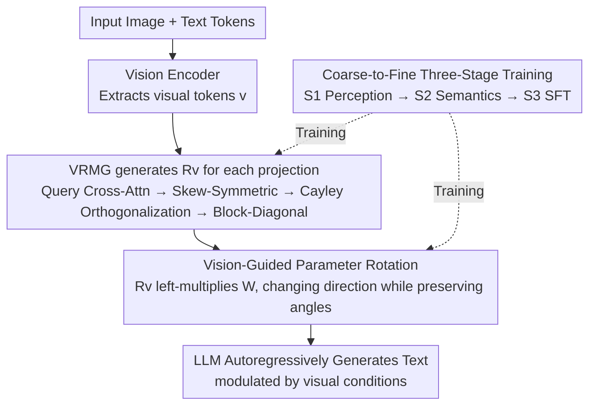

# ROSE: Rotate Your Large Language Model to See

**Conference**: CVPR 2026  
**Paper**: [CVF Open Access](https://openaccess.thecvf.com/content/CVPR2026/html/Yue_ROSE_Rotate_Your_Large_Language_Model_to_See_CVPR_2026_paper.html)  
**Code**: To be released (code and model weights pending)  
**Area**: Multimodal VLM / MLLM Efficiency / Parameter-space Vision Injection  
**Keywords**: MLLM, vision injection, parameter space, orthogonal rotation, Cayley transform, inference efficiency

## TL;DR
Instead of concatenating visual features as tokens into the LLM input (which causes long sequences, quadratic complexity, and dilutes language priors), this work encodes visual semantics into **orthogonal rotation matrices** that are directly left-multiplied onto the pre-trained weights of the LLM. This avoids context expansion and maintains the angular structure between parameters (i.e., language priors) through orthogonality. The resulting 7B ROSE model matches Qwen2.5-VL-7B across 12 multimodal benchmarks while reducing FLOPs by 80.7% and inference latency by 56.4%.

## Background & Motivation

**Background**: Current mainstream MLLMs (LLaVA series, Qwen-VL series) follow "input-space injection": a vision encoder extracts features → a projector maps them → they are concatenated with text tokens into a unified multimodal sequence → the sequence is processed jointly by the LLM.

**Limitations of Prior Work**: This approach incurs two inherent costs. First, **computational explosion**—visual encoding significantly lengthens the input context, and since LLMs have $O(n^2)$ quadratic complexity, higher resolutions or multi-image/long-video inputs become untenable due to latency and memory constraints. Second, **dilution of language priors**—visual tokens dominate the multimodal sequence, and parameter updates during training bias the LLM toward the visual domain, damaging its original linguistic capabilities.

**Key Challenge**: An ideal vision injection strategy must satisfy two principles: **computational efficiency** (escaping the quadratic complexity of visual tokens) and **preservation of pre-trained priors** (stronger LLMs consistently yield stronger MLLMs, so pre-trained knowledge must be retained). The "token concatenation" route naturally violates both. Existing efficiency optimizations (merging/compressing visual tokens, switching to smaller backbones) either lose fine-grained visual details or sacrifice inference/linguistic performance.

**Key Insight**: The authors conducted a crucial pilot experiment by retaining only the "direction" or only the "magnitude" of LLM parameter vectors layer-by-layer and measuring MMLU accuracy. They found that **semantic knowledge is primarily carried by the direction of the vectors** (direction-only: 67.3, magnitude-only: 56.7, adding noise dropped to 50.8, original: 71.2). This indicates that to inject visual semantics, one should modify the "direction"; to preserve pre-trained knowledge, one must maintain the **pairwise angles** between vectors (as angles characterize the mutual dependencies and geometric structure learned during pre-training).

**Core Idea**: In short: **encode visual signals into a vision-derived orthogonal matrix $R_v$ and left-multiply it onto the LLM's pre-trained weights to perform a "unified rotation."** The rotation changes the direction (injecting visual semantics), while orthogonality preserves the angles (maintaining language priors), all without adding any tokens to the input (avoiding quadratic complexity).

## Method

### Overall Architecture
ROSE moves vision injection from the "input space" to the "parameter space." Given an image, a vision encoder extracts visual tokens. A Vision-guided Rotation Matrix Generator (VRMG) generates a dedicated orthogonal matrix $R_v$ for each linear projection $W$ in the LLM. This $R_v$ left-multiplies all column vectors of $W$, rotating their directions according to the visual input. Consequently, the LLM performs text encoding and generation under "visual conditional modulation" without concatenating any visual tokens. Internally, the VRMG uses learnable queries to aggregate visual information via cross-attention. The output is reshaped into a skew-symmetric matrix, converted into an orthogonal matrix using the Cayley transform, and sparsified via block-diagonal structures to reduce complexity. The entire framework is trained end-to-end using a "vision-conditioned autoregressive language modeling loss" with a coarse-to-fine three-stage process (S1→S2→S3).

### Key Designs

**1. Vision-Guided Parameter Rotation: Injecting Semantics via Direction, Preserving Angles (Language Priors) via Orthogonality**

This is the theoretical cornerstone of the paper. For any linear projection $W=\{w_1,\dots,w_n\}\in\mathbb{R}^{d\times n}$ in the LLM, the forward pass is $z=W^\top x$. Each $w_i$ is uniquely determined by direction and magnitude, and pilot experiments proved semantics reside in direction. Thus, an orthogonal matrix $R_v$ is generated for each $W$ to perform a **unified rotation** of all column vectors: $z_v=(R_v W)^\top x$. This allows the vision to guide text encoding/generation without prepending visual tokens to the context, greatly reducing computation. Critically, "angle preservation" is guaranteed: for any pair $(w_i,w_j)$, the cosine similarity after rotation is:

$$\cos(R_v w_i, R_v w_j)=\frac{(R_v w_i)^\top(R_v w_j)}{\|R_v w_i\|\,\|R_v w_j\|}=\frac{w_i^\top (R_v^\top R_v) w_j}{\|w_i\|\,\|w_j\|}=\cos(w_i,w_j)$$

Since orthogonality ensures $R_v^\top R_v=I$ and $\|R_v w\|=\|w\|$. In other words, the rotation changes the direction of each vector (injecting vision) but keeps the pairwise angles between all vectors intact—and these angles represent the semantic geometric structure learned during pre-training. This is the mathematical reason why ROSE can inject vision without damaging language priors, distinguishing it from direct weight fine-tuning (which destroys both direction and angles).

**2. VRMG: Generating Orthogonal Matrices from Visual Features using Cayley Transform + Block-Diagonal Sparsification**

The VRMG (Vision-guided Rotation Matrix Generator) is responsible for creating a "valid orthogonal matrix $R_v$" determined by the vision. Process: a learnable query $q$ is assigned to each projection, aggregating information from the visual token sequence $v$ via cross-attention: $q=\mathrm{Attention}(W_Q^\top q, W_K^\top v, W_V^\top v)$. The query output is linearly mapped and reshaped into a lower triangular part $T_v$ to form a skew-symmetric matrix $P_v$ (lower triangle is $T_v$, upper triangle is $-T_v$, satisfying $P_v=-P_v^\top$). This is then converted into an orthogonal matrix using the **Cayley transform**:

$$R_v=(I+P_v)(I-P_v)^{-1}$$

The Cayley transform of a skew-symmetric matrix is guaranteed to be orthogonal. However, $P_v$ is determined by $\frac{d(d-1)}{2}$ parameters. Since $d$ (LLM hidden/intermediate dimension) is large, direct mapping is computationally prohibitive. Therefore, VRMG **sparsifies $R_v$ into a block-diagonal matrix** $R_v=\mathrm{diag}(R_v^1,\dots,R_v^r)$, where each sub-block of size $d/r$ is independently orthogonal. This reduces complexity from $O(d^2)$ to $O(d^2/r)$. In the paper, each $R_v$ is split into 64 sub-blocks.

**3. Coarse-to-Fine Three-Stage Training: Learning Discriminative Rotations**

The model is based on Qwen2.5-7B + SigLIP2. VRMG is **inserted every 4 layers** (${\approx}200$M extra parameters). Within each equipped layer, 7 projections ($W_q, W_k, W_v, W_o$ in attention and $W_{up}, W_{down}, W_{gate}$ in FFN) are each assigned a set of $r$ queries. Training uses a vision-conditioned autoregressive loss $\mathcal{L}_{LM}=-\sum_t \log P(y_t\mid y_{<t};\theta(v))$, where $\theta(v)$ represents LLM parameters modulated by vision $v$. The stages are: **S1 Perception Pre-training** (60M LAION-2B pairs for basic concepts, updating only VRMG); **S2 Semantic Pre-training** (90M fine-grained pairs from DataComp-1B re-captioned by Qwen2.5-VL-7B, unfreezing the vision encoder and VRMG); **S3 Supervised Fine-Tuning** (end-to-end full parameter tuning on FineVision 24.3M samples).

## Key Experimental Results

### Main Results
Evaluation across 12 multimodal benchmarks. FLOPs in T, Latency in ms (single H20 GPU).

| Model | Size | FLOPs↓ | Latency↓ | Avg↑ |
|------|------|------|------|------|
| LLaVA-OV-0.5B | ≤4B | 9.3 | 196.2 | 54.0 |
| Qwen2-VL-2B | ≤4B | 3.7 | 149.0 | 65.0 |
| Qwen2.5-VL-3B | ≤4B | 11.0 | 239.4 | 71.8 |
| LLaVA-OV-7B | ≥7B | 62.9 | 635.3 | 71.6 |
| Qwen2-VL-7B | ≥7B | 10.0 | 242.5 | 73.1 |
| Qwen2.5-VL-7B | ≥7B | 19.2 | 333.4 | **76.0** |
| **ROSE-7B (Ours)** | 7B | **3.7** | **145.1** | 74.5 |

ROSE-7B achieves an Avg of 74.5, comparable to Qwen2.5-VL-7B (76.0), but with only 3.7T FLOPs (**80.7% reduction**) and 145.1ms latency (**56.4% reduction**). Its FLOPs and latency are even lower than 2B-level small models while outperforming them by 9.5%+.

**Computational Scalability**: Scaling the visual sequence length from 512 to 32,768, ROSE's FLOPs, memory, and latency increase only **linearly and minimally** because visual information enters the parameter space rather than the context. In contrast, input-space models (Qwen-VL) surge due to $O(n^2)$ complexity.

**Language Prior Preservation**: In 5 language benchmarks, the ROSE-style architecture maintains performance **on par** with the original Qwen2.5-7B, significantly outperforming the LLaVA-style training, while requiring only **30% of the training time** and **13.8% of the inference FLOPs**.

### Ablation Study

| Configuration | Metric (4-bench Avg) | Note |
|------|---------|------|
| VRMG Layers = 9 | Optimal | Best balance among {6, 9, 12, 18} |
| Placement: **Uniform** | **66.1** | Uniform distribution across depths is most stable |
| Sub-blocks $r$ = **64** | **66.1** | Smaller $r$ is more precise but increases parameters significantly |
| Sub-layer: **Both** | **66.1** | Attn is more critical than FFN for token interaction |

### Key Findings
- **Direction carries semantics, angles carry priors**: The pilot experiment proves that "rotation" is the ideal operation to inject vision without harming language, as it modifies direction while preserving vector norms and pairwise angles.
- **Computation does not explode with visual tokens**: This is the greatest practical advantage of ROSE, particularly for high-resolution, multi-image, and long-video scenarios.
- **Scalability**: Cognition tasks benefit more from S1 perception data (world knowledge), while perception tasks benefit more from S2 semantic data (fine-grained alignment).

## Highlights & Insights
- **Reframing Vision Injection as Parameter Rotation**: While most MLLMs focus on *what* to add to the input, ROSE changes *how* the LLM parameters rotate, bypassing quadratic complexity entirely.
- **Orthogonality as a Mathematical Guarantee**: Using the Cayley transform ensures that angle preservation is a built-in property rather than a soft constraint like a regularization term.
- **Block-Diagonal Sparsification is Key for Deployment**: Reducing complexity from $O(d^2)$ to $O(d^2/r)$ makes the parameter-space injection feasible at the 7B scale.

## Limitations & Future Work
- **VRMG Overhead**: The generation and inversion of matrices $(I-P_v)^{-1}$ for every image introduces additional online overhead, though the paper argues the net benefit is massive.
- **Block-Diagonal Constraints**: Restricting $R_v$ to a block-diagonal form means rotations across sub-blocks cannot be expressed.
- **Not yet the Absolute SOTA**: ROSE prioritizes the "comparable accuracy + significant efficiency" trade-off and has not yet surpassed the absolute highest scores of the strongest contemporary models.

## Related Work & Insights
- **vs LLaVA / Qwen-VL (Input-space injection)**: These models prepend tokens to context, suffering from $O(n^2)$ complexity. ROSE uses parameter rotation to reduce FLOPs by up to 20x.
- **vs Token Merging/Pruning**: These methods reduce complexity by discarding tokens, which can lose fine-grained details. ROSE instead changes how information is communicated to the LLM.
- **vs Smaller Backbones**: Downsizing LLMs sacrifices reasoning/language capability; ROSE freezes the structural relations of a large LLM to keep language performance intact.

## Rating
- Novelty: ⭐⭐⭐⭐⭐ 
- Experimental Thoroughness: ⭐⭐⭐⭐ 
- Writing Quality: ⭐⭐⭐⭐ 
- Value: ⭐⭐⭐⭐⭐ 

<!-- RELATED:START -->

## Related Papers

- [\[CVPR 2026\] Learning to See through Illumination Extremes with Event Streaming in Multimodal Large Language Models](learning_to_see_through_illumination_extremes_with_event_streaming_in_multimodal.md)
- [\[CVPR 2026\] See What I Mean: Aligning Vision and Language Representations for Video Fine-grained Object Understanding](see_what_i_mean_aligning_vision_and_language_representations_for_video_fine-grai.md)
- [\[CVPR 2026\] CaptionQA: Is Your Caption as Useful as the Image Itself?](captionqa_is_your_caption_as_useful_as_the_image_itself.md)
- [\[CVPR 2026\] See Less, See Right: Bi-directional Perceptual Shaping For Multimodal Reasoning](see_less_see_right_bi-directional_perceptual_shaping_for_multimodal_reasoning.md)
- [\[CVPR 2026\] TransPrune: Token Transition Pruning for Efficient Large Vision-Language Model](transprune_token_transition_pruning_for_efficient_large_vision-language_model.md)

<!-- RELATED:END -->
