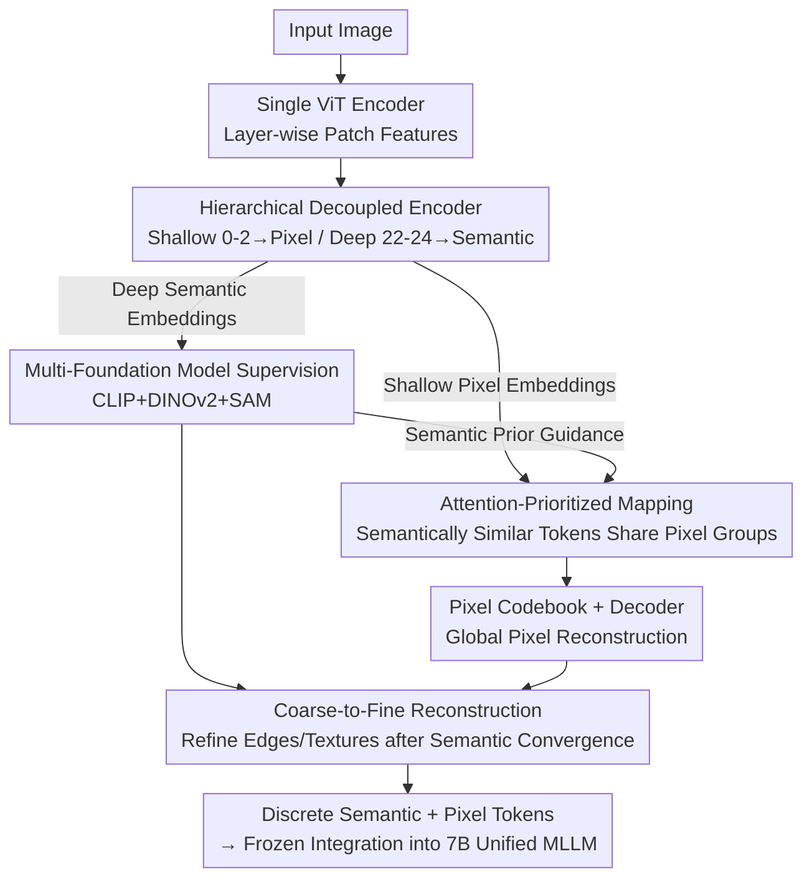

# Rosetta Stone for Unified MLLMs: A Unified Tokenizer to Decipher Understanding and Generation

**Conference**: CVPR 2026  
**Paper**: [CVF Open Access](https://openaccess.thecvf.com/content/CVPR2026/html/Sun_Rosetta_Stone_For_Unified_MLLMs_A_Unified_Tokenizer_to_Decipher_CVPR_2026_paper.html)  
**Code**: None  
**Area**: Multimodal VLM  
**Keywords**: Unified visual tokenizer, Understanding and generation unification, Discrete codebook, Attention-prioritized mapping, Hierarchical decoupling

## TL;DR
To address the long-standing conflict between reconstruction and semantic tasks in unified visual tokenizers, the authors employ **hierarchical decoupling in a single encoder** (shallow layers for pixel reconstruction, deep layers for semantic alignment) + **supervision from multiple foundation models** (CLIP/DINOv2/SAM) + **dual codebooks with attention-prioritized mapping** + **coarse-to-fine reconstruction guided by converged semantics**. This achieves an rFID of 0.33 and zero-shot accuracy of 80.9% on ImageNet, while the resulting 7B unified MLLM outperforms TokenFlow-13B by 3.1% in understanding.

## Background & Motivation

**Background**: To simultaneously perform multimodal understanding and generation within an autoregressive (next-token prediction) framework, the key is a "unified visual tokenizer" that encodes images into discrete tokens. Prevailing methods (VILA-U, TokenFlow, UniTok, QLIP, etc.) mostly rely on two pretext tasks—**pixel reconstruction** and **feature alignment** (contrastive learning)—to train the tokenizer.

**Limitations of Prior Work**: Existing feature extractors have inherent weaknesses: contrastive features like CLIP **lack low-level, fine-grained details**, while VAE-style features **lack high-level semantics**. Consequently, many methods resort to "stitching" two separate tokenizers (CLIP for understanding, VAE for generation), preventing true interoperability and mutual gains between high-level semantics and low-level details.

**Key Challenge**: The authors identify the root cause within the tokenizer training phase itself—**the embedding spaces of reconstruction and semantic tasks are naturally inconsistent**. Semantic spaces are compact and structured, whereas pixel spaces are vast and require reconstructing massive details. The optimization directions of these two proxy tasks are thus misaligned. By tracking the index changes of both codebooks (using normalized Hamming distance), the authors found that **the semantic codebook converges quickly, while the pixel codebook converges slowly with radical index jumping**, causing the reconstruction task to drain training resources and harm semantics. Thus, the pixel codebook becomes the true bottleneck.

**Key Insight**: Using the CKNNA metric to analyze feature similarities between different layers of foundation models and VQGAN (reconstruction space) / Qwen vision encoders (understanding space), the authors made two key observations: ① **Shallow layers** of CLIP are closer to the generation/reconstruction space than its deep layers, and models with strong segmentation capabilities like DINOv2 and SAM **naturally align better with the reconstruction space**; ② However, CLIP remains superior for downstream semantic tasks (linear probing, VQA). This inspired the authors: **a single layer should not be tasked with both reconstruction and semantics; instead, the two tasks should be decoupled across hierarchies and supervised by visual features with varying attributes**.

**Core Idea**: Conflictual proxy tasks are **hierarchically decoupled** within a single encoder (shallow layers for reconstruction, deep layers for semantics). Multiple foundation models are used for rich semantic supervision, and the converged strong semantic prior is used to **guide** the pixel branch, reframing "adversarial" optimization goals into "synergistic" ones.

## Method

### Overall Architecture

The input is an image, and the goal is to encode it into a sequence of **discrete semantic tokens + discrete pixel tokens**, ensuring high-quality reconstruction (generation) and strong semantic representation (understanding). The pipeline consists of: a single ViT encoder that outputs layer-wise patch features → an **aggregation neck** that pools shallow layers (0–2) into pixel embeddings and deep layers (22–24) into semantic embeddings → semantic embeddings look up the **semantic codebook** under multi-target supervision (CLIP/DINOv2/SAM), while pixel embeddings use **attention-prioritized mapping** to look up the **pixel codebook** for decoder-based reconstruction → once the semantic branch nears convergence, it provides **coarse-to-fine** refinement supervision for the reconstruction. Finally, this frozen tokenizer is integrated into LLaMA-2-7B to form a unified MLLM.

### Key Designs

**1. Hierarchical Decoupled Single Encoder: Specialized Layers in a Shared Tower**

To address the "overburdening" of single-encoder last layers and the "poor interaction/high cost" of dual-encoder systems (like TokenFlow), the authors utilize a **single** ViT-L encoder (initialized from CLIP-ViT-L) with hierarchical labor division: shallow layers handle pixels, and deep layers handle semantics. Specifically, the forward pass is defined as $z_{sem} = f_{sem}(h_{22}, h_{23}, h_{24})$ and $z_{pix} = f_{pix}(h_0, h_1, h_2)$, where $h_l$ is the patch sequence output of layer $l$, $f$ is a lightweight CNN-style aggregation neck, and $z$ is the embedding for quantization. This design ensures tasks are assigned based on the intrinsic properties of layer features. Ablations show this improves MME-P by +35.9 points, zero-shot accuracy by +2.5%, and rFID by −0.64.

**2. Multi-Foundation Model Supervision: Beyond CLIP to CLIP+DINOv2+SAM**

Relying solely on contrastive models like CLIP results in insufficient reconstruction capabilities (most layers except shallow ones have significantly lower reconstruction similarity compared to SAM or DINOv2), leading to blurry details. The authors supervise the semantic branch with three complementary features: CLIP (structured high-level semantics for VQA/OCR), DINOv2 (fine-grained analysis), and SAM (strong low-level/segmentation details). Lightweight MLPs project quantized semantic embeddings to match these targets: $o_{mod} = \text{MLP}_{mod}(\tilde{z}_{sem})$, where $mod \in \{\text{DINO}, \text{CLIP}, \text{SAM}\}$. A combination of cosine loss and L1 loss (for spatial feature magnitudes) is used for patches, while only cosine loss is used for the CLS token:

$$L_S = \sum_{mod}\big[L_{cos}(o_{mod}, T_{mod}) + L_1(o_{mod}, T_{mod})\big]_{\text{patch}} + \sum_{mod} L_{cos}(o_{mod}, T_{mod})_{\text{cls}}$$

Ablations demonstrate that switching from CLIP-only to triple-model supervision improves zero-shot accuracy by +4.9% and reduces rFID by −2.52.

**3. Attention-Prioritized Mapping: Offloading the Pixel Codebook via Semantic Similarity**

To solve the slow convergence and index jumping of the pixel codebook, the authors allow **semantically similar patches to share a set of pixel sub-codebooks**, compressing the search space. The semantic codebook $C_{sem}\in\mathbb{R}^{N\times d}$ is expanded into grouped pixel codebooks $C_{pix}\in\mathbb{R}^{N\times m\times d}$ (where $m=2$). Token similarity $A$ is derived from the attention module keys: $sim(i,j) = \frac{k_i\cdot k_j}{\|k_i\|\|k_j\|}$. A DFS with threshold $\tau=0.7$ groups tokens into $M=\{M_1,\dots,M_j\}$. Each token group finds its semantic indices $S_j$ and concatenates the corresponding pixel sub-codebooks:

$$C^j_{pix} = \text{concat}\big(C^{idx}_{pix}\ \text{for}\ idx\ \text{in}\ S_j\big)$$

Each patch token performs neighbor lookup in the concatenated $C^j_{pix}$, ensuring semantic neighbors map to adjacent pixel code groups. This provides semantic priors while allowing the model to focus on fine-grained pixel details, significantly mitigating pixel index drift.

**4. Coarse-to-Fine Reconstruction: Semantic Guidance for Detail Refinement**

The authors observed that global structures are well-reconstructed, but fine-grained details (edges, textures) are often blurry. Since the converged semantic branch already possesses segmentation-level awareness (aligned with DINO/SAM), it can supervise detail reconstruction with **low overhead**. A refinement loss is added: $L_F = \sum_{mod}\|\text{MLP}_{mod}(f_{sem}(E(x))) - T_{mod}(\hat{x})\|_2^2$, where $mod\in\{\text{DINO}, \text{SAM}\}$. This aligns the DINO/SAM features extracted from the reconstructed image $\hat{x}$ with those of the original image $x$ in the feature space. This term is introduced at 0.5 epoch, further reducing rFID by 0.16.

### Loss & Training

Global pixel reconstruction follows standard practice: $L_R = L_2(x,\hat{x}) + L_P(x,\hat{x}) + \lambda_G L_G(\hat{x}) + L_{VQ}$, where $L_P$ is LPIPS loss, $L_G$ is adversarial loss, and $L_{VQ} = \|\text{sg}[\hat{z}_{pix}] - z_{pix}\|_2^2 + \beta\|\hat{z}_{pix} - \text{sg}[z_{pix}]\|_2^2$ is the commitment loss. The total loss follows a two-stage strategy:

$$L_{total} = \begin{cases} L_S + L_R, & \text{Early Training} \\ L_S + L_R + L_F, & \text{After Semantic Convergence} \end{cases}$$

Training config: ViT-L backbone for the tokenizer, trained on 100M COYO image-text pairs for 1 epoch. Semantic codebook size 32768, pixel codebook 65536. Unified MLLM uses LLaMA-2-7B with a frozen tokenizer.

## Key Experimental Results

### Main Results: Tokenizer and Unified MLLM

The tokenizer leads in both reconstruction and zero-shot accuracy on ImageNet, with further gains at 384 resolution:

| Type | Model | Res | rFID ↓ | PSNR ↑ | SSIM ↑ | Zero-shot Acc ↑ |
|------|------|--------|--------|--------|--------|--------------|
| Unified | VILA-U | 256 | 1.80 | − | − | 73.3 |
| Unified | TokenFlow | 256 | 1.37 | 21.41 | 0.687 | − |
| Unified | UniTok | 256 | 0.38 | − | − | 78.6 |
| Semantic | SigLIP | 256 | − | − | − | 80.5 |
| **Ours** | **Ours** | **256** | **0.33** | **25.17** | **0.822** | **80.9** |
| **Ours** | **Ours** | **384** | **0.17** | **28.02** | **0.878** | **81.4** |

When integrated into a unified MLLM (LLaMA-2-7B, 256 res), Ours achieves SOTA among discrete models, even surpassing the larger TokenFlow-13B:

| Type | Method | LLM | SEEDB | GQA | MME-P | POPE | TextVQA | AI2D | MMMU | Avg |
|------|------|-----|-------|-----|-------|------|---------|------|------|-----|
| Discrete | VILA-U | 7B | 56.3 | 58.3 | 1336.2 | 83.9 | 48.3 | − | − | − |
| Discrete | TokenFlow-L | 13B | 62.6 | 60.3 | 1365.4 | 85.0 | 54.1 | 56.6 | 34.4 | 60.18 |
| Discrete | **Ours** | **7B** | **65.6** | **63.2** | **1442.6** | **86.8** | **56.2** | **60.4** | **38.3** | **63.23** |

### Ablation Study

Steadily adding components to the baseline (CLIP-L encoder + CNN-VAE) shows consistent benefits for both reconstruction and understanding:

| Config | MME-P ↑ | POPE ↑ | SEED ↑ | GQA ↑ | rFID ↓ | Acc ↑ |
|------------------|---------|--------|--------|-------|--------|-------|
| Baseline | 1209.1 | 76.5 | 54.9 | 43.2 | 3.97 | 71.2 |
| + Multi-Foundation Supervision | 1331.5 | 81.6 | 59.1 | 54.5 | 1.45 | 76.1 |
| + Hierarchical Decoupling | 1367.4 | 83.9 | 62.3 | 58.9 | 0.81 | 78.6 |
| + Attn-Prioritized Mapping | 1384.2 | 85.6 | 63.6 | 61.6 | 0.49 | 80.6 |
| + Coarse-to-Fine (Full) | 1387.3 | 85.3 | 63.5 | 61.6 | 0.33 | 80.9 |

### Key Findings
- **Multi-model supervision is the biggest contributor**: It slashes rFID from 3.97 to 1.45 and raises accuracy from 71.2 to 76.1, proving CLIP-only alignment is a clear bottleneck.
- **Synergistic improvements**: Every component improves both rFID and zero-shot accuracy, proving the design successfully harmonized the two objectives.
- **Smaller models can win**: The 7B unified MLLM outperforms the 13B TokenFlow, attributing gains to the tokenizer rather than parameter counts.

## Highlights & Insights
- **Attributes as First-Class Citizens**: Rather than arbitrary division, the authors diagnosed layer-wise properties (CKNNA analysis) to map shallow layers to pixels and deep layers to semantics.
- **Elegant Attention-Prioritized Mapping**: By reusing encoder keys for grouping (zero extra parameters), it compresses the search space and stabilizes the pixel codebook.
- **Semantic Refinement via Time-Lag**: Introducing $L_F$ only after semantic convergence effectively utilizes the semantic branch as an "in-house" DINO/SAM supervisor for fine details.

## Limitations & Future Work
- **High Resource Requirements**: Training on 100M COYO pairs and MLLM training on nearly 100M diverse samples suggests high reproduction costs.
- **Engineering Complexity**: Simultaneously running CLIP, DINOv2, and SAM during training involves sequence interpolation and increased pipeline complexity.
- **Generation Evaluation**: Relies heavily on proxy metrics (gFID, GenAI-Bench); human evaluation is less emphasized.
- **Threshold Sensitivity**: The rationale for hyperparameters like $\tau=0.7$ is relatively brief; adaptive thresholds could be an improvement.

## Related Work & Insights
- **vs TokenFlow**: TokenFlow uses dual encoders and hard-links semantic-pixel indices; Ours uses hierarchical decoupling in a single encoder with flexible attention-prioritized mapping, achieving better results with fewer parameters.
- **vs VILA-U / UniTok**: These models force the final layer to handle both tasks; Ours relieves this pressure via hierarchical specialization.
- **vs DualToken**: While DualToken also uses shallow/deep division, it lacks multi-source supervision and formal attribute analysis.

## Rating
- Novelty: ⭐⭐⭐⭐ (Solid analysis-driven architecture)
- Experimental Thoroughness: ⭐⭐⭐⭐⭐ (Broad benchmarks and granular ablations)
- Writing Quality: ⭐⭐⭐⭐ (Clear logic, though some hyperparameter choices are brief)
- Value: ⭐⭐⭐⭐ (Provides a scalable solution for unified multimodal tokenization)

<!-- RELATED:START -->

## Related Papers

- [\[CVPR 2026\] AToken: A Unified Tokenizer for Vision](atoken_a_unified_tokenizer_for_vision.md)
- [\[CVPR 2026\] UniCompress: Token Compression for Unified Vision-Language Understanding and Generation](unicompress_token_compression_for_unified_vision-language_understanding_and_gene.md)
- [\[CVPR 2026\] OneCAT: Decoder-Only Auto-Regressive Model for Unified Understanding and Generation](onecat_decoder-only_auto-regressive_model_for_unified_understanding_and_generati.md)
- [\[CVPR 2026\] HBridge: H-Shape Bridging of Heterogeneous Experts for Unified Multimodal Understanding and Generation](hbridge_h-shape_bridging_of_heterogeneous_experts_for_unified_multimodal_underst.md)
- [\[NeurIPS 2025\] UniTok: A Unified Tokenizer for Visual Generation and Understanding](../../NeurIPS2025/multimodal_vlm/unitok_a_unified_tokenizer_for_visual_generation_and_understanding.md)

<!-- RELATED:END -->
