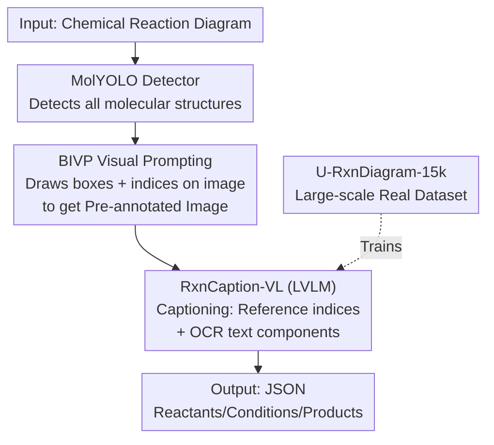

# RxnCaption: Reformulating Reaction Diagram Parsing as Visual Prompt Guided Captioning

**Conference**: CVPR 2026  
**Paper**: [CVF Open Access](https://openaccess.thecvf.com/content/CVPR2026/html/Song_RxnCaption_Reformulating_Reaction_Diagram_Parsing_as_Visual_Prompt_Guided_Captioning_CVPR_2026_paper.html)  
**Code**: https://github.com/opendatalab/RxnCaption  
**Area**: Multimodal VLM  
**Keywords**: Chemical Reaction Diagram Parsing, Visual Prompt, Large Vision-Language Model, Information Extraction, AI for Chemistry

## TL;DR
RxnCaption reformulates "Reaction Diagram Parsing (RxnDP)" from predicting molecular bounding box coordinates to an "image captioning" task. It utilizes a specialized molecular detector, MolYOLO, to pre-annotate molecular boxes and indices on the diagram, allowing the LVLM to describe reactions by simply referencing these indices in natural language. Combined with the newly created U-RxnDiagram-15k real-world dataset, it achieves SOTA performance across multiple metrics.

## Background & Motivation

**Background**: Chemical reaction data is the lifeblood of AI for Chemistry, but vast amounts of high-quality reactions are buried in literature as "reaction diagrams" that machines cannot read. The task of RxnDP is to take a reaction diagram as input and output all reactions within it, where each reaction contains three roles: reactants, conditions, and products. Humans naturally read such diagrams in three steps: ① detecting molecular structures (bounding boxes); ② assembling reactions (combining molecular boxes and text conditions into full reactions and assigning roles); ③ post-processing (OCSR to convert molecular boxes to SMILES, and OCR for text conditions).

**Limitations of Prior Work**: Previous deep learning methods (RxnScribe using Pix2Seq, RxnIM introducing LVLMs for the first time) adopt a "Bbox and Role in One Step" (BROS) strategy—requiring the model to **simultaneously** predict molecular box coordinates and roles. However, even with massive synthetic training data, RxnIM shows limited improvement over RxnScribe and generalizes poorly to out-of-distribution (OOD) samples. Large Vision-Language Models (LVLMs) have yet to achieve the breakthroughs seen in other domains within this field.

**Key Challenge**: The authors conducted a crucial pilot study. They first tasked GPT-4o / Gemini-2.5-Pro / Qwen-VL-Max with zero-shot RxnDP under the BROS setting; the results were poor (Gemini F1 only 35.4, GPT-4o only 0.3). However, when they rephrased the task as VQA—asking "how many reactions are in the diagram" or "is there a cyclic structure"—the models responded accurately (Gemini accuracy 75.9%). This indicates that LVLMs **understand** reaction diagrams and possess domain knowledge; the true bottleneck is **forcing them to predict precise bounding box coordinates**, as coordinate regression is not a natural strength of LVLMs.

**Goal**: Rather than forcing an LVLM to learn a skill it lacks (coordinate prediction) during fine-tuning, the goal is to design a prediction strategy that leverages its inherent capabilities (natural language description), while addressing the data shortage with a real-world, large-scale, and layout-diverse RxnDP dataset.

**Core Idea**: Replace "box regression" with "image captioning." Treat the heavy lifting of molecular detection as a separate task for a specialized detector, MolYOLO. By overlaying boxes and indices directly onto the image as **visual prompts**, the LVLM only needs to reference these indices to describe the reactions in natural language—this is the "BBox and Index as Visual Prompt" (BIVP) strategy.

## Method

### Overall Architecture
The core of RxnCaption is the reformulation of RxnDP from a coordinate prediction problem into an image captioning problem. The entire pipeline consists of two serial stages: **Stage 1** uses the self-developed molecular detector MolYOLO to detect all molecular structures in the image and pre-annotate the original image with bounding boxes and indices, resulting in a "pre-annotated image." **Stage 2** feeds this pre-annotated image into the fine-tuned LVLM (RxnCaption-VL). For **molecular components**, the model merely references the indices on the diagram; for **text components**, it directly extracts the content and assigns roles, ultimately outputting each reaction's reactants/conditions/products in JSON format. This allows the LVLM to work entirely within the natural language space, bypassing coordinate regression. To support this framework, the authors also solved two foundational issues: ensuring detector accuracy (via MolYOLO + MolDet-33k dataset) and ensuring training data authenticity and diversity (via U-RxnDiagram-15k dataset).

### Key Designs

**1. BIVP Strategy: Decoupling coordinate regression from LVLM to "captioning" via index referencing**

This is the primary motivation of the work. The pilot study proved that while LVLMs understand reaction diagrams (high VQA accuracy), they fail when directly outputting molecular box coordinates (BROS) (Gemini F1 35.4 → jumps to 81.0 when fed Ground Truth boxes via BIVP). The BIVP approach is straightforward: ① Pre-annotate bounding boxes for every molecular component; ② Add index numbers next to the boxes. LVLMs no longer need to "generate" coordinates but instead "reference" existing indices, converting a visual localization problem into a pure natural language description problem. During training, ground truth boxes are used for components within reactions, and MolYOLO boxes for those outside; during inference, the pipeline relies entirely on MolYOLO boxes. This design aligns with LVLM strengths (language generation, multimodal understanding) rather than their weaknesses (precise coordinate regression).

**2. MolYOLO: A high-precision specialized molecular detector as the prerequisite for BIVP**

BIVP outsources "drawing boxes," but it requires those boxes to be accurate—incorrect indices lead to downstream failure. Existing detectors (YoDe, MolDetect) lack sufficient precision for this task (Table 2 shows MolDetect P/R at only 0.84/0.77). Based on the YOLOv10-M architecture, the authors trained MolYOLO on the self-built MolDet-33k dataset (comprising ~3,000 organic chemistry papers, 219,721 professionally annotated molecular boxes, across 12,209 page-level and 21,155 image/table-level images) combined with YoDe data. MolYOLO achieves P/R of 0.98 on MolDet-33k-test, significantly outperforming others. Ablation (Table 5) confirms that detector quality directly determines the upper bound: replacing the weakest detector (YoDe) with MolYOLO on RxnScribe-test increases the Hybrid-F1 by 18.9 points (53.3 → 72.2).

**3. U-RxnDiagram-15k: Breaking the "synthetic data domain shift" bottleneck with real literature data**

Data is the other pillar. Previously, the RxnScribe dataset was real but contained only 1,378 samples, while the larger RxnIM dataset was synthetic and exhibited significant domain shift from real images (t-SNE visualization shows RxnIM barely overlaps with real data). This explains why RxnIM’s performance stagnated despite more data. The authors constructed U-RxnDiagram-15k via a four-step pipeline: ① Molecular structure annotation (using MolDet-33k boxes) → ② Reaction region annotation (using irregular polygons) → ③ Component role annotation (assigning roles following RxnScribe norms) → ④ Text content extraction (automated via Gemini-2.5-Pro for training, manually annotated for validation). The resulting training set of 15,128 images and 45,426 reactions is an order of magnitude larger than RxnScribe. The test set was specifically balanced with 100 images each for four layouts: Single-line, Multi-line, Tree, and Cyclic, avoiding the 50% simple single-line bias of RxnScribe-test.

### Mechanism
Consider a reaction diagram with two reactions: ① MolYOLO scans the image, detecting all molecular structures, drawing boxes, and numbering them ①②③④⑤; ② BIVP passes this indexed, pre-annotated image to RxnCaption-VL; ③ Instead of calculating coordinates, the model "reads and describes": identifying indices ① and ② as reactants, ③ as a product, and the adjacent text "Pd(PPh₃)₄, 80°C" as a condition (directly extracted via OCR), assembling the first reaction; the second reaction is processed similarly; ④ Finally, results are output as structured JSON like `{reactants:[1,2], conditions:["Pd(PPh3)4, 80°C"], products:[3]}`. Throughout, the LVLM only references indices and transcribes text in the language space, never generating pixel coordinates.

### Loss & Training
RxnCaption-VL is fine-tuned from a Qwen2.5-VL-7B base. The training set expands RxnScribe-train from 1,240 to 3,720 images for balance and merges it with 15,000 images from U-RxnDiagram-15k-train, with 2x augmentation for unconventional directions (reversible, right-to-left, bottom-to-top), totaling 23,432 images. Optimization uses AdamW with a peak learning rate of $1\times10^{-5}$, cosine decay, and a linear warm-up for the first 5%. Training was conducted on 8 A100 GPUs with a per-device batch size of 1 plus 16-step gradient accumulation (effective batch size 128), using DeepSpeed ZeRO-2 for full-parameter updates over 5 epochs. MolYOLO was trained using SGD (momentum 0.937, weight decay $5\times10^{-4}$) at a constant learning rate of 0.01 for 30 epochs with 1024×1024 input.

## Key Experimental Results

Evaluation follows the RxnScribe instance matching framework, distinguishing between two metric sets: **SoftMatch** (molecular box IoU ≥ 0.5, excluding text components) and **HybridMatch** (stricter; requires exact molecular box index matching, identical reactant/product text, and a condition text normalized edit distance ≤ 0.2). Note that BIVP's HybridMatch is inherently more rigorous than BROS.

### Main Results

| Test Set | Metric | RxnCaption-VL (BIVP) | Gemini-2.5-Pro (BIVP) | RxnScribe official | RxnIM |
|--------|------|----------------------|------------------------|--------------------|-------|
| RxnScribe-test | Hybrid-F1 | **72.2** | 49.8 | 69.1 | 70.5 |
| RxnScribe-test | Soft-F1 | **86.2** | 76.1 | 80.0 | 76.9 |
| U-RxnDiagram-15k-test | Hybrid-F1 | **59.8** | 40.4 | 34.9 | 37.4 |
| U-RxnDiagram-15k-test | Soft-F1 | **70.4** | 66.6 | 45.9 | 40.5 |

On the more challenging U-RxnDiagram-15k-test, RxnCaption-VL outperforms the strongest competitor, Gemini-2.5-Pro (BIVP), by 19.4 points in Hybrid-F1 and 3.8 points in Soft-F1. Notably, Gemini-2.5-Pro with BIVP is the strongest among all general-purpose LVLMs.

**BROS vs BIVP (Controlled comparison of model and data)**:

| Test Set | Strategy | Hybrid-F1 | Soft-F1 |
|--------|------|-----------|---------|
| RxnScribe-test | BIVP | **72.2** | **86.2** |
| RxnScribe-test | BROS | 69.2 | 76.2 |
| U-RxnDiagram-15k-test | BIVP | **59.8** | **70.4** |
| U-RxnDiagram-15k-test | BROS | 57.2 | 66.9 |

With identical training data, simply switching strategies to BIVP improves Soft-F1 by a full 10.0 points on RxnScribe-test. All general LVLMs nearly failed under BROS (Qwen2.5-VL-72B BROS Hybrid-F1 was only 1.6, but reached 50.1 with BIVP), validating the judgment that "coordinate regression is not an LVLM strength."

### Ablation Study

**Detector Impact (Table 5, Ours / RS=RxnScribe-test)**:

| Detector | RS Hybrid-F1 | RS Soft-F1 |
|--------|--------------|------------|
| YoDe | 53.3 | 61.5 |
| MolDetect | 70.8 | 84.4 |
| MolYOLO | **72.2** | **86.2** |

**Error Attribution (Table 6, Locating the stage bottleneck)**:

| Configuration | RS Hybrid-F1 | RC-15k Hybrid-F1 | Note |
|------|--------------|------------------|------|
| MolYOLO (Standard pipeline) | 72.2 | 59.8 | Full two-stage process |
| GT bbox + MolYOLO | 73.4 (+1.2) | 63.8 (+4.0) | Perfect recall boxes provide limited gain |
| Ideal Extractor (Stage 2 perfect) | 99.7 | 95.3 | Upper bound determined by detector |

### Key Findings
- **The bottleneck lies in Stage 2 LVLM inference, not the detector**: Using perfect ground truth boxes yielded marginal gains (+1.2 on RS), indicating MolYOLO is already sufficiently accurate. The real constraint is reaction extraction (role assembly). Conversely, an ideal Stage 2 would push performance to 99.7/95.3; thus, future improvements should focus on LVLM reasoning.
- **Real Data > Synthetic Data**: Although RxnIM was trained on 38x more images than RxnScribe and 4x more than this work, its performance is significantly worse—Soft-F1 on U-RxnDiagram-15k-test is 5.4 points lower than official RxnScribe and 29.9 points lower than RxnCaption-VL. Domain shift in synthetic data remains a major hurdle.
- **Dataset quality matters**: Retraining RxnScribe (still using BROS) on U-RxnDiagram-15k improved its Hybrid-F1 by 12.5 points on its test set, but it still falls behind RxnCaption-VL due to the Pix2Seq capacity and the limitations of the BROS strategy.

## Highlights & Insights
- **The methodology of "reformulating tasks rather than teaching new skills" is highly transferable**: When a strong model underperforms, one should first use VQA to probe if it "can't do it" or if the "prompting approach is wrong." This work discovered that LVLMs understand diagrams but cannot draw boxes, leading to a design that outsources weaknesses to specialized detectors and focuses on language strengths—a strategy applicable to any scenario requiring LLMs to perform precise localization.
- **Clever use of visual prompts as a human-machine interface**: Overlapping bounding boxes and indices directly on images provides the LVLM with a "deictic vocabulary," allowing it to reference visual objects precisely with language and bypass unfriendly coordinate output spaces.
- **Clean error attribution experimental design**: By using "Ground Truth boxes" and an "Ideal Extractor," the authors cleanly decoupled the contributions and bottlenecks of each stage, explicitly pointing out where future research should be directed.

## Limitations & Future Work
- Performance is heavily dependent on the Stage 1 detector: Detection errors propagate directly to downstream index referencing; if a box is missed or incorrect, the molecule cannot be parsed (the authors admit MolYOLO is the prerequisite for BIVP's success).
- The primary bottleneck remains LVLM reasoning for reaction extraction (role assembly), with significant room for improvement in complex layouts (Tree/Cyclic)—an ideal extractor would raise performance from 59.8 to 95.3.
- ⚠️ The current framework splits the task into "detection → captioning," meaning the final SMILES recognition (OCSR) is a post-processing step; the end-to-end degree is limited. OCR quality for text components (automated via Gemini) may also introduce noise.
- Future directions: Integrating molecular detection and reaction extraction for tighter joint optimization, or enabling self-correction/verification capabilities in LVLMs to mitigate reasoning bottlenecks.

## Related Work & Insights
- **vs RxnScribe**: RxnScribe uses Pix2Seq sequence generation for simultaneous detection and extraction (BROS), limited by model capacity and the unfriendliness of coordinate regression for LVLMs. This work uses BIVP to outsource detection to MolYOLO, allowing the LVLM to focus on captioning, leading to comprehensive gains.
- **vs RxnIM**: RxnIM was the first to use LVLMs for RxnDP but followed the BROS route and relied on large-scale synthetic data. This resulted in poor generalization due to domain shift. This work uses real-world data and the BIVP strategy, significantly outperforming it.
- **vs General LVLMs (GPT-4o / Gemini-2.5-Pro / Qwen-VL)**: These models perform nearly at zero under BROS, but their performance surges with BIVP (Gemini became the strongest general baseline), demonstrating that BIVP is a "universal empowerment" strategy rather than one specific to a single model.

## Rating
- Novelty: ⭐⭐⭐⭐⭐ Reformulating coordinate regression as "captioning via index referencing" is clever and addresses LVLM pain points directly.
- Experimental Thoroughness: ⭐⭐⭐⭐⭐ Comprehensive comparisons across models/strategies, detector ablations, and clear error attribution.
- Writing Quality: ⭐⭐⭐⭐⭐ The narrative using the pilot study to introduce motivation is fluent and well-supported by figures.
- Value: ⭐⭐⭐⭐⭐ Provides a method, a SOTA detector, and a large-scale real-world dataset, offering high practical value for chemical literature information extraction.

<!-- RELATED:START -->

## Related Papers

- [\[ICLR 2026\] DaVinci: Reinforcing Visual-Structural Syntax in MLLMs for Generalized Scientific Diagram Parsing](../../ICLR2026/multimodal_vlm/davinci_reinforcing_visual-structural_syntax_in_mllms_for_generalized_scientific.md)
- [\[CVPR 2026\] Boosting Document Parsing Efficiency and Performance with Coarse-to-Fine Visual Processing](boosting_document_parsing_efficiency_and_performance_with_coarse-to-fine_visual_.md)
- [\[ICLR 2026\] Visual Self-Refine: A Pixel-Guided Paradigm for Accurate Chart Parsing](../../ICLR2026/multimodal_vlm/visual_self-refine_a_pixel-guided_paradigm_for_accurate_chart_parsing.md)
- [\[CVPR 2026\] Diagram2Structure: Unlocking LLMs' Diagram Comprehension through DiagramDiff, a Framework for Structuring Offline Diagrams](diagram2structure_unlocking_llms_diagram_comprehension_through_diagramdiff_a_fra.md)
- [\[CVPR 2026\] Hugging Visual Prompt and Segmentation Tokens: Consistency Learning for Fine-Grained Visual Understanding in MLLMs](hugging_visual_prompt_and_segmentation_tokens_consistency_learning_for_fine-grai.md)

<!-- RELATED:END -->
