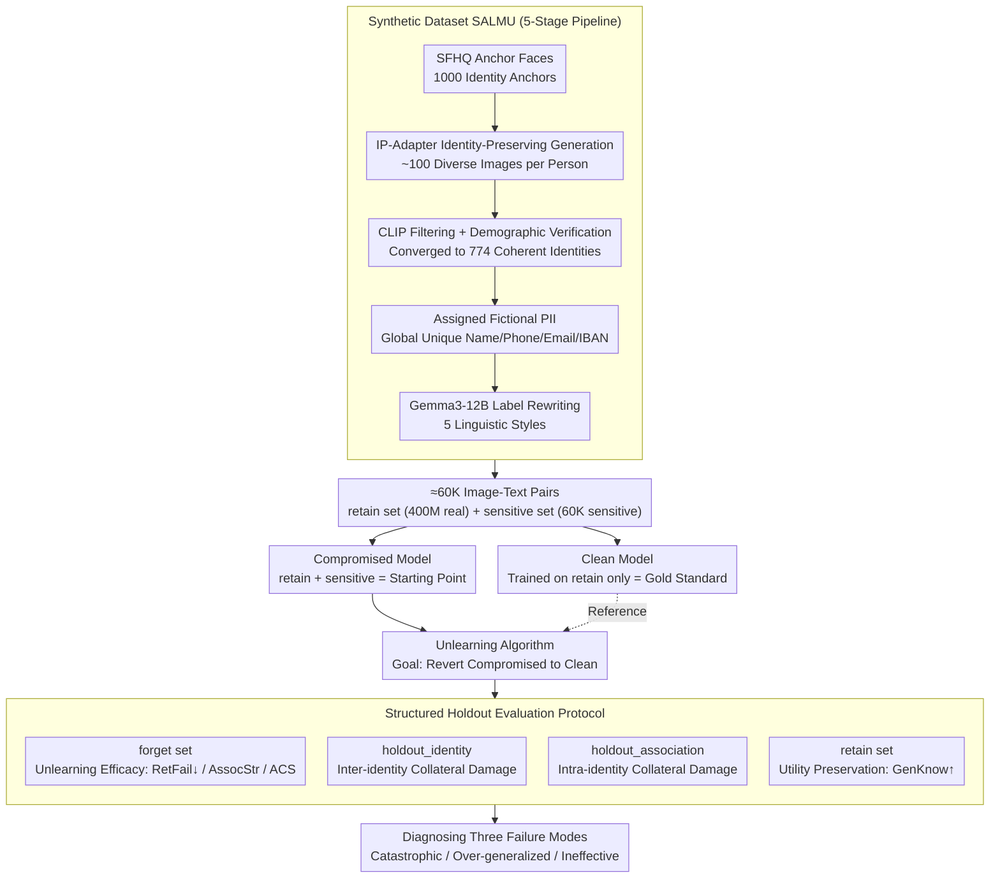

# SALMUBench: A Benchmark for Sensitive Association-Level Multimodal Unlearning

**Conference**: CVPR2026  
**arXiv**: [2603.26316](https://arxiv.org/abs/2603.26316)  
**Code**: [cvc-mmu.github.io/salmubench](http://cvc-mmu.github.io/salmubench)  
**Area**: Multimodal VLM  
**Keywords**: machine unlearning, CLIP, privacy protection, association-level unlearning, benchmark

## TL;DR
The authors propose SALMUBench—the first benchmark for association-level machine unlearning in CLIP-like models. It consists of a $60\text{K}$ synthetic dataset of person-sensitive attribute pairs, a pair of Compromised/Clean models trained from scratch, and a structured holdout evaluation protocol. The study systematically reveals three failure modes in existing unlearning methods: catastrophic collapse, over-generalized unlearning, and ineffective unlearning.

## Background & Motivation
Vision-language models (VLMs) like CLIP, trained on massive web-scale data, may inadvertently memorize sensitive personal information (e.g., associating faces with phone numbers). The "Right to be Forgotten" in the GDPR requires models to selectively delete learned sensitive associations.

**Limitations of Prior Work**: (1) Unimodal unlearning methods are difficult to transfer to embedding-based models using contrastive learning; (2) Existing multimodal unlearning benchmarks (MLLMU-Bench, FIUBench) mainly target VQA evaluation for generative MLLMs and are unsuitable for CLIP's embedding space; (3) Current evaluations inject sensitive knowledge via fine-tuning, failing to isolate unlearning effects from pre-training artifacts; (4) Crucially, existing simple "forget-retain" evaluation frameworks **cannot detect over-generalized unlearning**, where a method might successfully erase target information while inadvertently wiping related knowledge that should be preserved.

## Method

### Overall Architecture
SALMUBench is an evaluation infrastructure designed to objectively determine the success of unlearning. The core problem it addresses is confirming that when a CLIP model is requested to forget a sensitive association (e.g., "Face A $\leftrightarrow$ Phone Number X"), it truly forgets it without collateral damage to unrelated knowledge. The framework consists of three layers: a $60\text{K}$ synthetic dataset with person-attribute pairs, a comparison between "Compromised" (exposed to sensitive data) and "Clean" models trained from scratch, and a structured holdout protocol to quantify both unlearning efficacy and side effects.

### Key Designs

**1. Synthetic Dataset SALMU: Replacing Real Privacy with Controllable Fictional Identities**

Using real personal privacy data is neither compliant nor reproducible. The paper utilizes a 5-stage pipeline to create "realistic but fictional" identities. It starts with 1,000 synthetic faces from SFHQ as identity anchors; generates approximately 100 diverse images per person using IP-Adapter-FaceID Plus; filters these through CLIP zero-shot labeling and consistency checks to reach 774 coherent identities; assigns globally unique, culturally consistent fictional PII (name, city, phone, etc.); and uses Gemma3-12B to rewrite labels into five styles. The final dataset contains $60\text{K}$ pairs covering 65 countries, providing clear "to-be-forgotten" associations for public release.

**2. Trained-from-scratch Compromised/Clean Model Pairs: Isolating Unlearning Targets from Artifacts**

Traditional benchmarks often inject sensitive knowledge via fine-tuning, making it impossible to distinguish between the intended unlearning of the injection and the erasure of pre-existing training artifacts. SALMUBench trains two ViT-B/16 CLIP models from scratch: the Clean model is trained only on the retain set ($\approx 400\text{M}$ real pairs), while the Compromised model is trained on both retain and sensitive ($60\text{K}$) sets using identical seeds and configurations (32 epochs on 128 H100s). The Clean model serves as the literal gold standard for the ideal unlearning result.

**3. Structured Holdout Evaluation Protocol: Quantifying Over-generalized Unlearning**

To address the blind spot of "forget/retain" splits, the paper divides the 774 sensitive identities into subsets: the **forget set** (seen during unlearning), **holdout_identity** (identities never seen by the unlearning algorithm, used to measure **inter-identity damage**), and **holdout_association** (other associations for the same person, used to measure **intra-identity damage**). Metrics include:
- **Unlearning Efficacy**: `RetFail` (Retrieval Failure rate, lower MRR is better), `AssocStr` (average cosine similarity), `ACS` (accuracy of a logistic regression classifier in distinguishing correct vs. shuffled pairs), and `IdZSC` (identity classification).
- **Utility Preservation**: `GenKnow` (Zero-shot ImageNet-1K accuracy), `InterIdSim`/`IntraIdSim` (holdout set similarity), and `VisIdInt` (visual identity integrity).

## Key Experimental Results

### Main Results ($5 \times$ Budget)

| Method | RetFail $\downarrow$ | GenKnow $\uparrow$ | InterIdSim | IntraIdSim |
| :--- | :--- | :--- | :--- | :--- |
| Clean (Gold Standard) | 0.001 | 0.633 | 0.143 | 0.143 |
| Compromised | 0.236 | 0.638 | 0.321 | 0.321 |
| CLIPErase | 0.001 | 0.634 | 0.024 | 0.024 |
| DELETE | 0.001 | 0.632 | 0.023 | 0.023 |
| VLUnlearn | 0.001 | 0.638 | 0.210 | 0.210 |
| Finetuning | 0.003 | 0.638 | 0.209 | 0.209 |
| Neg. Gradient | 0.009 | 0.630 | 0.063 | 0.061 |
| Shuffled Captions | 0.004 | 0.548 | 0.212 | 0.212 |
| Direct Sim. Min. | 0.001 | 0.615 | -0.420 | -0.425 |

### Analysis of Three Failure Modes

| Failure Type | Representative Method | Characteristics |
| :--- | :--- | :--- |
| Catastrophic Collapse | Shuffled Captions, Direct Sim. Min. | Effective unlearning but massive drop in `GenKnow`. |
| Over-generalized Unlearning | DELETE, CLIPErase | Precise unlearning and `GenKnow` preservation, but severe damage to holdout sets. |
| Ineffective Unlearning | Generic Captions | Low collateral damage but fails to erase target associations. |

### Key Findings
- **No single method simultaneously avoids all three failure modes**—this remains the core open challenge in the field.
- High-efficiency unlearning ($>99\%$ leakage reduction with $<1\%$ `GenKnow` drop) is achievable, but existing methods (DELETE, CLIPErase) achieve this through over-generalization.
- When `AssocStr` is pushed below the Clean model baseline ($0.142$), over-generalization is triggered as the method over-corrects and erases related, unseen associations.
- Simple "forget-retain" evaluations are "blind" to over-generalization.

## Highlights & Insights
- The **structured holdout evaluation design** is the most significant contribution; the distinction between `holdout_identity` and `holdout_association` makes over-generalized unlearning quantifiable for the first time.
- Training two full CLIP models from scratch ($400\text{M}$ data point, 128 H100s) provides the cleanest possible baseline despite the high cost.
- The synthetic data pipeline (IP-Adapter identity preservation + CLIP filtering + LLM rewriting) is highly reusable.
- The **taxonomy of three failure modes** provides a clear target for future research: solving unlearning efficacy, utility preservation, and over-generalization avoidance simultaneously.

## Limitations & Future Work
- The study focuses on CLIP dual-encoders; evaluating the propagation of sensitive information in diffusion models using CLIP backbones is a natural extension.
- It covers structured PII only; generalization to implicit sensitive concepts (artistic styles, political stances) is unknown.
- There is a lack of **recoverability diagnostics**—how quickly can a model relearn forgotten information through fine-tuning?
- While domain consistency was verified via KS tests, the diversity of 100 images per synthetic identity is still relatively limited.

## Related Work & Insights
- **vs. MultiDelete / CLIPErase**: Previous methods did not target specific personal privacy and used fine-tuning for injection, making evaluation less rigorous.
- **vs. TOFU / FIUBench**: These focus on VQA evaluation for generative MLLMs, which are inapplicable to CLIP's embedding space.
- **Insight**: Over-generalized unlearning likely exists in knowledge editing/unlearning for LLMs as well, warranting cross-domain validation.

## Rating
- Novelty: ⭐⭐⭐⭐⭐ First association-level unlearning benchmark for CLIP with innovative holdout design.
- Experimental Thoroughness: ⭐⭐⭐⭐ 9 baseline methods and multi-budget comparisons, though limited to the ViT-B/16 architecture.
- Writing Quality: ⭐⭐⭐⭐⭐ Rigorous description of dataset construction and evaluation protocols.
- Value: ⭐⭐⭐⭐⭐ Establishes a new standard for multimodal machine unlearning with open-source data, models, and code.

<!-- RELATED:START -->

## Related Papers

- [\[CVPR 2026\] Towards Reasoning-Preserving Unlearning in Multimodal Large Language Models](towards_reasoning-preserving_unlearning_in_multimodal_large_language_models.md)
- [\[CVPR 2026\] MMLandmarks: a Cross-View Instance-Level Benchmark for Geo-Spatial Understanding](mmlandmarks_a_cross-view_instance-level_benchmark_for_geo-spatial_understanding.md)
- [\[CVPR 2026\] Beyond Single Images: A Comprehensive Benchmark for Album-Level Vision-Language Understanding](beyond_single_images_a_comprehensive_benchmark_for_album-level_vision-language_u.md)
- [\[CVPR 2026\] VL-Eraser: Vacuum Distillation for Machine Unlearning in Vision-Language Models](vl-eraser_vacuum_distillation_for_machine_unlearning_in_vision-language_models.md)
- [\[CVPR 2026\] ConeSep: Cone-based Robust Noise-Unlearning Compositional Network for Composed Image Retrieval](conesep_cone-based_robust_noise-unlearning_compositional_network_for_composed_im.md)

<!-- RELATED:END -->
