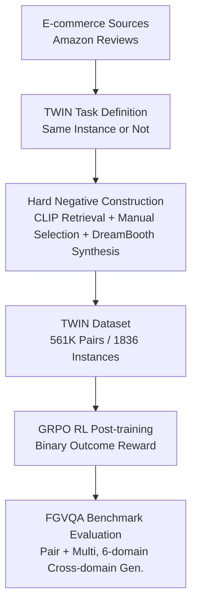

# Same or Not? Enhancing Visual Perception in Vision-Language Models

**Conference**: CVPR 2026  
**Paper**: [CVF Open Access](https://openaccess.thecvf.com/content/CVPR2026/html/Marsili_Same_or_Not_Enhancing_Visual_Perception_in_Vision-Language_Models_CVPR_2026_paper.html)  
**Code**: https://glab-caltech.github.io/twin/ (Project page, promising open-source data/code/models)  
**Area**: Multimodal VLM  
**Keywords**: Fine-grained visual perception, instance-level contrast, hard negatives, RL post-training, VQA benchmark

## TL;DR
The authors redefine "fine-grained visual perception" as a simple binary task—determining whether two similar images depict the same object instance. Based on this, they constructed the TWIN dataset with 561K pairs and applied GRPO reinforcement learning for VLM post-training. This approach improved Qwen2.5-VL's performance on a self-built FGVQA benchmark by up to 19.3% without degrading general VQA capabilities.

## Background & Motivation
**Background**: Modern VLMs (GPT-4o, Qwen2.5-VL, etc.) excel at "broad-field" visual understanding, such as identifying categories, spatial relationships, and common-sense reasoning. However, their perception granularity remains coarse.

**Limitations of Prior Work**: VLMs systematically "fail to see details." A typical example from the paper shows two Eureka vacuum cleaners with identical colors, brands, and logos, but completely different dust bin geometries, handles, and base shapes; Qwen2.5-VL identifies them as the "same product" and provides contradictory explanations. This coarse granularity, visual bias, and neglect of details are particularly severe in open-source VLMs.

**Key Challenge**: The authors attribute the root cause to the training data. Mainstream image-text corpora overwhelmingly reward "category-level" understanding (e.g., cat vs. dog, spatial relations, math reasoning), providing almost no supervisory signals to force the model to focus on "instance-level" subtle differences. Models are never trained to distinguish "two almost identical individuals within the same category," and thus fail to learn it.

**Goal**: To create a training corpus specifically designed to reward fine-grained perception and a benchmark to quantify this capability.

**Key Insight**: Instead of asking the model to describe differences (as in SpotTheDiff), the task is compressed into the cleanest binary judgment: "Are these two images of the same object?". This setup provides extremely cheap supervisory signals (requiring only a yes/no label without text descriptions) while forcing the model to scrutinize shapes, textures, and part geometries to distinguish instances.

**Core Idea**: Use the paired judgment task "whether two images are the same instance" (TWIN) as a "fine-grained perception enhancer" that can be directly incorporated into VLM training corpora, replacing category-level recognition.

## Method

### Overall Architecture
The "method" of this paper is essentially a **data-driven perception enhancement pipeline**: first, a paired dataset TWIN (positive samples + hard negatives + synthetic negatives) is constructed from real e-commerce images to reward fine-grained discrimination. Then, an off-the-shelf VLM is post-trained using pure reinforcement learning (GRPO, where rewards are based solely on final answer correctness). Finally, a cross-domain FGVQA benchmark verifies whether perception has improved without damaging general capabilities. The key lies in "what data to feed," while the training algorithm itself is kept simple.

### Key Designs

**1. TWIN Task: Compressing fine-grained perception into binary "same instance" judgment**

The pain point addressed is that "training corpora only reward category-level recognition." The authors reformulate fine-grained perception as an instance-level discrimination problem: given two images $(I_1, I_2)$, the model outputs an explanation and a final answer $\hat{y} \in \{\text{yes}, \text{no}\}$ to judge if they are the same physical instance. Here, an "instance" is defined as a collection of images of the same object under different viewpoints, lighting, and backgrounds. This forces the model to focus on fine cues like shape, texture, and part geometry. The supervision cost is minimal: the task requires only yes/no labels, making it naturally scalable. Data is sourced from Amazon Reviews, focusing on household items.

**2. Hard Negatives: Dual-track construction of real and synthetic hard negatives**

This is proven to be the "most critical" design in the experiments. If negative samples are too random (e.g., a cup paired with a fan), the task degrades to category recognition. The authors specifically seek **visually similar but distinct** negatives. Real hard negatives are found by using CLIP to calculate cosine similarities and recalling candidates for manual verification (e.g., two white vases with slightly different shapes). To scale this, the second track uses DreamBooth to generate "detail-modified" variants of an instance (e.g., a speaker with the same geometry but missing a logo). TWIN ultimately contains 123K positive and 438K negative samples. Ablations show that removing hard negatives leads to a significant performance drop.

**3. GRPO Pure RL Post-training: Binary rewards based on "correctness"**

To avoid the "forgetting" common in SFT, the authors choose Reinforcement Learning (RL). Specifically, the VLM $\pi_\theta$ is prompted to produce a text explanation followed by a final answer $\hat{y}$. The reward is a simple binary outcome: $R(y, \hat{y}) = \mathbb{1}\{y = \hat{y}\}$. Only the final answer is compared against the ground truth; the intermediate explanation tokens are not supervised. Optimizing with GRPO (Group Relative Policy Optimization) allows the model to improve its reasoning without deviating significantly from the pre-trained model. RL demonstrates stronger out-of-distribution generalization compared to SFT.

**4. FGVQA Benchmark: Recasting existing datasets for cross-domain VLM evaluation**

Traditional fine-grained benchmarks are often in 1-of-N classification or retrieval formats, which are unsuitable for VLMs. The authors reformulate 6 datasets into VQA format with 12K queries, covering artworks (MET), retail (ILIAS), landmarks (LANDMARKS), birds (CUB), plants/animals (INQUIRE), and TWIN-Eval. Two question types are used: **pair** (are these two images the same?) and **multi** (given one reference and three candidates, how many match?). The multi-task improvement proves the model learns genuine perception rather than task-specific overfitting.

### Loss & Training
The post-training objective is the binary outcome reward $R(y, \hat{y}) = \mathbb{1}\{y = \hat{y}\}$ optimized via GRPO. Implementation involves training Qwen2.5-VL-3B-Instruct and InternVL3.5-1B-Instruct using 4 A100 GPUs, 1 epoch, batch size 480, group size 5, and a $10^{-6}$ learning rate. The framework used is `verl`.

## Key Experimental Results

### Main Results
Post-training on TWIN brings consistent cross-domain gains (all except TWIN-Eval are zero-shot evaluations). The table below shows Total Accuracy (%) for Qwen2.5-VL 3B:

| Dataset | Qwen2.5-VL 3B | + TWIN | Gain |
|---------|---------------|--------|------|
| TWIN-Eval | 50.1 | 67.3 | +17.2 |
| ILIAS | 43.5 | 61.8 | +18.3 |
| INQUIRE (OOD) | 54.4 | 73.7 | +19.3 |
| CUB (OOD) | 60.7 | 75.1 | +14.4 |
| LANDMARKS (OOD) | 53.9 | 57.9 | +4.0 |
| MET (OOD) | 55.5 | 66.0 | +10.5 |

The gain on INQUIRE reduced the gap with proprietary models from 29.5% to 10.2%. Qwen2.5-VL + TWIN even outperformed the strong open-source baseline Gemma3 on several benchmarks.

### Ablation Study

| Configuration | MEAN | TWIN-Eval | ILIAS | INQUIRE | Description |
|---------------|------|-----------|-------|---------|-------------|
| Qwen2.5-VL 3B | 53.0 | 50.1 | 43.5 | 54.4 | Baseline |
| + TWIN w/o Hard Negatives | 58.6 | 51.1 | 53.1 | 60.9 | Replaced with random negatives |
| + TWIN | 63.1 | 65.3 | 58.4 | 68.7 | Full data |

Hard negatives contribute an average of +4.5%, with the largest impact on in-domain TWIN-Eval (+14.2%).

| Post-training Method | MEAN | CUB | MET | Description |
|----------------------|------|-----|-----|-------------|
| SFT | 53.8 | 53.9 | 52.3 | Supervise all output tokens (incl. CoT) |
| RL (GRPO) | 57.5 | 65.0 | 58.7 | Reward only final answer |

### Key Findings
- **Hard negatives are vital**: This is the most critical construction decision; removing them causes in-domain performance to collapse nearly to baseline.
- **Data scale defines the ceiling**: Moving from 5K to 561K instances consistently improves performance across in-domain and OOD datasets.
- **No harm to general capabilities**: Performance remains stable or slightly improves on 11 general VQA benchmarks (e.g., NLVR2 +1.4, AI2D +0.8) and pure text benchmarks (MMLU, GSM8K).
- **Improved underlying representations**: Linear probes on the Qwen2.5-VL vision encoder show gains (e.g., PETS 75.0%→79.1%), suggesting TWIN improves embeddings for fine-grained discrimination.

## Highlights & Insights
- **Binary choice is an underrated supervision**: Compressing perception into yes/no pairs reduces labeling costs while driving RL with sparse but clean rewards.
- **Dual-track engineering for hard negatives**: Combining CLIP retrieval with DreamBooth synthesis is a reproducible "low-cost recipe" for hard negative generation.
- **"Multi" questions as anti-overfitting probes**: Using structural variations in testing verifies that the model learns capabilities rather than memorizing the task format.
- **Drop-in positioning**: TWIN is designed as a supplement to existing VLM training corpora rather than a standalone model, lowering the barrier to adoption.

## Limitations & Future Work
- Rewards currently rely only on the final answer; future work could use multimodal verifiers for more structured feedback.
- Hard negative selection still involves human verification, limiting extreme scalability.
- TWIN requires reasoning about part geometry under viewpoint changes; explicit 3D representations might provide further improvements.
- *Self-evaluation note*: Training was concentrated on 1B/3B models; the gains for larger models and the independent contribution of synthetic vs. real negatives require further ablation. Cross-domain gains are not uniform (e.g., lower on Landmarks).

## Related Work & Insights
- **vs. SpotTheDiff**: These provide text descriptions of differences; TWIN uses binary judgment and is two orders of magnitude larger (561K vs 13K).
- **vs. Traditional Recognition (CUB, etc.)**: These use 1-of-N formats; this work reformulates them into VQA formats compatible with VLMs.
- **vs. SFT/Distillation**: This work utilizes GRPO RL, which is proven to better preserve generalization and prevent forgetting on out-of-distribution data.

## Rating
- Novelty: ⭐⭐⭐⭐ The combination of task formulation and data construction is clever, though the underlying algorithm is standard GRPO.
- Experimental Thoroughness: ⭐⭐⭐⭐⭐ Comprehensive coverage across main results, ablations, encoder probes, and general stability.
- Writing Quality: ⭐⭐⭐⭐⭐ Clear logical flow from motivation to validation.
- Value: ⭐⭐⭐⭐⭐ High utility for the open-source VLM community due to the drop-in dataset and benchmarks.

<!-- RELATED:START -->

## Related Papers

- [\[CVPR 2026\] Enhancing Descriptive Captions with Visual Attributes for Multimodal Perception](enhancing_descriptive_captions_with_visual_attributes_for_multimodal_perception.md)
- [\[CVPR 2026\] DiG: Differential Grounding for Enhancing Fine-Grained Perception in Multimodal Large Language Models](dig_differential_grounding_for_enhancing_fine-grained_perception_in_multimodal_l.md)
- [\[CVPR 2026\] Perception Programs: Unlocking Visual Tool Reasoning in Language Models](perception_programs_visual_tool_reasoning.md)
- [\[CVPR 2026\] Abstract 3D Perception for Spatial Intelligence in Vision-Language Models](abstract_3d_perception_for_spatial_intelligence_in_vision-language_models.md)
- [\[CVPR 2026\] Bias Is a Subspace, Not a Coordinate: A Geometric Rethinking of Post-hoc Debiasing in Vision-Language Models](bias_is_a_subspace_not_a_coordinate_a_geometric_rethinking_of_post-hoc_debiasing.md)

<!-- RELATED:END -->
