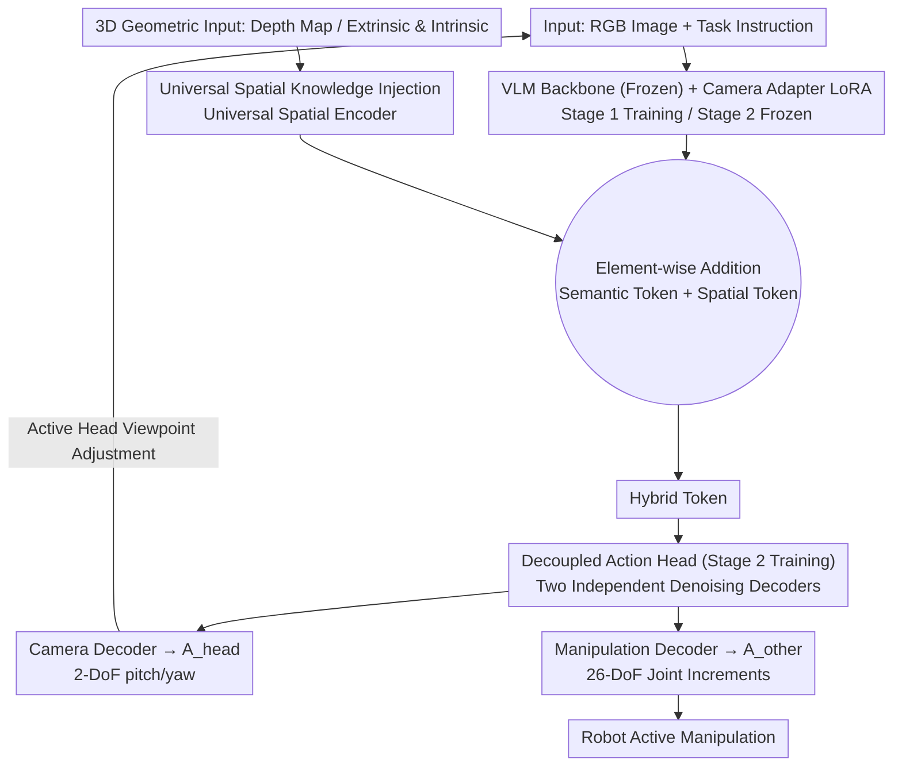

# SaPaVe: Towards Active Perception and Manipulation in Vision-Language-Action Models for Robotics

**Conference**: CVPR 2026  
**arXiv**: [2603.12193](https://arxiv.org/abs/2603.12193)  
**Code**: [https://lmzpai.github.io/SaPaVe](https://lmzpai.github.io/SaPaVe)  
**Area**: Multimodal VLM / Robotics  
**Keywords**: Active Perception, VLA Models, Decoupled Action Space, 3D Spatial Injection, Humanoid Robots

## TL;DR
SaPaVe proposes an end-to-end active manipulation framework. By employing a bottom-to-top training strategy with decoupled camera and manipulation actions, it first learns active perception priors using 200,000 semantic camera control pairs, followed by joint optimization for active manipulation. In real-world scenarios, it surpasses π₀ and GR00T N1 by a 31.25% improvement in success rate.

## Background & Motivation

1.  **Background**: Active perception and manipulation are core capabilities for robots interacting with complex scenes. Existing VLMs (e.g., Qwen2.5-VL, Gemini 2.5 Pro) have enhanced semantic understanding, while VLA models (e.g., π₀, GR00T N1) strive to bridge vision-language-action in an end-to-end manner.
2.  **Limitations of Prior Work**:
    *   VLMs often model active perception as VQA tasks (selecting the optimal view from discrete candidates), which lacks continuous and fine-grained camera control.
    *   VLA models are typically trained and evaluated under fixed optimal head camera views, making them sensitive to viewpoint changes and lacking active viewpoint adjustment capabilities.
    *   Directly adding camera actions to a unified action space in VLAs causes conflicts and requires a vast amount of expensive real-world active perception and manipulation data.
3.  **Key Challenge**: Active manipulation requires tight coupling between "semantic active perception" (viewpoint adjustment based on task strategy to obtain critical information) and "active viewpoint execution" (robust manipulation under dynamic viewpoints). However, data scarcity and action space conflicts make it difficult for existing methods to balance both.
4.  **Goal**: Enable robots to learn both semantic-driven active viewpoint adjustment and robust manipulation under changing viewpoints in a data-efficient manner.
5.  **Key Insight**: A critical insight is that camera motion is embodiment-agnostic. It can be learned independently first and then jointly optimized, facilitating efficient bottom-to-top training.
6.  **Core Idea**: Decouple camera actions from manipulation actions; establish active perception priors using large-scale semantic camera motion data, then perform joint optimization to achieve data-efficient active manipulation.

## Method

### Overall Architecture
The problem SaPaVe addresses is ensuring a robot can both "actively see" (rotating the head camera to angles that clarify key information based on the task) and "stably do" (completing tasks like grasping or articulating joints under these changing viewpoints). Based on a standard VLA architecture, it accepts RGB images and task instructions but splits the output into two decoupled action streams: head camera actions $A_{head}$ (pitch/yaw adjustment, 2-DoF) and manipulation actions $A_{other}$ (26-DoF joint position increments for the Unitree G1 arms and hands). Both streams use action chunking to predict sequences of length $k$ for temporal smoothness. The core hypothesis is that since how a camera rotates is embodiment-agnostic, active perception can be trained separately on massive view-only data before being integrated with manipulation using limited robot data.

### Key Designs

**1. Decoupled Action Head + Camera Adapter: Separating camera control from manipulation without polluting existing priors**

A direct approach would be to insert camera motion into the existing unified action space of a VLA, but this disrupts the priors learned from large-scale fixed-view manipulation data—camera and manipulation dimensions interfere, leading to poor performance in both. SaPaVe’s strategy is physical isolation: a camera adapter is attached to the VLM as a LoRA to learn semantic active perception priors while freezing original VLM weights; the decoupled action head uses two independent denoising decoders for $A_{head}$ and $A_{other}$. This "brackets" camera capabilities rather than "squeezing" them in, preserving the VLM's high-level semantic information. Ablations confirm this: full fine-tuning of the VLM for camera motion performs worse than the lightweight adapter (Table 5 shows a 11.25% drop without the adapter) because retraining overwrites semantic priors.

**2. Universal Spatial Knowledge Injection: Providing geometric sense to VLAs lacking 3D priors**

VLA models inherently lack 3D geometric priors. Once perspectives actively change, their understanding of object spatial positions drifts, causing manipulation instability. SaPaVe introduces a Universal Spatial Encoder inherited from a strong feed-forward 3D geometric model. It accepts various 3D geometric inputs (depth maps, camera parameters) without requiring architecture changes. The resulting spatial tokens are element-wise added to VLM output tokens. These hybrid tokens guide the denoising process of the decoupled action head, ensuring action generation is always aligned with a geometric reference for the current viewpoint. Its impact is direct: removing this module leads to a 16.25% average drop, with even simple occluded grasping dropping by 15%.

**3. Two-stage Bottom-to-Top Training Strategy: Mastering universal "seeing" before embodiment-specific "doing"**

Jointly training active perception and manipulation requires scarce and expensive data containing both viewpoint adjustments and manipulation labels. Following the "embodiment-agnostic" insight, SaPaVe splits training into two layers. Stage 1 (Semantic Active Perception Alignment) uses the mass-produced ActiveViewPose-200K dataset to train the camera adapter and camera action decoder with a pure MSE objective:

$$\mathcal{L}_{stage1} = \mathcal{L}_{MSE}(A_{head,t}, A_{head,t}^*)$$

This step equips the model with strong semantic-driven viewpoint adjustment priors. Stage 2 (Active Manipulation Fine-tuning) subsequently freezes the camera adapter to protect learned perception and uses mixed data (ActiveViewPose-200K + robot manipulation data) to train the decoupled action head:

$$\mathcal{L}_{stage2} = \lambda_{head}\mathcal{L}_{head} + \lambda_{other}\mathcal{L}_{other}$$

Because "how to see" is already mastered, the small amount of manipulation data only needs to learn "how to act" given the view, making migration highly data-efficient. Removing Stage 1 leads to a 31.25% crash (85 to 53.75), especially in out-of-view tasks, proving this prior is the foundation.

### Loss & Training
*   Stage 1: Uses MSE loss to supervise camera action prediction, establishing semantic active perception priors.
*   Stage 2: Uses weighted MSE loss to supervise both camera and manipulation actions, while freezing the camera adapter to protect Stage 1 priors.
*   Action chunking is utilized throughout to ensure temporal smoothness of predicted sequences.

## Key Experimental Results

### Main Results: Semantic Active Perception Evaluation

| Method | Val | Test1 | Test2 | Average |
|------|-----|-------|-------|------|
| Qwen2.5-VL-72B | 63.9 | 65.1 | 58.0 | 62.3 |
| Multi-SpatialMLLM | 72.8 | 74.3 | 63.6 | 70.2 |
| Gemini-2.5-Pro | 73.3 | 76.5 | 68.2 | 72.7 |
| **SaPaVe (2B)** | **85.5** | **89.1** | **78.3** | **84.3** |

Real-world Active Manipulation (Success Rate %):

| Method | Occluded Pick-and-Place | Out-of-view Pick-and-Place | Occluded Articulated | Out-of-view Articulated | Average |
|------|---------|----------|------------|------------|------|
| π₀ | 55 | 45 | 45 | 35 | 45.00 |
| GR00T-N1 | 60 | 55 | 50 | 50 | 53.75 |
| **SaPaVe** | **90** | **85** | **85** | **80** | **85.00** |

### Ablation Study

| Configuration | Occluded P&P | Out-of-view P&P | Occluded Manip. | Out-of-view Manip. | Average |
|------|---------|----------|---------|----------|------|
| Full Model | 90 | 85 | 85 | 80 | 85.00 |
| w/o Stage 1 | 65 | 55 | 50 | 45 | 53.75 |
| w/o Stage 2 | 75 | 60 | 70 | 60 | 66.25 |
| w/o Decoupled Head | 80 | 70 | 70 | 65 | 71.25 |
| w/o Camera Adapter | 80 | 75 | 70 | 70 | 73.75 |
| w/o Spatial Injection | 75 | 75 | 65 | 60 | 68.75 |

### Key Findings
*   Stage 1 contributes the most; its removal causes a 31.25% average drop (85 to 53.75), with out-of-view tasks nearly halved, indicating that active perception priors are core.
*   Removing Universal Spatial Knowledge Injection leads to a 16.25% drop, highlighting that 3D information is vital for handling viewpoint changes.
*   SaPaVe (2B) outperforms 72B models like Qwen2.5-VL and Gemini 2.5 Pro in semantic perception, suggesting active perception is not an emergent property of general VLMs but requires specific training.
*   Fixed + wrist camera combinations remain inferior to active cameras, especially in out-of-view tasks (gap > 40%), signifying that "more views" is not as effective as "active control of the view."

## Highlights & Insights
*   **The insight that "camera motion is embodiment-agnostic"** is the central contribution, leading to the elegant and effective decoupled bottom-to-top strategy. This can be transferred to other robot learning scenarios requiring separation of universal and specialized capabilities.
*   **ActiveViewPose-200K Dataset** construction (high-quality assets + heuristic motion + GPT-4o instructions + manual refinement) is both efficient and reproducible, providing a valuable benchmark for the community.
*   The absolute success rate improvement (over 40% vs π₀; 31.25% vs GR00T-N1) demonstrates that active manipulation cannot be solved by simply increasing action dimensions.

## Limitations & Future Work
*   Validation is limited to the Unitree G1 humanoid; transferability to other morphologies (single arms, mobile bases) is untested.
*   Current camera actions are only 2-DoF (pitch/yaw), excluding more complex adjustments like translation.
*   ActiveViewPose-200K relies on semi-automatically constructed static scenes; dynamic real-world occlusions may require more data.
*   Online learning mechanisms could be explored to allow robots to refine active perception strategies during execution.

## Related Work & Insights
*   **vs π₀ [6]**: π₀ is a strong general VLA but lacks active perception. Direct fine-tuning with camera actions yields poor results (45% success); SaPaVe achieves 85% via decoupling.
*   **vs GR00T-N1 [5]**: Similarly lacks active perception priors. Despite being designed for humanoids, it is surpassed by SaPaVe in active tasks.
*   **vs NBV methods [7,54]**: Traditional Next-Best-View methods are not end-to-end and lack semantic input. SaPaVe integrates semantic understanding with continuous camera control.

## Rating
*   Novelty: ⭐⭐⭐⭐⭐ Decoupled strategy and ActiveManip-Bench are pioneering contributions.
*   Experimental Thoroughness: ⭐⭐⭐⭐⭐ Covers simulation, real-world, ablations, and generalization with precise baselines.
*   Writing Quality: ⭐⭐⭐⭐ Clear structure and deep experimental analysis.
*   Value: ⭐⭐⭐⭐⭐ Fills a gap in VLA active manipulation; the dataset is highly valuable for the community.

<!-- RELATED:START -->

## Related Papers

- [\[ICML 2026\] ACTIVE-o3: Empowering MLLMs with Active Perception via Pure Reinforcement Learning](../../ICML2026/multimodal_vlm/active-o3_empowering_mllms_with_active_perception_via_pure_reinforcement_learnin.md)
- [\[CVPR 2026\] SIMPACT: Simulation-Enabled Action Planning using Vision-Language Models](simpact_simulation-enabled_action_planning_using_vision-language_models.md)
- [\[CVPR 2026\] Same or Not? Enhancing Visual Perception in Vision-Language Models](same_or_not_enhancing_visual_perception_in_vision-language_models.md)
- [\[CVPR 2026\] Abstract 3D Perception for Spatial Intelligence in Vision-Language Models](abstract_3d_perception_for_spatial_intelligence_in_vision-language_models.md)
- [\[CVPR 2026\] 4DP-QA: Scalable QA for 4D Perception in Vision Language Models](4dp-qa_scalable_qa_for_4d_perception_in_vision_language_models.md)

<!-- RELATED:END -->
