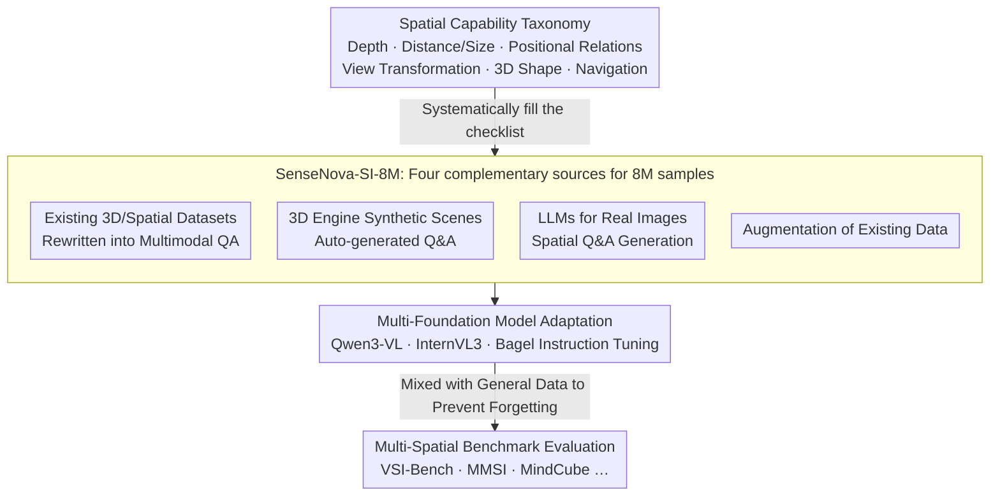

# Scaling Spatial Intelligence with Multimodal Foundation Models

**Conference**: CVPR 2026  
**arXiv**: [2511.13719](https://arxiv.org/abs/2511.13719)  
**Code**: [https://github.com/OpenSenseNova/SenseNova-SI](https://github.com/OpenSenseNova/SenseNova-SI)  
**Area**: Multimodal VLM / Spatial Intelligence  
**Keywords**: Spatial Intelligence, Multimodal Foundation Models, Data Scaling, Spatial Reasoning, Benchmarking

## TL;DR

SenseNova-SI cultivates spatial intelligence capabilities in multimodal foundation models (such as Qwen3-VL, InternVL3, and Bagel) by systematically constructing a diverse spatial dataset of 8 million samples (SenseNova-SI-8M). It achieves unprecedented performance on multiple spatial benchmarks like VSI-Bench and MMSI while maintaining general multimodal understanding capabilities.

## Background & Motivation

**Background**: Multimodal foundation models (e.g., GPT-4V, Gemini, Qwen-VL) perform excellently in tasks like visual understanding and text generation. However, they still exhibit significant deficiencies in spatial intelligence—including depth estimation, spatial relationship judgment, 3D scene understanding, and view transformation reasoning.

**Limitations of Prior Work**: (1) The performance of existing multimodal models on spatial reasoning tasks is far below their level in general visual question answering, suggesting a lack of sufficient spatial information in internet-scale training data; (2) There is a lack of a systematic taxonomy for spatial capabilities to guide data construction; (3) The impact of data scaling on spatial intelligence, overfitting risks, and language shortcuts have not been fully investigated.

**Key Challenge**: The insufficient spatial intelligence of multimodal models stems from the inadequate quantity and diversity of spatial-related samples in training data rather than limitations in model architecture.

**Goal**: To cultivate spatial intelligence in existing multimodal foundation models through large-scale data scaling and to deeply analyze the effects of data scale, diversity, and overfitting risks.

**Key Insight**: Instead of modifying the model architecture, this work systematically constructs a large-scale dataset (8 million samples) covering diverse spatial capabilities to enhance spatial intelligence via a data-driven approach.

**Core Idea**: Guided by a rigorous spatial capability taxonomy, construct an 8-million-scale diverse spatial dataset to achieve significant improvements in spatial intelligence through fine-tuning on existing foundation models.

## Method

### Overall Architecture

SenseNova-SI is built upon existing multimodal foundation models, adopting a "data-driven" strategy to enhance spatial intelligence. The overall process includes: (1) establishing a spatial capability taxonomy; (2) systematically collecting, generating, and augmenting 8 million data samples (SenseNova-SI-8M) under this taxonomy; (3) fine-tuning Qwen3-VL, InternVL3 (visual understanding models), and Bagel (unified understanding-generation model); (4) evaluating and analyzing various factors across multiple spatial benchmarks.

### Key Designs

**1. Spatial Capability Taxonomy: Defining and Decomposing "Spatial Intelligence" before Data Collection**

Broadly "collecting spatial data" often leads to data imbalance (e.g., an over-concentration on left-right relationship judgments) while neglecting other dimensions. This work decomposes spatial intelligence into specific dimensions—depth perception, distance and size estimation, positional relationships (up/down, left/right, front/back), view transformation reasoning, 3D shape understanding, and spatial navigation—where each dimension corresponds to a clear category of training samples. This taxonomy serves as a "checklist" for subsequent data collection: to reach 8 million samples, one must check if each category is filled and supplement missing types. Its value lies not only in guiding data construction but also in providing a framework for the community to evaluate spatial capabilities.

**2. SenseNova-SI-8M: Filling the Taxonomy via Four Complementary Sources**

A taxonomy alone is insufficient; the key is how to actually assemble 8 million balanced samples. This work utilizes four complementary channels: extracting annotations from existing 3D/spatial datasets and rewriting them into multimodal QA formats; using 3D engines to synthesize spatial scenes and automatically generate corresponding Q&A; utilizing LLMs to generate spatial-related question-answer pairs for real images; and performing augmentation on existing data. the four sources have different emphases—real datasets ensure authenticity, 3D engines provide precise geometric annotations, and LLM generation ensures linguistic diversity—collectively achieving the necessary scale while filling gaps in prior work regarding limited dimensions and data volume.

**3. Multi-Foundation Model Adaptation: Validating across Architectures to Prove Gains from Data**

Data scaling methods are often questioned regarding whether they only fit a specific model. To address this, the study selects three foundation models with different architectures: visually-oriented Qwen3-VL and InternVL3, and the unified understanding-generation model Bagel. Feeding the same SenseNova-SI-8M dataset to all three for instruction tuning consistently results in significant spatial intelligence improvements. This demonstrates that the benefits stem from the data itself and represent a transferable general strategy rather than a coincidental result tied to a specific architecture.

### Loss & Training

- **Training Method**: Standard instruction tuning using the SenseNova-SI-8M dataset to further fine-tune existing foundation models.
- **Preventing Forgetting**: A certain proportion of general multimodal data is mixed in during fine-tuning to avoid degradation of general capabilities while improving spatial intelligence.
- **Data Balancing Strategy**: Data from different spatial capability dimensions are mixed in specific ratios to ensure all capabilities are sufficiently trained.

## Key Experimental Results

### Main Results

| Benchmark | Metric | SenseNova-SI | Prev. SOTA | Gain |
|-----------|------|-------------|----------|------|
| VSI-Bench | Accuracy | 68.8% | ~55% | +13.8% |
| MMSI | Accuracy | 43.3% | ~35% | +8.3% |
| MindCube | Accuracy | 85.7% | ~70% | +15.7% |
| ViewSpatial | Accuracy | 54.7% | ~45% | +9.7% |
| SITE | Accuracy | 47.7% | ~40% | +7.7% |
| BLINK | Accuracy | 63.9% | ~55% | +8.9% |
| 3DSR | Accuracy | 55.5% | ~45% | +10.5% |
| EmbSpatial | Accuracy | 72.0% | ~60% | +12.0% |
| MMBench-En | Accuracy | 84.9% | 84.9% | Parity |

### Ablation Study

| Configuration | VSI-Bench | MMBench-En | Description |
|------|-----------|------------|------|
| Base Model (No Fine-tuning) | ~55% | 84.9% | Weak spatial but strong general capability |
| + 1M Spatial Data | ~60% | 84.5% | Limited spatial improvement |
| + 4M Spatial Data | ~65% | 84.7% | Continuous improvement via data scaling |
| + 8M Spatial Data (Full) | 68.8% | 84.9% | Best spatial + maintained general |

### Key Findings

- **Data Scaling Curve**: Spatial intelligence grows approximately logarithmically with data volume, suggesting further gains are possible but with diminishing marginal utility.
- **Emergent Generalization**: After training on diverse data, the model demonstrates generalization capabilities on unseen spatial task types.
- **Overfitting Risks**: Signs of overfitting exist on certain spatial benchmarks, particularly when the data distribution is similar to the test set.
- **Language Shortcuts**: Some spatial reasoning tasks contain language shortcuts (correctly guessing without looking at the image), necessitating data de-biasing.
- **General Capability Maintenance**: Through proper data mixing strategies, the enhancement of spatial intelligence does not compromise general multimodal understanding.

## Highlights & Insights

- **Data-Driven Paradigm over Architectural Innovation**: Proves that spatial intelligence can be acquired through large-scale data scaling without modifying model architectures. This provides a reference for addressing other capability deficits.
- **Systematic Spatial Capability Taxonomy**: The established taxonomy not only guides data construction but also provides a framework for the community to evaluate spatial intelligence.
- **Early Signals of Emergent Generalization**: The emergent generalization brought by data diversity is a promising direction for further research, suggesting that large-scale diverse data may be the key to general spatial intelligence.

## Limitations & Future Work

- The cost of constructing 8 million samples is high, and reliance on synthetic data requires further evaluation regarding authenticity and diversity.
- Spatial Chain-of-Thought (Spatial CoT) reasoning is in early stages, with limited performance on complex multi-step spatial reasoning.
- Evaluation is primarily on static images; spatial intelligence assessment in videos and interactive scenes is missing.
- Accuracy for spatial tasks requiring precise numerical output (e.g., exact depth estimation) still has room for improvement.
- Marginal utility of data scaling is decreasing; future work may need to combine architectural improvements or new training paradigms.

## Related Work & Insights

- **vs SpatialVLM**: While SpatialVLM focuses on 2D spatial relationships, SenseNova-SI covers broader spatial dimensions (including 3D) and uses a much larger data scale.
- **vs SpatialRGPT**: SpatialRGPT focuses on region-level spatial reasoning, whereas SenseNova-SI systematically improves overall spatial intelligence from a more macro perspective.
- **vs Specialized 3D Models**: Specialized 3D vision models may be stronger in specific tasks, but SenseNova-SI maintains general multimodal capabilities, following the path of general-purpose models.

## Rating

- Novelty: ⭐⭐⭐ The core idea is data scaling; limited innovation at the methodological level, but the systematic work is valuable.
- Experimental Thoroughness: ⭐⭐⭐⭐⭐ Comprehensive ablation and analysis across 8 spatial benchmarks and general benchmarks.
- Writing Quality: ⭐⭐⭐⭐ Report-style writing; content is rich but slightly verbose.
- Value: ⭐⭐⭐⭐ Open-sourced models and data provide clear contributions to the community.

<!-- RELATED:START -->

## Related Papers

- [\[CVPR 2026\] SpatialScore: Towards Comprehensive Evaluation for Spatial Intelligence](spatialscore_towards_comprehensive_evaluation_for_spatial_intelligence.md)
- [\[CVPR 2026\] Abstract 3D Perception for Spatial Intelligence in Vision-Language Models](abstract_3d_perception_for_spatial_intelligence_in_vision-language_models.md)
- [\[CVPR 2026\] SpatialTree: How Spatial Intelligence Branches Out in MLLMs](spatialtree_how_spatial_intelligence_branches_out_in_mllms.md)
- [\[CVPR 2026\] Is your VLM Sky-Ready? A Comprehensive Spatial Intelligence Benchmark for UAV Navigation](is_your_vlm_sky-ready_a_comprehensive_spatial_intelligence_benchmark_for_uav_nav.md)
- [\[CVPR 2026\] From Where Things Are to What They Are For: Benchmarking Spatial–Functional Intelligence in Multimodal LLMs](from_where_things_are_to_what_they_are_for_benchmarking_spatial-functional_intel.md)

<!-- RELATED:END -->
