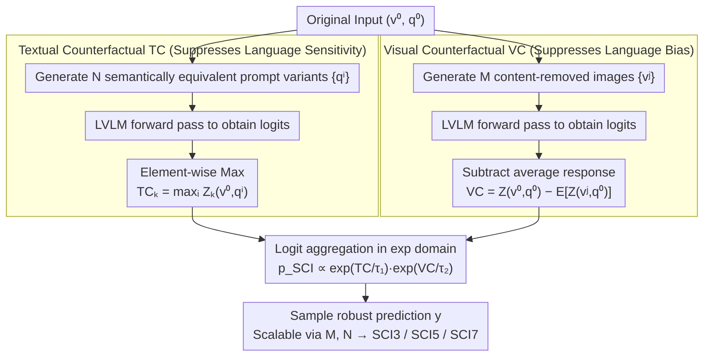

# Scaling Test-Time Robustness of Vision-Language Models via Self-Critical Inference Framework

**Conference**: CVPR 2026  
**arXiv**: [2603.07659](https://arxiv.org/abs/2603.07659)  
**Code**: [https://github.com/KaihuaTang/Self-Critical-Inference-Framework](https://github.com/KaihuaTang/Self-Critical-Inference-Framework)  
**Area**: Multimodal VLM  
**Keywords**: LVLM Robustness, Counterfactual Reasoning, Language Bias, Language Sensitivity, Test-time Scaling

## TL;DR
This paper proposes the Self-Critical Inference (SCI) framework, which addresses both language bias and language sensitivity in LVLMs through logit aggregation of multi-round textual and visual counterfactual reasoning. It also introduces DRBench, a dynamic robustness benchmark for model-specific evaluation. Increasing counterfactual reasoning rounds consistently improves robustness, opening a new direction for test-time scaling.

## Background & Motivation
**Background**: LVLMs achieve powerful vision-language capabilities by combining visual encoders with pre-trained LLMs and performing joint fine-tuning.

**Limitations of Prior Work**:
   - **Language Bias**: Models rely on language priors rather than visual input to answer questions, leading to object hallucinations (e.g., generating non-existent content).
   - **Language Sensitivity**: Models produce different answers for semantically equivalent variations of prompts, undermining consistency and reliability.
   - Methods like VCD only handle visual counterfactuals (bias issues) while completely ignoring textual counterfactuals (sensitivity issues).

**Key Challenge**: VCD is essentially an original logit reweighted by a TIE logit, involving only one dimension (visual) of counterfactuals; however, LVLM robustness is two-dimensional.

**Goal**: To simultaneously mitigate language bias and language sensitivity while discovering that increasing inference rounds can further enhance robustness.

**Key Insight**: Unify the understanding of VCD from the causal analysis perspective of CF-VQA, revealing the physical interpretation of $\alpha$ (the temperature parameter of TIE), and then naturally extend it to textual counterfactuals.

**Core Idea**: If VCD equals TIE reweighting, then Textual Counterfactual (TC) and Visual Counterfactual (VC) can be performed simultaneously. Test-time robustness scaling is achieved through multi-round logit aggregation.

## Method

### Overall Architecture
SCI aims to suppress two persistent issues in LVLMs—fabricating based on language priors (language bias) and changing answers based on phrasing (language sensitivity)—without additional training. It integrates "self-criticism" into decoding: for an original input $(v^0, q^0)$, it generates $N$ semantically equivalent but phrased differently textual variants $\{q^i\}$ and $M$ visual variants $\{v^j\}$ with key content removed. It calculates the textual counterfactual logit (TC) and visual counterfactual logit (VC), respectively, and aggregates them in the exponential domain by weighted multiplication with respective temperatures: $p_{SCI}(y) \propto \exp(TC/\tau_1) \cdot \exp(VC/\tau_2)$. These two counterfactual paths handle different aspects of robustness. As the number of variants $M$ and $N$ increases (more inference rounds), robustness improves—providing the entry point for "test-time scaling." The theoretical foundation of this mechanism stems from the observation that VCD is essentially temperature-based reweighting of the original distribution using TIE logits.

### Key Designs

**1. Treating VCD as TIE Reweighting: Providing Theoretical Grounding for Textual Expansion**

Prior debiasing methods like VCD only operated on the visual side. To apply similar logic to the textual side, the underlying mechanism of VCD must be understood. This paper deconstructs VCD logits from the causal perspective of CF-VQA: $Z_{vcd} = (1+\alpha)Z(v,q) - \alpha Z(v^*,q)$, where $v^*$ is a counterfactual image with content removed. Expanding this in the exponential domain yields $p(y) \propto \exp(Z(v,q)) \cdot \exp(\text{TIE}/\tau)$. Thus, VCD is essentially using TIE (Total Indirect Effect) logits as a vocabulary-level reweighting term multiplied by the original distribution, where $\alpha$ is the inverse temperature $\tau = 1/\alpha$. This connects VCD and CF-VQA into a single framework, implying that since counterfactual reweighting works for the visual dimension, it can also be applied to the textual dimension.

**2. Textual Counterfactual: Using "Element-wise Max" to Suppress Language Sensitivity**

Language sensitivity occurs when answers change based on phrasing, indicating the model is biased by specific tokens in a prompt. The TC strategy feeds multiple semantically equivalent prompt variants $\{q^i\}$ into the model and takes the element-wise maximum of all variant logits for each vocabulary position $k$: $TC_k = \max_i\big(Z_k(v^0, q^i)\big)$. The intuition is that if a candidate token is only pushed high by specific phrasing but remains low elsewhere, it is likely noise; truly vision-supported answers will maintain high logits across various phrasings.

**3. Visual Counterfactual: Robust Estimation of Language Bias via Multi-Image Averaging**

VCD uses a single noisy image as a counterfactual, resulting in high variance. VC expands this to multiple counterfactual images: $VC = Z(v^0, q^0) - \mathbb{E}\big[Z(v^j, q^0)\big]$, where the average response of $M$ content-removed images characterizes what the model would answer without visual evidence. Subtracting this pure language prior from the original logit provides a smoother and more reliable bias estimation compared to single-image VCD.

**4. SCI3 / SCI5 / SCI7: Using Variant Counts for Test-time Robustness Scaling**

By increasing $N$ for TC and $M$ for VC, different levels of SCI are obtained: SCI3 uses $M=N=1$ (3 forward passes), SCI5 uses $M=N=2$ (5 passes), and SCI7 uses $M=N=3$ (7 passes). Experiments show that higher levels yield stronger robustness at the cost of linear growth in forward passes. This provides a scaling axis orthogonal to CoT (Chain of Thought), relying on counterfactual reasoning rounds rather than intermediate token length.

### Loss & Training
This is a training-free inference-time method. Temperature parameters $\tau_1, \tau_2$ for TC and VC are tuned once on a validation set.

## Key Experimental Results

### Main Results (DRBench BS Subset Overall)

| Method | LLaVA-NeXT BS↑ | Qwen2-VL BS↑ |
|------|:---------:|:---------:|
| Baseline | 18.75 | 14.52 |
| TIE | 27.31 | - |
| VCD | 27.89 | - |
| M3ID | 29.05 | - |
| **SCI3** | **32.72** | - |
| **SCI5** | **34.19** | - |
| **SCI7** | **34.92** | - |

### Ablation Study

| Configuration | Effect | Description |
|------|------|------|
| VC Only (≈VCD) | Improved bias but constant sensitivity | Solves only half the problem |
| TC Only | Improved sensitivity but constant bias | Solves the other half |
| VC + TC (SCI) | Improves both simultaneously | Advantage of the unified framework |
| SCI3→SCI5→SCI7 | Continuous 1-2% gain | Successful test-time scaling |

### Key Findings
- **Overlap between bias and sensitivity samples is minimal**: Only 7.34% of the 24.68% hard samples for LLaVA-NeXT are shared with Qwen2-VL, proving robustness is model-specific.
- Qwen2-VL is generally more robust but more susceptible to bias; LLaVA-NeXT suffers more from sensitivity issues.
- Increasing counterfactual rounds (SCI3→SCI7) yields continuous improvements, suggesting the potential for test-time robustness scaling is underexplored.

## Highlights & Insights
- **Unification of VCD and CF-VQA**: Revealing VCD as temperature-scaled TIE reweighting provides significant analytical value.
- **Test-time Robustness Scaling**: Unlike traditional test-time scaling (increasing intermediate token length), this method improves robustness through more counterfactual reasoning rounds.
- **DRBench Design**: A dynamic, model-specific benchmark that can be automatically converted from any dataset, solving the problem of fixed benchmarks being included in subsequent training data.
- The method is model-agnostic and can be integrated into any LVLM inference pipeline.

## Limitations & Future Work
- Linear growth in inference cost: SCI7 requires 7 forward passes.
- Generation strategies for textual and visual variants are relatively simple; more advanced counterfactual generation might further improve results.
- Temperature parameters $\tau_1, \tau_2$ require manual tuning.
- DRBench relies on specific counterfactual generation methods to construct bias and sensitivity subsets.

## Related Work & Insights
- **vs VCD**: VCD is a special case of SCI ($N=0, M=1$). SCI extends the counterfactual dimensions and introduces test-time scaling.
- **vs CF-VQA / TDE**: While causal analysis for debiasing was used in traditional VQA, this work proves the same principles apply to LVLMs and can naturally extend to language sensitivity.

## Rating
- Novelty: ⭐⭐⭐⭐ (Insightful unified analysis and novel test-time scaling direction)
- Experimental Thoroughness: ⭐⭐⭐⭐ (Tested on 6 datasets and 2 models with logical benchmark design)
- Writing Quality: ⭐⭐⭐⭐⭐ (Excellent theoretical analysis and natural derivation)
- Value: ⭐⭐⭐⭐ (Practical inference-time robustness enhancement)

<!-- RELATED:START -->

## Related Papers

- [\[CVPR 2026\] dMLLM-TTS: Self-Verified and Efficient Test-Time Scaling for Diffusion Multi-Modal Large Language Models](dmllm-tts_self-verified_and_efficient_test-time_scaling_for_diffusion_multi-moda.md)
- [\[CVPR 2026\] UniT: Unified Multimodal Chain-of-Thought Test-time Scaling](unit_unified_multimodal_chain-of-thought_test-time_scaling.md)
- [\[CVPR 2026\] TTRV: Test-Time Reinforcement Learning for Vision Language Models](ttrv_test-time_reinforcement_learning_for_vision_language_models.md)
- [\[CVPR 2026\] Evolving Contextual Safety in Multi-Modal Large Language Models via Inference-Time Self-Reflective Memory](evolving_contextual_safety_in_multi-modal_large_language_models_via_inference-ti.md)
- [\[CVPR 2026\] Dynamic Logits Adjustment and Exploration for Test-Time Adaptation in Vision Language Models](dynamic_logits_adjustment_and_exploration_for_test-time_adaptation_in_vision_lan.md)

<!-- RELATED:END -->
