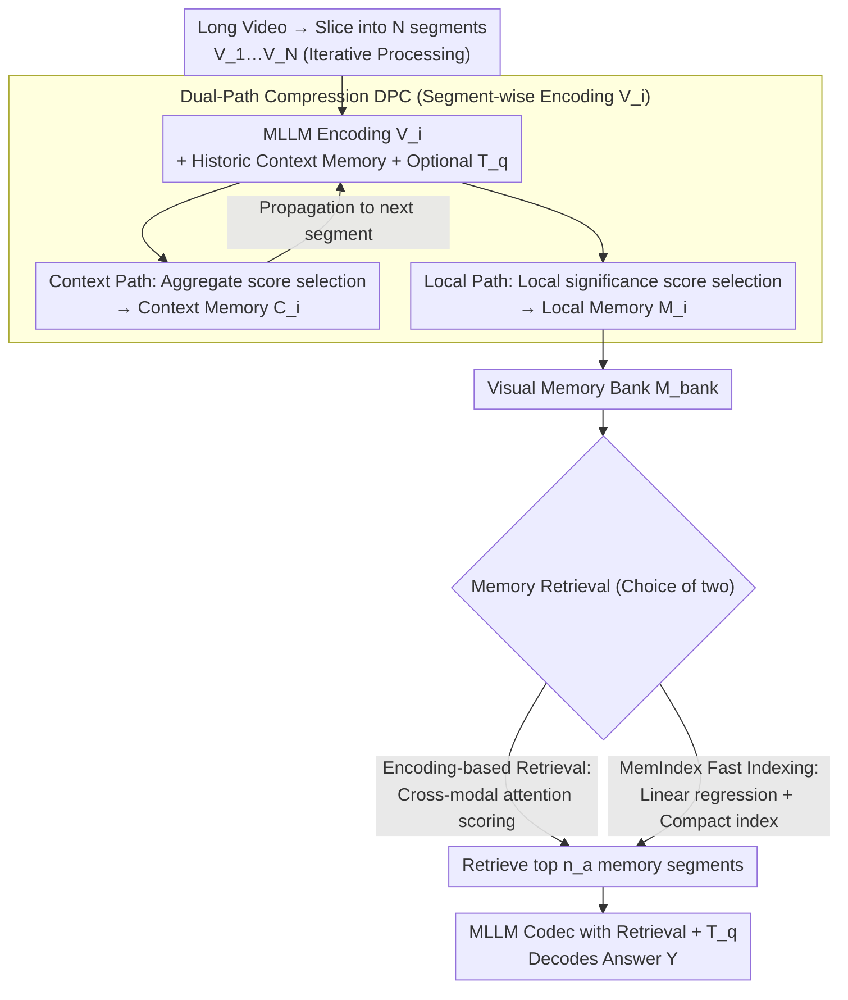

# Scaling the Long Video Understanding of Multimodal Large Language Models via Visual Memory Mechanism

**Conference**: CVPR2026  
**arXiv**: [2603.29252](https://arxiv.org/abs/2603.29252)  
**Code**: [FlexMem](https://github.com/FlexMem)  
**Area**: Multimodal VLM  
**Keywords**: Long Video Understanding, Visual Memory, KV Cache Compression, Training-free, Streaming Video

## TL;DR
The authors propose FlexMem, a training-free visual memory mechanism that constructs a visual memory bank through iterative dual-path KV cache compression. Combined with encoding-based and fast-indexing memory retrieval strategies, it enables MLLMs to process long videos exceeding 1000 frames on a single NVIDIA RTX 3090 GPU, significantly outperforming existing efficient video understanding methods.

## Background & Motivation
Long video understanding remains a core challenge for MLLMs. The primary difficulty lies in the vast number of visual tokens in long videos, which easily exceed the sequence length limits of MLLMs (e.g., 1024 frames can generate over 200K tokens), leading to performance degradation and massive memory overhead.

Limitations of Prior Work: (1) **RAG Methods** (e.g., AKS): These retrieve keyframes and perform local processing, excelling at needle-in-haystack tasks but failing in tasks requiring global understanding, while still being constrained by memory; (2) **Visual Compression Methods** (e.g., AdaRETAKE): These compress the KV cache to increase the number of input frames but still require all compressed features to be input simultaneously for decoding, leaving the computational bottleneck unresolved as input length grows linearly with video duration.

**Core Idea**: Mimic human video-watching behavior—continuous observation, memory formation, and question answering based on relevant memory segments. By iteratively processing video segments to form a fixed-size memory bank, the method breaks the input length limit, theoretically allowing for the processing of infinitely long videos.

## Method

### Overall Architecture
FlexMem aims to solve the issue of "sequence length explosion" when feeding long videos into MLLMs. It simulates human memory—instead of remembering 1000+ frames at once, it compresses while watching to form a fixed-size memory bank and retrieves relevant segments to answer questions. Specifically, a long video is divided into $N$ segments $\{V_1, ..., V_N\}$ and processed iteratively: each segment is encoded with historical context memory. Through dual-path compression, it produces two outputs—context memory $C_i$ for the next segment and local memory $M_i$ stored in the bank. After processing, the most relevant segments are retrieved from the bank to generate answers. Since the memory bank size is fixed, the input length no longer grows linearly, theoretically supporting infinite video length.

### Key Designs

**1. Dual-Path Compression: Fundamentally different token requirements for prefill and decoding**

Using a single compression strategy either loses "connector tokens" needed for cross-segment information flow or retains redundant tokens useless for final decoding. FlexMem utilizes two paths. One path generates context memory $C_i$ for information propagation during the prefill phase, using an aggregate score $s_j^l = \sum_{k \in C} a_{jk}^l + \sum_{h \in V_i} a_{hj}^l$ to select tokens—retaining those that both aggregate info from history and propagate it forward, with a compression ratio $\alpha_c$. The other path generates local memory $M_i$ for the bank to be used in decoding, using a local significance score $\hat{s}_j^l = \sum_{k \in V_i} a_{kj}^l$ to select the most discriminative tokens within a segment, with ratio $\alpha_s$. Context memory ensures **continuity** between iterations, while local memory ensures the **uniqueness** of evidence in each segment.

**2. Encoding-based Memory Retrieval: Using cross-modal attention as a similarity metric**

Given the many segments in the bank, not all can be fed into the model during answering. FlexMem uses the MLLM's own cross-modal attention weights as a relevance signal during segment encoding (optionally including the question $T_q$): $g_i = \sum_{l=3}^{L} \sum_{j \in T_q} \sum_{k \in V_i} a_{jk}^l$. It retrieves the $n_a$ segments with the highest scores. This avoids introducing extra retrieval models and reuses the model's inherent attention mechanism.

**3. MemIndex Fast Indexing: Eliminating "repeated inference for retrieval"**

A bottleneck in encoding-based retrieval is the need to re-run encoding for every new question. MemIndex uses linear regression to fit the results of encoding-based retrieval $\arg\min_\sigma \sum_i \|\sigma(R_i) - g_i\|_2$, approximating retrieval as a lightweight look-up. It selects $K=3$ key cache layers and $k=5$ salient tokens per layer to form a compact index tensor, using only the last token's features from the question. It achieves 95%+ of the performance of encoding-based retrieval while supporting offline indexing and multi-query scenarios.

### Loss & Training
- **Fully Training-free**: FlexMem requires no additional training and can be directly applied to existing MLLMs.
- Layer weights $\alpha^l$ for MemIndex are obtained via linear regression fitting on a small dataset.
- Validated on LLaVA-Video and LLaVA-OneVision backbones.

## Key Experimental Results

### Main Results (LLaVA-Video 7B, single 3090 GPU)

| Method | Sampling Frames | Input Tokens | TimeScope | LVBench | Video-MME(All) | LongVideoBench(All) |
|------|---------|-----------|-----------|---------|----------------|---------------------|
| LLaVA-Video Baseline | 32frm | 7k | 58.3 | 41.4 | 61.7 | 58.6 |
| AKS (RAG) | 1fps | 7k | 84.6 | 46.6 | 62.8 | 59.7 |
| AdaRETAKE (Comp.) | 384frm | 40k | 78.2 | 46.8 | 63.6 | 59.8 |
| **FlexMem** | 512/1024frm | 13k | **85.6** | **50.2** | **64.6** | **63.0** |

### vs SOTA MLLM Comparison

| Method | TimeScope | LVBench | MLVU | Video-MME(All) | LongVideoBench |
|------|-----------|---------|------|----------------|----------------|
| GPT-4o | - | 27.0 | 64.6 | 71.9 | 66.7 |
| Gemini-1.5-Pro | - | 33.1 | - | 75.0 | 64.0 |
| LLaVA-Video+FlexMem | 85.9 | **51.0** | 72.4 | 64.7 | 63.6 |

### Ablation Study

| Design Choice | LongVideoBench(All) | LVBench |
|---------|---------------------|---------|
| Context Compression Only | 62.5 | 49.9 |
| Local Compression Only | 62.6 | 49.7 |
| **Dual-Path Compression** | **63.6** | **51.0** |
| Full Memory Bank (No Retrieval) | 59.8 | 49.3 |
| **Memory Retrieval** | **63.6** | **51.0** |

### Key Findings
- FlexMem yields a 32.2% Gain on TimeScope and 19.7% on LVBench for LLaVA-Video.
- On a single 3090 GPU, it outperforms AKS and AdaRETAKE by 3.9% and 5.2% respectively (average across five benchmarks).
- Elevates LLaVA-Video performance close to Gemini-1.5-Pro, exceeding it by 54.1% on LVBench.
- Dual-path compression outperforms single-path by 1-1.3%, proving the complementarity of context continuity and local significance.
- Using the full memory (no retrieval) results in a 3.8% drop, highlighting the importance of retrieval in filtering noise.
- 8 frames per segment is optimal; longer segments (16/32 frames) decrease performance due to information redundancy.
- MemIndex performs excellently in streaming QA scenarios with a minimal gap (<1%) compared to encoding-based retrieval.

## Highlights & Insights
- **Elegant Human-like Modeling**: The paradigm of iterative processing + memory formation + selective recall is natural and highly effective.
- **Unique Dual-Path Design**: Context memory ensures continuity while local memory ensures uniqueness, catering to different requirements of various stages.
- **Engineering Value of MemIndex**: The use of simple linear regression and layer/token selection reduces memory retrieval overhead to extremely low levels.
- **Extreme Resource Efficiency**: Processes 1000+ frames on a single 3090 GPU while outperforming methods requiring higher resources.
- The training-free design makes it a plug-and-play enhancement for any video-MLLM.

## Limitations & Future Work
- Iterative processing of segments still requires step-by-step inference; total processing time for extremely long videos may be significant (though memory remains constant per step).
- Context memory only retains the $n_s$ most recent segments, potentially missing dependencies across very large time spans.
- MemIndex's linear regression fitting requires a small amount of annotated data, introducing some distribution dependency.
- Evaluations are limited to LLaVA-Video and LLaVA-OneVision; generalization to other architectures (e.g., Qwen-VL) remains to be verified.

## Related Work & Insights
- **vs AKS (RAG Method)**: While RAG excels at precise localization, it lacks global understanding; FlexMem balances both through iterative memory.
- **vs AdaRETAKE (Compression Method)**: AdaRETAKE's one-time input of all features causes computational bottlenecks; FlexMem decouples encoding and decoding via the memory bank and retrieval.
- **vs Video-XL (Special Token Method)**: Video-XL uses special tokens for summarization, but input grows linearly; FlexMem maintains a fixed memory bank size.

## Rating
- Novelty: ⭐⭐⭐⭐ Innovative dual-path compression and MemIndex; the visual memory paradigm is worth promoting.
- Experimental Thoroughness: ⭐⭐⭐⭐⭐ 5 long video + 1 streaming benchmark, two backbone models, detailed ablations, and resource-constrained comparisons.
- Writing Quality: ⭐⭐⭐ Method section is formula-heavy but logically clear; some linguistic refinements possible.
- Value: ⭐⭐⭐⭐⭐ High practical value for 1000+ frame processing on a 3090; training-free + plug-and-play suitability for broad applications.

<!-- RELATED:START -->

## Related Papers

- [\[CVPR 2026\] ReMoRa: Multimodal Large Language Model based on Refined Motion Representation for Long-Video Understanding](remora_multimodal_large_language_model_based_on_refined_motion_representation_fo.md)
- [\[CVPR 2026\] REVISOR: Beyond Textual Reflection, Towards Multimodal Introspective Reasoning in Long-Form Video Understanding](revisor_beyond_textual_reflection_towards_multimodal_introspective_reasoning_in_.md)
- [\[CVPR 2026\] TimeViper: A Hybrid Mamba-Transformer Vision-Language Model for Efficient Long Video Understanding](timeviper_a_hybrid_mamba-transformer_vision-language_model_for_efficient_long_vi.md)
- [\[CVPR 2025\] Video-XL: Extra-Long Vision Language Model for Hour-Scale Video Understanding](../../CVPR2025/multimodal_vlm/video-xl_extra-long_vision_language_model_for_hour-scale_video_understanding.md)
- [\[CVPR 2026\] MSJoE: Jointly Evolving MLLM and Sampler for Efficient Long-Form Video Understanding](msjoe_jointly_evolving_mllm_and_sampler_for_efficient_long-form_video_understand.md)

<!-- RELATED:END -->
