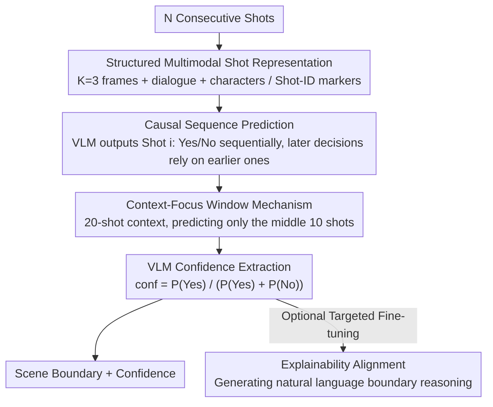

# Scene-VLM: Multimodal Video Scene Segmentation via Vision-Language Models

**Conference**: CVPR2026  
**arXiv**: [2512.21778](https://arxiv.org/abs/2512.21778)  
**Code**: None  
**Area**: Multimodal VLM  
**Keywords**: Video scene segmentation, Vision-Language Models, Multimodal reasoning, Sequence prediction, Confidence estimation

## TL;DR
Proposes Scene-VLM—the first video scene segmentation framework based on fine-tuned VLMs. By utilizing structured multimodal shot representations (visual frames + dialogue + metadata), causal sequence prediction, a context-focus window mechanism, and token logit confidence extraction, it achieves significant gains of +6 AP and +13.7 F1 on MovieNet and demonstrates natural language explanation capabilities.

## Background & Motivation
Video scene segmentation (partitioning long videos into semantically coherent scenes) is a foundational task in video understanding, essential for applications such as automated structured summarization and semantic retrieval. Formally, a scene consists of consecutive shots sharing the same location, time, characters, or narrative theme.

Three major limitations of prior encoder-based methods (BaSSL, TranS4mer, MEGA): (1) **Visual Over-reliance**: Ignores or underutilizes non-visual signals such as dialogue and characters; (2) **Pointwise Independent Prediction**: Each shot is classified independently without leveraging causal dependencies between consecutive decisions; (3) **Lack of Explainability**: Outputs only confidence scores, failing to explain why a boundary was predicted.

**Core Idea**: Leveraging VLM multimodal reasoning and text generation capabilities to redefine scene segmentation as a sequence generation task that sequentially outputs "Shot i: Yes/No," naturally achieving causal dependency, multimodal fusion, and explainability.

## Method

### Overall Architecture
Scene-VLM transforms video scene segmentation from traditional encoder-based per-shot classification into a VLM sequence generation task. Based on a fine-tuned Qwen2.5-VL-7B, the input comprises multimodal representations of $N$ consecutive shots (visual frames + dialogue + character IDs). The model sequentially generates "Shot i: Yes/No" judgments for each shot within a focus window and extracts confidence scores from the judgment token logits. This reformulation integrates multimodal fusion, inter-shot causal dependencies, and explainability into a single generative framework.

### Key Designs

**1. Structured Multimodal Shot Representation: Incorporating non-visual signals like dialogue and characters**

Prior encoder methods overemphasize visual features and underestimate or ignore narrative signals like dialogue and characters. Scene-VLM equips each shot $s_i$ with $K=3$ sampled frames, synchronized subtitles, and character information. It overlays a visual identifier (shot-ID marker) on each frame to help the model associate visual content with the shot numbers mentioned in the text, providing narrative context invisible to visual-only methods.

**2. Causal Sequence Prediction: Making preceding decisions visible to each boundary judgment**

A drawback of pointwise independent classification is that shots are judged in isolation, failing to use "causal dependencies between decisions." By reformulating this as sequence generation, the model outputs Yes/No for multiple shots sequentially. Each boundary judgment causally influences subsequent ones by using previous predictions as context. Attention analysis confirms the model "trusts" previous decisions, allocating less attention to processed shots and more to those pending judgment.

**3. Context-Focus Window Mechanism: Providing sufficient evidence for every judged shot**

Shots at the ends of a sequence naturally lack context on one side, leading to performance drops at the edges. Scene-VLM uses a 20-shot context window but only performs predictions for the middle 10 shots (focus window), ensuring each evaluated shot has ample evidence from both sides. Ablations show that removing this mechanism causes a sharp drop in F1 at edge positions, while its presence ensures consistency.

**4. VLM Confidence Extraction: Reading scores from Yes/No logits**

Unlike encoders with classification heads, VLMs do not directly provide scores. Scene-VLM calculates normalized confidence from the softmax logits of the judgment tokens: $\text{conf}_i = P(\text{Yes}) / (P(\text{Yes}) + P(\text{No}))$. This allows for precision-recall trade-offs similar to traditional methods. This simple technique enables any binary classification-style VLM output to yield adjustable confidence scores.

**5. Explainability Alignment: Enabling the model to state "why this is a boundary"**

While encoders only output a confidence score, Scene-VLM can generate coherent natural language explanations (e.g., "The scene transitions from indoors to outdoors, and both the characters and narrative topic have changed") through targeted fine-tuning on a small set of samples with annotated explanations.

### Loss & Training
- Standard next-token prediction loss
- Base Model: Qwen2.5-VL-7B
- Training Data: MovieNet-318 (190 movies for training)

## Key Experimental Results

### Main Results (MovieNet-318)

| Method | F1 ↑ | AP ↑ |
|------|------|------|
| BaSSL | 47.0 | 57.4 |
| TranS4mer | 48.4 | 60.8 |
| MEGA | 55.3 | 58.6 |
| Chapter-LLaMA | 38.6 | 41.5 |
| **Scene-VLM (Ours)** | **62.1** | **66.8** |

### Zero-shot Cross-domain (BBC Planet Earth)

| Method | AP ↑ |
|------|------|
| TranS4mer | 43.6 |
| **Scene-VLM (Ours)** | **45.8** |

### Ablation Study

| Configuration | F1 | AP | Description |
|------|----|----|------|
| Ours | 62.1 | 66.8 | - |
| No vision | 32.0 | 34.7 | Vision is the core signal |
| No Shot-ID | 60.8 | 64.1 | Temporal anchoring is valuable |
| No subtitles | 61.1 | 62.2 | Subtitles provide complementary signals |
| Vision only | 58.6 | 61.4 | Multimodal fusion provides +3.5 F1 |
| Context 20 + Focus 10 | **62.1** | - | Optimal configuration |
| Context 20 + Focus 1 (Pointwise) | 60.1 | - | Sequence prediction outperforms pointwise |
| Context 5 + Focus 5 | 55.8 | - | Larger context is better |

### Model Scale Impact

| Parameters | F1 | AP |
|--------|----|----|
| 1.5B | 55.9 | 58.7 |
| 3B | 59.6 | 62.8 |
| **7B** | **62.1** | **66.8** |

### Key Findings
- Vision is the most important signal source (F1 drops 30 points without it), but subtitles and character IDs provide irreplaceable supplementary information.
- Attention analysis shows that after length normalization, the attention on subtitle and character tokens is comparable to visual tokens.
- The model shows higher attention toward subsequent shots than preceding ones, as preceding info is already encoded in the output tokens.
- The focus mechanism is critical for edge positions: F1 drops sharply at edges without it but remains consistent across positions with it.
- Performance improves monotonically from 1.5B to 7B parameters, with significant gains at 7B suggesting potential benefits from even larger models.

## Highlights & Insights
- **Paradigm Shift**: Transitioning from an encoder classification framework to a VLM sequence generation framework addresses multimodal fusion, sequence dependency, and explainability simultaneously.
- **Confidence Extraction Technique**: The method of calculating normalized confidence from Yes/No logits is simple and effective, providing a general solution for applying VLMs to binary classification tasks.
- **Deep Attention Analysis**: Reveals the information flow pattern in VLMs during scene boundary prediction—trusting historical predictions while focusing heavily on future context.
- Zero-shot generalization on BBC indicates the framework is not restricted to the movie domain.

## Limitations & Future Work
- Sampling 3 frames per shot might be insufficient to capture scenes with intense intra-shot motion.
- A 20-shot context window may be inadequate for extremely long movies; hierarchical or memory-augmented expansions are needed.
- Inference speed may be slower than lightweight encoder methods (latency not reported).
- Explainability alignment requires manual annotation of explanation samples, involving non-negligible costs.

## Related Work & Insights
- **vs MEGA**: MEGA also fuses subtitles and scripts but uses a fixed fusion strategy and pointwise prediction; Scene-VLM is more flexible with end-to-end VLM reasoning.
- **vs Chapter-LLaMA**: An LLM-based chaptering method that only uses text descriptions without direct visual processing; its F1 on MovieNet is only 38.6.
- **vs TranS4mer**: Uses self-attention and SSM for long-range dependency but remains an encoder-based approach without explainability.

## Rating
- Novelty: ⭐⭐⭐⭐⭐ First application of VLM to video scene segmentation; paradigm innovation solves multiple long-standing pain points.
- Experimental Thoroughness: ⭐⭐⭐⭐⭐ Extremely detailed ablations (modalities, windows, frames, scale) and in-depth attention analysis.
- Writing Quality: ⭐⭐⭐⭐⭐ Clear structure and intuitive diagrams; logic from methodology to analysis is complete.
- Value: ⭐⭐⭐⭐ Provides a new paradigm for video structural understanding; confidence extraction and explainability designs have broad transfer value.

<!-- RELATED:START -->

## Related Papers

- [\[CVPR 2026\] RE-VLM: Event-Augmented Vision-Language Model for Scene Understanding](re-vlm_event-augmented_vision-language_model_for_scene_understanding.md)
- [\[CVPR 2026\] HOG-Layout: Hierarchical 3D Scene Generation, Optimization and Editing via Vision-Language Models](hog_layout_hierarchical_3d_scene_generation_optimization_and_editing.md)
- [\[CVPR 2026\] Can We Build Scene Graphs, Not Classify Them? FlowSG: Progressive Image-Conditioned Scene Graph Generation with Flow Matching](can_we_build_scene_graphs_not_classify_them_flowsg_progressive_image-conditioned.md)
- [\[CVPR 2025\] Embodied Scene Understanding for Vision Language Models via MetaVQA](../../CVPR2025/multimodal_vlm/embodied_scene_understanding_for_vision_language_models_via_metavqa.md)
- [\[CVPR 2026\] InfiniBench: Infinite Benchmarking for Visual Spatial Reasoning with Customizable Scene Complexity](infinibench_infinite_benchmarking_for_visual_spatial_reasoning_with_customizable.md)

<!-- RELATED:END -->
