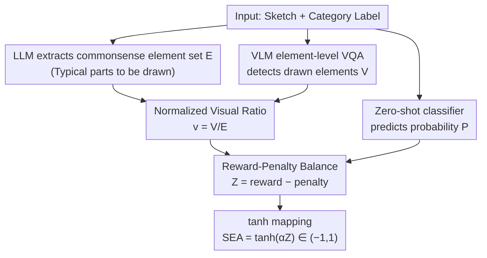

# SEA: Evaluating Sketch Abstraction Efficiency via Element-level Commonsense Visual Question Answering

**Conference**: CVPR 2026  
**Paper**: [CVF Open Access](https://openaccess.thecvf.com/content/CVPR2026/html/Park_SEA_Evaluating_Sketch_Abstraction_Efficiency_via_Element-level_Commonsense_Visual_Question_CVPR_2026_paper.html)  
**Code**: None (Project Page: https://zihos.github.io/SEA/)  
**Area**: Multi-modal VLM  
**Keywords**: Sketch understanding, abstraction efficiency evaluation, reference-free metrics, commonsense visual elements, element-level VQA

## TL;DR
Addressing the lack of suitable metrics for "sketch quality," this paper proposes SEA, a reference-free metric that combines three signals—recognition probability $P$, total number of commonsense elements $E$, and the number of elements actually drawn $V$—into a reward-penalty score. It specifically measures the abstraction efficiency of "preserving recognizability with minimal strokes." The authors also release CommonSketch, the first sketch dataset with element-level annotations (300 classes, 23,100 human sketches). Experiments demonstrate that SEA achieves high alignment with human judgment (approx. 88%).

## Background & Motivation
**Background**: Sketches are the most refined visual expressions, conveying semantics with just a few strokes. Current sketch research focuses on two main tasks: sketch classification (labeling) and sketch-photo matching (sketch-photo retrieval). When evaluating the quality of generated sketches, researchers typically borrow general image metrics such as Top-K classification accuracy, FID, SSIM, LPIPS, DreamSim, and CLIPScore.

**Limitations of Prior Work**: These approaches fail to capture the essence of sketching. ① Dataset level: TU-Berlin, Sketchy, QuickDraw, and SEVA provide either "sketch-label" or "sketch-photo" pairs, but none record element-level information, such as which diagnostic parts should be included or omitted. ② Metric level: Metrics like FID/SSIM/LPIPS are designed for photorealism. They are either reference-based or only measure pixel similarity/recognizability, failing to answer whether a sketch efficiently conveys a concept using minimal elements.

**Key Challenge**: The defining attribute of a sketch is **deliberate abstraction**—retaining only a small set of "diagnostic visual elements" for recognizability. However, existing metrics reward "more detail" (closer to photos), which contradicts abstraction efficiency. A detailed drawing might achieve high SSIM or classification confidence, yet represent an "abstraction failure." There is a trade-off between recognizability and visual economy that no existing metric explicitly characterizes.

**Goal**: ① Construct a dataset capable of element-level reasoning for sketches; ② Design a reference-free metric that quantifies "abstraction efficiency."

**Key Insight**: The authors observe that each category possesses a set of "commonsense visual representatives"—humans usually draw wings for birds, handles for mugs, and spokes/wheels for bicycles. By using an LLM to list these "expected elements" and a VLM to detect "actually drawn elements," the abstraction process can be explicitly quantified.

**Core Idea**: Use "category commonsense elements" as anchors to upgrade sketch evaluation from label prediction to element-level reasoning. A good sketch = high recognition probability (high $P$) preserved with as few commonsense elements as possible (low $v$).

## Method

This work is "dataset + metric" oriented, consisting of the construction of the CommonSketch dataset and the formulaic definition of the SEA metric.

### Overall Architecture
The design goal of SEA is to output a continuous score in the range of $(-1, 1)$ for a given sketch and its category label, where higher scores indicate more efficient abstraction. It fuses three complementary signals: ① Prediction probability $P$ of the correct class from a zero-shot classifier (measuring recognizability); ② The set of "drawable elements" $\mathcal{E}$ extracted by an LLM from commonsense knowledge, where $E=|\mathcal{E}|$; ③ The subset of elements $\mathcal{V}\subseteq\mathcal{E}$ actually detected in the sketch by a VLM via element-level VQA, where $V=|\mathcal{V}|$. This defines the normalized visual ratio $v = V/E \in [0,1]$, representing the proportion of commonsense elements expressed. These signals enter a "reward-penalty" structure mapped by $\tanh$. The pipeline is as follows:

On the data side, CommonSketch provides the "anchors" for this pipeline—manually verified versions of the commonsense element set $\mathcal{E}$ for each class, along with element-level binary annotations (present/absent) for each sketch, the latter serving as the ground truth for VLM element-level VQA.

### Key Designs

**1. CommonSketch Dataset: Turning "Abstraction" into Annotated Element-level Supervision**

To address the lack of element-level reasoning in existing datasets, the authors built the first sketch dataset with element-level commonsense annotations. Selecting 300 classes from TU-Berlin and QuickDraw (categorized into 14 macro-categories like food, animal, clothing, vehicle, etc.), they collected 23,100 human sketches (approx. 77 per class) drawn by 12 volunteers on tablets within 60–80 seconds. The pipeline involved four steps: ① **Collection**: 512×512 PNGs; ② **Caption Generation and Verification**: GPT-4o generated captions and served as a filter—sketches were discarded if the target label was missing from the caption; ③ **Commonsense Extraction**: LLMs (GPT-4o, Llama3, etc.) extracted "externally visible" parts, with human auditors removing internal elements like "heart" or "brain"; ④ **Element-level Annotation**: Human annotators performed binary (present/absent) labeling for each commonsense element across all sketches.

**2. Overall Structure of SEA: Reward-Penalty Decomposition + Tanh Bounded Mapping**

To provide a reference-free, interpretable, and continuous abstraction efficiency score, SEA compresses a latent "efficiency signal" $Z$ using a hyperbolic tangent:

$$\mathrm{SEA} = \tanh(\alpha Z), \qquad Z = \mathrm{reward}(P, v) - \mathrm{penalty}(P, v)$$

Where $\alpha>0$ controls sensitivity near the decision boundary. $Z>0$ indicates "maintaining high recognition probability with minimal visual detail" (efficient abstraction), while $Z<0$ indicates either over-drawing or insufficient recognizability. This explicit decomposition allows for diagnostic analysis—low scores can be traced back to poor recognition (low $P$) or excessive detail (high $v$).

**3. Reward and Penalty Terms: Characterizing Abstraction via the "Self-consistency Line $v=P$"**

The reward term encourages "minimal drawing while maintaining recognizability":

$$\mathrm{reward}(P, v) = P^{\gamma}\, u(v)\, g(P, v)$$

The factor $u(v) = \log\frac{1+\delta}{v+\delta}$ rewards "economy of expression"; a smaller $v$ yields a larger $u(v)$. The factor $g(P,v) = \tanh\!\big(\frac{\beta}{2}\log\frac{P+\delta}{v+\delta}\big)$ acts as a **centering gate** defining a self-consistency line: $g=0$ when $v=P$; $g>0$ amplifies the reward when $v<P$ (high recognizability with few elements); $g<0$ suppresses it when $v>P$ (too much detail relative to recognizability). The penalty term suppresses "drawn much but unidentifiable":

$$\mathrm{penalty}(P, v) = \lambda\, v^{\eta}(1-P)^{k} + \tau\,(1-P)^{r}$$

The first part penalizes high $v$ with low $P$, while the second part is a baseline penalty for sketches that are simply unrecognizable regardless of $v$.

### An Example: How SEA Distinguishes Abstraction Levels
Using sketches from the SEVA dataset drawn under 4/8/16/32-second constraints: A 4-second sketch is too messy, having a low $P$ (~0.17) and an SEA of -0.56 (abstraction failure). As the time limit increases to 16 and 32 seconds, $P$ rises to 0.64 and 0.75 while $v$ only increases slightly from 0.40 to 0.45, resulting in SEA scores of 0.29 and 0.43 (efficient abstraction). This demonstrates that SEA rewards "increases in $P$ without significant increases in $v$."

## Key Experimental Results

### Main Results: SEA Monotonically Increases with Abstraction Levels (SEVA Dataset)
With fixed hyperparameters, SEA increases monotonically across the four time levels (4/8/16/32s) in SEVA, as the reward increases and the penalty decreases:

| Metric | Level 4 | Level 8 | Level 16 | Level 32 |
|------|---------|---------|----------|----------|
| SEA | −0.56±0.32 | −0.23±0.30 | 0.29±0.24 | 0.43±0.29 |
| reward(P,v) | 0.16±0.20 | 0.30±0.20 | 0.52±0.20 | 0.57±0.26 |
| penalty(P,v) | 0.53±0.11 | 0.41±0.09 | 0.24±0.09 | 0.18±0.11 |
| visual ratio v | 0.22±0.06 | 0.31±0.08 | 0.40±0.08 | 0.45±0.10 |
| prediction P | 0.17±0.17 | 0.37±0.15 | 0.64±0.11 | 0.75±0.11 |

### Element-level Commonsense VQA: VLM Benchmark
Evaluation of VLMs detecting "which elements are drawn" against CommonSketch ground truth: GPT-4o is the strongest (F1=0.881). Though Molmo has the highest recall (0.949), it suffers from a severe false-positive bias. Qwen2.5-VL is selected as the best open-source VLM due to its alignment with GPT-4o's prediction patterns.

| Model | Precision↑ | Recall↑ | F1↑ | Accuracy↑ |
|------|-----------|---------|-----|-----------|
| LLaVA | 0.749 | 0.819 | 0.782 | 0.706 |
| Molmo | 0.798 | **0.949** | 0.867 | 0.812 |
| Qwen2.5-VL | 0.898 | 0.782 | 0.836 | 0.802 |
| **GPT-4o** | **0.935** | 0.832 | **0.881** | **0.855** |

### Key Findings
- **High Human Alignment**: In ranking tasks, the human agreement rate with SEA reaches 87.8% (closed) and 88.0% (open-source), confirming that SEA captures the consensus on "abstraction quality."
- **Open-source Pipeline Equivalence**: Element extraction ($E$) using GPT-OSS 20B is comparable to GPT-4o. Paired with Qwen2.5-VL, OpenSEA is as reliable as the closed-source version.
- **CommonSketch Quality**: Ground-truth class prediction probability $\mu=0.86$ in CommonSketch is significantly higher than in TU-Berlin ($\mu=0.62$) and QuickDraw ($\mu=0.29$), resulting in higher SEA scores.
- **Extrapolation to Unseen Classes**: SEA provides consistent scores for classes outside the 300-class set (e.g., mosquito, tank).

## Highlights & Insights
- **The "Self-consistency Line $v=P$" is Brilliant**: Coding the intuition that visual detail should match recognition probability into the zero-point of gate $g(P,v)$ allows the metric to naturally distinguish between "efficient abstraction" and "over-drawing." This "cost vs. effect" balance can generalize to other evaluation scenarios.
- **Captioning as Data Cleaning**: Using GPT-4o to verify sketches via captioning is an efficient data engineering trick to ensure label consistency.
- **Interpretability via Decomposition**: The reward-penalty split allows a low score to be diagnosed as either "low $P$" or "high $v$," making SEA an analytical tool rather than a black-box number.
- **Reference-free and Differentiable**: It works for text-to-sketch tasks where no reference exists, and its differentiability allows it to be used as a training objective.

## Limitations & Future Work
- **Strong Dependence on Base Models**: SEA relies on external VQA, classifiers, and LLMs. Biases in these models (e.g., false positives) directly affect results.
- **Limited to Single-object Sketches**: CommonSketch currently lacks multi-object or scene-based sketches. Commonsense extraction may also contain cultural biases.
- **Hyperparameter Sensitivity**: SEA involves 9 hyperparameters. While fixed in this study, their robustness needs further investigation. Since element set size $E$ varies by LLM, absolute SEA scores across different configurations should be compared cautiously.

## Related Work & Insights
- **vs. General Image Metrics**: Metrics like FID/SSIM measure distributional or pixel similarity but cannot measure "efficient expression with minimal elements." SEA is reference-free and explicitly models abstraction.
- **vs. SketchRef**: SketchRef uses structural consistency but requires reference photos; SEA does not.
- **vs. GACL**: GACL rewards complex rendering/detail for higher classification confidence; SEA avoids this "detail bias" by focusing on commonsense elements.

## Rating
- Novelty: ⭐⭐⭐⭐⭐ First "element-level abstraction efficiency" metric + first dataset with element-level commonsense annotations.
- Experimental Thoroughness: ⭐⭐⭐⭐ Solid multi-model analysis and human studies, though lacks direct quantitative comparison with SketchRef/GACL.
- Writing Quality: ⭐⭐⭐⭐ Clear motivation and readable formula decomposition; minor discrepancies in hyperparameter notation.
- Value: ⭐⭐⭐⭐ Provides a reference-free, differentiable, human-aligned tool for the sketch community.

<!-- RELATED:START -->

## Related Papers

- [\[CVPR 2026\] ChartR: Evaluating Reasoning Accuracy and Robustness in Chart Question Answering](chartr_evaluating_reasoning_accuracy_and_robustness_in_chart_question_answering.md)
- [\[CVPR 2026\] VQ-VA World: Towards High-Quality Visual Question-Visual Answering](vq-va_world_towards_high-quality_visual_question-visual_answering.md)
- [\[CVPR 2026\] StaR-KVQA: Structured Reasoning Traces for Implicit-Knowledge Visual Question Answering](star-kvqa_structured_reasoning_traces_for_implicit-knowledge_visual_question_ans.md)
- [\[CVPR 2026\] DocPrune: Efficient Document Question Answering via Background, Question, and Comprehension-aware Token Pruning](docpruneefficient_document_question_answering_via_background_question_and_compre.md)
- [\[ACL 2025\] MAGIC-VQA: Multimodal and Grounded Inference with Commonsense Knowledge for Visual Question Answering](../../ACL2025/multimodal_vlm/magic-vqa_multimodal_and_grounded_inference_with_commonsense_knowledge_for_visua.md)

<!-- RELATED:END -->
