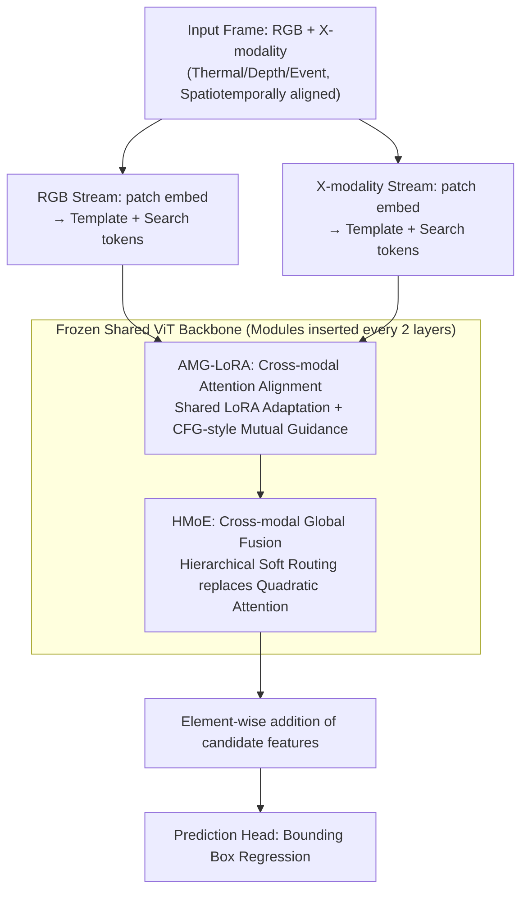

# SEATrack: Simple, Efficient, and Adaptive Multimodal Tracker

**Conference**: CVPR 2026 Oral  
**arXiv**: [2604.12502](https://arxiv.org/abs/2604.12502)  
**Code**: Available  
**Area**: Object Tracking / Multi-modality  
**Keywords**: Multi-modal tracking, Parameter-Efficient Fine-Tuning (PEFT), Attention Alignment, Mixture-of-Experts (MoE), LoRA

## TL;DR

Ours proposes SEATrack, a multi-modal tracker that achieves dynamic alignment of cross-modal attention maps via AMG-LoRA and efficient cross-modal fusion for global relation modeling via HMoE. It achieves a SOTA performance-efficiency balance in RGB-T/D/E tracking with minimal parameters.

## Background & Motivation

**Background**: Multi-modal tracking achieves all-weather robust tracking by fusing RGB with complementary data such as thermal (T), depth (D), or event (E) data. The PEFT paradigm has gradually replaced full fine-tuning to avoid catastrophic forgetting.

**Limitations of Prior Work**: The number of adjustable parameters in PEFT methods has expanded 16-fold from early methods to the latest SOTA, fundamentally contradicting the original efficiency goal of PEFT. Meanwhile, domain gaps in dual-stream architectures lead to conflicting attention maps across modalities, hindering joint representation learning.

**Key Challenge**: The performance-efficiency dilemma—more parameters yield better performance but erode the core value of PEFT.

**Goal**: (1) Break the performance-efficiency trade-off through cross-modal attention alignment; (2) Design efficient global relation modeling to replace attention-based fusion.

**Key Insight**: Multi-modal inputs are spatiotemporally aligned, meaning the intra-modal attention maps for target matching should, in principle, be consistent. This consistency can be leveraged for cross-modal mutual guidance.

**Core Idea**: AMG-LoRA uses matching information from one modality to guide the matching process of another, achieving bidirectional dynamic alignment.

## Method

### Overall Architecture

SEATrack addresses the cycle of increasing parameters in multi-modal tracking that deviates from the PEFT objective. The backbone is a dual-stream ViT: a pre-trained RGB tracker backbone is frozen, allowing the RGB stream and the X-modality stream (thermal/depth/event) to process independently. Two lightweight modules are inserted every two layers: AMG-LoRA aligns cross-modal attention maps and performs domain adaptation, while HMoE handles global fusion of features. For each frame, features of candidate targets are extracted from both modalities, aggregated via element-wise addition into a unified representation, and passed to the prediction head for bounding box regression. The total adjustable parameters are only 0.8M, with most computation occurring on the frozen backbone.

### Key Designs

**1. AMG-LoRA: Calibrating attention of one modality using matching information from another**

The primary challenge in dual-stream architectures is the domain gap—RGB and thermal cameras may focus on different areas for the same target, causing fusion to be counterproductive. SEATrack observes a neglected prior: since multimodal inputs are spatiotemporally aligned, the attention maps indicating "where the target is" should theoretically be consistent. LoRA is applied to the $K/V$ projections for domain adaptation, and cross-modal alignment is implemented as a branch trade-off inspired by Classifier-Free Guidance (CFG):

$$\textbf{attn}_{rgb} = \tilde{\textbf{attn}}_{rgb} + w_X(\tilde{\textbf{attn}}_X - \tilde{\textbf{attn}}_{rgb})$$

Here, $\tilde{\textbf{attn}}_{rgb}$ and $\tilde{\textbf{attn}}_X$ are the respective attention maps, and $w_X$ is a learnable scaling factor acting as the "guidance strength." When the X-modality is reliable, it pulls the RGB attention toward it; when unreliable, $w_X$ decreases, reverting to the RGB internal judgment. This dynamic alignment outperforms static alignment ($w=1$) by 3–5 percentage points because target saliency varies by scene. This adds only 0.02M parameters (0.12M to 0.14M) but improves LasHeR PR from 60.8 to 70.4.

Notably, the LoRA bypass is **shared** between the RGB and X streams. This halves the parameter count and encourages consistent cross-modal representations. During inference, this low-rank bypass can be merged into the original $K/V$ weights, introducing zero additional latency.

**2. HMoE: Replacing quadratic fusion with linear cost via hierarchical soft routing**

Attention-based fusion is expressive but has quadratic complexity, while local fusion is efficient but lacks global context. HMoE seeks a linear path with a global receptive field. Inserted after the attention and FFN sub-layers, it fuses template or search token sequences. Unlike standard MoE which integrates at the expert level, HMoE sinks interaction to the sub-token level. Each token is split into $h$ sub-tokens, and each expert is a low-rank linear layer. A learnable gating matrix $\boldsymbol{\Phi}$ assigns soft weights across levels, allowing fine-grained information flow without pairwise attention. HMoE matches the performance of attention fusion (70.4 vs 70.2 PR) while being ~35% faster and reducing parameters from 1.6M to under 0.8M for the total model.

### Loss & Training

Standard tracking losses (classification + regression) are used. The AMG scaling factor is initialized to 1 and adaptively tuned during training.

## Key Experimental Results

### Main Results

| Method | Parameters | LasHeR PR↑ | DepthTrack PR↑ | VisEvent PR↑ |
|------|---------|-----------|---------------|-------------|
| ProTrack | 0.3M | 52.1 | 58.3 | 65.2 |
| Un-Track | 4.8M | 65.4 | 63.8 | 69.1 |
| SDSTrack | 2.1M | 68.2 | 65.5 | 71.3 |
| **SEATrack** | **0.8M** | **70.4** | **65.5** | **71.3** |

### Ablation Study

| Configuration | LasHeR PR | Parameters | Description |
|------|----------|--------|------|
| Baseline (Frozen ViT) | 52.1 | 0M | No adaptation |
| + LoRA | 60.8 | 0.12M | Domain adaptation only |
| + AMG-LoRA | 70.4 | 0.14M | Adaptation + Alignment |
| + HMoE | 70.4 | 0.8M | Full model |
| Replace HMoE w/ Attention | 70.2 | 1.6M | 35% slower |

### Key Findings

- AMG-LoRA increases parameters by only 0.02M (from 0.12M in standard LoRA to 0.14M) but provides a nearly 10% PR improvement.
- HMoE performs comparably to attention fusion while being 35% faster.
- CFG-inspired dynamic alignment outperforms static alignment ($w=1$) by 3-5 percentage points.

## Highlights & Insights

- The use of Classifier-Free Guidance for cross-modal alignment in tracking is a clever analogy: treating modality reliability as "conditional" vs. "unconditional" branches.
- The insight that "cross-modal attention alignment is key to breaking the performance-efficiency dilemma" is generalizable to other multi-modal tasks.

## Limitations & Future Work

- Validation is limited to tracking; performance on detection or segmentation is untested.
- The number of experts and heads in HMoE requires manual tuning.
- Scenarios involving more than two modalities were not considered.
- AMG could be extended to more complex types of attention alignment.

## Related Work & Insights

- **vs SDSTrack**: SDSTrack reuses frozen attention layers for global interaction but suffers from high complexity; SEATrack replaces this with HMoE.
- **vs ProTrack**: ProTrack pioneered prompt tuning for tracking but lacks expressiveness; SEATrack's AMG-LoRA is more effective.

## Rating

- Novelty: ⭐⭐⭐⭐ AMG-LoRA and HMoE designs are innovative.
- Experimental Thoroughness: ⭐⭐⭐⭐ Comprehensive evaluation across RGB-T/D/E tasks.
- Writing Quality: ⭐⭐⭐⭐ Clear motivation and design logic.
- Value: ⭐⭐⭐⭐ Significant reference value for multi-modal PEFT.

<!-- RELATED:START -->

## Related Papers

- [\[CVPR 2026\] ReaGEN: Adaptive Generation of Structured Chains-of-Thought for Efficient Multimodal Reasoning](reagen_adaptive_generation_of_structured_chains-of-thought_for_efficient_multimo.md)
- [\[CVPR 2026\] AdaptVision: Efficient Vision-Language Models via Adaptive Visual Acquisition](adaptvision_efficient_vision-language_models_via_adaptive_visual_acquisition.md)
- [\[ACL 2025\] AVG-LLaVA: An Efficient Large Multimodal Model with Adaptive Visual Granularity](../../ACL2025/multimodal_vlm/avg-llava_an_efficient_large_multimodal_model_with_adaptive_visual_granularity.md)
- [\[ICCV 2025\] LLaVA-PruMerge: Adaptive Token Reduction for Efficient Large Multimodal Models](../../ICCV2025/multimodal_vlm/llava-prumerge_adaptive_token_reduction_for_efficient_large_multimodal_models.md)
- [\[ACL 2025\] MadaKV: Adaptive Modality-Perception KV Cache Eviction for Efficient Multimodal Long-Context Inference](../../ACL2025/multimodal_vlm/madakv_adaptive_modality-perception_kv_cache_eviction_for_efficient_multimodal_l.md)

<!-- RELATED:END -->
