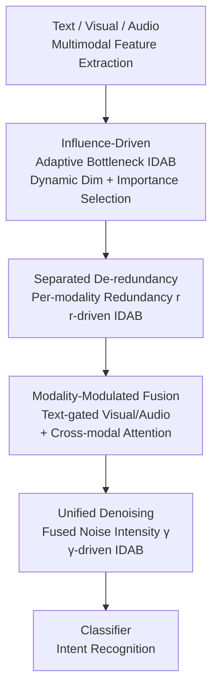

# SeD-UD: An Influence-Driven and Hierarchically-Decoupled Information Bottleneck for Multimodal Intent Recognition

**Conference**: CVPR 2026  
**Paper**: [CVF Open Access](https://openaccess.thecvf.com/content/CVPR2026/html/Li_SeD-UD_An_Influence-Driven_and_Hierarchically_Decoupled_Information_Bottleneck_for_Multimodal_Intent_CVPR_2026_paper.html)  
**Code**: https://github.com/9meiye/SeD-UD  
**Area**: Multimodal VLM  
**Keywords**: Multimodal Intent Recognition, Information Bottleneck, Adaptive Compression, De-redundancy and Denoising Decoupling, Feature Purification

## TL;DR
Addressing the coexistence of redundancy and noise in text/audio/visual features for multimodal intent recognition, SeD-UD proposes an Influence-Driven Adaptive Bottleneck (IDAB) that dynamically adjusts the bottleneck dimension per sample. It hierarchically decouples the process into two steps: parallel unimodal de-redundancy followed by unified denoising after fusion, outperforming existing SOTA on MIntRec, MELD-DA, and CH-SIMS.

## Background & Motivation
**Background**: Multimodal Intent Recognition (MIR) aims to infer user intent from complementary text, audio, and visual information. The mainstream approach involves designing various cross-modal fusion strategies to learn discriminative representations. Recently, a significant branch has introduced Information Bottleneck (IB) principles—compressing and reconstructing fused features to discard redundancy and noise while retaining discriminative information (e.g., InMu-Net, DIB, MIB).

**Limitations of Prior Work**: Visual and audio modalities often have low Signal-to-Noise Ratios (SNR), leading to spurious correlations between noise and intent labels. While text has a high SNR, it contains semantic noise such as ambiguity and irony. Additionally, weakly correlated redundancy between modalities introduces inconsistent signals that interfere with fusion. Existing IB methods suffer from two major flaws: (1) **Fixed bottleneck dimensions**: A one-size-fits-all compression dimension cannot adapt to sample-level variations in redundancy and noise, leading to the accidental deletion of discriminative features when redundancy is low, or residual interference when redundancy is high. (2) **Coupled handling of redundancy and noise**: Performing de-redundancy and denoising in a single compression step is suboptimal because redundancy arises from cross-modal overlaps while noise stems from unimodal distortions; treating them uniformly weakens the suppression effect.

**Key Challenge**: There is a need for a sample-level trade-off between information retention and interference suppression. Fixed dimensions and unified compression fail to adapt and couple two distinct types of interference.

**Goal**: To enable the IB framework to (a) adaptively adjust capacity based on the input and (b) hierarchically decouple de-redundancy and denoising.

**Core Idea**: Replace fixed bottlenecks with an adaptive bottleneck, IDAB, driven by influence factors with dynamic dimension and parameter selection. Deploy it in the SeD-UD (Separated de-redundancy and Unified Denoising) architecture: parallel de-redundancy $\rightarrow$ fusion $\rightarrow$ unified denoising.

## Method

### Overall Architecture
SeD-UD takes raw text, visual, and audio signals as input and outputs the intent category. The pipeline consists of a reusable IDAB module and a hierarchically decoupled processing sequence: First, modality-specific encoders extract features and project them to a unified dimension $D$. Then, **the redundancy $r$ of each unimodal feature relative to the others is estimated and used to drive IDAB for de-redundancy**. Next, text features modulate visual/audio features for fusion. Finally, **noise intensity $\gamma$ is estimated from the fused features and used to drive a final IDAB for unified denoising**, after which the purified features are fed to the classifier.

The "adaptivity" stems from IDAB: Unlike traditional IB with fixed encoders/decoders and compression dimensions, IDAB takes a quantized influence factor (redundancy or noise intensity). It **calculates the optimal compression dimension $D^c$ for the specific sample and selects the Top-$D^c$ parameters from a pre-trained encoder/decoder based on parameter importance** for compression and reconstruction.

The sequence "de-redundancy $\rightarrow$ fusion $\rightarrow$ denoising" is intentional. The authors argue that de-redundancy relies on coarse-grained semantic matching of cross-modal distributions; denoising first would disturb these distributions. Conversely, noise is difficult to identify from a unimodal perspective (as useful cues in one modality might look like noise in another), and fusion introduces interactive noise from modal discrepancies. Thus, denoising must be performed uniformly after fusion.

### Key Designs

**1. IDAB: Influence-Driven Adaptive Bottleneck with Dynamic Capacity Allocation**

To address the inability of fixed dimensions to adapt to sample-level interference, IDAB varies the compression dimension and parameters based on a scalar influence factor $\alpha$ (redundancy for de-redundancy, noise intensity for denoising). This is supported by a variational derivation (Theorem 1) showing that the optimal IB representation $q^*(Z|X)$ should adapt to input noise/redundancy levels. It involves three steps:

(a) **Pre-train a linear encoder-decoder pair** ($W^{en}, W^{de}\in\mathbb{R}^{D\times D}$): This step ensures optimization stability. After convergence, first-order Taylor significance is used to score the importance of each parameter $\theta_i$ on a hold-out batch:

$$\text{Importance}(\theta_i) = \|\theta_i\|_2^2 \cdot \|\nabla_{\theta_i}\mathcal{L}^{total}\|_2^2$$

Parameters are then ranked globally ($\pi$). This criterion is similar to significance pruning (e.g., SNIP), approximating the change in loss if a parameter were removed.

(b) **Calculate compression dimension $D^c$ using $\alpha$**: First, normalize with temperature $\bar\alpha = \tanh(\alpha/\tau)/(\|\tanh(\alpha/\tau)\|_2+\epsilon)$, then pass through a learnable monotonic projection $\beta = w_2\,\text{SiLU}(w_1\bar\alpha+b_1)+b_2$, and finally apply a non-linear scaling law:

$$D^c = \min\!\big(\max(\lfloor D^{1-\beta}\rceil,\, D^{\min}),\, D^{\max}\big)$$

Boundaries are enforced by $D^{\min}$ and $D^{\max}$. The authors prove (Proposition 1) that as long as $\beta$ is non-decreasing with $\alpha$, $D^c$ is non-increasing—**samples with higher redundancy/noise receive a smaller bottleneck dimension** (harder compression), which is intuitive.

(c) **Select Top-$D^c$ parameters for execution**: $\hat W^{en}=W^{en}[:,\pi_{1:D^c}]$, etc. The final computation is $Z=\text{ReLU}(\hat W^{en\top}X+\hat b^{en})$ and $\hat X=\text{ReLU}(\hat W^{de\top}Z+b^{de})$, where $Z\in\mathbb{R}^{D^c}, \hat X\in\mathbb{R}^{D}$.

**2. Separated De-redundancy: Parallel Unimodal Processing**

SeD-UD performs de-redundancy for each modality before fusion. Given three features $F^t, F^v, F^a$, one is selected as the primary feature $F^{pri}$ and the others as auxiliary features $F^{aux}_1, F^{aux}_2$. Auxiliary features are aligned to the primary via attention: $V_i=\text{Softmax}(F^{pri}F^{aux\top}_i/\sqrt{D})F^{aux}_i$. Redundancy is then calculated:

$$r = \text{Sigmoid}(W^{r\top}\text{Concat}(V_1,V_2)+b^r)$$

$r$ quantifies the redundancy of the primary modality relative to others, driving IDAB to produce $\hat F^t, \hat F^v, \hat F^a$.

**3. Modulated Fusion + Unified Denoising**

**Fusion**: Based on the prior that text provides key context in MIR, text features gate non-text features. Gating weights $g^v=\text{Sigmoid}(W^{gv\top}\text{Concat}(\hat F^t,\hat F^v)+b^{gv})$ are calculated to obtain non-text fused features $\hat F^{nt}$, which are then refined via multi-head cross-modal attention with $\hat F^t$ as the query.

**Denoising**: The noise intensity of the fused feature $\hat F^{fu}$ is estimated. First, importance weights $I=\text{Sigmoid}(W^{p\top}\hat F^{fu}+b^p)$ are generated per dimension, then aggregated:

$$\gamma = \text{Sigmoid}\!\Big(\frac{1}{D}\sum_{d=1}^{D} I_d\,|\hat F^{fu}_d|\Big)$$

$\gamma$ drives IDAB to produce the denoised feature $\hat F^{de}$ for classification.

### Loss & Training
Information distillation is used: Unimodal de-redundancy loss $\mathcal{L}^{dr}_m=\mathcal{L}^{kl}(\hat y_{F^m}, \hat y_{\hat F^m})$ ensures consistency. Denoising loss $\mathcal{L}^{dn}=\mathcal{L}^{kl}(\hat y_{\hat F^{fu}}, \hat y_{\hat F^{de}})+\mathcal{L}^{ce}(y,\hat y_{\hat F^{de}})$ balances consistency and accuracy. Total loss:

$$\mathcal{L}^{total}=\frac{\sum_m \lambda_m \mathcal{L}^{dr}_m}{3}+\eta\mathcal{L}^{dn}+\omega\mathcal{L}^{fu},\quad m\in\{t,v,a\}$$

Hyperparameters: $D=768$, $D^{\min}=64$, $D^{\max}=768$, $\eta=0.8$, $\omega=1$.

## Key Experimental Results

### Main Results
Comparison on MIR datasets (MIntRec with 20 categories, MELD-DA with 12 categories). **Bold** is best overall, <u>Underline</u> is best among IB methods:

| Dataset | Metric | SeD-UD | DIB | InMu-Net | SDIF-DA | Strongest Baseline |
| :--- | :--- | :--- | :--- | :--- | :--- | :--- |
| MIntRec | ACC | 73.81 | 73.20 | 72.91 | **73.90** | SDIF-DA |
| MIntRec | wF1 | 73.55 | 72.66 | 72.46 | 73.93 | SDIF-DA |
| MIntRec | wP | **73.96** | 73.42 | 72.82 | 73.96 | Tie |
| MELD-DA | ACC | **63.72** | 62.72 | 61.52 | 61.31 | **Ours** |
| MELD-DA | wF1 | **62.44** | 61.06 | 59.34 | 58.01 | **Ours** |

SeD-UD outperforms all IB competitors (InMu-Net, DIB). While slightly behind SDIF-DA in MIntRec Accuracy (likely due to their use of ChatGPT for data augmentation), SeD-UD excels in complex dialogue scenarios (MELD-DA) and maintains a faster inference speed (21.8ms vs. 25.x ms).

### Ablation Study
**Components of IDAB (MIntRec ACC)**:
| Variant | ACC | wF1 |
| :--- | :--- | :--- |
| FIB (Fixed Dimension IB) | 71.47 | 71.06 |
| $D^c_{avg}$ + Importance Rank | 69.99 | 69.44 |
| Dynamic $D^c$ + Importance Rank (Ours) | **73.81** | **73.55** |

Dynamic dimensioning provides a greater gain than importance ranking alone.

### Key Findings
- **Sequence is Critical**: Changing the order to `SD→DR→MF` dropped performance (70.63 ACC on MIntRec), confirming that de-redundancy before fusion and denoising after fusion is optimal.
- **Interpretability**: Sanity checks showed $\gamma$ increases with injected Gaussian noise, while $r$ decreases when a modality is randomly shuffled, aligning with design goals.
- **Efficiency**: Inference is ~15% faster than complex baselines because adaptive dimensions prune unnecessary computations.

## Highlights & Insights
- **Sample-level Capacity Allocation**: Turning the bottleneck dimension into a learnable, input-dependent quantity with a non-linear scaling law allows for fine-grained feature purification.
- **"Soft Pruning" for IB**: Leveraging first-order Taylor significance from pruning research to select IB parameters avoids the need to train multiple sub-networks for different dimensions.
- **Hierarchical Interference Decoupling**: Recognizing that redundancy is cross-modal and noise is interactive/unimodal allows for targeted suppression at different stages of the pipeline.

## Limitations & Future Work
- IDAB is an approximation of the Information Bottleneck rather than a strictly optimal mutual information solver.
- Estimation of influence factors ($\alpha$) relies on learnable modules, which may introduce bias.
- Future work could involve making parameter selection end-to-end differentiable or exploring scalability to more than three modalities.

## Related Work & Insights
- **vs. InMu-Net**: While InMu-Net uses fixed dimensions and kurtosis regulation, SeD-UD introduces adaptivity and decoupling, achieving better performance and faster inference.
- **vs. SDIF-DA**: SDIF-DA relies on LLM-based augmentation. SeD-UD focuses on architectural feature purification, which is complementary and more efficient for real-time applications.

## Rating
- Novelty: ⭐⭐⭐⭐ (Dynamic IB capacity + Hierarchical decoupling)
- Experimental Thoroughness: ⭐⭐⭐⭐ (Extensive ablations and sanity checks)
- Writing Quality: ⭐⭐⭐⭐ (Clear motivation and logical flow)
- Value: ⭐⭐⭐⭐ (Generalizable logic for multimodal feature purification)

<!-- RELATED:START -->

## Related Papers

- [\[ICML 2025\] Learning Optimal Multimodal Information Bottleneck Representations](../../ICML2025/multimodal_vlm/learning_optimal_multimodal_information_bottleneck_representations.md)
- [\[ACL 2026\] From Verbatim to Gist: Distilling Pyramidal Multimodal Memory via Semantic Information Bottleneck](../../ACL2026/multimodal_vlm/from_verbatim_to_gist_distilling_pyramidal_multimodal_memory_via_semantic_inform.md)
- [\[AAAI 2026\] Conditional Information Bottleneck for Multimodal Fusion: Overcoming Shortcut Learning in Sarcasm Detection](../../AAAI2026/multimodal_vlm/conditional_information_bottleneck_for_multimodal_fusion_overcoming_shortcut_lea.md)
- [\[CVPR 2026\] MODIX: Training-Free Multimodal Information-Driven Positional Index Scaling for VLMs](modix_positional_index_scaling.md)
- [\[ACL 2026\] Thinking Like a Botanist: Challenging Multimodal Language Models with Intent-Driven Chain-of-Inquiry](../../ACL2026/multimodal_vlm/thinking_like_a_botanist_challenging_multimodal_language_models_with_intent-driv.md)

<!-- RELATED:END -->
