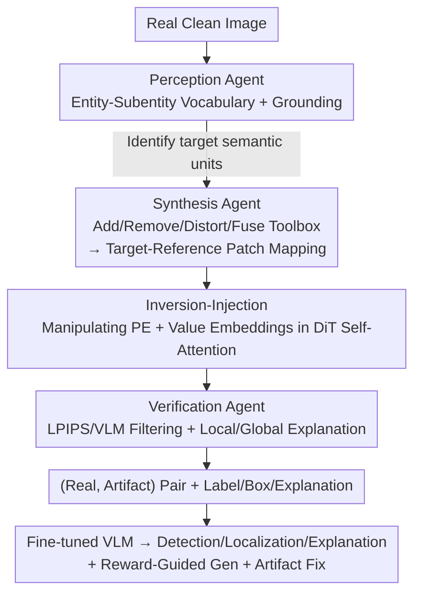

# See and Fix the Flaws: Enabling VLMs and Diffusion Models to Comprehend Visual Artifacts via Agentic Data Synthesis

**Conference**: CVPR 2026  
**Paper**: [CVF Open Access](https://openaccess.thecvf.com/content/CVPR2026/html/Park_See_and_Fix_the_Flaws_Enabling_VLMs_and_Diffusion_Models_CVPR_2026_paper.html)  
**Code**: https://huggingface.co/datasets/KRAFTON/ArtiBench  
**Area**: Multimodal VLM / Diffusion Models  
**Keywords**: Visual Artifacts, Agentic Data Synthesis, Diffusion Artifact Injection, VLM Artifact Understanding, DiT Positional Embedding Manipulation  

## TL;DR
Addressing the dual dilemma where structural artifacts generated by modern diffusion models are difficult to annotate manually and VLMs fail to comprehend them, this paper proposes **ArtiAgent**—a fully automated pipeline comprising perception, synthesis, and verification agents. By **manipulating Positional Embeddings (PE) and Value Embeddings** within DiT self-attention, it injects plausible artifacts into real images. This enables the synthesis of 100,000 artifact data samples with bounding boxes and explanations under zero human labor. Open-source VLMs fine-tuned on this data outperform GPT-5 across detection, localization, and explanation tasks.

## Background & Motivation
**Background**: Modern diffusion models (DiT architectures like FLUX, Qwen-Image, Nano-Banana) have become exceptionally strong in text-to-image alignment and aesthetics, yet they still produce **visual artifacts**—distorted physical structures in generated content (six-fingered hands, dual noses, fused entities). Meanwhile, VLMs show prominent capabilities in VQA and scene description, serving as automated judges for various visual tasks.

**Limitations of Prior Work**: Empirical tests by the authors reveal that even top-tier VLMs like GPT-5 and Gemini-2.5-Pro have an ability to detect, localize, and explain artifacts in AI-generated images that is **nearly equivalent to random guessing** (detection accuracy on ArtiBench is only 0.58–0.62). Training VLMs to understand artifacts requires annotated data, but existing datasets (PAL, SynthScars, DiffDoctor) suffer from two major flaws: (1) They primarily target **early artifact types** (Gaussian noise, blurring) common in the SD 1.0 era, which modern models have largely eliminated; (2) They **rely heavily on manual annotation** (up to 10k–25k labels), which is expensive and fails to scale across the full diversity of artifacts.

**Key Challenge**: Modern artifacts are **plausible structural artifacts** where pixel quality is high but the structures violate common sense. These are the hardest to perceive by humans and the hardest to generate via rules. Scaling VLM training necessitates breaking the bottleneck of manual annotation. The intersection of "plausible artifacts × zero-annotation × scalability" remains a blank space.

**Goal**: Construct an **automated pipeline without human intervention** capable of injecting **plausible structural artifacts** into any real image, while automatically generating binary labels, bounding boxes, and local/global textual explanations for downstream detection, localization, and reasoning tasks.

**Key Insight**: The authors redefine "creating artifacts" as an **inversion-restoration problem** in image editing. Since DiT editing can achieve precise local replacements, intentionally "misaligning" those replacements (mismatching the position/semantics of one region with another) can create structural disorders with natural pixels.

**Core Idea**: Coordinate three agents (where to modify → how to modify → quality check) with an inversion-injection toolset that **manipulates positional and value embeddings** in DiT self-attention to proceduralize and scale artifact injection.

## Method

### Overall Architecture
ArtiAgent takes a clean real image as input and outputs a pair (real image, artifact-injected image) along with rich annotations. The pipeline consists of three interconnected agents: the **Perception Agent** first decomposes the image into entities/sub-entities with grounding to identify suitable target semantic units; the **Synthesis Agent** uses a toolbox (add/remove/distort/fuse) to generate "target-reference patch mappings," which are then applied via the inversion-injection module to create plausible artifacts; finally, the **Verification Agent** performs quality filtering and generates local/global explanations, organizing the results into trainable data. The entire process automates "artifact creation + annotation," ultimately fine-tuning open-source VLMs with 100,000 synthesized samples.

### Key Designs

**1. Perception Agent: Decomposing images into "modifiable" entity-subentity hierarchies**

Before synthesizing artifacts, it is essential to know "where to modify to simulate physical structure errors." The Perception Agent first uses an off-the-shelf VLM to decompose the input image into a **hierarchical vocabulary**: entities (e.g., dog) and sub-entities (e.g., nose/leg). Sub-entities are further divided into two semantic levels—peripheral sub-entities (fingers, legs) and mid-level sub-entities (body, face). Then, Grounded-SAM is used for segmentation and localization, followed by **containment analysis** via overlap ratios to link each sub-entity to its parent (e.g., "a dog's leg"). This hierarchy determines which tool acts on which granularity—peripheral sub-entities are suitable for add/remove, mid-level for distortion, and overlapping entities for fusion—ensuring the injected artifacts land in semantically plausible locations.

**2. Synthesis Agent: Toolbox + Inversion-Injection for "misaligned" artifacts in DiT attention**

This is the technical core, solving how to generate plausible artifacts with natural pixels but nonsensical structures. It involves two steps. First, the **target-reference patch mapping toolbox**, which includes four tools, each producing a set of mappings $M=\{(p_t, p_r)\}$ between target and reference patches: **add** (selecting the best target from adjacent non-conflicting patches to place in a sub-entity region, creating duplicates), **remove** (replacing sub-entity regions with surrounding context patches, creating missing parts), **distort** (applying jitter/strip/random permutation kernels to target patches), and **fuse** (mismatching patches between two overlapping entities).

Second, the **inversion-injection module** applies these mappings to the image. It extends the inversion-restoration paradigm of image editing: In the **Inversion stage**, the real image is inverted into noise latents, and self-attention is calculated as $Q^{(\ell)}=X^{(\ell)}W_Q^{(\ell)},\ K^{(\ell)}=X^{(\ell)}W_K^{(\ell)},\ V^{(\ell)}=X^{(\ell)}W_V^{(\ell)}$, with RoPE used for position injection $\tilde Q^{(\ell)}_p=\text{RoPE}(Q^{(\ell)},p)$, while **caching value embeddings for each layer** $V^{(\ell)}_{inv}$. In the **Injection stage**, two operations occur simultaneously for each target patch $p_t$ (mapped to $p_r$) during denoising: its **positional embedding is swapped with the reference patch's position** ($\tilde Q^{(\ell)}_{p_t}=\text{RoPE}(Q^{(\ell)}_{p_t}, p_r)$, same for key), and its **value embedding is replaced with the cached value of the reference patch** $V^{(\ell)}_{p_t}\leftarrow V^{(\ell)}_{p_r,inv}$. Background patches retain their original positions and values. The intuition: **PE injection controls "where the model thinks the denoising is happening," while value injection provides "what semantic content to fill in that location."** Combined, they precisely plant artifacts while keeping the background consistent. The authors emphasize that while value injection is a mature editing technique, **manipulating position during injection and PE injection itself are novel approaches**; to avoid shortcut features like edge fractures, PE/value injection is only performed in **early-to-mid layers**, and disabled during final denoising steps. This method is **training-free and model-agnostic**, applicable to any DiT (implemented with FLUX.1-dev + FireFlow).

**3. Verification Agent: Dual filtering + local/global explanations to refine labels**

Synthesis results vary in quality. The Verification Agent ensures quality and enriches annotations by leveraging the **paired (real, artifact) input**. **Filtering** follows two paths: distortions use **LPIPS filtering**, keeping pairs satisfying $\tau_1 \le 1 - d_{\text{LPIPS}}(x_{\text{original}}, x_{\text{artifact}}) \le \tau_2$ ($\tau_2$ removes imperceptible changes, $\tau_1$ removes overly corrupted/implausible ones). Add/remove/fuse types use **VLM filtering**, feeding the VLM a triplet (original image with target area masked for context, original target patch, artifact target patch) to judge if a new instance/missing object/unnatural fusion occurred. **Explanation generation** uses the same triplet to write **local explanations** (differences between artifact and real regions), then aggregates these with boxes to write a **global explanation** for the entire image. This yields 50K image pairs + metadata (sources: COCO, Caltech-101, 11K Hands, CelebA-HQ; VLM: GPT-4o).

### Loss & Training
ArtiAgent is a data synthesis pipeline and does not train a new model itself. For downstream training, synthesized data is converted into VQA samples to fine-tune Qwen2.5-VL-7B and InternVL3.5-8B (100k samples each). In mitigation applications, a **Bradley-Terry reward model** (CLIP-based) is trained to learn higher scores for real images over artifact images, guiding FLUX-schnell generation via test-time scaling.

## Key Experimental Results

### Main Results
Evaluations were conducted on ArtiBench (a new 1K modern generation benchmark) and three legacy benchmarks: RichHF, LOKI, and SynthScars. Tasks include detection (Acc/F1), localization (mIoU/F1), and explanation (ROUGE/CSS). Core conclusion: Open-source VLMs fine-tuned on ArtiAgent data dominate the originals and generally match or exceed GPT-5/Gemini-2.5-Pro.

| Task/Benchmark | Metric | Qwen2.5-VL-7B | + ArtiAgent | GPT-5 | Gemini-2.5-Pro |
|--------|------|------|----------|------|------|
| Det ArtiBench | Acc | 0.501 | **0.627** | 0.599 | 0.582 |
| Det ArtiBench | F1 | 0.336 | **0.627** | 0.577 | 0.575 |
| Loc ArtiBench | mIoU | 0.075 | **0.119** | 0.126 | 0.061 |
| Loc SynthScars | mIoU | 0.013 | **0.137** | 0.117 | 0.064 |
| Expl ArtiBench | CSS | 0.263 | **0.643** | 0.434 | 0.420 |

> InternVL3.5-8B's detection accuracy rose from 0.498 to 0.630 (+26.5%). Old artifact segmentation baselines like PAL/DiffDoctor performed okay on LOKI but **failed to generalize to ArtiBench** (DiffDoctor LOKI mIoU 0.175 → ArtiBench 0.081), confirming modern artifacts are more difficult. Overall ArtiBench detection accuracies remain relatively low (~0.6), indicating modern structural artifacts remain an unsolved challenge.

### Ablation Study

| Config | Det Acc | Loc mIoU | Expl CSS | Description |
|------|---------|---------|---------|------|
| 1K SynthScars (Manual) | 0.555 | **0.094** | 0.521 | Human supervision |
| 1K ArtiAgent (Synth) | 0.555 | 0.074 | **0.606** | Synthetic supervision |
| Data Scale 1K → 100K | Rising | — | — | Detection scales with data |

### Key Findings
- **Synthetic supervision matches manual annotation**: At 1K samples, ArtiAgent matches manual labels in detection and performs better in explanation, though slightly weaker in localization. This is attributed to **patch-level labels** in ArtiAgent (less precise than manual boxes), but proves it is a low-cost, scalable alternative.
- **Clear scaling laws**: Performance across all three tasks improves steadily as synthetic data increases. Localization and explanation **surpass GPT-5 with only 1K samples**, showing high sample efficiency of the supervision signal; detection continues to benefit up to 100K, requiring more artifact diversity.
- **Downstream applications are effective**: The reward model trained on ArtiAgent data guided diffusion sampling, with rewards rising from 0 to 0.23±0.08 after 6 search rounds, yielding clearer structures. Using artifact-aware VLM localization + FLUX inpainting iteratively repaired artifacts naturally.

## Highlights & Insights
- **Repurposing "failed editing" to create artifacts**: The cleverest move is using the inversion-restoration paradigm to cause **positional embedding mismatch**, making the model "think" it is denoising at location A while filling it with location B's semantics. This directly targets the essence of modern artifacts—"visually real, structurally wrong."
- **PE injection as a true novelty**: While value injection exists in editing, "manipulating position during injection" and "standalone PE injection" were previously unexplored. Being training-free and DiT-agnostic, it can be applied to any new DiT model.
- **Efficiency of paired-data design**: Paired (real/artifact) images are naturally suited for Bradley-Terry preference learning. A single dataset can simultaneously fine-tune artifact-understanding VLMs and train reward models for generation guidance.
- **Transferable Insight**: The technique of "manipulating attention position encoding to direct where generated content lands" can be transferred to tasks requiring precise local intervention, such as controllable editing, adversarial example generation, and controlled data augmentation.

## Limitations & Future Work
- **Annotation granularity**: ArtiAgent uses patch-level labels, so localization precision is naturally lower than manual boxes (the only metric where it trailed manual labels), which may not suffice for pixel-level downstream tasks.
- **Dependency on tools and hyperparameters**: Four tools, three kernels, LPIPS thresholds, and the injection layer range all require tuning. Whether the synthetic distribution covers the full spectrum of real-model failure cases remains an open question.
- **Reliance on teacher VLMs for perception/verification**: Using GPT-4o propagates its biases into the synthetic data; if the VLM itself is blind to certain structures, synthesized data and filtering will be systematically biased.
- **Absolute difficulty remains high**: Even with the strongest configuration, ArtiBench detection accuracy is only around 0.63, showing that modern structural artifact understanding is far from solved.

## Related Work & Insights
- **vs SynthScars / PAL / DiffDoctor (Manual Artifact Datasets)**: These rely on manual pixel-level or semi-supervised labeling (10k–25k) and focus on old-style artifacts. Ours uses zero human labor, targets modern structural flaws, scales to 100k, and proves synthetic supervision quality is comparable.
- **vs LEGION (Unified Detect-Loc-Expl Model)**: LEGION is strong within its training distribution (SynthScars) but drops significantly on modern artifacts like ArtiBench. Our synthetic data provides better generalization.
- **vs Inversion-Restoration / Value Injection (FireFlow, etc.)**: While they pursue "faithful editing," this work does the opposite—using the mechanism for "targeted destruction"—and adds the previously unused dimension of PE injection.

## Rating
- Novelty: ⭐⭐⭐⭐⭐ Reframing artifact synthesis as "misdirected DiT editing" with PE injection is innovative and bypasses manual annotation.
- Experimental Thoroughness: ⭐⭐⭐⭐ Covers three tasks, four benchmarks, scaling laws, manual comparisons, and two downstream applications; localization granularity is slightly weak.
- Writing Quality: ⭐⭐⭐⭐ Clear problem motivation and methodology; mathematical formulation of the injection mechanism is sound.
- Value: ⭐⭐⭐⭐⭐ Provides a scalable engine for both VLM artifact understanding and diffusion artifact mitigation, plus the modern ArtiBench benchmark.

<!-- RELATED:START -->

## Related Papers

- [\[CVPR 2026\] LLaDA-V: Large Language Diffusion Models with Visual Instruction Tuning](llada-v_large_language_diffusion_models_with_visual_instruction_tuning.md)
- [\[CVPR 2026\] CRIT: Graph-Based Automatic Data Synthesis to Enhance Cross-Modal Multi-Hop Reasoning](crit_graph-based_automatic_data_synthesis_to_enhance_cross-modal_multi-hop_reaso.md)
- [\[CVPR 2026\] Thinking Diffusion: Penalize and Guide Visual-Grounded Reasoning in Diffusion Multimodal Language Models](thinking_diffusion_penalize_and_guide_visual-grounded_reasoning_in_diffusion_mul.md)
- [\[CVPR 2026\] ARM-Thinker: Reinforcing Multimodal Generative Reward Models with Agentic Tool Use and Visual Reasoning](arm-thinker_reinforcing_multimodal_generative_reward_models_with_agentic_tool_us.md)
- [\[CVPR 2026\] MindPower: Enabling Theory-of-Mind Reasoning in VLM-based Embodied Agents](mindpower_enabling_theoryofmind_reasoning_in_vlmba.md)

<!-- RELATED:END -->
