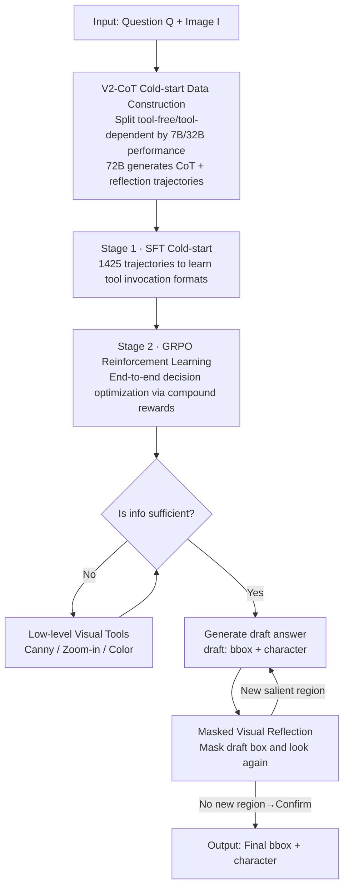

# See Further, Think Deeper: Advancing VLM's Reasoning Ability with Low-level Visual Cues and Reflection

**Conference**: CVPR 2026  
**Paper**: [CVF Open Access](https://openaccess.thecvf.com/content/CVPR2026/html/Wu_See_Further_Think_Deeper_Advancing_VLMs_Reasoning_Ability_with_Low-level_CVPR_2026_paper.html)  
**Code**: None  
**Area**: Multimodal VLM  
**Keywords**: Visual Language Model, Reinforcement Learning, Multimodal Chain-of-Thought, Low-level Visual Tools, Visual Reflection

## TL;DR
ForeSight equips VLMs with a set of low-level visual tools (Canny / Zoom / Color) and a mask-based visual reflection mechanism. Using GRPO reinforcement learning, a 7B model autonomously decides "when to invoke tools and whether to overturn draft answers" during reasoning. On the self-built Odd-One-Out saliency localization benchmark CG-SalBench, it improves IoU from 32.56% to 62.24%, approaching the performance of 72B models.

## Background & Motivation

**Background**: Enhancing the reasoning capabilities of VLMs using RL (especially DeepSeek-R1 style "outcome-only reward") is currently mainstream. To integrate visual information into the reasoning chain, the community has proposed interleaved Multimodal Chain-of-Thought (i-MCoT), such as DeepEyes' "thinking with images" and DriveAgent-R1's text/tool hybrid thinking, allowing models to invoke image tools during reasoning.

**Limitations of Prior Work**: The authors identify two overlooked gaps in i-MCoT. First, it **lacks low-level visual information**—existing tools mostly revolve around high-level tasks like RoI scaling, 3D detection, and depth maps, while neglecting "low-level" cues like edges and colors. SalBench has revealed that even SOTA large VLMs perform poorly on "Odd-One-Out" saliency anomalies—detecting the object that differ from others—which is trivial for humans. Second, there is **no effective visual feedback**—the process from reasoning to answering is open-loop: once an answer is generated, it is never reviewed or corrected. This unidirectional "reasoning → answer" flow provides limited intelligence.

**Key Challenge**: VLM reasoning processes are almost entirely confined to the language modality (text-only reasoning). Symbolic reasoning lacks dynamic grounding to visual evidence, contrary to the human visual reasoning method of "looking again if information is insufficient." As the reasoning chain lengthens, fine-grained visual features are increasingly ignored.

**Goal**: To enable VLMs to both "See Further" (actively acquire low-level visual details) and "Think Deeper" (perform visual reflection and self-correction on their own answers).

**Key Insight**: Mimic human behavior—actively use tools to extract details when information is insufficient; after providing a preliminary answer, mask the corresponding area and look again to verify its correctness.

**Core Idea**: Upgrade the open-loop "reasoning → answer" to a closed-loop "reasoning → answer → visual feedback → reasoning → answer...", using RL to let the model autonomously learn "when to call tools and whether to change answers," using final localization/recognition accuracy as reward signals. This is claimed to be the first work to introduce "reflection with visual feedback" into VLM reasoning.

## Method

### Overall Architecture

ForeSight is a unified multi-modal tool-augmented reasoning framework based on Qwen2.5-VL-7B. Given a question $Q$ and an image $I$, the model autonomously judges at each step of the text CoT: is the current information sufficient to provide the correct answer? If yes, it outputs directly; if not, it invokes appropriate low-level visual tools to process/enhance the image and continues reasoning with the updated visual input, iterating until it believes the answer is correct or the maximum number of calls is reached. After generating a draft answer, **visual reflection** is triggered: the area corresponding to the draft localization box is masked on the original image and fed back to the model for re-examination to decide whether to overturn and correct it.

Training is serialized in two stages: **Stage 1 (SFT Cold-start)** uses automatically constructed high-quality V2-CoT trajectories for supervised fine-tuning to teach the model tool invocation formats and reflection trajectory structures; **Stage 2 (RL)** uses GRPO with a set of compound rewards for end-to-end optimization to truly develop decision-making skills.

### Key Designs

**1. Low-level Visual Toolset: Extracting edge/scale/color cues missed by high-level tools**

To address the gap where i-MCoT tools ignore low-level visual information, ForeSight provides three basic tools: (1) **Canny Tool** uses the Canny edge detection algorithm to delineate object contours via high-gradient regions, providing explicit structural cues for contour-aware reasoning; (2) **Zoom-In Tool** allows the model to adaptively enlarge relevant regions for finer cues if details are deemed insufficient (max 2 calls); (3) **Color Tool** amplifies color differences to strengthen local features and improve grounding reliability (max 1 call). These outputs are fed back as `<tool_response><image></tool_response>`, and the model continues its reasoning. The core is not just "having tools" but the model learning "active looking" when information is deficient.

**2. Masked Visual Reflection: Transforming open-loop reasoning into a closed-loop "verify by masking" process**

To solve the open-loop pain point where answers are never revisited, this is the core novelty of the paper. Let $I$, $I_{\text{ans}}$, and $T_{\text{ans}}$ be the input image, the predicted localization area, and the predicted answer at the current step. The model first writes a `<draft_answer>` (containing $T_{\text{ans}}$ and $I_{\text{ans}}$). During reflection, the previous localization area $I_{\text{ans}}^{(k-1)}$ is masked in the original image to obtain the input for the $k$-th round:

$$I'^{(k)} = I \odot \big(1 - \mathbf{1}_{I_{\text{ans}}^{(k-1)}}\big), \quad T_{\text{ans}}^{(k)}, I_{\text{ans}}^{(k)} = f_\theta\big(I'^{(k)}, T_{\text{ans}}^{(k-1)}, I_{\text{ans}}^{(k-1)}\big)$$

where $\mathbf{1}_{I_{\text{ans}}^{(k-1)}}$ is the binary mask of the previous area, $\odot$ is the element-wise product, and $f_\theta(\cdot)$ is the model's CoT reasoning and grounding function. The intuition is: if the draft correctly localized the Odd-One-Out object, the masked image should contain no further salient anomalies, leading the model to confirm; if a new salient area appears, the draft was likely wrong, prompting a correction. This provides an explicit visual feedback signal for true closed-loop cross-validation.

**3. V2-CoT Cold-start Data Construction: Balancing tool utility using capabilities of three model tiers**

Pre-RL cold-start requires high-quality data. The V2-CoT (Visual Cues and Visual Feedback chain) workflow involves: (1) **Data Partitioning**—Samples Qwen2.5-VL-7B solves without tools are *tool-free*; samples where Qwen2.5-VL-32B improves significantly with tools are *tool-dependent*. This uses model capability gaps to define tool necessity. (2) **CoT Label Generation**—Qwen2.5-VL-72B generates structured CoT trajectories with visual reflection. (3) **Data Cleaning**—Manual rule filtering. The resulting SFT set (1425 trajectories: 596 tool-free, 829 tool-dependent) teaches the model to avoid unnecessary tool calls while invoking them decisively when needed.

**4. GRPO + Five Compound Rewards: Optimization for correct tool use and reflection consistency**

Stage 2 uses GRPO for RL with a weighted sum of five rewards:

$$R(\tau) = \lambda_{\text{fmt}} R_{\text{fmt}} + \lambda_{\text{IoU}} R_{\text{IoU}} + \lambda_{\text{F1}} R_{\text{F1}} + \lambda_{\text{tc}} R_{\text{tc}} + \lambda_{\text{ver}} R_{\text{ver}}$$

Weights are set to $0.2, 1.2, 1, 0.8, 1.2$. $R_{\text{fmt}}$ constrains trajectory formatting; $R_{\text{IoU}}$ and $R_{\text{F1}}$ target localization and character recognition accuracy. Two specific rewards support the proposed mechanisms: **Tool Reward** $R_{\text{tc}}$ provides $+1$ only if tools are used correctly without abuse and result in an accurate answer; **Verification Reward** $R_{\text{ver}}$ checks self-consistency: if the draft matches GT, `<verify>` must be "correct" with an unchanged final answer; if the draft is wrong, `<verify>` must be "incorrect" and the answer must be corrected. This ensures reflection is a genuine validation rather than a procedural formality.

## Key Experimental Results

### Main Results

CG-SalBench is an extended Odd-One-Out benchmark for localization and recognition. ForeSight-7B results compared to SOTA:

| Model | IoU | F1 | Precision | Recall |
|------|-----|-----|-----------|--------|
| InternVL3-8B | 30.50 | 72.09 | 69.74 | 79.01 |
| Qwen2.5-VL-7B (Base) | 32.56 | 64.97 | 61.46 | 75.81 |
| Qwen2.5-VL-72B | 66.00 | 82.70 | 82.37 | 86.74 |
| Qwen3-VL-8B | 48.40 | 70.94 | 67.76 | 81.15 |
| GPT-5 (Closed-source) | 7.85 | 89.85 | 87.79 | 95.54 |
| Doubao-Seed-1.6 | 47.66 | 89.10 | 90.55 | 89.99 |
| Claude-Sonnet-4 | 20.82 | 82.50 | 82.40 | 89.13 |
| **ForeSight (7B)** | **62.24** | **84.24** | 84.52 | 87.18 |
| Δ vs Qwen2.5-VL-7B | **+29.68** | **+19.27** | +23.06 | +11.37 |

The 7B model's IoU (62.24%) approaches the 72B model (66.00%) and significantly outperforms closed-source models in localization (e.g., Doubao at 47.66%). Notably, while GPT-5 has high F1/Recall, its IoU is only 7.85%, meaning it identifies "what" is wrong but cannot "where" it is; ForeSight balances both.

ForeSight also demonstrates gains on RefCOCO benchmarks and MME:

| Benchmark | Qwen2.5-VL-7B* | ForeSight (7B) | Gain |
|------|----------------|----------------|----|
| RefCOCO | 88.91 | 91.42 | +2.51 |
| RefCOCO+ | 82.11 | 83.66 | +1.55 |
| RefCOCOg | 86.4 | 88.43 | +2.03 |
| MME | 2288.2 | 2326 | +37.8 |

### Ablation Study

**Component Ablation** (Tools vs. Reflection):

| tools | reflect | IoU | F1 | Precision | Recall | Note |
|:---:|:---:|-----|-----|-----------|--------|------|
| × | × | 59.36 | 51.40 | 39.68 | 84.25 | Baseline |
| ✓ | × | 59.23 | 57.19 | 45.40 | 91.10 | Tools only: F1 +5.79 |
| × | ✓ | 61.04 | 45.96 | 32.77 | 93.18 | Reflection only: Recall +8.93 |
| ✓ | ✓ | **62.24** | **84.24** | **84.52** | 87.18 | Synergistic improvement |

**Training Stage Ablation** (SFT vs. RL):

| SFT | RL | IoU | F1 | Precision | Recall |
|:---:|:---:|-----|-----|-----------|--------|
| ✓ | × | 57.47 | 72.34 | 69.64 | 81.10 |
| × | ✓ | 52.80 | 74.94 | 75.12 | 74.77 |
| ✓ | ✓ | **62.24** | **84.24** | **84.52** | **87.18** |

### Key Findings
- **Tools and reflection are complementary**: Tools primarily boost F1/Precision (proactive perception), while reflection boosts Recall (error correction). Combining them allows F1 to jump from ~51% to 84%.
- **Cold-start is indispensable**: RL without SFT achieves only 52.80% IoU and suffers from instability; SFT establishes the format for tool use and reflection needed for RL to refine performance.
- **Reasoning design compensates for model scale**: The 7B model rivals the 72B model in IoU, suggesting that Odd-One-Out grounding is a scale-resistant weakness that benefits from specialized perception and reflection.

## Highlights & Insights
- **The "mask and look again" reflection is elegant**: It translates "is the answer right" into a visual self-check—no anomalies should remain if the box is correct. This is more reliable than text-only self-critique for vision-centric tasks.
- **Capability gaps for data partitioning**: Using performance differences between models (7B vs 32B) to define tool necessity is a scalable trick to avoid manual labeling.
- **Verification consistency reward $R_{\text{ver}}$**: Rewarding the alignment between the verification judgment and the actual outcome prevents reflection from becoming a perfunctory step.

## Limitations & Future Work
- **Task Specificity**: Benefits are concentrated on Odd-One-Out saliency (CG-SalBench). A slight drop in MMBench suggests the training biases the model toward basic vision/localization over general comprehension.
- **Fixed Toolset**: Tools are limited to low-level operators (Canny/Zoom/Color). Extending this set for complex textures or semantic relationships remains an open question.
- **Iteration Depth**: Reflection is limited to 2 rounds and depends heavily on the initial bbox quality; if the draft box misses the target entirely, masking might mislead the model.

## Related Work & Insights
- **vs. DeepEyes / DriveAgent-R1**: While all involve i-MCoT, those models focus on high-level tools (3D detection, etc.), whereas ForeSight targets low-level cues and introduces closed-loop visual reflection.
- **vs. GThinker**: GThinker uses text-centric reflection; ForeSight's masked feedback provides a true closed-loop visual signal for cross-validation.
- **vs. DeepSeek-R1**: While R1 demonstrates emergent self-verification in text-only RL, ForeSight introduces multi-objective rewards (IoU/F1/Tool/Ver) to handle the fuzzy perception and open-ended targets of visual reasoning.

## Rating
- Novelty: ⭐⭐⭐⭐ First to integrate "masked reflection with visual feedback" into VLM reasoning.
- Experimental Thoroughness: ⭐⭐⭐⭐ Extensive comparison with open/closed-source SOTAs and comprehensive ablations.
- Writing Quality: ⭐⭐⭐⭐ Logical flow from motivation to method; clear visualizations.
- Value: ⭐⭐⭐⭐ Demonstrates that specialized reasoning can push small models to large-scale performance levels.

<!-- RELATED:START -->

## Related Papers

- [\[CVPR 2026\] See Less, See Right: Bi-directional Perceptual Shaping For Multimodal Reasoning](see_less_see_right_bi-directional_perceptual_shaping_for_multimodal_reasoning.md)
- [\[CVPR 2026\] REVISOR: Beyond Textual Reflection, Towards Multimodal Introspective Reasoning in Long-Form Video Understanding](revisor_beyond_textual_reflection_towards_multimodal_introspective_reasoning_in_.md)
- [\[CVPR 2026\] See, Think, Act: Teaching Multimodal Agents to Effectively Interact with GUI by Identifying Toggles](see_think_act_teaching_multimodal_agents_to_effectively_interact_with_gui_by_ide.md)
- [\[ICML 2026\] What You Think is What You See: Driving Exploration in VLM Agents via Visual-Linguistic Curiosity (GLANCE)](../../ICML2026/multimodal_vlm/what_you_think_is_what_you_see_driving_exploration_in_vlm_agents_via_visual-ling.md)
- [\[CVPR 2026\] Don't Show Pixels, Show Cues: Unlocking Visual Tool Reasoning in Language Models via Perception Programs](dont_show_pixels_show_cues_unlocking_visual_tool_reasoning_in_language_models_vi.md)

<!-- RELATED:END -->
