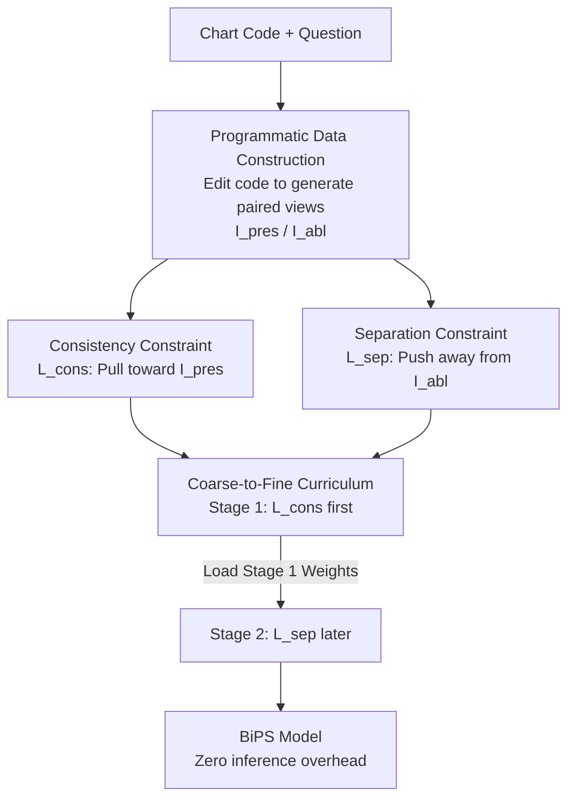

# See Less, See Right: Bi-directional Perceptual Shaping For Multimodal Reasoning

**Conference**: CVPR 2026  
**Paper**: [CVF Open Access](https://openaccess.thecvf.com/content/CVPR2026/html/Zhang_See_Less_See_Right_Bi-directional_Perceptual_Shaping_For_Multimodal_Reasoning_CVPR_2026_paper.html)  
**Code**: https://github.com/zss02/BiPS  
**Area**: Multimodal VLM  
**Keywords**: Visual Language Models, Reinforcement Learning, Perceptual Shaping, KL Constraint, Chart Understanding

## TL;DR
BiPS shifts the "where to look" visual cues from inference-time tools or latent tokens to the training phase. By employing a pair of KL constraints (pulling toward "evidence-only" charts and pushing away from "evidence-ablated" charts) within the GRPO framework, it shapes the perceptual strategy of the VLM. Training on only 13K chart samples, Qwen2.5-VL-7B achieves a 7.3% average improvement across eight benchmarks (rising to 8.2% with 39K math data) with zero additional inference overhead.

## Background & Motivation

**Background**: In Visual Question Answering (VQA), Visual Language Models (VLMs) often require intermediate visual cues to identify "where to look." Prevailing approaches follow two paths: (1) invoking external tools (cropping, masking, segmentation) during inference to generate focused evidence images; (2) training the model to output a "Visual Chain-of-Thought" (bounding boxes, tool-call trajectories, or implicit visual tokens) during inference.

**Limitations of Prior Work**: These paths treat visual cues as **inference-time crutches**, leading to three issues. First, **rigid shapes**: focused regions are often rectangular crops or coarse masks, failing to capture irregular evidence like thin lines in charts, lesion contours in medical images, or non-convex polygons in geometry. Second, **scenario coupling**: customized tools and training pipelines for specific tokens are tightly coupled with layouts/domains, hindering generalization. Third, **inference overhead**: generating intermediate cues at inference time increases latency and the risk of cascading errors.

**Key Challenge**: Placing visual cues in the inference phase forces a trade-off between "cue quality" and "computation/generalization"—finer cues require more specialized, slower, and less universal tools.

**Goal**: To **internalize** the ability to "perceive correct fine-grained evidence" into the model weights, eliminating the need for extra tools, parsers, or visual tokens during inference.

**Key Insight**: Since charts are rendered via code, every element (marks/axes/legend) has a specific programmatic origin. This allows "surgical" manipulation at the code level to programmatically generate two types of **perfect, ground-truth** visual views: one that preserves only the evidence required for the question, and one that precisely ablates only the critical evidence. These views are used as **training signals** rather than inference crutches.

**Core Idea**: Shaping the policy using a pair of opposing KL constraints—**pulling** the model's prediction on the original image toward the "evidence-preserved" view (learning where to look) while **pushing** it away from the "evidence-ablated" view (forcing it to rely on vision rather than linguistic shortcuts). This is termed Bi-directional Perceptual Shaping (BiPS).

## Method

### Overall Architecture

BiPS is a **two-stage training curriculum** built upon GRPO. It uses programmatically generated paired views to "bidirectionally shape" the VLM's perceptual strategy. This mechanism occurs entirely during training; at inference, the model behaves as a standard Qwen2.5-VL without extra steps.

The pipeline comprises three components: a **programmatic data construction pipeline** that edits rendering code to produce $(I, q, I_{pres}, I_{abl})$ quadruplets; a **bi-directional KL constraint** consisting of a consistency term (pulling the original image policy toward $I_{pres}$) and a separation term (pushing it away from $I_{abl}$); and a **coarse-to-fine two-stage curriculum** that decouples these objectives.

### Key Designs

**1. Programmatic data construction pipeline: Pixel-precise views via code-level surgery**

To perform bi-directional shaping, precise supervision of "what to look at" is required. Using the ECD corpus (multi-panel charts with executable code), the pipeline follows three steps: (i) **Question reconstruction and verification**: Open-ended questions are rewritten as multiple-choice questions via an LLM judge (GPT5-mini) using chart source code and metadata to ensure verifiability. (ii) **Difficulty filtering**: Problems solved correctly 8/8 times by the base model are discarded to focus training on difficult samples. (iii) **Code editing and rendering**: The evidence-preserved view $I_{pres}$ is rendered by deleting code segments irrelevant to the question. The evidence-ablated view $I_{abl}$ is rendered by deleting segments providing critical evidence while maintaining global context (axes, layout). This yields 13K high-quality samples where supervision is semantically precise and naturally aligned.

**2. Consistency constraint $L_{cons}$: Learning coarse-grained focus**

To address the issue of the model being distracted by irrelevant information, $L_{cons}$ requires the policy on the original image $I$ to be consistent with the policy on the evidence-preserved view $I_{pres}$ by **minimizing** KL divergence:

$$L_{cons} = \mathbb{E}_{(I,q,r)}\Big[\mathbb{I}(r{=}1)\min\big(c_{cons},\ D_{KL}(\pi_\theta(\cdot|I,q)\,\|\,\mathrm{sg}[\tilde\pi_\theta(\cdot|I_{pres},q)])\big)\Big]$$

$\pi_\theta$ is the distribution on the original image, $\tilde\pi_\theta$ is the target distribution on the preserved view, and $\mathrm{sg}[\cdot]$ denotes a stop-gradient. This forces the model to treat irrelevant regions as redundant and focuses decision-making on the preserved evidence.

**3. Separation constraint $L_{sep}$: Cutting off text shortcuts**

Models might rely on OCR text or linguistic priors to give the same answer on both $I$ and $I_{pres}$ without truly "seeing" the fine-grained evidence (shortcut learning). $L_{sep}$ acts as a regularizer, forcing the policy on $I$ to **diverge** from the policy on the evidence-ablated view $I_{abl}$ by **maximizing** KL divergence:

$$L_{sep} = \mathbb{E}_{(I,q)}\Big[\min\big(c_{sep},\ D_{KL}(\pi_\theta(\cdot|I,q)\,\|\,\mathrm{sg}[\tilde\pi_\theta(\cdot|I_{abl},q)])\big)\Big]$$

Since $I_{abl}$ removes key evidence, this forces the model to provide different answers for the original and "no-evidence" images, ensuring reliance on fine-grained visual features (See Right).

**4. Coarse-to-fine two-stage curriculum: Decoupling conflicting objectives**

$L_{cons}$ acts as an attractive force and $L_{sep}$ as a repulsive force; optimizing both simultaneously may lead to gradient conflict. BiPS decouples them: **Stage 1 (Consistency Phase)**: $L_{Stage 1} = L_{GRPO} + \alpha L_{cons}$ establishes coarse-grained focus. **Stage 2 (Separation Phase)**: $L_{Stage 2} = L_{GRPO} - \beta L_{sep}$ applies grounding constraints. Experiments show that reversing the order or joint training results in slower convergence and worse performance.

### Loss & Training
- **Base Objective**: $L_{GRPO} = -\mathbb{E}\big[\min(r_t(\theta)A_t, \mathrm{clip}(r_t(\theta),1-\epsilon,1+\epsilon)A_t) - \gamma D_{KL}(\pi_\theta\|\pi_{ref})\big]$.
- **Curriculum**: Stage 1 (5 epochs / 7K samples, $+\alpha L_{cons}$) → Stage 2 (3 epochs / 13K samples, $-\beta L_{sep}$) results in BiPS-Chart. Further fine-tuning on 39K math samples (ViRL39k) results in BiPS-General.
- **Optimization**: AdamW, lr $=1\times10^{-6}$, 8×H100 GPUs.

## Key Experimental Results

### Main Results
Using Qwen2.5-VL-7B as the base, average accuracy across eight benchmarks:

| Model | Training Data Size | CharXiv | Evochart | MathVista | MMStar | Average (8 items) |
|------|-----------|---------|----------|-----------|--------|---------|
| Qwen2.5-VL-7B (base) | - | 42.5 | 52.0 | 68.2 | 62.1 | 44.3 |
| DeepEyes-7B | 14K+33K | 42.9 | 65.6 | 70.8 | 63.0 | 47.5 |
| Chart-R1-7B | 258K | 46.2 | 64.7 | 67.5 | 61.1 | 45.5 |
| **BiPS-Chart-7B** | **13K** | 49.4 | 68.2 | 73.5 | 64.9 | **51.6 (+7.3)** |
| **BiPS-General-7B** | 13K+39K | 50.6 | 68.7 | 75.0 | 65.7 | **52.5 (+8.2)** |

BiPS-Chart outperforms models trained on significantly more data. It also exhibits strong OOD generalization on general reasoning tasks (MathVista +5.3).

### Ablation Study

Breakdown of bi-directional constraints (added to GRPO baseline):

| Configuration | CharXiv | ECD | ChartMuseum | Description |
|------|---------|-----|-------------|------|
| Qwen2.5-VL-7B | 42.5 | 19.0 | 26.0 | base |
| GRPO | 44.3 | 35.6 | 30.8 | Pure RL baseline |
| GRPO + $L_{cons}$ | 47.2 | 36.3 | 31.3 | Consistency only |
| GRPO + $L_{sep}$ | 47.7 | 38.3 | 31.8 | Separation only |
| **Ours (Both)** | **49.4** | **39.9** | **33.5** | Two-stage synergy |

Curriculum order and view generation strategy:

| Dimension | Configuration | CharXiv | ECD | ChartMuseum |
|---------|------|---------|-----|-------------|
| Order | Joint Training | 46.4 | 36.7 | 31.5 |
| Order | Reversed (Stage 2 then 1) | 46.8 | 39.2 | 31.3 |
| Order | **Ours (Coarse-to-fine)** | **49.4** | **39.9** | **33.5** |
| Strategy | Random Masking (60% patch) | 44.8 | 37.6 | 31.8 |
| Strategy | **Ours (Programmatic)** | **49.4** | **39.9** | **33.5** |

### Key Findings
- **Complementarity**: $L_{cons}$ primarily drives focus (CharXiv), while $L_{sep}$ enhances fine-grained grounding and shortcut suppression (ECD).
- **Curriculum Order**: Reversing the order causes a drop in CharXiv from 49.4 to 46.8 because regularization is applied before stable focus is established.
- **Programmatic vs. Random Masking**: Significant gap (49.4 vs 44.8) proves that semantically faithful views are essential for effective $L_{sep}$.
- **Case Analysis**: BiPS significantly improves precision in reading values and counting curves where the base model often makes minor numerical errors.

## Highlights & Insights
- **Inference Cues to Training Signals**: BiPS internalizes perception into model weights, achieving zero inference overhead while improving fine-grained perception.
- **Code-Level Surgery**: Manipulating rendering code bypasses the limitations of pixel-level masking, producing pixel-precise paired views without human annotation.
- **Symmetric KL Design**: The dual-force structure (attraction/repulsion) effectively solves both "where to look" and "grounding" simultaneously.
- **Data Efficiency**: 13K samples outperforming million-scale models suggests that improving core perception is more efficient than increasing task data volume.

## Limitations & Future Work
- **Reliance on Rendering Code**: While effective for charts (ECD), programmatically generating such views for natural or medical images remains an open challenge.
- **LLM Arbiter Dependency**: The pipeline depends on GPT5-mini for question reconstruction and code editing, potentially limiting quality based on the arbiter's capabilities.
- **Domain Coverage**: Validation was primarily within chart and math VQA; effectiveness in dense natural scene VQA or video has not been verified.
- **Hyperparameter Sensitivity**: $\alpha, \beta, c_{cons}, c_{sep}$ may require tuning when switching base models or data domains.

## Related Work & Insights
- **vs. External Tools / Visual CoT (DeepEyes, Chart-R1)**: These models require box/mask generation at inference. BiPS internalizes these skills during training, ensuring efficiency and better generalization.
- **vs. Noise-based Methods (ChiP, PAPO)**: These use random noise/masking as negative perturbations. BiPS uses semantically precise ablated views, providing a "cleaner" negative space for grounding.
- **vs. Implicit Latent Reasoning**: Unlike methods that couple reasoning with specific tasks, BiPS shapes a generalizable perceptual strategy.

## Rating
- Novelty: ⭐⭐⭐⭐⭐ Innovative combination of training-time signal shaping and code-level paired views.
- Experimental Thoroughness: ⭐⭐⭐⭐ Strong results on chart/math domains, but less exploration of natural images.
- Writing Quality: ⭐⭐⭐⭐⭐ Clear logical flow from motivation to method and results.
- Value: ⭐⭐⭐⭐⭐ High data efficiency and practical utility due to zero inference overhead.

<!-- RELATED:START -->

## Related Papers

- [\[CVPR 2026\] See Further, Think Deeper: Advancing VLM's Reasoning Ability with Low-level Visual Cues and Reflection](see_further_think_deeper_advancing_vlms_reasoning_ability_with_low-level_visual_.md)
- [\[CVPR 2026\] Perceptual-Evidence Anchored Reinforced Learning for Multimodal Reasoning](perceptual-evidence_anchored_reinforced_learning_for_multimodal_reasoning.md)
- [\[CVPR 2026\] Noise-Aware Few-Shot Learning through Bi-directional Multi-View Prompt Alignment](noise-aware_few-shot_learning_through_bi-directional_multi-view_prompt_alignment.md)
- [\[CVPR 2026\] Aligning What Vision-Language Models See and Perceive with Adaptive Information Flow](aif_adaptive_information_flow_vlm.md)
- [\[CVPR 2026\] ROSE: Rotate Your Large Language Model to See](rose_rotate_your_large_language_model_to_see.md)

<!-- RELATED:END -->
