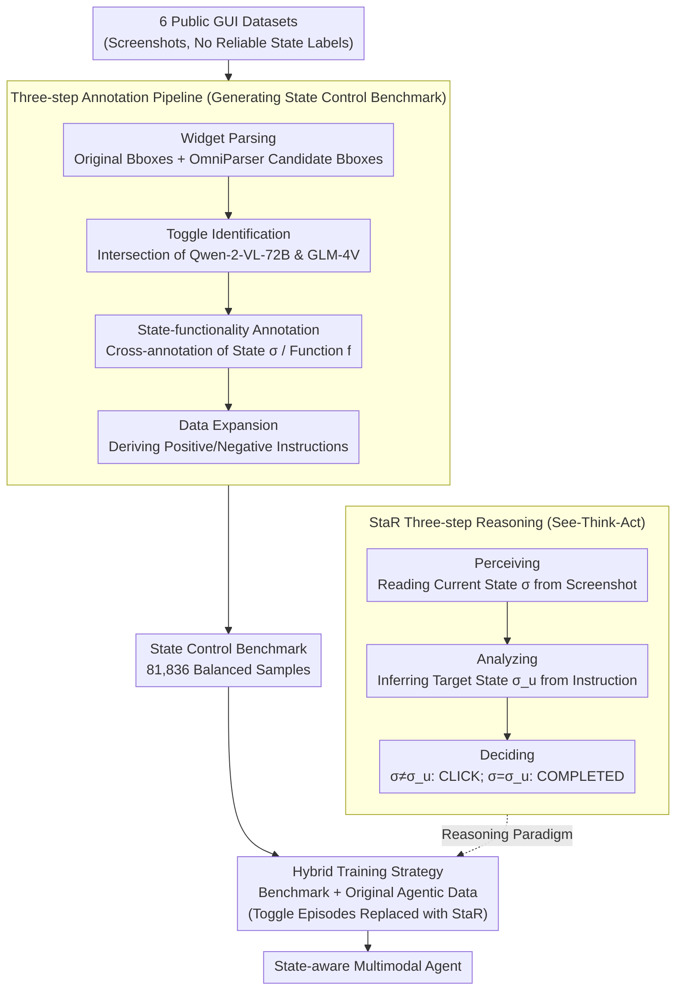

# See, Think, Act: Teaching Multimodal Agents to Effectively Interact with GUI by Identifying Toggles

**Conference**: CVPR 2026  
**arXiv**: [2509.13615](https://arxiv.org/abs/2509.13615)  
**Code**: [Available](https://github.com/ZrW00/StaR)  
**Area**: Multimodal VLM  
**Keywords**: GUI Agent, Toggle Control, Multimodal Reasoning, State-aware Reasoning  

## TL;DR

State-aware Reasoning (StaR) is proposed to improve GUI toggle control accuracy by over 30% without compromising general agent performance. This is achieved by teaching multimodal agents a three-step reasoning chain: "perceive current state → analyze target state → decide whether to act."

## Background & Motivation

### 1. Background

Multimodal Agents (e.g., AppAgent, UI-TARS, Mobile-Agent) leverage Multimodal Large Language Models (MLLMs) to directly perceive GUI screenshots and execute human-like operations. These agents have made significant progress in GUI interaction as flexible and reliable human-computer interaction assistants without relying on APIs.

### 2. Limitations of Prior Work

**Toggle controls (switches, toggle buttons, checkboxes) are ubiquitous and fundamental interaction elements in GUIs**, widely found in mobile settings, in-car systems, smart homes, and industrial controls. However, existing agents are highly unreliable when executing toggle commands; the authors found that most agents, including GPT-5, achieve an execution accuracy of less than 50% on a newly constructed benchmark.

### 3. Key Challenge

Agents exhibit a strong "toggling bias":
- **False Positive**: The agent clicks to toggle even when the current state already meets the goal.
- **False Negative**: The agent fails to execute the toggle when the current state does not meet the goal.

The fundamental reason is the lack of perception and reasoning regarding the current state of the toggle, leading agents to prefer predicting a CLICK without first determining if an operation is necessary.

### 4. Goal

To enhance the intrinsic reasoning capabilities of multimodal agents, enabling them to accurately perceive, reason about, and execute toggle control commands.

### 5. Key Insight

Analysis of two intuitive solutions reveals their deficiencies: (a) Prompt engineering cannot fundamentally strengthen reasoning; (b) Introducing extra annotators (multi-agent collaboration) presents a paradox—if the annotator is unreliable, it is useless; if it is reliable, it would be more efficient to use the annotator directly. Therefore, a method to improve the agent's own reasoning ability is required.

### 6. Core Idea

Simulate the cognitive process used by humans to execute toggle commands: first see the current state → then understand the target state required by the command → finally compare them to decide whether to act. This "See-Think-Act" three-step reasoning is internalized within the agent through training.

## Method

### Overall Architecture

This paper addresses a long-overlooked specific issue: multimodal agents often predict a CLICK when facing toggles (switches, checkboxes) without considering the current state. The core concept of StaR (State-aware Reasoning) is to explicitly integrate the human intuition of "perceiving the state, conceiving the goal, and deciding on the action" into the agent's reasoning chain and internalize it through training.

The workflow consists of two main phases. First is data generation: since reliable state annotations for toggles are missing from standard datasets, the authors used a three-step annotation pipeline to clean, identify, and expand 6 public datasets into a state control benchmark with 81,836 samples. Second is training: the agent learns the StaR three-step reasoning on this benchmark. Simultaneously, toggle-related episodes in the agent's original training sets are replaced with StaR-style reasoning chains, while other episodes remain unchanged to inject new capabilities without damaging existing ones.

### Key Designs

**1. Three-step Annotation Pipeline: Creating a Reliable Toggle Benchmark from Unlabeled Screenshots**

Training an agent to "see the state" requires data with clean state labels. Public datasets lack reliable XML trees for extracting whether a toggle is ON or OFF. The authors decomposed annotation into three sequential steps: Widget Parsing (combining original bboxes with OmniParser detections), Toggle Identification (using Qwen-2-VL-72B and GLM-4V; only keeping widgets where both agree), and State-functionality Annotation (independent labeling of state and function, filtered by cross-consistency).

Dual-annotator cross-validation offsets systematic biases of individual models; random manual checks of 200 samples showed 91% accuracy for state and 92.5% for function. Data expansion was then performed: each sample $\langle s, b, \sigma, f \rangle$ (screenshot, bbox, state, function) generated both a positive and negative instruction. For instance, if a toggle is $\sigma=1$ (ON), instructions to "Turn off $f$" (requiring CLICK) and "Turn on $f$" (requiring COMPLETED) were generated, forcing the model to observe the state. This resulted in 81,836 balanced samples (73,652 training + 8,184 testing).

**2. StaR Three-step Reasoning Chain: Explicitly Integrating "Perceive-Think-Decide"**

Existing agents follow a direct Thought → Action structure, rarely explicitly confirming the current state of a toggle. StaR decomposes this into steps following human cognition: the Perceiving phase guides the agent to read the state $\sigma$ from the screenshot, binding visual features to fine-grained toggle statuses; the Analyzing phase infers the target state $\sigma_u$ from user instructions (positive instructions imply $\sigma_u \neq \sigma$, negative imply $\sigma_u = \sigma$); the Deciding phase compares $\sigma$ and $\sigma_u$, outputting CLICK only if they differ.

For example, if a WiFi switch is OFF ($\sigma=0$) and the command is "Turn off WiFi," a direct-reasoning agent might CLICK because of the keywords "Turn off," inadvertently turning it ON. StaR perceives $\sigma=0$ and analyzes $\sigma_u=0$; since they match, it outputs COMPLETED. This reasoning chain is internalized via training, as experiments show that mere prompting ("pay attention to toggle state") yields minimal gains.

**3. Hybrid Training Strategy: Injecting Toggle Reasoning without Degrading General Tasks**

Training exclusively on a toggle benchmark risks catastrophic forgetting. The authors employed joint training to maintain performance. For original agentic benchmarks (AndroidControl, AITZ, GUI-Odyssey), only the reasoning chains for toggle-related episodes were rewritten into the StaR style, while other episodes were left intact.

This prevents the introduction of out-of-distribution samples, as these benchmarks were already part of the target agents' original training sets. The agents learn to switch to three-step reasoning for toggle scenarios while maintaining standard procedures for others.

### Loss & Training

- Fine-tuned using the LLaMA-Factory framework.
- Learning rate: $5 \times 10^{-6}$ for 3 epochs.
- Accelerated with FlashAttention.
- Click coordinates normalized to $[0, 1000]$.
- Validated across four different agent architectures: OS-Atlas-7B, UI-TARS-7B, AgentCPM-GUI-8B, and GUI-Owl-7B.

## Key Experimental Results

### Main Results: Performance on State Control Benchmark

| Model | Setting | O-TMR↑ | O-AMR↑ | P-AMR↑ | N-AMR↑ | N-FPTR↓ | N-FPR↓ |
|------|------|--------|--------|--------|--------|---------|--------|
| OS-Atlas-7B | Zero-shot | 67.16 | 43.95 | 52.10 | 35.80 | 64.10 | 28.67 |
| OS-Atlas-7B | StaR Prompting | 73.52 | 50.07 | 49.88 | 50.27 | 49.62 | 22.21 |
| OS-Atlas-7B | **StaR Training** | **96.13** | **79.72** | **62.95** | **96.48** | **3.52** | **1.52** |
| UI-TARS-7B | Zero-shot | 67.14 | 47.45 | 54.94 | 39.96 | 48.29 | 17.62 |
| UI-TARS-7B | **StaR Training** | **95.82** | **77.86** | **59.19** | **96.53** | **3.45** | **1.34** |
| AgentCPM-GUI-8B | Zero-shot | 81.74 | 64.08 | 60.04 | 68.11 | 30.69 | 11.07 |
| AgentCPM-GUI-8B | **StaR Training** | **95.98** | **79.00** | **60.53** | **97.46** | **2.54** | **0.95** |
| GUI-Owl-7B | Zero-shot | 76.58 | 53.57 | 48.97 | 58.16 | 39.15 | 14.66 |
| GUI-Owl-7B | **StaR Training** | **95.99** | **77.60** | **58.87** | **96.33** | **3.67** | **1.56** |

**Main Conclusion**: StaR training improves O-AMR by +35.77% (OS-Atlas), +30.41% (UI-TARS), +14.92% (AgentCPM), and +24.03% (GUI-Owl). The trained 7B models outperformed zero-shot Qwen-2-VL-72B (O-AMR 66.42%), bridging the model scale gap.

### Dynamic Evaluation Results

| Model | W/O StaR | W/ StaR |
|------|---------|---------|
| UI-TARS-7B | 35 (7/20) | 40 (8/20) |
| OS-Atlas-7B | 10 (2/20) | **55 (11/20)** |
| AgentCPM-GUI-8B | 20 (4/20) | 42.5 (8.5/20) |

**Main Conclusion**: StaR identifies consistent success rate improvements in real dynamic environments within the AndroidWorld framework. OS-Atlas-7B jumped from 10% to 55%, confirming that StaR is most effective at transforming agents with weak reasoning.

### Ablation Study

- **StaR-style Prompting vs. StaR Training**: Prompting alone has limited benefits (e.g., OS-Atlas O-AMR +6.12%) compared to training (+35.77%), proving structured reasoning must be learned.
- **Prompt Engineering baseline** (Section 3.2): Simple instructions to "pay attention to toggle state" slightly improved UI-TARS and GUI-Owl but were largely ineffective for AgentCPM.
- **Cross-architecture Generalization**: Agents with four different architectures and historical modeling strategies all benefited, verifying the model-agnostic nature of StaR.

### Key Findings

1. **Persistent Toggling Bias**: All existing agents exhibit low P-FNR + high N-FPTR + non-zero N-FPR, indicating a tendency to predict CLICK unconditionally.
2. **Poor Grounding in General Proprietary Models**: GPT-5/GPT-4o/Gemini 2.5 Pro reach ~100% P-TMR but only ~20% P-AMR.
3. **Largest Gains in Weak Reasoning Models**: OS-Atlas-7B showed the greatest improvement (O-AMR +35.77%, dynamic env 10% → 55%), proving StaR effectively reshapes reasoning.
4. **No Degradation in General Tasks**: Performance on AndroidControl, AITZ, and GUI-Odyssey was maintained or improved; TSR for complex long-chain tasks (GUI-Odyssey) improved by 10-20%.
5. **StaR Chain Aids Decision Making**: In AndroidControl-L, StaR-style reasoning chains facilitated more accurate decisions than original low-level instructions.

## Highlights & Insights

- **Precise Problem Definition**: First to systematically reveal toggle control as a neglected but common GUI Agent bottleneck; constructed a large-scale benchmark with 81,836 samples.
- **Elegant Methodology**: The See-Think-Act reasoning chain is intuitive, mimicking human cognitive processes without requiring extra annotators or multi-agent collaboration.
- **Robust Data Pipeline**: The dual-annotator cross-validation pipeline provides a high-quality reference for future data construction.
- **Comprehensive Validation**: Benefits demonstrated across static benchmarks, general agentic benchmarks, and real dynamic environments.

## Limitations & Future Work

- Focused solely on mobile toggles (binary states); did not address sliders, dropdowns, or other multi-value controls.
- Dynamic evaluation was limited to a small scale of 20 tasks.
- StaR requires fine-tuning for each target agent, lacking a plug-and-play zero-shot solution.
- Not yet combined with RL-based reasoning (e.g., GRPO in GUI-R1).
- Toggle state identification relies on visual perception; robustness to extremely fine-grained or non-standard toggle styles remains to be fully tested.

## Related Work & Insights

- **Multimodal Reasoning**: Building on CoAT (AITZ) semantic labels, StaR further embeds state perception into the reasoning chain.
- **GUI Agents**: While UI-TARS and AgentCPM-GUI offer strong foundational capabilities, fine-grained control remains a blind spot.
- **Insights**: The "Perceive-Analyze-Decide" pattern can be generalized to other GUI interactions requiring state comparison (e.g., checking list selections or text field status).

## Rating

⭐⭐⭐⭐ The problem is well-defined, the method is simple and effective, and the experiments are thorough despite the core contribution leaning towards engineering optimization via trained reasoning patterns.

<!-- RELATED:START -->

## Related Papers

- [\[CVPR 2026\] HiconAgent: History Context-aware Policy Optimization for GUI Agents](hiconagent_history_context-aware_policy_optimization_for_gui_agents.md)
- [\[ICML 2026\] What You Think is What You See: Driving Exploration in VLM Agents via Visual-Linguistic Curiosity (GLANCE)](../../ICML2026/multimodal_vlm/what_you_think_is_what_you_see_driving_exploration_in_vlm_agents_via_visual-ling.md)
- [\[CVPR 2026\] See Further, Think Deeper: Advancing VLM's Reasoning Ability with Low-level Visual Cues and Reflection](see_further_think_deeper_advancing_vlms_reasoning_ability_with_low-level_visual_.md)
- [\[AAAI 2026\] See, Symbolize, Act: Grounding VLMs with Spatial Representations for Better Gameplay](../../AAAI2026/multimodal_vlm/see_symbolize_act_grounding_vlms_with_spatial_representations_for_better_gamepla.md)
- [\[CVPR 2026\] See Less, See Right: Bi-directional Perceptual Shaping For Multimodal Reasoning](see_less_see_right_bi-directional_perceptual_shaping_for_multimodal_reasoning.md)

<!-- RELATED:END -->
