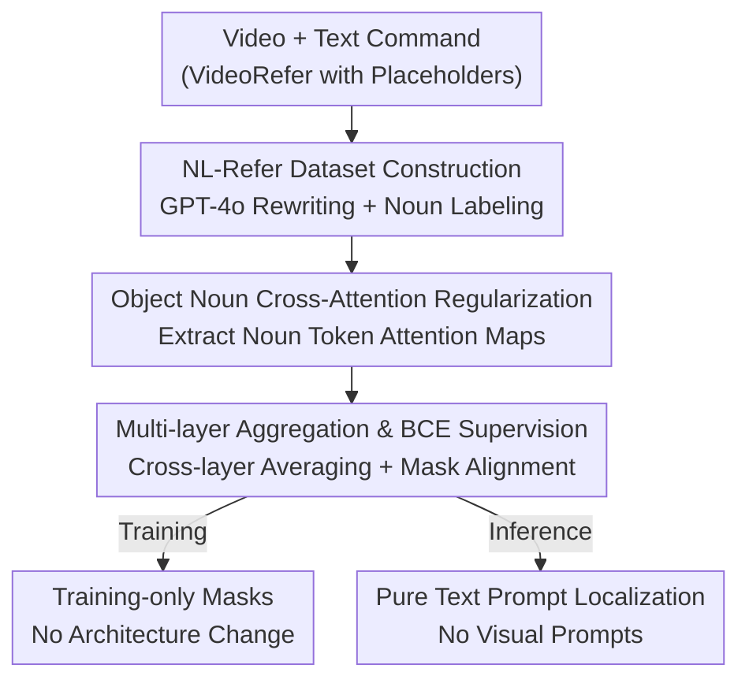

# See What I Mean: Aligning Vision and Language Representations for Video Fine-grained Object Understanding

**Conference**: CVPR 2026  
**Paper**: [CVF Open Access](https://openaccess.thecvf.com/content/CVPR2026/html/Sun_See_What_I_Mean_Aligning_Vision_and_Language_Representations_for_CVPR_2026_paper.html)  
**Code**: https://github.com/HumanMLLM/SWIM  
**Area**: Multimodal VLM / Video Understanding  
**Keywords**: Video fine-grained understanding, vision-language alignment, cross-attention supervision, referring understanding, MLLM

## TL;DR
SWIM is a training strategy that supervises the "object noun token → visual token" cross-attention in MLLMs using object masks during the training phase only. This enables the model to precisely locate user-specified objects from pure text prompts. At inference, it requires no visual prompts such as points, boxes, or masks, outperforming expert models that rely on visual prompts on video fine-grained understanding benchmarks.

## Background & Motivation

**Background**: General multimodal large models (MLLMs) are proficient in holistic scene understanding but often fail to maintain focus on specific objects for fine-grained descriptions or question answering. The prevailing remedy is to provide additional visual prompts at inference—points (Osprey), boxes (Ferret), or masks (VideoRefer, PixelRefer)—and utilize a region-level encoder to encode the object as a separate token.

**Limitations of Prior Work**: Such approaches require visual prompts even during **inference**, which increases auxiliary encoder and computational costs while deviating from the most natural human interaction—describing "the man in the striped shirt" in plain language rather than drawing a box.

**Key Challenge**: Using visualizations of Qwen2.5-VL cross-attention maps, the authors identified a systematic phenomenon: **attribute words** (colors, textures like striped, brown) produce **sharp, localized** activations in the visual modality. In contrast, **object nouns** (man, shirt) produce **diffuse, scattered** activations. This occurs because attribute words naturally map to low-level visual features and are tied to specific spatial textures, while object nouns depend on high-level semantic representations and appear in diverse contexts in massive corpora, diluting their spatial associations without explicit supervision.

**Goal**: To "restore" the correspondence between object nouns and their visual regions without architectural changes or additional visual prompts during inference.

**Key Insight**: Since cross-attention acts as a direct indicator of multimodal interaction, spatial supervision can be applied directly to the cross-attention of "noun tokens," forcing them to focus on the correct regions.

**Core Idea**: Replace "inputting visual prompts at inference" with "supervising cross-attention with masks only during training," transforming visual prompts from an inference input into a training signal.

## Method

### Overall Architecture
SWIM is built upon Qwen2.5-VL-7B (SigLIP visual encoder, Qwen2.5 LLM). The pipeline consists of two steps. Step 1: **Data Refining**. Starting from the VideoRefer dataset, human instructions containing placeholders like `<region>` are rewritten using GPT-4o into sentences with clear natural language references, labeling the most representative object nouns to create the NL-Refer dataset. Step 2: **Supervised Fine-tuning with Attention Regularization**. During training, the cross-attention maps generated by the labeled noun tokens across multiple intermediate layers are extracted, mapped back to the original spatial grid, and aggregated across layers. Pixel-wise BCE supervision is then applied using ground-truth masks to force the noun's attention onto the correct object. The mask $M_i$ participates only in the training loss; during inference, the entire network processes only "video + pure text" without visual prompts.

### Key Designs

**1. NL-Refer Dataset Construction: Replacing placeholder references with supervisable natural language**

Prior limitations: Instructions in VideoRefer look like "Describe the important elements in the marked region `<region>`." Placeholders rely on external masks, and the text **does not** explicitly state what the object is, preventing the model from learning direct noun-region correspondences. SWIM uses GPT-4o for refinement: for each sample, `<region>` is replaced with a concise, unambiguous natural language reference $r_i$ based on paired GPT responses $G_i$. Simultaneously, GPT-4o selects a **single most representative object noun** $w_i$ from $r_i$, wrapped in a special `<ins>` tag to deterministically locate the token during training. This is formalized as $\hat H_i = \mathrm{Mark}(\mathrm{Replace}(H_i, \texttt{<region>}, r_i), w_i)$, where $r_i = \mathrm{NLRef}(G_i)$. This anchors the labeled noun token to the ground-truth mask $M_i$, providing a reliable "word ↔ pixel" mapping.

**2. Object Noun Cross-Attention Regularization: Directly supervising "noun → visual region" alignment**

This is the core of SWIM, addressing the "diffuse noun attention" identified in the motivation. During training, $\hat H_i$ is tokenized to locate the noun token at index $j_i$. In the $l$-th cross-attention layer of the LLM decoder, the query $Q^t_l[j_i]$ of that noun and the keys $K^v_l$ of all visual tokens in the frame are used to calculate the attention distribution:

$$A_{l,i} = \mathrm{softmax}\!\left(\frac{Q^t_l[j_i]\,(K^v_l)^\top}{\sqrt{d}}\right),$$

where the softmax is normalized over $L_v$ visual tokens. The attention vector is then mapped back to an $(H, W)$ grid based on the spatial correspondence between visual tokens and patches, resulting in $\bar A_{l,i}\in[0,1]^{H\times W}$. Crucially, supervision acts specifically on the "noun" token's attention rather than general visual feature reconstruction—contrasting with works like Cambrian or VIRAL that focus on visual representation itself. Since $M_i$ is not used at inference, there is zero additional overhead.

**3. Multi-layer Aggregation and BCE Supervision: Stable alignment for sparse attention**

Since attention patterns vary significantly across layers, single-layer supervision is unstable. SWIM aggregates from a set of selected layers $S$: $\bar A_i = \frac{1}{|S|}\sum_{l\in S} A_{l,i}$ and applies pixel-wise Binary Cross-Entropy (BCE) with the ground-truth mask:

$$\mathcal{L}^{(i)}_{\mathrm{BCE}} = -\frac{1}{HW}\sum_{u,v}\Big[M_i(u,v)\log\bar A_i(u,v) + (1-M_i(u,v))\log(1-\bar A_i(u,v))\Big].$$

Three engineering choices are supported by ablations. Regarding layers, performance saturates at 6 layers, where a **uniform distribution** (e.g., `[2,7,12,17,22,27]`) outperforms narrow depth bands. For fusion, **simple averaging** (3.78) is superior as it smooths noise without depth bias. For loss, **BCE** outperforms mIoU/Focal/Dice; given the high sparsity of attention maps, BCE's pixel-independent penalty effectively suppresses irrelevant activations while strengthening target confidence.

### Loss & Training
The total training data is approximately 235K: 125K from NL-Refer (derived from VideoRefer-700K) and approximately 110K sampled general video QA to maintain general capabilities. Attention regularization is added as an auxiliary supervision to the standard text loss. Training was conducted on 8× A100 GPUs.

## Key Experimental Results

### Main Results
On the VideoRefer-Bench, SWIM (with pure text prompts) outperforms expert models relying on visual prompts and stronger general models.

| Benchmark | Metric | SWIM | VideoRefer-7B(Mask) | DAM-8B(Point/Box/Mask) | GPT-4o |
|-----------|------|------|---------------------|------------------------|--------|
| VideoRefer-Q | Avg. Acc | **78.3** | 71.9 | – | 71.3 |
| VideoRefer-Q | Basic | **83.8** | 75.4 | – | 62.3 |
| VideoRefer-D | Avg. (0–5) | **3.78** | 3.46 | 3.68 | 3.25 |
| VideoRefer-D | SC (Subject Corr.) | **4.92** | 4.44 | 4.69 | 4.15 |

SWIM remains competitive in general video understanding (MVBench 62.1, Video-MME 55.9), showing no sacrifice in generalization due to alignment training.

### Ablation Study
| Experiment | Configuration | VideoRefer-D Avg. | Instruction |
|------|------|-------------------|------|
| Layers | Single [1] | 3.43 | Too shallow, weak alignment |
| Layers | 6 Uniform [2,7,…,27] | **3.78** | Best, saturates after 6 |
| Fusion | Add | 3.57 | Introduces depth bias |
| Fusion | Prod. | 3.55 | Over-suppresses medium activations |
| Fusion | Mean | **3.78** | Smooths noise, preserves peaks |
| Loss | mIoU / Focal / Dice | 3.71 / 3.69 / 3.74 | Improper penalty for sparse attention |
| Loss | BCE | **3.78** | Most suitable pixel-wise penalty |

The GamePoint@P metric (proportion of top P% attention pixels within the target mask) shows that SWIM improves Qwen2.5-VL-7B from 0.329 to 0.392 at P=1 (+6.3%), indicating that the "most confident" attention point is significantly more likely to land on the correct object.

### Key Findings
- **Transforming masks from inference inputs to training signals** is the primary value: SWIM achieves superior performance without structural changes or inference overhead.
- **Attention disparity between attribute words and nouns** is the conceptual pivot: supervision tightens noun activations into the correct regions, making them as sharp as attributes.
- **Monotonic Scalability**: Performance on VideoRefer-D increases monotonically from 3.23 (30K data) to 3.78 (125K), suggesting further gains with more mask data.
- The "6-layer uniform + Mean aggregation + BCE" combination is the most stable engineering configuration.

## Highlights & Insights
- **Internalizing visual prompts into training**: The core insight is that visual prompts are not necessary for inference if they are used to supervise cross-attention during training—an elegant "use the crutch in training, discard it in inference" approach.
- **Diagnosing alignment via cross-attention**: Identifying "diffuse noun activation" as a specific defect allowed for targeted supervision rather than generic architectural additions.
- **Sparsity determines loss selection**: The choice of BCE over IoU/Dice due to the sparse nature of attention maps highlights the importance of matching loss functions to the statistical properties of the supervision signal.

## Limitations & Future Work
- The experiments are constrained by the scale of existing mask data (125K); though the curve hasn't saturated, larger scales remain unverified. The quality of NL-Refer depends on GPT-4o rewriting, which may introduce biases or incorrect noun labeling.
- The method relies on "one labeled noun per sample." How it extends to multiple objects in a single sentence or complex relational referring (e.g., "the cup in the hand of the man on the left") is not discussed.
- Improvement ideas: Extending single noun supervision to multi-noun/phrase levels or using attribute words as auxiliary anchors could further refine noun activations.

## Related Work & Insights
- **vs VideoRefer / PixelRefer (Visual Prompt School)**: These rely on masks and additional encoders at inference; SWIM moves the mask to training supervision, achieving better results with pure text.
- **vs Cambrian / VIRAL (Intermediate Reconstruction School)**: These reconstruct visual embeddings. SWIM directly supervises "noun token cross-attention," filling the gap in vision-language alignment.
- **vs Osprey / Ferret (Point/Box/Mask Referring)**: These deviate from natural language interaction modes; SWIM returns to the common "one sentence to refer" real-world interaction.

## Rating
- Novelty: ⭐⭐⭐⭐ Clear perspective on training-only masks with diagnostic support.
- Experimental Thoroughness: ⭐⭐⭐⭐ Comprehensive multi-dimensional ablations (layers/fusion/loss/data).
- Writing Quality: ⭐⭐⭐⭐ Logical flow from attention phenomena to methodology.
- Value: ⭐⭐⭐⭐ Provides a reusable training paradigm for fine-grained understanding without visual prompts.

<!-- RELATED:START -->

## Related Papers

- [\[CVPR 2026\] Aligning What Vision-Language Models See and Perceive with Adaptive Information Flow](aif_adaptive_information_flow_vlm.md)
- [\[CVPR 2026\] HanDyVQA: A Video QA Benchmark for Fine-Grained Hand-Object Interaction Dynamics](handyvqa_a_video_qa_benchmark_for_fine-grained_hand-object_interaction_dynamics.md)
- [\[CVPR 2026\] MA-Bench: Towards Fine-grained Micro-Action Understanding](ma-bench_towards_fine-grained_micro-action_understanding.md)
- [\[CVPR 2026\] Hugging Visual Prompt and Segmentation Tokens: Consistency Learning for Fine-Grained Visual Understanding in MLLMs](hugging_visual_prompt_and_segmentation_tokens_consistency_learning_for_fine-grai.md)
- [\[CVPR 2026\] CropVLM: Learning to Zoom for Fine-Grained Vision-Language Perception](cropvlm_learning_to_zoom_for_fine_grained_vision_language_perception.md)

<!-- RELATED:END -->
