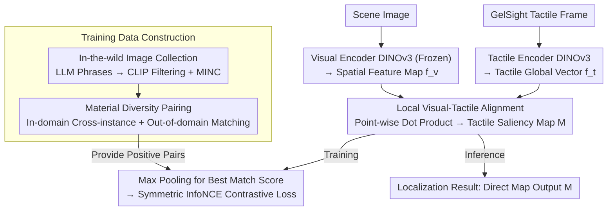

# Seeing Through Touch: Tactile-Driven Visual Localization of Material Regions

**Conference**: CVPR 2026  
**arXiv**: [2604.11579](https://arxiv.org/abs/2604.11579)  
**Code**: [https://mm.kaist.ac.kr/projects/SeeingThroughTouch/](https://mm.kaist.ac.kr/projects/SeeingThroughTouch/)  
**Area**: Multimodal VLM  
**Keywords**: Tactile localization, Visual-tactile alignment, Material segmentation, Cross-modal learning, Dataset

## TL;DR
This paper proposes the tactile localization task—identifying regions in an image that share the same material properties as a given tactile input. By learning dense cross-modal features through local visual-tactile alignment and a material diversity pairing strategy, the authors construct two new tactile-material segmentation datasets.

## Background & Motivation

**Background**: Visual-tactile learning has primarily focused on global alignment (determining if an image and tactile signal correspond to the same material) but lacks spatial localization capabilities—it cannot find regions in a visual scene that "feel the same."

**Limitations of Prior Work**: (1) Global alignment methods cannot localize material regions. (2) Existing datasets mostly consist of close-up shots with static visual frames and a single material filling the view, lacking scene-level multi-material images. (3) There is a lack of evaluation benchmarks for tactile-material segmentation.

**Key Challenge**: Tactile localization requires fine-grained local cross-modal correspondence, whereas existing methods and data only provide coarse global alignment.

**Core Idea**: Learn local visual-tactile alignment to generate tactile saliency maps, and expand effective training pairs through a material diversity pairing strategy.

## Method

### Overall Architecture
The paper addresses "tactile localization": given an image and a tactile reading, it identifies regions in the image that "feel like this tactile input." Unlike previous visual-tactile learning that treats this as a global binary classification task, this method identifies material-consistent regions pixel-by-pixel.

The pipeline operates as follows: A tactile encoder compresses a GelSight tactile frame into a global vector $\bar{f}_t$, while a visual encoder encodes the image into a feature map $f_v$ that preserves spatial structure (both use DINOv3, with the visual backbone frozen during alignment training). A dense similarity map $M[h,w] = \bar{f}_t \cdot f_v[h,w]$ is calculated via point-wise dot products between the tactile vector and the feature map at each location; this map serves as the "tactile saliency map." During training, max pooling is applied to this map to extract the highest matching score for symmetric InfoNCE contrastive learning. During inference, the similarity map is directly output as the localization result. To train this local alignment effectively, two data construction steps address the scarcity of training pairs: "Material Diversity Pairing" expands sparse tactile-visual pairs via cross-instance and cross-scene matching, while "In-the-wild Image Collection and Filtering" gathers scene-level images containing multiple materials.

### Key Designs

**1. Local Visual-Tactile Alignment: Shifting from "What" to "Where"**

Global alignment methods compress images into single vectors, losing spatial information and preventing localization. This work employs dense alignment: while tactile input remains a global vector $\bar{f}_t$, the visual features retain spatial dimensions. Their point-wise dot product yields a similarity map $M$. Using max pooling $s = \max_{h,w} M[h,w]$ allows the model to focus only on the most similar region to pull the tactile feature closer. This ensures that only regions with identical materials achieve high response, naturally turning the similarity map into a localization map.

**2. Material Diversity Pairing: Leveraging Material Similarity to Expand Samples**

Datasets like Touch-and-Go (TG) suffer from static visual frames where a single material occupies the entire view, leading to sparse positive pairs. Two layers of pairing are used: in-domain pairing recombines different tactile instances and visual frames of the same material category, breaking the "one-frame-only" association. Out-of-domain pairing matches web-crawled scene images to tactile samples based on category labels, leveraging the assumption that "similar materials yield similar tactile signatures." This forces the model to learn material correspondences that hold across different instances and scenes.

**3. In-the-wild Image Collection and Filtering: Providing Multi-material Scenes**

TG datasets lack multi-material scenes, which are essential for training localization. The authors used LLMs to generate diverse search queries for each material (e.g., "brick chimney in a cozy living room") to scrape images. These were filtered using CLIP similarity to ensure category accuracy and supplemented with images from the MINC material dataset. This resulting collection provides rich scenes with multiple materials, diverse perspectives, and varied distances.

### Loss & Training
Symmetric InfoNCE contrastive loss is used (Visual-to-Tactile and Tactile-to-Visual). During training, the visual DINOv3 backbone is frozen to preserve spatial features, while only the tactile encoder and alignment modules are updated.

## Key Experimental Results

### Main Results

| Dataset | Metric | Ours | Prev. SOTA | Gain |
|--------|------|-----|---------|------|
| TG-Seg (New) | mIoU | Sig. Higher | ImageBind | Massive |
| Web-Mat-Seg (New) | mIoU | Sig. Higher | UniTouch | Massive |
| OpenSurfaces | F1 | Higher | Baseline | Improvement |

### Ablation Study

| Configuration | mIoU | Description |
|------|------|------|
| Full (In-domain + Out-of-domain) | Optimal | Complete model |
| In-domain Pairing Only | Sub-optimal | Lacks scene-level generalization |
| Standard Pairing Only | Poor | Insufficient effective training pairs |
| Global Alignment Alternative | Poor | No spatial localization capability |

### Key Findings
- Local alignment significantly outperforms global alignment, proving that spatially resolved cross-modal features are key to localization.
- Material diversity pairing (especially out-of-domain images) is crucial for generalizing to scene-level images.
- The ability to handle weak tactile signals (e.g., light touch or uncertain materials) improved significantly with increased out-of-domain data.

## Highlights & Insights
- **New Task Definition**: Tactile localization is a natural yet previously unstudied problem that could inspire further research into sensory interaction.
- **Exploiting Material-Tactile Consistency**: The simple assumption that "similar materials produce similar tactile feedback" allows for massive data expansion, serving as a general strategy for cross-modal learning under data scarcity.

## Limitations & Future Work
- The tactile sensor is fixed (GelSight); cross-sensor generalization has not been verified.
- The granularity of material categories is limited (18 classes).
- Future work could extend to finer material attributes like roughness and hardness.

## Related Work & Insights
- **vs ImageBind/UniTouch**: These use global alignment and cannot perform localization.
- **vs TaRF**: Performs tactile localization within 3D NeRFs, limited to reconstructed scenes.

## Rating
- Novelty: ⭐⭐⭐⭐ Innovative task definition and practical data strategy.
- Experimental Thoroughness: ⭐⭐⭐⭐ Constructed two new datasets for evaluation.
- Writing Quality: ⭐⭐⭐⭐ Clear motivation and methodology.
- Value: ⭐⭐⭐⭐ Opens a new direction for tactile localization.

<!-- RELATED:START -->

## Related Papers

- [\[CVPR 2026\] Mechanisms of Object Localization in Vision-Language Models](mechanisms_of_object_localization_in_vision-language_models.md)
- [\[CVPR 2026\] Concept Regions Matter: Benchmarking CLIP with a New Cluster-Importance Approach](concept_regions_matter_benchmarking_clip_with_a_new_cluster-importance_approach.md)
- [\[CVPR 2026\] GroundingME: Exposing the Visual Grounding Gap in MLLMs through Multi-Dimensional Evaluation](groundingme_exposing_the_visual_grounding_gap_in_mllms_through_multi-dimensional.md)
- [\[ICLR 2026\] Seeing Through Deception: Uncovering Misleading Creator Intent in Multimodal News with Vision-Language Models](../../ICLR2026/multimodal_vlm/seeing_through_deception_uncovering_misleading_creator_intent_in_multimodal_news.md)
- [\[CVPR 2026\] VLM-Loc: Localization in Point Cloud Maps via Vision-Language Models](vlm-loc_localization_in_point_cloud_maps_via_vision-language_models.md)

<!-- RELATED:END -->
