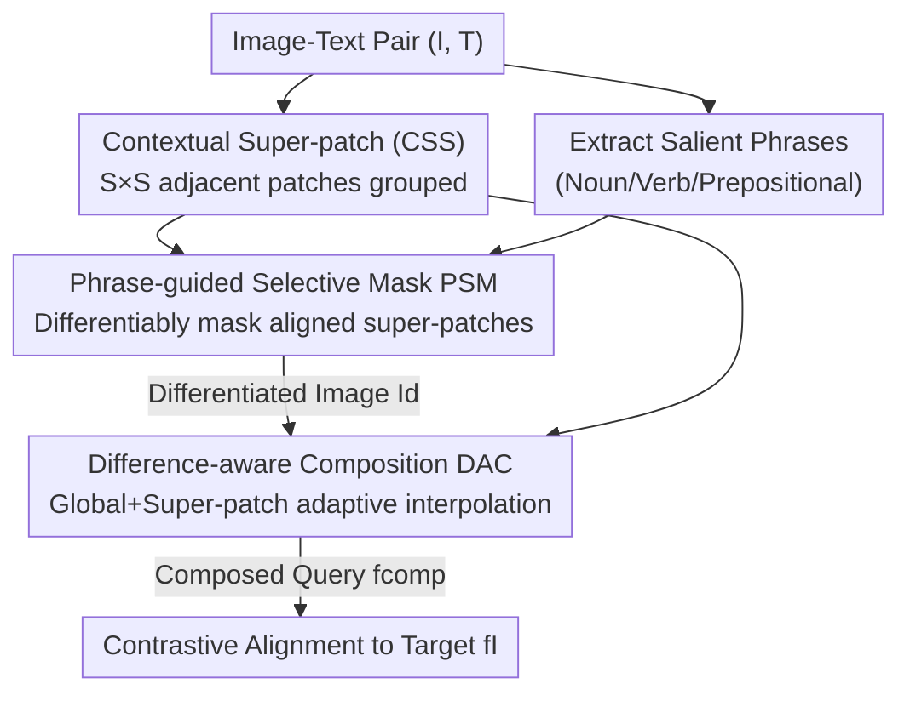

# Self-guided Semantic Inspection for Zero-Shot Composed Image Retrieval

**Conference**: CVPR 2026  
**Paper**: [CVF Open Access](https://openaccess.thecvf.com/content/CVPR2026/html/Zhang_Self-guided_Semantic_Inspection_for_Zero-Shot_Composed_Image_Retrieval_CVPR_2026_paper.html)  
**Code**: https://github.com/Orange1999/DiffComp  
**Area**: Multi-modal VLM  
**Keywords**: Composed Image Retrieval, Zero-Shot, Cross-modal Difference, Self-supervision, Adaptive Fusion

## TL;DR
Addressing the training-inference mismatch in Zero-Shot Composed Image Retrieval (ZS-CIR)—where models are trained on "aligned image-text pairs" but must handle "unaligned reference images + modified text" during inference—this paper proposes DiffComp. It introduces a "Differentiate-then-Compose" self-supervised paradigm that actively masks visual regions aligned with text phrases during training to artificially introduce cross-modal differences, followed by difference-aware adaptive fusion. DiffComp achieves SOTA performance across four ZS-CIR benchmarks.

## Background & Motivation
**Background**: The task of Composed Image Retrieval (CIR) is to retrieve a target image that reflects modifications specified by a text query relative to a reference image (e.g., "change the man's clothes to a suit"). Supervised CIR relies on manually annotated (reference image, text, target image) triplets, which are costly and difficult to generalize. Zero-Shot CIR (ZS-CIR) leverages pre-trained vision-language models (CLIP/BLIP) to bypass triplet supervision and is the current mainstream direction.

**Limitations of Prior Work**: ZS-CIR generally adopts a **consistency-driven** paradigm, training on "semantically aligned" image-text pairs with alignment or reconstruction objectives. Mainstream pseudo-word methods (e.g., Pic2Word, LinCIR) map the reference image into pseudo-language tokens and concatenate them with the modified text during inference; fusion-based methods (e.g., SlerpTAT) tighten the alignment of vision-language spaces for feature-level fusion. However, training data is naturally **aligned**, whereas inference inputs are **unaligned or even conflicting** (the reference image describes A, while the text demands it be changed to B).

**Key Challenge**: The authors performed a quantitative comparison of CLIP cosine similarity distributions between 300,000 training samples and CIR benchmarks (Fig.1b), confirming a significant **semantic distribution shift** between training (aligned) and inference (unaligned). Consistency training teaches the model to focus only on "shared semantics" but never requires it to **identify and reconcile cross-modal conflicts**—which is precisely the essence of CIR.

**Goal**: To enable the model to encounter and learn to handle cross-modal differences during the training phase, thereby bridging the training-inference gap. This is decomposed into three sub-problems: (1) how to obtain controllable and interpretable local visual semantic units; (2) how to **artificially induce** controlled cross-modal differences on aligned data; and (3) how to perform adaptive vision-text fusion based on the degree of difference.

**Key Insight**: Rather than reinforcing consistency on aligned data, it is better to **actively induce differences**. The authors propose a paradigm shift: from "consistency-driven alignment" to "difference-aware composition," treating semantic differences as the core signal for compositional reasoning.

**Core Idea**: A "Differentiate-then-Compose" self-supervised loop that transforms aligned image-text pairs into training samples with controlled differences, forcing the model to perceive and reconcile cross-modal conflicts.

## Method

### Overall Architecture
DiffComp is a self-supervised framework: given a standard training image-text pair $(I, T)$, it first segments the image into "contextual super-patches" and extracts salient phrases from the text; it then **selectively masks** super-patches highly aligned with the salient phrases to artificially create semantic differences between the "modified image" and the "original caption"; finally, a difference-aware fusion module adaptively merges the retained visual features with text features to produce a composed query feature $f_{comp}$, which is aligned to the **unmasked target image feature** $f_I$ via contrastive loss. During inference, the masking module is disabled, and the reference image $I_r$ + modified text $T_m$ undergo difference-aware fusion before computing cosine similarity with the global features in the gallery.

The three core modules are connected in sequence: CSS (Super-patch Representation) $\rightarrow$ PSM (Phrase-guided Selective Masking, training only) $\rightarrow$ DAC (Difference-aware Composition).

### Key Designs

**1. Contextual Super-patch Representation (CSS): Providing Usable Local Semantic Units for CLIP**

The pain point is straightforward: although CLIP/ViT provides patch tokens, existing work has found that the hidden states of these patches tend to encode aggregate global semantics rather than "independent, interpretable" local region representations—yet CIR requires precise judgment on "which visual content to keep/modify/exclude." This paper groups $S\times S$ adjacent patches into **spatially coherent super-patches**, serving as a midpoint between "fine-grained patches" and "coarse global features." An image is divided into $L$ patch embeddings with positional encodings $e_i = p_i + pos_i$, then non-overlappingly split into $N_s = L/S^2$ super-patches. Each super-patch independently passes through the visual encoder once, using its `[CLS]` output as the super-patch feature $f^{SP}_j = \text{VisualEncoder}([e_{CLS}, e_{j_1}, \dots, e_{j_{S^2}}])$. This step involves simple grouping and encoder reuse with almost no extra parameters, yet provides semantic units of appropriate granularity for subsequent "phrase-region correspondence" and "difference-modulated fusion." Ablations show performance gains as the super-patch scale increases from $1\times1$ (original patches) to $4\times4$, though $8\times8$ is too coarse and blurs object boundaries.

**2. Phrase-guided Selective Masking (PSM): Artificially Inducing Controlled Differences**

This is the "Differentiate" step of the "Differentiate-then-Compose" loop, specifically designed to address training-inference mismatch. During training, it masks the regions **most likely to be modified** by the text, simulating the inference scenario where the reference image conflicts with the text. This involves two steps. First, **Super-patch-Phrase Interaction**: salient phrases $K$ (nouns/verbs/prepositions) are extracted using Stanford CoreNLP, encoded as $f^K_i$, and used to compute a matching matrix $S_{ij}$ with each super-patch. Softmax aggregation yields phrase saliency scores $\omega_i$, reflecting the relative contribution of each phrase to the "intended modification." Second, **Differentiable Mask Sampling**: each super-patch's mask probability $p_j = \sigma(\gamma z_j + b)$ is calculated based on its alignment $z_j = \sum_i \omega_i S_{ij}$. Gumbel-Softmax with straight-through argmax generates a binary mask $m_j$. The super-patch mask propagates to patches and is injected into attention as a log bias: $\text{Attention}(Q,K,V) = \text{Softmax}(QK^\top/\sqrt{d_k} + \log(1-M^p)^\top)V$, resulting in a differentiated image representation $f_{I_d}$—an image where content aligned with the salient text has been removed, leaving only residual cues. Phrase-level guidance is more precise than random or CAM-based masking.

**3. Difference-aware Composition (DAC): Adaptive Mixing Based on Semantic Difference**

The pain point: methods like SlerpTAT use **global, fixed-ratio** Spherical Linear Interpolation (Slerp) in the CLIP space, which cannot adapt to local semantic differences. This paper implements **dual-layer interpolation (global + super-patch)**: regions aligned with the text retain more visual semantics, while regions with high semantic divergence are primarily driven by the text. The global layer performs Slerp between the text feature $f_T$ and the differentiated image feature $f_{I_d}$ using a base weight $\lambda_{base}$ to obtain $\tilde f_{global}$. The super-patch layer calculates text similarity $sim_j = \langle f^{SP}_j, f_T\rangle / (\|f^{SP}_j\|\|f_T\|)$ for each retained super-patch, using an adaptive weight $\lambda_j = \lambda_{base}\left(1 - \frac{\exp(sim_j)}{\max_i \exp(sim_i)}\right)$. Higher similarity results in a smaller $\lambda_j$, preserving more visual content in aligned regions. Each super-patch is then interpolated toward the text. The final query feature weights the super-patch and global results by $\phi$: $f_{comp} = \phi\cdot\frac{1}{N_p}\sum_{j=1}^{N_p}\tilde f_j + (1-\phi)\cdot\tilde f_{global}$. This achieves semantically controllable, difference-guided adaptive fusion at the super-patch level.

### Loss & Training
The total loss is $\mathcal{L} = \mathcal{L}_{align} + \mathcal{L}_{diff} + \mathcal{L}_{ratio}$.

$$\mathcal{L}_{align} = -\frac{1}{B}\sum_{i=1}^{B}\log\frac{\exp(s(f^{(i)}_{comp}, f^{(i)}_I)/\tau)}{\sum_{j=1}^{B}\exp(s(f^{(i)}_{comp}, f^{(j)}_I)/\tau)}$$

This is a unidirectional contrastive loss that aligns the composed query $f_{comp}$ with the **unmasked target image** feature $f_I$ (unidirectional design fits the query $\rightarrow$ target retrieval goal). $\mathcal{L}_{diff} = -\frac{1}{|M_1|}\sum_{j\in M_1} S_{k^*j}$ encourages masking regions highly correlated with the **most salient phrase** $k^*$, guiding targeted difference induction. $\mathcal{L}_{ratio} = \left(\frac{1}{N_s}\sum_j m_j - \eta\right)^2$ regularizes the mask ratio near the target $\eta$ to avoid degenerate solutions.

Training details: Trained on 10% of CC3M. Backbones include CLIP ViT-L/14 (super-patch scale $S=4$, mask ratio $\eta=0.7$) and BLIP ViT-L/16 ($S=2$, $\eta=0.5$). Gumbel-Softmax temperature decays from 1.0 to 0.1. $\lambda_{base}=0.8, \phi=0.4$. Single A100, batch size 64, AdamW (lr $1\times10^{-6}$), 10 epochs. Only parts of the backbone are fine-tuned; the three modules add negligible parameters and computation.

## Key Experimental Results

### Main Results
Evaluated on four ZS-CIR benchmarks: FashionIQ (clothing attributes, R@10/50), CIRR (real-world scenes, R@1/5/10/50), CIRCO (120K COCO gallery, multi-GT, mAP@5–50), and GeneCIS (conditioned similarity reasoning, R@1/2). The table below summarizes FashionIQ Average and CIRR (CLIP/BLIP backbones):

| Backbone | Method | FashionIQ Avg R@10 | FashionIQ Avg R@50 | CIRR R@1 | CIRR R@5 |
|----------|------|------|------|------|------|
| CLIP L/14 | HIT (ICCV'25) | 30.30 | 51.00 | 27.90 | 57.60 |
| CLIP L/14 | PrediCIR (CVPR'25) | 30.10 | 52.30 | 27.20 | 57.00 |
| CLIP L/14 | **DiffComp** | **32.62** | **53.85** | **32.36** | **62.90** |
| BLIP L/16 | HIT (ICCV'25) | 34.50 | 55.80 | 36.90 | 67.70 |
| BLIP L/16 | **DiffComp** | **34.71** | **56.14** | **39.72** | **68.64** |

On CIRCO, the CLIP backbone matches SlerpTAT (mAP5 16.19 vs 16.98, but SlerpTAT uses ~8x more training data), while the BLIP backbone sets a new SOTA (mAP5 18.35). GeneCIS achieves the highest average Recall in Focus and Object dimensions. Overall, the largest gains appear in low recall thresholds (R@1) on CIRR, indicating more precise semantic alignment.

### Ablation Study
Module combinations and variant configurations (FashionIQ R@10 / CIRR R@1):

| Config | R@10 | R@1 | Note |
|------|------|------|------|
| Baseline (standard patch + random mask + simple fusion) | 29.5 | 28.4 | Starting point |
| CSS | 30.1 | 29.5 | Super-patches alone provide gains |
| PSM | 29.8 | 28.9 | Limited/unstable gains alone |
| DAC | 29.3 | 29.6 | Limited/unstable gains alone |
| CSS+PSM | 31.2 | 30.4 | PSM effective only with CSS structured semantics |
| CSS+DAC | 30.8 | 31.0 | — |
| **CSS+PSM+DAC (Full)** | **32.6** | **32.4** | +2.5 / +2.9 over CSS alone |

| Variant Dimension | Config | R@10 | R@1 |
|----------|------|------|------|
| CSS Scale | grid 2×2 | 31.9 | 31.5 |
| CSS Scale | grid 4×4 (Default) | 32.6 | 32.4 |
| CSS Scale | grid 8×8 (Too coarse) | 29.6 | 29.7 |
| CSS Method | K-Means clustering | 31.6 | 32.8 |
| PSM Mask Gen | Random cropping | 29.8 | 30.9 |
| PSM Mask Gen | CAM masking | 31.2 | 31.5 |
| PSM Mask Gen | Hard masking | 30.2 | 31.0 |
| PSM Granularity | Sentence-level | 31.6 | 32.0 |

### Key Findings
- **CSS is the Foundation**: PSM and DAC provide limited or unstable gains on their own because original patch tokens lack structured semantics. Once paired with CSS (grouping patches into semantically coherent super-patches), both become significantly effective, proving the three modules are complementary.
- **Optimal Super-patch Scale**: Performance improves from $1\times1 \to 4\times4$ (moderate spatial aggregation enhances semantic coherence while retaining local detail), but drops at $8\times8$ (blurred object boundaries weaken difference modeling). K-Means clustering is slightly better on CIRR but worse on FashionIQ and hinders parallel efficiency due to varying cluster sizes; thus, a regular grid is the default.
- **Phrase-level Guidance is Best**: Random cropping performs worst (lacks semantic selectivity, often loses relevant regions). CAM is based on visual saliency and may misalign with phrase-level text cues. Sentence-level context is richer but introduces more noise. A mask ratio of ~0.7, $\lambda_{base}=0.8$, and $\phi\approx0.4$ yield the best performance.
- **Efficiency-Friendly**: DiffComp averages 47.6% (R@1/R@5) on CIRR, outperforming HIT by 4.8% and Pic2Word by nearly 10% while using only 10% of CC3M and 4 hours of single-GPU training. Lightweight linear mixing and CSS local features also make inference faster than pseudo-word mapping methods (PrediCIR, HIT).

## Highlights & Insights
- **Paradigm Shift through "Reverse Operation"**: While others strengthen "consistency/alignment" during training, this paper does the opposite—**actively induces cross-modal differences** to match the unaligned inputs at inference. This idea of "using self-supervision to create differences on aligned data" can generalize to any task where training is aligned but inference is conflicting (e.g., instructive image editing, counterfactual VQA).
- **Super-patch as a Cost-effective Intermediate Granularity**: Without retraining the large model or adding supervision, simply grouping adjacent patches and taking the `[CLS]` after one encoder pass provides local semantic units that are "more stable than patches, finer than global features"—a prerequisite for successful phrase alignment and difference-modulated fusion.
- **Difference-aware Adaptive Interpolation**: $\lambda_j$ varies inversely with similarity, allowing "aligned regions to keep more vision, and conflicting regions to follow text." This upgrades global fixed-ratio Slerp to spatially selective fusion, a direct improvement over SlerpTAT.
- **Interpretability**: Visualizing $(1-\lambda_j)$ reveals the model's spatial modulation of visual retention under different text queries (e.g., "close coverage on animal instead of man" suppresses human regions). The masks learned during training also correspond to readable phrase-region relationships.

## Limitations & Future Work
- **Dependency on External Phrase Parser**: PSM relies on Stanford CoreNLP to extract phrases; phrase quality directly affects difference induction. CoreNLP may perform poorly on non-English or colloquial/complex modified text.
- **Encoder Passes During Training**: CSS requires each super-patch to pass through the visual encoder once. While the authors claim the overhead is negligible, the number of forward passes increases with more super-patches (complexity details in Appendix A).
- **Comparison on CIRCO**: With the CLIP backbone, DiffComp only matches SlerpTAT. The authors explain that SlerpTAT uses ~8x more data, but a direct comparison under equal data volumes is missing.
- **Hyperparameter Sensitivity**: Mask ratio, $\lambda_{base}$, $\phi$, and super-patch scale all have clear optimal ranges. These may need re-tuning for different datasets or backbones (e.g., CLIP uses $S=4, \eta=0.7$ vs. BLIP's $S=2, \eta=0.5$).

## Related Work & Insights
- **vs. Pseudo-word Mapping (Pic2Word / LinCIR / Context-I2W)**: These methods compress images into pseudo-language tokens, which often distorts visual semantics and relies on heuristic fusion. DiffComp avoids pseudo-word compression by explicitly modeling differences at the feature level (showing significant gains in fine-grained attribute reasoning on FashionIQ).
- **vs. Fusion-based SlerpTAT (ECCV'24)**: SlerpTAT uses global, fixed-ratio Slerp fusion, which is insensitive to local semantic differences and sensitive to data quality. DiffComp's DAC uses global + super-patch adaptive interpolation, mitigating over-smoothing and matching performance with 1/8 of the data.
- **vs. LLM Caption Generation**: Those methods generate target captions but lose visual grounding. DiffComp requires no LLM or external modules, achieving controllable composition while maintaining visual grounding.
- **Insight**: Quantifying "training-inference mismatch" (via similarity distribution comparison) and resolving it with self-supervised differences is a clean research paradigm. Any retrieval/matching task where "training distribution $\neq$ inference distribution" can benefit from this "diagnose shift $\rightarrow$ self-supervised sample generation $\rightarrow$ difference-aware fusion" loop.

## Rating
- Novelty: ⭐⭐⭐⭐⭐ Shifts from "consistency-driven" to "difference-driven" paradigm; phrase-guided differentiable masking for controlled differences is a fresh concept.
- Experimental Thoroughness: ⭐⭐⭐⭐ Four benchmarks + dual backbones + complete ablations on modules/variants/hyperparameters; however, equal-data comparison on CIRCO is missing.
- Writing Quality: ⭐⭐⭐⭐⭐ Motivation is quantified via distribution comparisons, the three modules progress logically, and the narrative is self-consistent and easy to follow.
- Value: ⭐⭐⭐⭐ SOTA results + efficiency (10% data, 4h single GPU); the paradigm is transferable to other cross-modal mismatch tasks.

<!-- RELATED:START -->

## Related Papers

- [\[CVPR 2026\] STiTch: Semantic Transition and Transportation in Collaboration for Training-Free Zero-Shot Composed Image Retrieval](stitch_semantic_transition_and_transportation_in_collaboration_for_training-free.md)
- [\[CVPR 2026\] G-MIXER: Geodesic Mixup-based Implicit Semantic Expansion and Explicit Semantic Re-ranking for Zero-Shot Composed Image Retrieval](g_mixer_geodesic_mixup_based_implicit_semantic_expansion_for_zero_shot_cir.md)
- [\[CVPR 2026\] ReCALL: Recalibrating Capability Degradation for MLLM-based Composed Image Retrieval](recall_recalibrating_capability_degradation_for_mllm-based_composed_image_retrie.md)
- [\[CVPR 2026\] ConeSep: Cone-based Robust Noise-Unlearning Compositional Network for Composed Image Retrieval](conesep_cone-based_robust_noise-unlearning_compositional_network_for_composed_im.md)
- [\[CVPR 2026\] Air-Know: Arbiter-Calibrated Knowledge-Internalizing Robust Network for Composed Image Retrieval](air-know_arbiter-calibrated_knowledge-internalizing_robust_network_for_composed_.md)

<!-- RELATED:END -->
