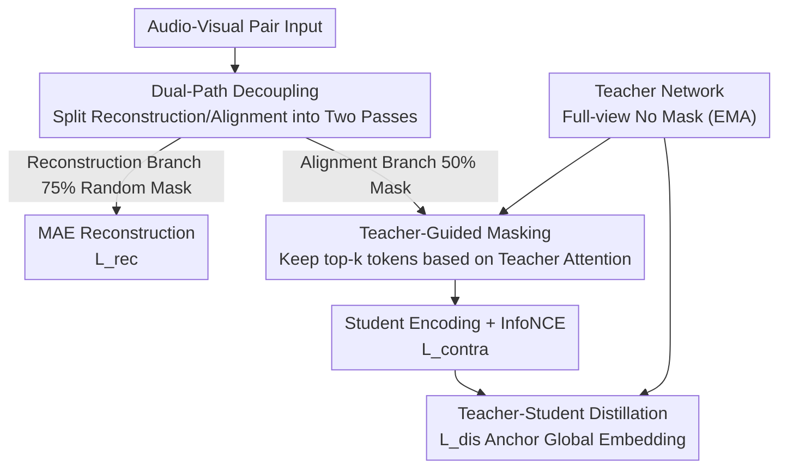

# Semantic Noise Reduction via Teacher-Guided Dual-Path Audio-Visual Representation Learning

**Conference**: CVPR 2026  
**Paper**: [CVF Open Access](https://openaccess.thecvf.com/content/CVPR2026/html/Wang_Semantic_Noise_Reduction_via_Teacher-Guided_Dual-Path_Audio-Visual_Representation_Learning_CVPR_2026_paper.html)  
**Code**: https://github.com/wanglg20/TG-DP  
**Area**: Multimodal VLM / Self-Supervised Representation Learning  
**Keywords**: Audio-Visual Pre-training, Contrastive Learning, Masked Autoencoder, Self-Distillation, Cross-Modal Retrieval

## TL;DR
TG-DP decouples "masked reconstruction" and "contrastive alignment" in audio-visual pre-training into two independent forward passes (each with its own mask ratio). It uses a full-view teacher network to select visible tokens for the contrastive branch and distill global representations, eliminating semantic noise from previous single-pass coupling and achieving SOTA on zero-shot retrieval and linear probing for AudioSet / VGGSound.

## Background & Motivation
**Background**: Two main paradigms in audio-visual self-supervised learning are Masked Autoencoders (MAE, learning unimodal structures via reconstruction) and Contrastive Learning (CL, aligning heterogeneous modalities in a shared embedding space). Recent mainstream methods (CAV-MAE, MaViL, CAV-MAE Sync, etc.) optimize these objectives in a **single forward pass**, performing reconstruction and alignment simultaneously.

**Limitations of Prior Work**: The authors identify two specific issues with this coupling. The first is **semantic noise**—the global tokens used by the contrastive branch are aggregated from visible patches left by "random masks designed for reconstruction." This visibility pattern is not designed for cross-modal matching and retains many regions irrelevant to alignment (silent spectrogram segments, uninformative backgrounds), polluting global representations and weakening fine-grained alignment. The second is **optimization interference**—MAE requires "high-fidelity reconstruction from local observations," while CL requires "semantic invariance for cross-modal matching." Forcing both objectives onto shared tokens causes gradient conflict.

**Key Challenge**: The requirements for "which tokens should be visible" conflict between reconstruction and alignment. Reconstruction prefers high mask ratios to force completion, while alignment prefers low mask ratios to preserve complete semantics. Previous frameworks forced them to share a single masked view.

**Goal**: Decouple the optimization paths of the two objectives while retaining their respective benefits, allowing the contrastive branch to use a visibility pattern "better suited for alignment."

**Key Insight**: Since the conflict arises from "sharing a single view," two separate forward passes with different masks should be used. Meanwhile, a full-view teacher can inject priors about "which tokens are more important for cross-modal alignment" into the contrastive branch.

**Core Idea**: Replace "single-forward joint optimization" with "dual-path decoupling + teacher-guided masking + teacher distillation" to liberate the contrastive branch from reconstruction-oriented random masking.

## Method

### Overall Architecture
TG-DP uses CAV-MAE Sync as the backbone. Given a video and paired audio, a sampled RGB frame and a time-aligned log-Mel spectrogram segment are processed as a training pair, patchified into tokens, and augmented with learnable global tokens and register tokens. The key modification is splitting training into **two objective-specific forward passes**, where each sample is processed twice:

- **Reconstruction Branch**: Following MAE conventions, a high random mask ratio (75%) is applied. Visible audio/visual tokens are concatenated and fed into a joint encoder-decoder to reconstruct masked patches, contributing only to the reconstruction loss $L_{rec}$ to learn strong unimodal structures.
- **Contrastive Branch**: A lower mask ratio (50%) is used, with visible tokens selected via teacher guidance. After encoding, global tokens are used for InfoNCE cross-modal alignment, contributing only to the contrastive loss $L_{contra}$. An additional distillation loss $L_{dis}$ aligns the student's global representation with the teacher's full-view global representation.

Both branches **share encoder and joint layer weights**, but losses are calculated from their respective masked views, completely separating generative and discriminative objectives in terms of representation. Teacher parameters are updated via Exponential Moving Average (EMA) of the student.

### Key Designs

**1. Dual-Path Decoupling: Separate Forward Passes for Reconstruction and Alignment**

To address "semantic noise + optimization interference," TG-DP no longer forces objectives to share a masked view. Each sample is forwarded twice. The reconstruction branch uses a 75% mask (loss defined as $L_{rec}^{m}=\frac{1}{|M_m|}\sum_{i\in M_m}\|\hat{m}_i^m-m_i^m\|_2^2$), while the contrastive branch uses a 50% mask to expose more patches and preserve richer semantic context for global representations. Since the encoder is shared but $L_{rec}$ and $L_{contra}$ are calculated on different views, the objectives do not compete for gradients. This **asymmetric masking** provides the contrastive branch with a view "more compatible with cross-modal alignment." Ablations show that adding a second pass (even with 75% masks for both) improves the harder Audio→Visual direction (R@10 58.1→60.1), but its true value lies in providing the structural basis for different mask ratios.

**2. Teacher-Student Distillation: Semantic Anchoring for Masked Global Representations**

The contrastive branch only sees a partial masked view, which can cause the global token to drift. A lightweight teacher is introduced that processes **complete, unmasked** dual-modal inputs to produce full-view global representations $[\hat{g}^v,\hat{g}^a]$. The student produces global representations $[g^v,g^a]$ from masked inputs. In addition to InfoNCE, an MSE distillation loss is added:
$$L_{dis}=\|g^v-\hat{g}^v\|_2^2+\|g^a-\hat{g}^a\|_2^2$$
This anchors the student's global representation to the teacher's full-view perspective. Teacher parameters are updated via student EMA for temporal stability. The total objective is $L_{all}=\lambda_1 L_{rec}+\lambda_2 L_{dis}+\lambda_3 L_{contra}$. Ablation results (Table 7) show distillation improves AS20K classification from 30.5 to 32.0 mAP.

**3. Teacher-Guided Masking: Retaining "Alignment-Useful" Tokens**

Decoupling alone is insufficient—which 50% of tokens should the contrastive branch retain? Random selection might still discard critical semantics. The authors extract **attention weights** from the teacher's joint encoder to measure the interaction strength between each patch token and the global token. These are normalized over spatial tokens as "token priority cues." The student retains the top-k scoring tokens as visible inputs. This deterministic selection biases the student's view toward regions the teacher finds informative, injecting semantic priors. In Table 8, this "Distinct Guided Mask" improves AS20K classification to 32.0 (compared to 30.2 for random and 29.8 for probabilistic masking), indicating it stabilizes representative robustness.

### Loss & Training
The total objective is $L_{all}=\lambda_1 L_{rec}+\lambda_2 L_{dis}+\lambda_3 L_{contra}$, where $\lambda_{1,2,3}$ are fixed weights. The contrastive branch mask ratio is 0.50, and the reconstruction branch is 75%. The teacher is the student's EMA and is discarded after training.

## Key Experimental Results

### Main Results
Pre-training was conducted on a subset of AudioSet-2M (approx. 1.39M pairs). Evaluation includes zero-shot audio-visual retrieval (R@1/5/10) and frozen encoder attention-probe classification.

Zero-shot Retrieval (R@1 comparison; VAB-Encodec is listed for reference but requires fine-tuning):

| Dataset/Direction | Metric | Ours (TG-DP) | CAV-MAE Sync | Gain |
|--------|------|------|----------|------|
| AudioSet V→A | R@1 | 37.4 | 35.2 | +2.2 |
| AudioSet A→V | R@1 | 37.1 | 27.9 | +9.2 |
| VGGSound V→A | R@1 | 31.3 | 27.9 | +3.4 |
| VGGSound A→V | R@1 | 30.3 | 23.2 | +7.1 |

Frozen Encoder Classification (Attention Probe):

| Task | Metric | Ours | CAV-MAE Sync | Prev. Best |
|------|------|------|----------|------|
| AS20K | mAP | 32.0 | 30.5 | 33.3 (VAB, fine-tuned) |
| VGGSound | Top-1 Acc | 52.7 | 52.7 | — |
| AS20K Audio-only | mAP | 31.2 | 29.3 | — |
| AS20K Visual-only| mAP | 17.8 | 14.3 | — |

The gains are particularly significant in the **Audio→Visual** direction (+9.2 R@1 on AudioSet). This is attributed to: 1) encoders often being initialized with visual-domain weights, making audio encoders more fragile under joint optimization; 2) audio semantics being sparser on tokens, where heavy masking is more likely to destroy critical cues—TG-DP preserves a more complete audio view.

### Ablation Study

| Configuration | VGG A→V R@1 | AS20K mAP | Description |
|------|---------|------|------|
| Single forward baseline | 23.2 | 30.5 | Coupled Rec/CL |
| + Dual-path (Both 75%) | 27.4 | 30.4 | Structural decoupling only |
| Contrastive Mask 0.50 | 30.3 | 32.0 | Optimal compromise |
| Contrastive Mask 0.00 | 29.8 | 29.6 | Good retrieval, drop in class |
| Contrastive Mask 0.65 | 25.1 | 30.5 | Heavy mask hurts retrieval |
| w/o Distillation | 29.1 | 30.5 | Class drop by 1.5 mAP |
| Random Masking | 30.3 | 30.2 | Class drop by 1.8 mAP |

### Key Findings
- **Contrastive mask ratio is a critical hyperparameter**: ratios of 0.00/0.20 maximize retrieval but hurt AS20K classification (loss of regularization); 0.65/0.75 collapse retrieval (audio semantics destroyed); 0.50 provides the best overall balance.
- **Distillation and guided masking mainly contribute "semantic robustness" (classification)**: Removing distillation drops AS20K to 30.5, and switching to random masking drops it to 30.2, while R@1 retrieval remains relatively stable.
- **Costs are training-only**: Training time increased from 730s to 1045s per epoch (extra pass + EMA teacher). However, the teacher and extra forward pass are discarded during inference, resulting in **zero extra inference cost/parameters**.

## Highlights & Insights
- **The "Decoupling + Asymmetric Masking" strategy is elegant**: It resolves the inherent conflict between reconstruction (needs heavy mask) and alignment (needs light mask) through two forward passes rather than forcing a compromised single mask.
- **Using teacher attention as a masking prior** is clever: It requires no extra labels or architecture changes, repurposing existing attention to change masking from random to semantic at almost zero cost.
- **Honest attribution of Retrieval vs. Classification**: The authors avoid general claims and use ablations to show that guided masking/distillation stabilizes classification while low mask ratios drive retrieval.

## Limitations & Future Work
- **Author's acknowledgement**: The method introduces ~43% training time overhead. While inference is unaffected, this cost is non-negligible for large-scale pre-training.
- **Self-observation**: Guided masking shows little advantage over random masking in retrieval (Table 8 R@1 is identical). Benefits are concentrated in classification robustness. Also, experiments were on a 1.4M subset; scalability to the full AudioSet-2M remains unverified.
- **Future Directions**: Exploring adaptive/curriculum mask ratios for the contrastive branch or applying teacher attention priors to the reconstruction branch.

## Related Work & Insights
- **vs CAV-MAE Sync**: This work uses it as a backbone but changes the "single forward pass with shared mask" to "dual-path + asymmetric masking + teacher guidance," consistently outperforming it.
- **vs ImageBind / DenseAV**: While those rely on massive multi-modal binding or dense region supervision, this work improves alignment quality through training framework decoupling, showing that changing the training paradigm can match heavier solutions.
- **vs Self-distillation (DINO/BYOL)**: It adapts EMA teacher-student stability for audio-visual alignment, specifically for providing full-view anchors and attention-guided masking for partial views.

## Rating
- Novelty: ⭐⭐⭐⭐ The combination of dual-path decoupling and teacher-guided masking is clear and effective, though individual components build on existing ideas.
- Experimental Thoroughness: ⭐⭐⭐⭐ Dual-dataset/direction retrieval, classification, and unimodal transfer with comprehensive ablations. Lacks full AS2M verification.
- Writing Quality: ⭐⭐⭐⭐ Smooth logic from motivation to method; problem definitions (semantic noise/optimization interference) are clear.
- Value: ⭐⭐⭐⭐ The "decoupling conflicting objectives" paradigm is highly transferable to other multi-modal self-supervised tasks with zero inference overhead.

<!-- RELATED:START -->

## Related Papers

- [\[CVPR 2026\] SAVE: Speech-Aware Video Representation Learning for Video-Text Retrieval](save_speech-aware_video_representation_learning_for_video-text_retrieval.md)
- [\[ACL 2026\] Privacy-preserving Prosody Representation Learning](../../ACL2026/audio_speech/privacy-preserving_prosody_representation_learning.md)
- [\[ACL 2026\] Retrieving to Recover: Towards Incomplete Audio-Visual Question Answering via Semantic-consistent Purification](../../ACL2026/audio_speech/retrieving_to_recover_towards_incomplete_audio-visual_question_answering_via_sem.md)
- [\[CVPR 2026\] How Far Can We Go With Synthetic Data for Audio-Visual Sound Source Localization?](how_far_can_we_go_with_synthetic_data_for_audio-visual_sound_source_localization.md)
- [\[CVPR 2026\] EgoAVU: Egocentric Audio-Visual Understanding](egoavu_egocentric_audio-visual_understanding.md)

<!-- RELATED:END -->
