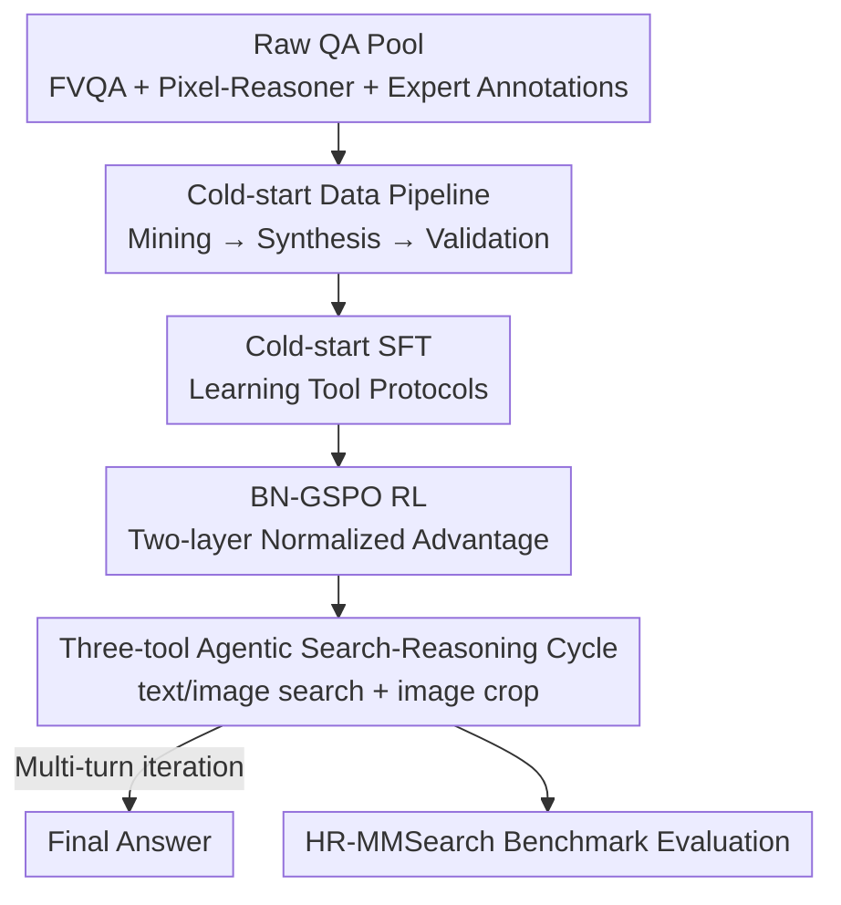

# SenseSearch: Empowering Vision-Language Models with High-Resolution Agentic Search-Reasoning via Reinforcement Learning

**Conference**: CVPR 2026  
**Paper**: [CVF Open Access](https://openaccess.thecvf.com/content/CVPR2026/html/Chng_SenseSearch_Empowering_Vision-Language_Models_with_High-Resolution_Agentic_Search-Reasoning_via_Reinforcement_CVPR_2026_paper.html)  
**Code**: https://github.com/OpenSenseNova/SenseNova-MARS (Available)  
**Area**: Multimodal VLM / Agent  
**Keywords**: agentic VLM, multi-tool coordination, reinforcement learning, high-resolution vision, search-augmented reasoning

## TL;DR
SenseSearch enables a 7B VLM to autonomously coordinate three tools—"text search + image search + image crop"—during multi-turn reasoning. Through two-stage training (cold-start SFT + self-developed BN-GSPO reinforcement learning), the model learns to address both "knowledge-intensive" and "high-resolution fine-grained perception" challenges, outperforming same-scale baselines by 19.18 points on the new HR-MMSearch benchmark.

## Background & Motivation
**Background**: VLMs are limited by the static knowledge in their training corpora and exhibit weak analysis of small objects in high-resolution images. To mitigate the former, recent works equip models with external tools (text/image search) and train agentic search capabilities via end-to-end RL (GRPO/DeepSeek-R1 paradigm), such as Search-R1 and MMSearch-R1. To mitigate the latter, the "Thinking with Images" paradigm (OpenAI-o3, DeepEyes, Pixel Reasoner) allows models to repeatedly view images in pixel space using cropping/zooming tools.

**Limitations of Prior Work**: These two research lines remain disjointed. Search-based agents focus on "whole-image level" context acquisition and cannot answer questions requiring fine-grained perception of small objects (e.g., covering 5% of the area). Conversely, pixel-reasoning agents only possess image manipulation tools and are helpless when external knowledge (long-tail or real-time info) is required. Even approaches like DeepMMSearch-R1, which integrate cropping as a pre-processing step for image search, only concatenate tools without true adaptive multi-tool coordination.

**Key Challenge**: Real-world "knowledge-intensive + visually complex" problems require both capabilities simultaneously—precisely locating and magnifying key visual clues in high-resolution images, then initiating external searches based on those clues. These must occur alternately in multi-turn reasoning. Single-tool or fixed-pipeline systems cannot achieve such adaptive coordination.

**Goal**: Construct an end-to-end agentic VLM capable of adaptively scheduling multiple tools during reasoning, alongside an evaluation benchmark to test "high-resolution + search-driven" capabilities.

**Key Insight**: Treat image cropping as an "action" at the same level as searching within a unified action space. This allows the model to decide in each turn whether to zoom in, search text, or reverse-search images. To stabilize training, cold-start SFT is used to teach protocols, followed by a refined RL algorithm for strategy optimization.

**Core Idea**: Integrate search and fine-grained perception into a single agent using a "three-tool unified action space + cold-start SFT + Batch Normalized Sequence-level Policy Optimization (BN-GSPO)," enabling task-adaptive tool orchestration.

## Method

### Overall Architecture
SenseSearch models the problem as a multi-turn interaction: given a natural language question $q$ and an initial (typically 4K high-resolution) image $I_0$, the policy VLM first outputs a `<think>` block, then selects one of four actions: text search, image search, image crop, or final answer. The text/images returned by tools are appended to the interaction history $\mathcal{T}_t$, forming a growing trajectory until the model provides an `<answer>`. Trajectories failing to yield a valid answer within $T$ turns are marked incorrect.

Capabilities are derived from two-stage training: first, **cold-start SFT** using approximately 3,000 multi-turn trajectories to teach interaction protocols and tool calls; second, **BN-GSPO** reinforcement learning to refine tool-calling and reasoning strategies. Rewards consist of "accuracy + format compliance," judged by GPT-4o. Evaluation is conducted on the new **HR-MMSearch** benchmark.

### Key Designs

**1. Unified Agentic Search-Reasoning Action Space: Coordinating "Seeing" and "Searching"**

To address the gap between search agents (failing at small objects) and pixel-reasoning agents (lacking external knowledge), SenseSearch promotes image cropping to a first-class action. In each turn, the model observes $\mathcal{T}_t$ and chooses: ① `text search` (Serper API retrieves top-5 results, summarized by Qwen3-32B to prevent context overflow); ② `image search` (Serper retrieves similar images, returning top-5 titles + thumbnails); ③ `image crop` (given normalized bbox $[0,1]^4$, crops a region for fine-grained analysis); ④ Final answer. Each turn must contain one reasoning step and one valid action. This allows adaptive sequences, e.g., cropping a racing driver's suit to see a 5% area logo, then text-searching the brand's founding year.

**2. Two-stage Training + Three-stage Cold-start Pipeline: Protocol First, Optimization Second**

Pure RL in multi-tool scenarios often falls into a "learning trap" where models bypass new tools in favor of familiar text search. Cold-start SFT maximizes the log-likelihood of target trajectories:

$$\mathcal{L}_{\text{SFT}} = -\sum_{(x_i, y_i) \in \mathcal{D}_{\text{SFT}}} \log \pi_\theta(y_i \mid x_i)$$

The cold-start data is produced via a three-stage pipeline: **Data Mining** (merging FVQA, Pixel-Reasoner, and expert QA, then filtering for "hard" problems); **Trajectory Synthesis** (using Gemini-2.5-Flash to generate reasoning chains); and **Quality Validation** (using GPT-4o to check format, logic, and answers). SFT fine-tunes the LM while freezing the vision encoder and projector.

**3. BN-GSPO: Batch Normalized Sequence-level Policy Optimization**

Reinforcement learning over long trajectories with external rewards is sensitive to reward scales and task difficulties. BN-GSPO applies **two-layer normalization** to advantage estimation. First, length-normalized importance ratios are calculated:

$$s_{b,g}(\theta) = \left(\frac{\pi_\theta(y_{b,g}\mid x_b)}{\pi_{\theta_{\text{old}}}(y_{b,g}\mid x_b)}\right)^{1/|y_{b,g}|}$$

The first layer performs intra-group standardization as in GSPO: $\bar{A}_{b,g} = (r_{b,g} - \text{mean}(\{r_{b,g'}\})) / \text{std}(\{r_{b,g'}\})$. The second layer normalizes these values across the entire minibatch:

$$\tilde{A}_{b,g} = \frac{\bar{A}_{b,g} - \text{mean}(\{\bar{A}_{b',g'}\}_{b'\in\mathcal{B}, g'\in\mathcal{G}})}{\text{std}(\{\bar{A}_{b',g'}\}_{b'\in\mathcal{B}, g'\in\mathcal{G}})}$$

This corrects for variance between different prompts within a batch. Using a clipped objective $\min(s_{b,g}\tilde{A}_{b,g}, \text{clip}(s_{b,g})\tilde{A}_{b,g}) - \beta D_{\text{KL}}(\pi_\theta\|\pi_{\text{ref}})$, this batch normalization proves critical for stabilizing perception-heavy RL tasks.

**4. HR-MMSearch: The First High-Resolution, Search-Driven Benchmark**

Existing benchmarks (FVQA, MMSearch) focus on whole-image understanding. HR-MMSearch uses 305 4K images of recent 2025 events to prevent data leakage. Questions are anchored to small objects or text occupying less than 5% of the image area, forcing the agent to crop/magnify before searching.

## Key Experimental Results

### Main Results
Based on Qwen2.5-VL-7B-Instruct. RL used a global batch of 128, lr 1e-6, and $T=10$ maximum turns.

Search Benchmarks (Agentic Workflow, Pass@1):

| Benchmark / Avg | Qwen2.5-VL-7B(base) | MMSearch-R1 | SenseSearch-SFT | SenseSearch-RL |
|------|------|------|------|------|
| Average | 35.50 | 52.49 | 53.06 | **57.43** |
| MMSearch | 32.16 | 53.80 | 53.80 | **59.06** |
| HR-MMSearch | 19.34 | 20.33 | 29.80 | **38.52** |
| FVQA-test | 36.00 | 58.40 | 56.72 | **61.17** |

SenseSearch-RL outperforms MMSearch-R1 by 4.94 points on average and is comparable to Gemini-2.5-Flash and GPT-4o. On HR-MMSearch, it exceeds the base agentic baseline by 19.18 points.

Fine-grained Visual Understanding:
SenseSearch-RL achieves an average of 72.8 on perception benchmarks (V*, HR-Bench), surpassing GPT-4o (71.5) and DeepEyes (72.5).

### Ablation Study

BN-GSPO vs. GRPO/GSPO (Pure RL, Table 3):

| Algorithm | MMSearch | V* Bench | HR-Bench 4K |
|------|---------|---------|---------|
| GRPO | 50.88 | 67.54 | 61.38 |
| GSPO | 53.80 | 53.93 | 44.50 |
| **BN-GSPO** | **56.72** | **79.05** | **69.12** |

### Key Findings
- **Batch normalization is key to stabilizing multi-tool RL**: Standard GSPO collapses on perception tasks (V* 53.93). BN-GSPO stabilizes training by suppressing reward scale variance across heterogeneous trajectories.
- **Mixed data prevents overfitting**: RL on perception data alone improves V* but degrades search. Combined training ensures balanced multi-tool strategies.
- **RL improves tool-use efficiency**: Average tool calls dropped from ~4 to ~2 during training, as the agent learned task-specific strategies (e.g., using only crop for V* and only search for MMSearch).

## Highlights & Insights
- **Unified action space bridges two disjoint research lines**: Integrating "cropping" as an action equal to "searching" allows fine-grained perception and external knowledge retrieval to co-exist in one reasoning chain.
- **BN-GSPO's second normalization layer is a lightweight stability trick**: Minibatch-level normalization suppresses variance from heterogeneous prompts, offering a low-cost improvement for sequence-level RL.
- **Clear division: SFT for protocol, RL for efficiency**: SFT ensures rule compliance, while RL optimizes precision and reduces redundant actions.
- **Benchmark constraints**: The "5% area target + 2025 images" design ensures that models cannot rely on direct search or pre-training knowledge, truly testing coordination.

## Limitations & Future Work
- **Dependency on commercial judges and APIs**: Reward signals rely on GPT-4o, and tools rely on Serper, affecting reproducibility and cost.
- **Limited scale and turns**: Only verified on 7B models with up to 10 turns; scalability to deeper reasoning chains is unexplored.
- **Small benchmark size**: 305 images across 8 domains may have limited statistical robustness.
- **Future Work**: Generalizing image operations (annotation, multi-image stitching), integrating tool-call costs into rewards, and adopting lightweight open-source judges.

## Related Work & Insights
- **vs. MMSearch-R1**: SenseSearch adds image cropping and BN-GSPO, significantly improving performance on high-resolution targets (HR-MMSearch 38.52 vs 20.33).
- **vs. Pixel Reasoner / DeepEyes**: These focus on pixel-space operations without external knowledge. SenseSearch unifies both.
- **vs. GSPO/GRPO**: SenseSearch extends GSPO with batch normalization to handle the reward variance typical of multi-tool interaction.

## Rating
- Novelty: ⭐⭐⭐⭐ 
- Experimental Thoroughness: ⭐⭐⭐⭐ 
- Writing Quality: ⭐⭐⭐⭐ 
- Value: ⭐⭐⭐⭐ 

<!-- RELATED:START -->

## Related Papers

- [\[ICML 2026\] CVSearch: Empowering Multimodal LLMs with Cognitive Visual Search for High-Resolution Image Perception](../../ICML2026/multimodal_vlm/cvsearch_empowering_multimodal_llms_with_cognitive_visual_search_for_high-resolu.md)
- [\[ICLR 2026\] ERGO: Efficient High-Resolution Visual Understanding for Vision-Language Models](../../ICLR2026/multimodal_vlm/ergo_efficient_high-resolution_visual_understanding_for_vision-language_models.md)
- [\[CVPR 2026\] TTRV: Test-Time Reinforcement Learning for Vision Language Models](ttrv_test-time_reinforcement_learning_for_vision_language_models.md)
- [\[CVPR 2026\] Learning to Focus and Precise Cropping: A Reinforcement Learning Framework with Information Gaps and Grounding Loss for MLLMs](learning_to_focus_and_precise_croppinga_reinforcement_learning_framework_with_in.md)
- [\[CVPR 2026\] Training High-Level Schedulers with Execution-Feedback Reinforcement Learning for Long-Horizon GUI Automation](training_high-level_schedulers_with_execution-feedback_reinforcement_learning_fo.md)

<!-- RELATED:END -->
