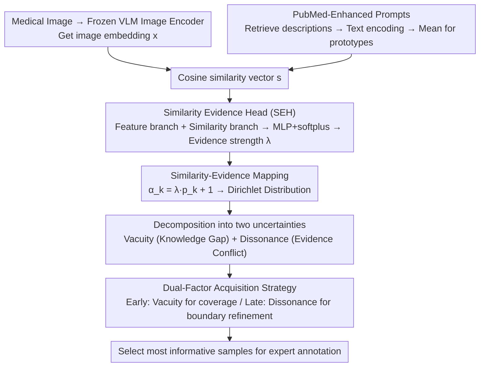

# Similarity-as-Evidence: Calibrating Overconfident VLMs for Interpretable and Label-Efficient Medical Active Learning

**Conference**: CVPR2026  
**arXiv**: [2602.18867](https://arxiv.org/abs/2602.18867)  
**Code**: To be confirmed  
**Area**: Multi-modal VLM  
**Keywords**: Active Learning, Vision-Language Models, Uncertainty Quantification, Dirichlet Distribution, Evidential Deep Learning, Medical Image Classification, Calibration

## TL;DR

Ours proposes the Similarity-as-Evidence (SaE) framework, which reinterprets VLM text-image similarity as Dirichlet evidence. By calibrating overconfident softmax outputs through the Similarity Evidence Head (SEH) and implementing an interpretable and efficient medical active learning process based on a dual-factor acquisition strategy of vacuity (knowledge gap) and dissonance (evidence conflict), Ours achieves a SOTA macro average accuracy of 82.57% across 10 datasets with a 20% labeling budget.

## Background & Motivation

**High annotation costs**: Expert labeling in medical image analysis is constrained by time, cost, and privacy regulations. Active Learning (AL) maximizes model performance under limited annotation budgets by selecting the most informative samples.

**Cold-start problem**: Traditional AL methods suffer from unreliable model predictions when initial labels are extremely scarce (e.g., 1-3 per class), leading to inefficient sample selection in early rounds and wasting annotation resources.

**VLM overconfidence**: VLMs convert cosine similarity into probabilities via temperature-scaled softmax, essentially treating geometric proximity as certainty. This leads to significant calibration bias—assigning high confidence even to incorrect predictions.

**Misleading acquisition functions**: Overconfidence causes the model to prioritize samples it believes it already "understands" rather than those that would provide the greatest performance gains, wasting valuable annotation budget.

**Lack of interpretability**: Existing AL strategies rely on scalar uncertainty scores (entropy/margin), which only measure the magnitude of uncertainty and fail to reveal its source—whether it stems from a lack of knowledge or conflicting hypotheses.

**Clinical demand**: In clinical workflows, experts need to understand why a specific case was selected for labeling—whether it is an unseen phenotype or an ambiguous decision boundary. Existing methods cannot provide such interpretable selection rationales.

## Method

### Overall Architecture

SaE aims to address the issue where "VLMs treat cosine similarity as certainty, resulting in overconfidence and incorrect sample selection in active learning." The Mechanism involves reinterpreting similarity as evidence: the VLM image encoder is frozen, and only a Similarity Evidence Head (SEH) that maps similarity to Dirichlet evidence and CoOp-style learnable prompts are trained. Two types of uncertainty are then decomposed from the calibrated distribution to drive sample acquisition. The pipeline consists of: PubMed-enhanced prompts constructing rich semantic text prototypes → SEH transforming similarity into evidence parameters → Similarity-evidence mapping decomposing into vacuity/dissonance → Dual-factor strategy for sample selection.

### Key Designs

**1. PubMed-enhanced prompts: Adding domain semantics to category prototypes**

Relying solely on class names as text prototypes results in thin semantics and poor alignment with medical images. SaE retrieves $\delta_k$ descriptive sentences from PubMed for each category $k$. These are passed through a frozen text encoder, L2-normalized, and averaged to obtain semantically rich category prototypes $\bar{\hat{\mathbf{e}}}^k_{\text{txt}}$. The cosine similarity vector $\mathbf{s} = [s_1, \dots, s_K]$ is then calculated as input for the subsequent evidence model.

**2. Similarity Evidence Head (SEH): Treating the similarity vector as "Evidence Budget Allocation"**

The VLM softmax treats geometric proximity directly as confidence, which is the root of overconfidence. SEH uses a dual-branch MLP to reallocate evidence: the feature branch encodes the frozen image embedding $\mathbf{x}$ into $z_f$, and the similarity branch maps $\mathbf{s}$ to $z_s$. After concatenation, a shallow MLP + softplus outputs a strictly positive evidence strength scalar $\lambda$. The Core Idea is to view the similarity vector as "how the total evidence budget is distributed across classes," while the total budget is controlled by $\lambda$—the amount of evidence is no longer equivalent to the similarity level.

**3. Similarity-Evidence Mapping: Decomposing two types of uncertainty from the Dirichlet distribution**

An evidence scalar alone is insufficient; active learning needs to know the "source of uncertainty." SaE defines the Dirichlet concentration parameters as $\alpha_k(x) = \lambda(x) \cdot p_k(x) + 1$ (where $p_k$ is the VLM softmax probability). From this, two interpretable signals are decomposed: Vacuity $\text{Vac}(x) = K / \sum_k \alpha_k(x)$, which measures the lack of total evidence (corresponding to rare or unseen phenotypes), and Dissonance, which measures evidence conflict between classes based on the balance of belief masses (corresponding to ambiguous decision boundaries). This separates "lack of knowledge" from "conflicting evidence," which scalar uncertainty cannot achieve.

**4. Dual-factor acquisition strategy: Coverage first, then refinement**

With two types of uncertainty identified, SaE schedules their use across different AL stages. Using a linear schedule $w_v(t) = 1 - (t-1)/(T-1)$ and $w_d(t) = (t-1)/(T-1)$, the strategy weights early rounds toward high vacuity samples to cover unseen phenotypes, while later rounds prioritize high dissonance samples to refine decision boundaries. This "coverage-then-refinement" sequence aligns with clinical reasoning logic and provides interpretable selection reasons for experts.

### Loss & Training

The SEH is trained with a dual-objective loss $\mathcal{L}_{\text{SEH}}$:

$$\mathcal{L}_{\text{SEH}} = \text{MSE}\left(\frac{1}{\lambda_i + \epsilon},\; l_{\text{cls},i}\right) + \beta \cdot \text{MSE}\left(\lambda_i,\; \frac{1}{H[\mathbf{p}_i] + \epsilon}\right)$$

The first term aligns inverse evidence with observed classification difficulty (hard samples → high $l_{\text{cls}}$ → low $\lambda$). The second term ensures evidence strength is consistent with the frozen VLM's intrinsic certainty (low entropy → high $\lambda$), where $H[\mathbf{p}_i]$ is a detached target with no gradient backpropagation. $\beta = 0.5$ balances the two terms.

## Key Experimental Results

### Main Results

Across 10 public medical datasets (covering 9 organs), SaE achieves a macro average accuracy of 82.57% at a 20% annotation budget, surpassing the strongest baseline MedCoOp+BADGE at 77.75% (+4.82%).

| Dataset | Random | PCB | MedCoOp+Coreset | MedCoOp+Entropy | MedCoOp+BADGE | **Ours (SaE)** |
|---|---|---|---|---|---|---|
| DermaMNIST | 69.42 | 71.07 | 74.11 | 74.56 | 75.46 | **80.21** |
| Kvasir | 71.10 | 72.92 | 80.83 | 81.92 | 81.42 | **88.58** |
| RETINA | 51.48 | 53.55 | 62.78 | 65.22 | 66.88 | **75.22** |
| LC25000 | 93.92 | 95.71 | 96.93 | 97.47 | 97.25 | **99.23** |
| BTMRI | 83.40 | 85.50 | 86.26 | 89.92 | 89.57 | **93.46** |
| BUSI | 57.10 | 58.47 | 66.53 | 72.03 | 72.88 | **79.15** |
| **Macro Avg** | 68.01 | 71.41 | 73.84 | 77.39 | 77.75 | **82.57** |

### Ablation Study

| Variant | Macro Avg (%) |
|---|---|
| Random | 68.01 |
| + Dual-factor score (Classifier logits) | 73.35 (+5.34) |
| + VLM similarity instead of logits | 78.62 (+10.61) |
| **SaE: + SEH Calibration** | **82.57 (+14.56)** |

SEH provides the largest incremental Gain (+3.95%), proving that calibration is key.

### Key Findings

1. **Cold-start mitigation**: By round 3 (60% budget), SaE reaches 96.7% of its final accuracy on average. On BTMRI, it reaches 92.92% by round 3 (final is 93.46%, a ratio of 99.42%).
2. **Calibration superiority**: On BTMRI, SaE’s ECE=0.021 and NLL=0.425 are significantly better than PCB (ECE=0.116/NLL=0.757) and BADGE (ECE=0.036/NLL=0.548).
3. **Training stability**: SaE maintains the lowest and most stable training loss from the first epoch, whereas BADGE exhibits high initial loss and significant instability.
4. **Scenarios with maximum improvement**: Gains are most significant in RETINA (+8.34%), Kvasir (+6.66%), and BUSI (+6.27%), indicating superior performance in class-imbalanced or data-scarce scenarios.

## Highlights & Insights

- **Novelty**: First to reinterpret VLM similarity as evidence to parameterize a Dirichlet distribution, providing a principled solution to the VLM overconfidence problem.
- **Interpretability**: The vacuity/dissonance decomposition provides clinically understandable rationales for annotation selection (unseen phenotypes vs. ambiguous diagnostics) rather than black-box scores.
- **Mechanism Design**: The adaptive "early coverage → late refinement" strategy aligns with clinical reasoning logic.
- **Experimental Thoroughness**: Consistent results and low standard deviations across 10 datasets, 9 organs, and 5 seeds.
- **Efficiency**: Frozen VLM encoder with only the SEH and learnable prompts being trained; runs on a single RTX 4090.

## Limitations & Future Work

- Currently evaluated only on classification; generalization to other medical tasks like segmentation or detection is not yet verified.
- The quality of PubMed-enhanced prompts depends on retrieval results; rare diseases might lack high-quality descriptions.
- The linear scheduling of $w_v(t)/w_d(t)$ is a heuristic design and hasn't been compared with adaptive scheduling strategies.
- Only BiomedCLIP (ViT-B/16) was used as the backbone; applicability to other VLMs (e.g., CONCH, UNI) remains to be verified.
- The dual-factor model only considers vacuity and dissonance, without incorporating complementary signals like sample diversity or representativeness.

## Related Work & Insights

- **Medical AL**: Uncertainty sampling like Least-Confidence/Margin/Entropy is sensitive to artifacts and class imbalance; diversity methods like Coreset/BADGE are computationally expensive.
- **VLM Calibration**: CLIP-style models suffer from severe overconfidence. Post-hoc temperature scaling only provides global adjustments and does not explain uncertainty sources.
- **Evidential Deep Learning (EDL)**: Models predictions as Dirichlet distributions for uncertainty decomposition, but standard EDL transforms evidence directly from classification logits, proving fragile under early AL or distribution shifts.
- **VLM+AL**: Methods like PCB compress VLM uncertainty into softmax scalars, inheriting overconfidence issues and lacking uncertainty source decomposition.

## Rating

- Novelty: ⭐⭐⭐⭐ — The perspective shift from similarity to evidence is clever; vacuity/dissonance decomposition provides a new paradigm for medical AL.
- Experimental Thoroughness: ⭐⭐⭐⭐⭐ — 10 datasets, multiple baseline comparisons, detailed ablations, calibration analysis, and cold-start analysis.
- Writing Quality: ⭐⭐⭐⭐ — Clear structure, well-articulated motivation, and high-quality figures.
- Value: ⭐⭐⭐⭐ — High practical clinical value for improving medical image annotation efficiency with a versatile framework.

<!-- RELATED:START -->

## Related Papers

- [\[CVPR 2026\] Perceptual-Evidence Anchored Reinforced Learning for Multimodal Reasoning](perceptual-evidence_anchored_reinforced_learning_for_multimodal_reasoning.md)
- [\[CVPR 2026\] Relational Visual Similarity](relational_visual_similarity.md)
- [\[CVPR 2026\] Sparse Spectral LoRA: Routed Experts for Medical VLMs](sparse_spectral_lora_routed_experts_for_medical_vlms.md)
- [\[CVPR 2026\] RNED: Rotary Number Encoding and Decoding for Medical VLMs](rned_rotary_number_encoding_and_decoding_for_medical_vlms.md)
- [\[CVPR 2026\] Towards Calibrating Prompt Tuning of Vision-Language Models](towards_calibrating_prompt_tuning_of_vision-language_models.md)

<!-- RELATED:END -->
