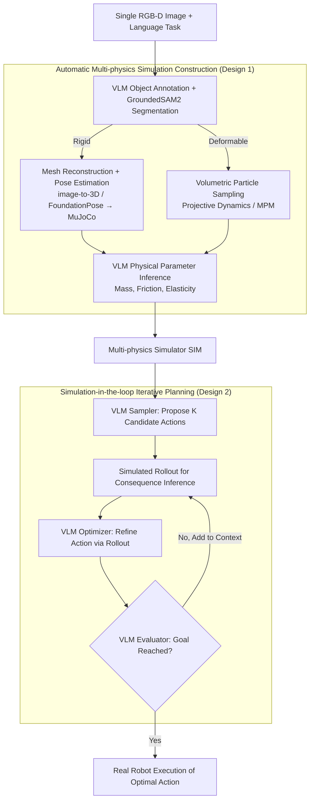

# SIMPACT: Simulation-Enabled Action Planning using Vision-Language Models

**Conference**: CVPR 2026  
**arXiv**: [2512.05955](https://arxiv.org/abs/2512.05955)  
**Code**: None (coming soon)  
**Area**: Multimodal VLM / Robotic Manipulation  
**Keywords**: Simulation-enabled Reasoning, Vision-Language Models, Action Planning, Physical Reasoning, Robotic Manipulation

## TL;DR

SIMPACT proposes a test-time simulation-augmented action planning framework that automatically constructs physical simulation environments from a single RGB-D image. This enables VLMs to propose actions, observe simulation results, and iteratively refine reasoning, achieving SOTA performance on rigid and deformable object manipulation tasks without additional training.

## Background & Motivation

**Background**: Vision-Language Models (VLMs) such as GPT-4V and Gemini have demonstrated exceptional commonsense reasoning and semantic understanding, being widely explored for robotic task planning. However, VLM training data originates from static image-text pairs on the internet, which lack causal interactions or changes conditioned on actions.

**Limitations of Prior Work**: (1) VLMs lack a deep understanding of physical dynamics—they do not know "what happens when an object is pushed" or the "effects of different force levels"; (2) Existing VLM-based robotic methods typically have the model output action parameters directly, but the models lack physical verification capabilities; (3) How to enable VLMs to "understand" the physical world without training new models remains an open problem.

**Key Challenge**: VLMs possess strong semantic reasoning capabilities but lack physical dynamics understanding. This is fundamentally because causal "action $\rightarrow$ consequence" information is absent from internet-scale data.

**Goal**: To supplement VLMs with physical reasoning capabilities at test time without additional training, allowing VLMs to perform robotic manipulation tasks that require fine-grained physical understanding.

**Key Insight**: The authors observe that physical simulators (such as PyBullet, MuJoCo, etc.) can provide precise physical predictions. If a simulator can be embedded as a "world model" into the VLM reasoning loop at test time, the VLM's lack of physical understanding can be compensated for.

**Core Idea**: Embed a physical simulation loop within the VLM reasoning process—VLM proposes an action $\rightarrow$ simulator executes $\rightarrow$ VLM observes simulation results $\rightarrow$ VLM iteratively corrects. This realizes physical-augmented reasoning via "simulation as a world model."

## Method

### Overall Architecture

The core problem SIMPACT addresses is that while VLMs have semantic commonsense, they lack physical dynamics, making direct output of action parameters a "blind guess." The solution is to hook an external physical simulator to the VLM at test time, delegating the calculation of "consequences of actions" to the simulator while the VLM handles proposals and result interpretation. The pipeline starts from a single RGB-D image and consists of two stages: **Simulation Construction**—automatically reconstructing the interactive simulation scene (assigning two sets of physical engines based on whether objects are rigid or deformable, with physical parameters inferred by the VLM); and **Action Planning**—letting the VLM repeatedly "propose actions $\rightarrow$ observe rollouts $\rightarrow$ evaluate $\rightarrow$ refine actions" in simulation until the actions push the scene to the target state. Finally, the converged action sequence is executed on a real robot. The VLM weights remain frozen throughout.

### Key Designs

**1. Automatic Multi-physics Simulation Construction from Single RGB-D: Reducing Perception Barriers to "One Image"**

To run a physical simulation, 3D geometry and physical parameters are required. However, per-scene 3D scanning or manual labeling of mass and friction is impractical. This step reduces the barrier to "one image." Given an RGB-D image and language task, the pipeline uses the VLM to generate object labels, segments each object using GroundedSAM2, and automatically switches between two physical engines (rigid or deformable, also determined by the VLM). Rigid bodies use mesh-based simulation—reconstructing full triangle meshes via image-to-3D models, scaling via point cloud bounding boxes, estimating 6DoF poses with FoundationPose, and loading into MuJoCo. Deformable objects use particle-based simulation—back-projecting segmentation masks into 3D surface points, sampling particles in the volume between the surface and the tabletop, and using Projective Dynamics for stiffness or MPM for soft bodies. Both branches conclude with the VLM inferring physical parameters (mass, friction for rigid; elasticity, plasticity for deformable) based on commonsense. A key observation is that while VLM estimated parameters are imprecise, the simulation requires the correct "direction" of movement rather than perfect precision—experiments confirm that rough but directionally correct physical predictions are far superior to none. This dual-engine setup allows "rope manipulation" and "plasticine shaping"—traditional VLM blind spots—to enter the realm of planning.

**2. Simulation-in-the-loop Iterative Action Planning: Simulator as a VLM "Sandbox"**

VLM commonsense provides reasonable initial guesses (where to push, how much force, contact points), but it cannot verify how far an object slides or if it hits an obstacle. This step delegates verification to simulation. Planning iterates per Algorithm 1: The VLM **Sampler** proposes $K$ initial candidate action sequences based on scene context (initial observation, robot proprioception, 6DoF poses). Each is dropped into simulation for a rollout. The VLM **Optimizer** synthesizes the action set and corresponding rollouts to produce an improved action. The VLM **Evaluator** checks if the rollout achieves the goal—if successful, it executes on the real robot; otherwise, the new action and rollout are added to the context for the next iteration until success or reaching the limit $K_{max}$. The same frozen VLM plays the roles of sampler, optimizer, and evaluator via three different system prompts. Notably, there is no explicit numerical loss function; the VLM's own visual semantic judgment of the rollout end-state serves as the reward function, merging semantic guidance with physical safeguards.

### Full Example: Pulling a Rope into a Target Shape

Consider "pulling a messy rope on a table into a U-shape." **Build Simulation**: Extract the rope from the RGB-D image, identify it as deformable, load into particle simulation, and let the VLM estimate length and stiffness. **Initial Sampling**: The VLM Sampler proposes $K$ candidate grasp points and pull directions. In simulation, most rollouts pull the rope into a line or a J-shape; only one grasping the middle and pulling sideways approaches a U-shape. **Iterative Refinement**: The VLM Optimizer synthesizes these candidates and their rollouts, producing an improved action each round (e.g., fine-tuning grasp points and force near the best candidate), followed by simulation and evaluator judgment. The symmetry of the U-shape in the rollout improves each round. This continues until the evaluator deems it successful or $K_{max}$ is reached, followed by real-robot execution. No real-world trial and error is needed; all "errors" occur in simulation.

> ⚠️ Object parameters and iteration counts above are illustrative; refer to the original paper for specific values.

### Loss & Training

SIMPACT is a pure inference-time framework. VLM weights remain frozen throughout with no training or fine-tuning, thus there is no traditional loss function. Action quality is implicitly judged by the VLM observing visual simulation results—it acts as an evaluation function (TASKSUCCESS) determining if the rollout end-state achieves the goal. The process starts by sampling $K$ initial candidate actions; in each subsequent round, the optimizer produces an improved action, followed by simulation and evaluation, looping until success or reaching $K_{max}$.

> ⚠️ Specific values for $K$ / $K_{max}$ are subject to the original text.

## Key Experimental Results

### Main Results

| Task | SIMPACT | RT-2 | Code-as-Policies | VoxPoser | Description |
|------|---------|------|------------------|----------|-------------|
| Rigid Pushing to Target | Best | Poor | Medium | Medium | Fine force control |
| Object Sorting/Tidying | Best | Fair | Good | Fair | Multi-object planning |
| Rope Manipulation | Best | Unable | Unable | Poor | Deformable objects |
| Plasticine Shaping | Best | Unable | Unable | Unable | High-difficulty deformation |
| Collision Prediction | Best | Poor | Poor | Fair | Contact dynamics |

### Ablation Study

| Configuration | Average Success Rate | Description |
|------|----------|------|
| Full SIMPACT | Best | Sim-optimization + Iterative refinement |
| w/o Simulation (Direct VLM) | Significant Drop | Direct action output lacks verification |
| w/o Iterative Refinement | Noticeable Drop | Single sampling lacks fine-tuning |
| Random Physics Params | Slight Drop | Physical parameter accuracy has some impact |
| Single Sim Iteration | Lower than Multi-round | Iterative improvement is significant |

### Key Findings

- Physical prediction from the simulation loop is the largest contributor to performance—VLMs essentially fail tasks requiring fine force control without simulation.
- Deformable object manipulation (rope, plasticine) is a blind spot for traditional methods; SIMPACT demonstrates the feasibility of VLMs for these tasks via particle simulation.
- Even if physical parameters (estimated by VLM) are imprecise, simulation feedback is significantly better than none—showing "rough but directionally correct" physics is vastly superior to omitting physics.
- The system is robust to object appearance changes (colors, shapes) and distractors.

## Highlights & Insights

- **"Simulation as a World Model" Concept**: An elegant approach that doesn't modify the VLM or train new models, but equips the VLM with a "physical engine in the brain" at test time. This can generalize to any reasoning task requiring physical understanding.
- **Auto-sim Construction from Single RGB-D**: Significantly lowers the barrier to entry for simulation, allowing rapid deployment in new scenes. While accuracy is limited, "having a simulation" is better than "no simulation."
- **Unified Rigid + Deformable Framework**: The ability to handle both rigid and deformable manipulation is a first for VLM-based robotic methods.

## Limitations & Future Work

- Simulation construction relies on depth information and segmentation models, which may be unreliable in outdoor or high-noise scenarios.
- Precision of VLM-estimated physical parameters (mass, friction) is limited; performance may suffer in tasks highly sensitive to these parameters.
- The sim-to-real gap remains, particularly regarding the simulation accuracy of deformable objects.
- High inference latency due to per-inference simulation construction and multiple rollout iterations.
- Currently limited to tabletop-level manipulation; scaling to complex long-horizon tasks (e.g., cooking, assembly) requires further research.

## Related Work & Insights

- **vs Code-as-Policies**: CaP has LLMs output robot control code directly, lacking physical verification. SIMPACT provides a "sandbox" for predicting action consequences.
- **vs VoxPoser**: VoxPoser uses VLMs to generate value functions for planning but lacks explicit physical simulation. SIMPACT's simulation provides more accurate physical predictions.
- **vs RT-2/Octo**: These end-to-end methods require massive robot data for training. SIMPACT relies purely on pre-trained VLMs + simulation, requiring no extra training data.

## Rating

- Novelty: ⭐⭐⭐⭐⭐ An elegant and novel approach to simulation-augmented VLM reasoning.
- Experimental Thoroughness: ⭐⭐⭐⭐ Validated on 5 real-world tasks including rigid and deformable objects with thorough robustness tests.
- Writing Quality: ⭐⭐⭐⭐ Clear method description and rich visualizations.
- Value: ⭐⭐⭐⭐⭐ Important insights for the VLM robotics field; the no-training requirement is a practical advantage.

<!-- RELATED:START -->

## Related Papers

- [\[CVPR 2025\] Evaluating Vision-Language Models as Evaluators in Path Planning](../../CVPR2025/multimodal_vlm/evaluating_vision-language_models_as_evaluators_in_path_planning.md)
- [\[ICCV 2025\] Perspective-Aware Reasoning in Vision-Language Models via Mental Imagery Simulation](../../ICCV2025/multimodal_vlm/perspective-aware_reasoning_in_vision-language_models_via_mental_imagery_simulat.md)
- [\[CVPR 2026\] Joint-Aligned Latent Action: Towards Scalable VLA Pretraining in the Wild](joint-aligned_latent_action_towards_scalable_vla_pretraining_in_the_wild.md)
- [\[CVPR 2026\] From Observation to Action: Latent Action-based Primitive Segmentation for VLA Pre-training in Industrial Settings](from_observation_to_action_latent_action-based_primitive_segmentation_for_vla_pr.md)
- [\[CVPR 2026\] SMAP: Semantic Route Planning with Map-Grounded Multimodal Alignment](smap_semantic_route_planning_with_map-grounded_multimodal_alignment.md)

<!-- RELATED:END -->
