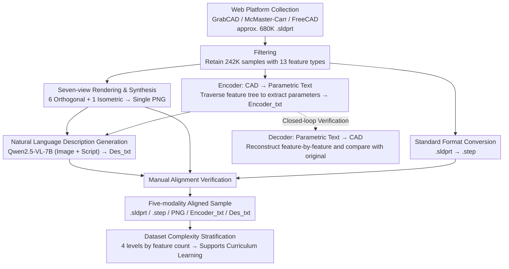

# SldprtNet: A Large-Scale Multimodal Dataset for CAD Generation in Language-Driven 3D Design

**Conference**: CVPR2026  
**arXiv**: [2603.13098](https://arxiv.org/abs/2603.13098)  
**Code**: None  
**Area**: others (3D CAD Generation / Multimodal Dataset)  
**Keywords**: CAD dataset, language-driven 3D design, multimodal alignment, parametric modeling, text-to-CAD, encoder-decoder, SolidWorks

## TL;DR

The authors developed SldprtNet, a large-scale multimodal CAD dataset containing over 242,000 industrial parts. Each sample includes fully aligned data across four modalities: .sldprt/.step 3D models, seven-view composite images, parametric modeling scripts, and natural language descriptions. They also developed lossless encoder/decoder tools supporting 13 CAD commands. Baseline experiments demonstrate the significant advantages of multimodal input over text-only input for CAD generation tasks.

## Background & Motivation

**Scarcity of CAD Datasets**: Compared to image and text datasets, CAD datasets are extremely small in scale. Each sample must be manually created by professionals using specialized software, resulting in high modeling costs. This data scarcity directly restricts research progress in semantics-driven CAD modeling.

**Missing Modalities in Existing Datasets**: Major 3D datasets suffer from severe modal incompleteness. Non-parametric datasets (ModelNet, ShapeNet, Thingi10K) provide only meshes or point clouds, losing design history and parametric information, thus failing to support editable modeling. Parametric datasets (ABC, Fusion 360) retain B-Rep or modeling sequences but lack text annotations and visual information, hindering language-driven or cross-modal tasks.

**Key Bottlenecks in Text-to-CAD**: DeepCAD pioneered modeling CAD modeling as a sequence generation problem but only supports two operations: 2D sketches and extrclusions. Text2CAD introduced text guidance but used synthetic text, which exhibits alignment deviations between semantics and actual geometry, and lacks the image modality entirely.

**Key Insight from Multimodal Learning**: Works like CLIP, Flamingo, and BLIP-2 have proven that cross-modal alignment learning is essential for enhancing generalization and zero-shot reasoning. The CAD field similarly requires a unified multimodal dataset integrating geometry, vision, parametric sequences, and natural language to provide richer supervisory signals.

**Limitations of Prior Work in CAD-LLMs**: Recent works such as CAD-GPT, CAD-MLLM, CAD-Coder, and CAD-Llama show the potential of multimodal/code-driven methods. However, they suffer from small data scales, limited command coverage, high proportions of synthetic data, lack of executable modeling sequences, or deviation from industrial CAD workflows.

## Method

### Overall Architecture

SldprtNet is not a model but a dataset construction pipeline involving "Collection → Filtering → Multimodal Generation → Annotation Verification." The Goal is to provide the multimodal aligned data long missing in the CAD field. The process consists of four steps: first, collecting approximately 680,000 .sldprt industrial part models from GrabCAD, McMaster-Carr, and FreeCAD; then, filtering to retain 242,000+ high-quality samples containing 13 representative feature types; next, using an automated pipeline to generate multi-view images, parametric text, and standard format conversions for each sample; finally, using a multimodal language model to generate natural language descriptions followed by manual alignment verification.

Each sample consists of five fully aligned modalities: .sldprt files (native SolidWorks format, encoding full feature tree history); .step files (standard exchange format for cross-platform verification); multi-view composite images (6 orthogonal views: front/back/left/right/top/bottom + 1 isometric view synthesized into a single PNG); parametric modeling scripts Encoder_txt (including the feature tree and detailed parameters for each feature); and natural language descriptions Des_txt (appearance and functional descriptions generated by Qwen2.5-VL-7B).

### Key Designs

**1. Mechanism: Lossless Bidirectional Tools (Encoder/Decoder)**

The value of CAD data lies in manual modeling by professionals, which is difficult to scale through collection alone and hard to verify regarding whether generated sequences reconstruct parts correctly. SldprtNet features a pair of reciprocal tools developed around the SolidWorks COM interface. The Encoder (CAD → Text) automatically traverses the .sldprt Feature Tree, extracts feature types, names, and parent-child relationships in chronological modeling order, and then extracts detailed parameters (dimensions, constraints, sketch entities, dependencies) to output structured, human-readable, and machine-parsable text. The Decoder (Text → CAD) reverses this process, creating a blank .sldprt document and parsing the Encoder_txt Feature Tree to reconstruct each feature via SolidWorks APIs, ensuring geometric and topological consistency with the source. These tools support 13 CAD operations (2D Sketch, Extrusion, Chamfer, Fillet, Linear Pattern, Mirror Pattern, etc.), significantly exceeding the 2 operations in DeepCAD and enabling a closed-loop "output → reconstruction → comparison" verification.

**2. Function: Natural Language Description Generation**

Parametric datasets generally lack text, and manual descriptions for 240,000 samples are unfeasible. Qwen2.5-VL-7B was used, taking synthetic images and parametric scripts as input to generate appearance and functional descriptions. Inference was completed in 368 GPU-hours on 12 NVIDIA A100s, followed by manual verification and alignment correction. The strategy of synthesizing seven views into a single image also compressed input token length and accelerated inference.

**3. Dataset Complexity Level Stratification**

To balance training coverage and inference depth evaluation, the authors categorized models into four levels based on the number of CAD commands in the Feature Tree:

| Complexity Level | Number of Features | Samples | Percentage |
|:---:|:---:|:---:|:---:|
| Level 1 (Simple) | 1–5 | 93,188 | 38.4% |
| Level 2 (Medium) | 6–10 | 78,926 | 32.5% |
| Level 3 (Advanced) | 11–100 | 69,259 | 28.5% |
| Level 4 (Expert) | >100 | 1,234 | 0.5% |

The balanced distribution among the first three levels ensures training coverage, while Expert samples are crucial for evaluating reasoning depth. This stratification provides out-of-the-box support for curriculum learning—starting with simple samples to build geometric understanding before introducing high-complexity samples.

## Key Experimental Results

### Main Results: Single-modal vs. Multimodal Baseline

Qwen2.5-7B (text-only) and Qwen2.5-7B-VL (image+text) were fine-tuned on a 50K sample subset and tested on 3,644 samples:

| Metric | Qwen2.5-7B (Text-only) | Qwen2.5-7B-VL (Multimodal) | Gain |
|:---|:---:|:---:|:---:|
| Exact Match Score | 0.0058 | 0.0099 | +70.7% |
| BLEU Score | 97.1827 | 97.9309 | +0.77% |
| Command-Level F1 | 0.3247 | 0.3670 | +13.0% |
| Tolerance Accuracy | 0.5016 | 0.4630 | -7.7% |
| Partial Match Rate | 0.5554 | 0.6162 | +10.9% |

### Dataset Comparison

| Dataset | Models | Format | Parametric | Multi-view | Reconstructible | Text Descriptions |
|:---|:---:|:---:|:---:|:---:|:---:|:---:|
| **SldprtNet** | **242,606** | **Sldprt** | **✓** | **✓** | **✓** | **✓** |
| ABC | 1,000,000+ | B-Rep | ✓ | ✗ | ✗ | ✗ |
| ShapeNet | 3,000,000+ | Mesh | ✗ | ✓ | ✗ | ✗ |
| ModelNet | 151,128 | Mesh | ✗ | ✗ | ✗ | ✗ |
| Fusion 360 | 50,000+ | B-Rep | ✓ | ✗ | ✗ | ✗ |
| Thingi10K | 10,000 | Mesh | ✗ | ✗ | ✗ | ✗ |

### Key Findings

1. **Multimodal Significantly Outperforms Single-modal**: The multimodal model significantly outperformed the text-only model in Exact Match (+70.7%), Command-Level F1 (+13.0%), and Partial Match Rate (+10.9%), indicating that visual information plays a key role in geometric semantic understanding and modeling logic reasoning.
2. **Counter-intuitive Result in Tolerance Accuracy**: The text-only model was slightly higher in parameter tolerance accuracy (0.5016 vs. 0.4630). The authors speculate this reflects a tendency to overfit numerical values rather than true structural semantic understanding.
3. **Uniqueness of SldprtNet**: Among the six compared datasets, SldprtNet is the only one satisfying all four characteristics: parametric, multi-view, reconstructible, and text-described.
4. **Dominance of 2D Sketch**: As the foundation for nearly all 3D geometry, 2D Sketch is the most frequently used feature. The high frequency of Chamfer and Fillet reflects the industrial part nature of the dataset.

## Highlights & Insights

1. **Closed-loop Verification Design**: The bidirectional lossless conversion between encoder and decoder fails not only to scale data but also provides a means of structured verification for model outputs—generated CAD sequences can be reconstructed and compared with originals for automated quality control.
2. **Seven-view Composition Strategy**: Synthesizing 7 rendered images into one is highly practical, significantly reducing the number of input tokens and inference time for multimodal models without losing visual completeness.
3. **Coverage of 13 Operations**: Supporting 13 CAD commands compared to DeepCAD's 2 significantly enhances the diversity of representable parts, bringing the dataset closer to real-world industrial design scenarios.
4. **Natural Support for Curriculum Learning**: The four-level complexity stratification provides out-of-the-box support for curriculum learning, which could lead to significant training efficiency gains for long-sequence CAD generation tasks.

## Limitations & Future Work

1. **Simple Baseline**: The study only compared single-modal vs. multimodal variants of the same model, lacking direct comparisons with existing methods like DeepCAD, Text2CAD, or CAD-GPT, making it difficult to pinpoint the dataset's specific gains for SOTA methods.
2. **Extremely Low Exact Match**: The best multimodal model achieved an Exact Match of only 0.0099, showing that precise replication of full CAD modeling sequences remains extremely challenging, yet the paper lacks an in-depth failure mode analysis.
3. **Description Quality Dependency**: Natural language descriptions were generated by Qwen2.5-VL-7B. Although manually verified, the verification coverage and standards are not detailed, potentially introducing systematic biases.
4. **Domain Limited to Industrial Parts**: Collected from platforms like GrabCAD, the dataset has limited coverage for other CAD domains like architecture or consumer goods.
5. **SolidWorks Dependency**: The encoder/decoder relies on the SolidWorks COM interface, limiting portability to other CAD platforms.
6. **Lack of Geometric Reconstruction Evaluation**: The paper does not provide a quantitative analysis of geometric accuracy for encoder-decoder round-trip conversions.

## Related Work & Insights

- **DeepCAD** (ICCV 2021): Pioneering work formalizing CAD modeling as sequence generation but limited to sketch+extrusion. SldprtNet expands command coverage by supporting 13 operations.
- **Text2CAD** (NeurIPS 2024): First to introduce text-guided CAD generation but uses synthetic text and lacks image modality. SldprtNet fills this gap via multimodal alignment.
- **ABC Dataset** (CVPR 2019): A benchmark million-scale B-Rep CAD dataset but completely lacks text and visual modalities.
- **CAD-Coder**: The first open-source vision-language model for image-to-CadQuery code, but its reliance on lightweight DSL deviates from industrial workflows.
- The core insight is that multimodal aligned datasets have a direct positive impact on CAD generation quality, with clear gains observed even in relatively simple baselines.

## Rating

- **Novelty**: ⭐⭐⭐⭐ — Fills a clear gap as the first large-scale CAD dataset providing full alignment across parametric models, multi-view images, modeling scripts, and natural language descriptions.
- **Experimental Thoroughness**: ⭐⭐⭐ — The multimodal vs. single-modal baseline effectively validates the core premise, but broader comparisons with existing methods and detailed ablation studies are missing.
- **Writing Quality**: ⭐⭐⭐⭐ — Clearly structured with well-justified motivation and systematized dataset design principles, though some experimental analyses lack depth.
- **Value**: ⭐⭐⭐⭐ — The 242K-scale multimodal CAD dataset and its tools hold high practical value for the Text-to-CAD community, although the SolidWorks dependency might limit adoption during open-source deployment.

<!-- RELATED:START -->

<!-- RELATED:END -->

## Related Papers

- [\[CVPR 2026\] CADFS: A Big CAD Program Dataset and Framework for Computer-Aided Design with Large Language Models](cadfs_a_big_cad_program_dataset_and_framework_for_computer-aided_design_with_lar.md)
- [\[CVPR 2026\] Towards Open-Vocabulary Industrial Defect Understanding with a Large-Scale Multimodal Dataset](towards_open-vocabulary_industrial_defect_understanding_with_a_large-scale_multi.md)
- [\[CVPR 2026\] SpatialStack: Layered Geometry-Language Fusion for 3D VLM Spatial Reasoning](spatialstack_layered_geometry-language_fusion_for_3d_vlm_spatial_reasoning.md)
- [\[CVPR 2026\] Uncertainty-Aware Knowledge Distillation for Multimodal Large Language Models](uncertainty-aware_knowledge_distillation_for_multimodal_large_language_models.md)
- [\[CVPR 2026\] Scaling the Long Video Understanding of Multimodal Large Language Models via Visual Memory Mechanism](scaling_the_long_video_understanding_of_multimodal_large_language_models_via_vis.md)

<!-- RELATED:END -->
