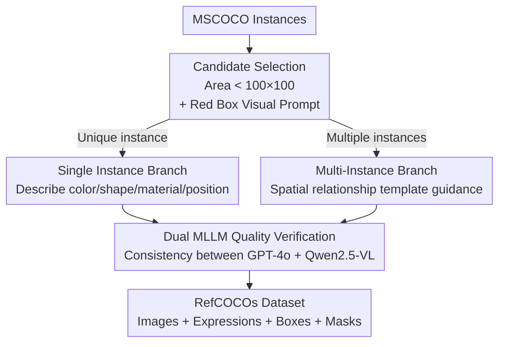

# Small Object, Great Challenge: A Benchmark for Small Object Visual Grounding

**Conference**: CVPR 2026  
**Paper**: [CVF Open Access](https://openaccess.thecvf.com/content/CVPR2026/html/Jia_Small_Object_Great_Challenge_A_Benchmark_for_Small_Object_Visual_CVPR_2026_paper.html)  
**Code**: https://github.com/lemonskyer/sovg  
**Area**: Multimodal VLM  
**Keywords**: Visual Grounding, Small Objects, RefCOCO, Referring Expressions, MLLM Auto-labeling

## TL;DR
Addressing the bias in existing Visual Grounding (VG) benchmarks toward large objects, this paper constructs the RefCOCOs benchmark (320k referring expressions) using an MLLM-based automated pipeline on COCO, where the average target area is only 1.60% of the image. A strong baseline, SoVG-Net, featuring a Hierarchical Text Injection (HTI) module, is proposed, achieving leading performance in Acc@0.5 and mIoU for small object localization and segmentation.

## Background & Motivation

**Background**: Visual Grounding (VG) aims to localize or segment objects in an image based on a referring expression. It primarily consists of two sub-tasks: REC (Referring Expression Comprehension, predicting bounding boxes) and RES (Referring Expression Segmentation, predicting pixel-level masks). Research in this area relies heavily on three classic datasets: RefCOCO, RefCOCO+, and RefCOCOg.

**Limitations of Prior Work**: These three datasets were collected via human annotation (two-player games or describe-and-verify workflows). Humans naturally tend to select **large and salient** objects during annotation for speed and clarity. Consequently, the average area of referred objects in traditional VG benchmarks is **18-19%** (nearly 1/5) of the image, with almost no coverage of small objects. However, in real-world scenarios, small objects often carry critical information—such as a nursing robot needing to find a small medicine bottle on a cluttered shelf—making the ability to ground small objects essential but currently missing.

**Key Challenge**: Small objects possess weak visual information (low resolution, faint features). As visual features are passed layer-by-layer through deep networks, these subtle signals are **easily diluted by dominant background features**. Furthermore, uniquely referring to a small object often requires longer descriptions with complex spatial relationships, placing higher demands on linguistic reasoning. Existing datasets and models do not address these factors.

**Goal**: This work targets two specific sub-problems: (1) How to **efficiently and cost-effectively** build a large-scale small-object VG benchmark (human annotation is expensive, and RefCOCO lacks region-level labels for small objects); (2) How to build a **strong baseline model** to prevent small-object features from being diluted within the network.

**Key Insight**: The authors formally define the **Small Object Visual Grounding (SOVG)** task, using an operational definition where the referred object area is approximately 1/50 of the image ($< 2\%$). MLLMs are utilized to generate referring expressions to bypass human annotation bottlenecks.

**Core Idea**: An **MLLM-automated pipeline** is used to "translate" existing small-object instances in COCO into high-quality referring expressions, creating the RefCOCOs dataset. Subsequently, **SoVG-Net** is developed, which injects text guidance into multiple layers of the visual encoder to prevent small-object features from being submerged in deeper layers.

## Method

The paper follows two main lines: the **dataset construction** (the RefCOCOs automated pipeline, the core contribution) and the **baseline model** (SoVG-Net).

### Overall Architecture

**Dataset Side**: RefCOCOs construction is a three-stage automated labeling pipeline based on MSCOCO. Stage 1: **Candidate Selection**—instances smaller than 100×100 pixels are filtered from COCO, and a red box is drawn as a visual prompt to focus the MLLM's attention. Stage 2: **Expression Generation**—referring expressions are generated via two separate branches depending on whether the category is a "unique instance" or "multiple instances" in the image. Stage 3: **Quality Verification**—two MLLMs (GPT-4o and Qwen2.5-VL) perform cross-validation to ensure object-expression consistency, retaining only pairs accepted by both. The final product is RefCOCOs, containing COCO images, expressions, bounding boxes, and pixel masks.

**Model Side**: SoVG-Net is a Transformer-based multi-task framework comprising a text encoder (BERT), a visual encoder (DINOv2), a cross-modal decoder, and two task heads. After encoding, the visual encoder utilizes HTI modules at selected layers to progressively enhance visual features using text guidance. These features are then fed into the decoder, followed by REC and RES heads to predict boxes and masks.

### Key Designs

**1. Dual-Branch Expression Generation: Category Consistency for Single Instance, Spatial Templates for Multiple Instances**

This step addresses how to generate accurate and unambiguous descriptions for small objects. The authors found that MLLMs often suffer from hallucinations when describing small objects, frequently drifting toward larger objects. Thus, the pipeline branches based on instance count: for **single instances**, the MLLM is prompted to describe color, shape, material, and position. Predicted categories are then matched against ground-truth labels—mismatched descriptions (e.g., describing a "person in white" instead of a chair) are discarded. For **multiple instances**, where appearance alone is insufficient, **spatial relationship templates** (absolute position like "at the top" and relative position like "to the right of [another object]") are used to direct the MLLM to generate unique identifiers like "the leftmost glove positioned near home plate."

**2. Dual MLLM Quality Verification: Retaining Only Consensual Labels**

To mitigate noise from automated generation, a single MLLM's self-judgment is insufficient. Two **heterogeneous MLLMs (GPT-4o and Qwen2.5-VL) act as a jury**: an object-expression pair is kept only if both agree the expression uniquely points to the red-boxed object. Templated prompts ("Is [Expression] the sole referent of the red box in the image?") allow independent voting. This intersection filtering is critical to producing a "usable" benchmark rather than a noisy collection.

**3. RefCOCOs Dataset Properties: Smallness as a Statistical Metric**

RefCOCOs is systematically biased toward small objects. It contains 42,407 images, 72,588 instances, and **323,266 referring expressions**, exceeding the scale of the original RefCOCO series. The **average target area is only 1.60%**, about 1/12th of RefCOCO (~19%). The normalized scale distribution is highly concentrated below 0.15, peaking at ~0.05. The **average expression length is 8.67 words**, longer than classic datasets because small objects require more linguistic detail for disambiguation, increasing the reasoning difficulty. Spatial distribution is more uniform compared to the center-biased RefCOCO series.

**4. Hierarchical Text Injection (HTI) Module: Multi-layer Fusion to Prevent Feature Dilution**

HTI is the core of SoVG-Net, designed to prevent small-object features from being diluted by the background in deep layers. Unlike late-fusion methods, HTI **repeatedly injects text guidance into several pre-selected layers $K=\{k_1,\dots,k_n\}$ of the visual encoder**. Text features $F_t$ are projected to dimension $D_v$ to get $F'_t$. At each layer $k$, a **unidirectional cross-attention** is performed with visual features as queries: $F^{(k)}_{\text{update}} = \text{Attention}(F^{(k)}_v, F'_t, F'_t)$. The results are fused back into the visual stream via residual connections and LayerNorm: $F'^{(k)}_v = \text{LN}(F^{(k)}_v + \text{Linear}(F^{(k)}_{\text{update}}))$. This "lights up" small-object regions semantically by the end of the encoder. Ablations show that injection into **deep layers** (blocks 15/18/21/24) is most effective.

### Loss & Training

The model is trained end-to-end: $L_{\text{total}} = \lambda_{\text{reg}} L_{\text{reg}} + \lambda_{\text{seg}} L_{\text{seg}}$. 
Regression loss includes L1 and GIoU: $L_{\text{reg}} = \lambda_{L1} L_{1}(b,\hat b) + \lambda_{\text{giou}} L_{\text{giou}}(b,\hat b)$. 
Segmentation loss combines Focal and Dice: $L_{\text{seg}} = \lambda_{\text{focal}} L_{\text{focal}}(m,\hat m) + \lambda_{\text{dice}} L_{\text{dice}}(m,\hat m)$, where Focal loss addresses the extreme foreground/background imbalance inherent to small objects. Training uses AdamW on 4x RTX A6000s with specialized learning rates for encoders and heads.

## Key Experimental Results

### Main Results: Localization/Segmentation on RefCOCOs

Existing methods without RefCOCOs training perform poorly (Acc@0.5 ~13%). Once trained on RefCOCOs, performance jumps significantly, with SoVG-Net leading across all splits.

| Method (w/ RefCOCOs) | val Acc@0.5 | val mIoU | testB Acc@0.5 | testB mIoU |
|--------|------|------|------|------|
| TransVG | 64.70 | - | 64.23 | - |
| HiVG | 65.32 | - | 65.34 | - |
| EEVG | 66.23 | 53.97 | 66.76 | 54.30 |
| **SoVG-Net** | **72.69** | **60.85** | **72.33** | **60.40** |

Compared to EEVG, SoVG-Net is nearly 6% higher in Acc@0.5 on testB. Meanwhile, SoVG-Net maintains SOTA-level performance on classic RefCOCO/+/g datasets, showing that small-object training does not degrade general capability.

### Ablation Study

**Contribution of HTI Module** (Acc@0.5 / mIoU):

| Configuration | val | testA | testB |
|------|-----|-------|-------|
| Baseline | 68.61 / 56.10 | 59.88 / 48.54 | 66.82 / 55.09 |
| Baseline + HTI | 72.69 / 60.58 | 63.39 / 53.31 | 72.33 / 60.40 |
| Gain | +4.08 / +4.48 | +3.51 / +4.77 | +5.51 / +5.31 |

**Injection Layer Scheme** (REC Acc@0.5):

| Scheme | Block Indices | val | testA | testB |
|------|-----------|-----|-------|-------|
| Shallow | 3,6,9,12 | 70.01 | 51.83 | 67.59 |
| Middle | 9,12,15,18 | 71.49 | 57.57 | 70.40 |
| Uniform | 6,12,18,24 | 71.23 | 58.21 | 70.56 |
| **Deep** | 15,18,21,24 | **72.69** | **63.39** | **72.33** |

### Key Findings
- **HTI is the primary driver of performance**: Improvements of 3.51%–5.51% in Acc@0.5 and 4.48%–5.31% in mIoU demonstrate that text-guided feature reinforcement effectively prevents small object signal loss.
- **Deeper injection is better**: Performance increases monotonically from shallow to deep schemes, as injecting language features into high-level visual semantics is more beneficial for small object grounding.
- **Dataset necessity**: Models trained on RefCOCOg fail on SoVG (e.g., misidentifying "the rightmost green plant" as a large object), proving that classic benchmarks are insufficient for this challenge.

## Highlights & Insights
- **Upgrading detection labels via MLLM**: By using the red-box visual prompt, the authorship converts existing COCO object detection labels into grounding labels, reducing human annotation costs to nearly zero.
- **Red Box Prompt + Dual MLLM Consensus**: This combination effectively suppresses MLLM hallucinations and ensures the high quality required for a benchmark.
- **Fusion layer as a hyperparameter**: The ablation clearly identifies the importance of injection depth, providing a reference for other multimodal architectures.

## Limitations & Future Work
- **Reliance on MLLM generation**: Expressions lack human diversity and are limited by the stylistic constraints of GPT-4o/Qwen.
- **Fixed pixel threshold**: The definition of "small" ($< 100\times100$) is an engineering heuristic that might not be universal across all resolutions.
- **Static images only**: Future work aims to expand SOVG to video domains.

## Related Work & Insights
- **vs. Classic VG (RefCOCO/+/g)**: Classic datasets rely on human bias toward large objects (~19% area). RefCOCOs targets small objects (1.60% area) and surpasses them in scale.
- **vs. Small Object Detection (SOD)**: SOD is a category-level task; SOVG is an instance-level task requiring linguistic reasoning to distinguish between multiple small objects.
- **vs. General VG Methods**: Methods like EEVG perform poorly on small objects without specific training. SoVG-Net's HTI specifically addresses the dilution problem, leading by ~6 points on RefCOCOs.

## Rating
- Novelty: ⭐⭐⭐⭐ Systematically defines and benchmarks SOVG; the baseline is effective though not a radical architectural shift.
- Experimental Thoroughness: ⭐⭐⭐⭐ Comprehensive results across RefCOCOs and classic datasets, with clear ablations on HTI depth.
- Writing Quality: ⭐⭐⭐⭐ Clear structure and detailed statistical analysis of the dataset.
- Value: ⭐⭐⭐⭐ Fills a significant gap in the VG field with high-quality data and a strong baseline.

<!-- RELATED:START -->

## Related Papers

- [\[CVPR 2026\] Visual Grounding for Object Questions](visual_grounding_for_object_questions.md)
- [\[CVPR 2026\] From Failure to Feedback: Group Revision Unlocks Hard Cases in Object-Level Grounding](from_failure_to_feedback_group_revision_unlocks_hard_cases_in_object-level_groun.md)
- [\[CVPR 2026\] HanDyVQA: A Video QA Benchmark for Fine-Grained Hand-Object Interaction Dynamics](handyvqa_a_video_qa_benchmark_for_fine-grained_hand-object_interaction_dynamics.md)
- [\[CVPR 2026\] Mechanisms of Object Localization in Vision-Language Models](mechanisms_of_object_localization_in_vision-language_models.md)
- [\[CVPR 2026\] IAG: Input-aware Backdoor Attack on VLM-based Visual Grounding](iag_input-aware_backdoor_attack_on_vlm-based_visual_grounding.md)

<!-- RELATED:END -->
