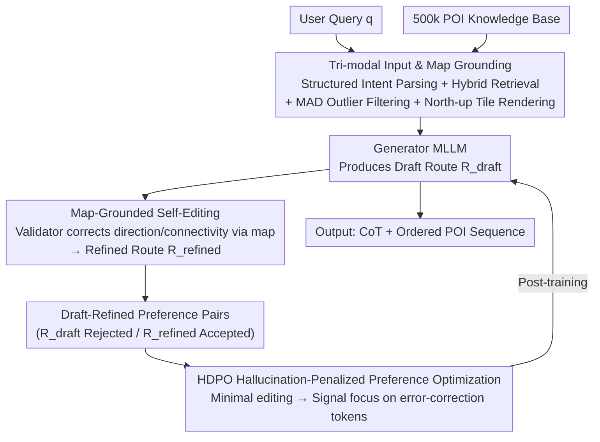

# SMAP: Semantic Route Planning with Map-Grounded Multimodal Alignment

**Conference**: CVPR 2026  
**Paper**: [CVF Open Access](https://openaccess.thecvf.com/content/CVPR2026/html/Zhang_SMAP_Semantic_Route_Planning_with_Map_Grounded_Multimodal_Alignment_CVPR_2026_paper.html)  
**Code**: None (Project page only: https://amap-mobility-intelligence.github.io/SMAP/)  
**Area**: Multimodal VLM  
**Keywords**: Semantic route planning, multimodal alignment, map grounding, preference optimization, hallucination suppression

## TL;DR
SMAP feeds user queries, structured POI metadata, and a "north-up map tile marking only candidate POIs" into a multimodal large model for semantic route planning. It utilizes a "generator drafts, validator corrects via map" process to automatically create preference pairs, followed by training with Hallucination-Penalized DPO (HDPO). This boosts a 32B open-source model to match or exceed GPT-5 in route efficiency, temporal rationality, and overall quality.

## Background & Motivation
**Background**: Semantic route planning aims to generate a POI sequence that is both themed (e.g., "five-day city tour", "child-friendly walking route") and spatially feasible given user intent. Current approaches mainly use LLMs: either the LLM parses intent for a traditional TSP/constraint solver (ITINERA, ChinaTravel), or uses ReAct/Reflexion multi-step agents to iteratively call tools.

**Limitations of Prior Work**: Text-only LLMs only perceive textual POI descriptions and lack spatial grounding. This often leads to "hallucinated" routes that are geographically illogical—jumping across districts or repeatedly backtracking between non-adjacent POIs. While masked by fluent natural language, these routes are practically non-navigable. Solver routes require explicit constraints, whereas real user needs are often implicit and hard to formalize. Multi-step agents involve lengthy interactions that test user patience.

**Key Challenge**: Route planning is inherently a **spatial + multimodal** task requiring "map reading." Existing methods treat it as a pure text generation problem, where models cannot infer fine-grained information like spatial continuity or local POI density from metadata. Furthermore, existing datasets primarily feature coarse city-level itineraries, lacking multimodal supervision for local, fine-grained planning.

**Goal**: (1) Enable models to "read maps" for planning like humans; (2) Suppress spatial hallucinations to ensure directional and topological consistency; (3) Provide the first multimodal, multi-scale semantic route planning dataset.

**Key Insight**: Humans focus on relative POI positions on a map during planning. The authors transfer this cognitive process to an MLLM by rendering a tile that only displays candidate POIs as visual input, forcing the model to reason based on relative positions rather than just text.

**Core Idea**: Use tri-modal input (map tiles + POI metadata + query) for one-step route planning, combined with "self-editing to create preference pairs + hallucination-penalized DPO" to internalize validator corrections, reducing hallucinations and improving feasibility.

## Method

### Overall Architecture
SMAP formalizes semantic route planning as modeling $p(R\mid q,P,m)$, given user query $q$, candidate POI set $P=\{p_1,\dots,p_n\}$ (with structured metadata like categories/labels), and map tile $m$. The output is a themed, spatially feasible, and coherent route $R$. Model output consists of two parts: a `<think>` block for Chain-of-Thought (CoT) reasoning with spatial considerations, and an `<answer>` block containing an ordered list of POI indices.

The pipeline comprises two main stages. **Input Construction**: Parses natural language queries into four structured intent types → Hybrid retrieval to recall candidate POIs with spatial outlier filtering → Rendering a high-resolution, north-up map tile marking only candidate POIs. **Anti-hallucination Training**: Cold-starts an SFT model via distillation from strong models, then generates drafts from the SFT model which the validator MLLM corrects against the map. Each query yields a "draft (rejected) / refined (accepted)" pair for HDPO training.

### Key Designs

**1. Tri-modal Input and Map Grounding: Complementing LLMs with "Map Reading"**

To address the inability of text-only LLMs to infer spatial relationships, SMAP provides three complementary inputs: query $q$ for intents and constraints, structured POI metadata $P$ from the knowledge base, and map tile $m$. Two specific designs are used for the tiles: a fixed **north-up** orientation to provide a stable directional reference, and **superimposing only candidate POI** labels without other features. This forces the model to reason about spatial relationships solely from relative positions. Tiles are rendered at $980\times980$ resolution to maintain clarity.

**2. Structured Intent Parsing + Spatial-Aware Candidate Construction**

Queries are parsed into four intent types—destination (e.g., "Haidian, Beijing"), theme (e.g., "hiking", "parent-child"), explicit POI (naming specific landmarks), and nearby search ("walk near the Forbidden City"). Retrieval uses a hybrid **lexical matching + dense vector** strategy followed by reranking. For "nearby search," a 3–5 km radius filter is applied. After selecting the top-20 POIs from a 500k-item knowledge base, **MAD (Median Absolute Deviation) outlier filtering** is applied to remove POIs that are too far from cluster centroids, ensuring a compact and feasible exploration area.

**3. Map-Grounded Self-Editing: Automated Preference Pair Creation**

Given input $x=(q,P,m)$, the generator MLLM produces an initial $R_{\text{draft}}$. A second MLLM acts as a **validator**, checking the draft against POI metadata and tiles for directional consistency, walkability, and topological connectivity. It corrects illogical segments (e.g., reversing incorrect directions or reordering non-adjacent POIs) to produce $R_{\text{refined}}$. This automatically generates $(R_{\text{draft}}, R_{\text{refined}})$ pairs without human annotation. The validator performs **minimal editing**, which is crucial for focusing training signals.

**4. HDPO Hallucination-Penalized Preference Optimization: Focusing Learning Signals**

With $R_{\text{refined}}$ as accepted and $R_{\text{draft}}$ as rejected, DPO is performed on the SFT reference model $\pi_{\text{ref}}$:

$$\mathcal{L}_{\text{DPO}} = -\mathbb{E}_{(x,y_a,y_r)}\left[\log\sigma\left(\beta\log\frac{\pi_\theta(y_a\mid x)}{\pi_{\text{ref}}(y_a\mid x)} - \beta\log\frac{\pi_\theta(y_r\mid x)}{\pi_{\text{ref}}(y_r\mid x)}\right)\right]$$

The authors decompose the preference gap at the token level. Because $y_a$ is a minimal edit of $y_r$, tokens overlap significantly. The context $t^a_{<i}$ and $t^r_{<i}$ for common tokens are nearly identical, causing their signals to cancel out (**Term B approaches 0**). This focuses optimization signals on **Term A**—the hallucinated segments that were corrected. This ensures the model learns "what was wrong and how to fix it," whereas standard DPO signals are often diluted by irrelevant differences in phrasing or structure.

### Loss & Training
The base models are Qwen2.5-VL-7B / 32B. The workflow is **Distillation Cold-start → SFT → HDPO**. High-quality routes generated by Gemini-2.5-Pro are used for SFT. Then, SFT model drafts (rejected) and Gemini-2.5-Pro spatial corrections (accepted) form pairs for HDPO. Training utilizes 5 epochs with AdamW, learning rate 1e-5, cosine annealing, and gradient clipping. Training was conducted on 16 H20 GPUs with DeepSpeed ZeRO-3.

## Key Experimental Results

Evaluations were performed on the self-built **MM-Route** dataset (3,000 multi-scale/theme queries, each with $\le 20$ candidate POIs and north-up tiles). Metrics include: PSR (Planning Success Rate), RDR (Route Distance Ratio, higher is more efficient), RTPR (Route Topic Pass Rate), TSPR (Temporal Schedule Pass Rate), SHR (Spatial Hallucination Rate, lower is better), ORS (Overall Route Score 1–5), and CPR (Comparative Preference Rate vs. GPT-5, judged by Gemini).

### Main Results

| Model | RDR↑ | RTPR↑ | TSPR↑ | SHR↓ | ORS↑ | CPR↑ |
|------|------|-------|-------|------|------|------|
| Qwen2.5-VL-32B (Pre-trained) | 0.667 | 59.3 | 34.5 | 31.9 | 1.69 | 4.6 |
| GPT-4o | 0.688 | 72.8 | 36.5 | 31.8 | 2.12 | 10.5 |
| OpenAI-o1 | 0.780 | 90.9 | 37.0 | 21.2 | 3.10 | 15.0 |
| GPT-5 (Reference) | 0.825 | **94.0** | 68.8 | **13.3** | 3.76 | — |
| Qwen2.5-VL-7B-HDPO | 0.802 | 85.4 | 70.4 | 20.4 | 3.37 | 34.0 |
| **Qwen2.5-VL-32B-HDPO** | **0.831** | 91.0 | **77.5** | 14.0 | **3.89** | **51.5** |

After SFT+HDPO, the 32B model improved RDR from 0.667 to 0.831 and slashed SHR from 31.9% to 14.0%. It **outperformed GPT-5** in route efficiency (RDR 0.831 vs 0.825), temporal rationality (TSPR 77.5% vs 68.8%), and overall quality (ORS 3.89 vs 3.76), achieving a 51.5% win rate (CPR) in head-to-head comparisons.

### Ablation Study

**Effect of Multimodal Input (Tab. 2; text-only includes coordinates but removes tiles):**

| Configuration (Qwen2.5-VL-32B) | RDR↑ | TSPR↑ | SHR↓ | ORS↑ | CPR↑ |
|------|------|-------|------|------|------|
| HDPO (text-only) | 0.789 | 73.5 | 15.4 | 3.72 | 49.0 |
| HDPO (text-image) | **0.831** | **77.5** | **14.0** | **3.89** | **51.5** |

**Effect of HDPO Sample Construction (Tab. 3; DPO uses SFT ground-truth as accepted):**

| Configuration (Qwen2.5-VL-7B) | RDR↑ | RTPR↑ | SHR↓ | ORS↑ |
|------|------|-------|------|------|
| SFT | 0.763 | 83.8 | 22.1 | 3.00 |
| DPO (Standard) | 0.733 | 79.8 | 27.6 | 2.75 |
| HDPO (Ours) | **0.802** | **85.4** | **20.4** | **3.37** |

### Key Findings
- **Map tiles primarily enhance spatial ability**: RDR and SHR improved most significantly after adding images, proving the model "grounds" planning to the map. TSPR also improved as tiles provide implicit temporal cues like POI spacing.
- **Standard DPO can degrade performance**: For the 7B model, RDR dropped from 0.763 to 0.733. Large differences between ground-truth and model drafts dilute signals. HDPO's minimal-edit "refined vs. draft" approach provides focused signals that lead to stable gains.
- **Smaller models can win**: Targeted data and specialized post-training allow a 32B model to surpass GPT-5, highlighting the importance of task-specific tuning for MLLMs.

## Highlights & Insights
- **Effective Tile Design**: Using fixed orientation for directional reference and "candidate-only" marking for relative reasoning successfully translates the human cognitive process of map reading to models.
- **Token-level HDPO Insight**: The derivation showing how minimal editing focuses signals on hallucinated tokens provides a theoretical basis for preference pair construction.
- **Validator as Annotator**: Using one MLLM to correct another based on a map provides a scalable, zero-annotation paradigm for specialized tasks.

## Limitations & Future Work
- **Dependency on Strong Validators**: Preference pairs and evaluations rely heavily on Gemini-2.5-Pro, introducing potential "teacher-judge" circular bias.
- **Private Data Usage**: The 500k POI knowledge base and specific queries are internal resources, leaving cross-region/language generalization not fully explored.
- **One-step vs. Interactive**: While efficient, the one-step approach lacks the ability for multi-turn clarification or dynamic adjustments with the user.
- **Future Improvements**: Replacing the LLM validator with executable geometric/road-network constraints could further reduce SHR.

## Related Work & Insights
- **vs. ITINERA / ChinaTravel (Solver-based)**: These use LLMs to parse intent and traditional solvers for planning. SMAP allows the MLLM to act as the planner directly, handling implicit needs but sacrificing the optimality guarantees of solvers.
- **vs. ReAct / Reflexion Agents**: These are multi-step and slow. SMAP uses one-step planning with RAG, making it more user-friendly.
- **vs. TraveLLaMA**: While previous models use map data for QA or retrieval, SMAP is the first to perform end-to-end route synthesis while explicitly aligning directional coherence and geographical feasibility.

## Rating
- Novelty: ⭐⭐⭐⭐⭐ 
- Experimental Thoroughness: ⭐⭐⭐⭐ 
- Writing Quality: ⭐⭐⭐⭐⭐ 
- Value: ⭐⭐⭐⭐ 

<!-- RELATED:START -->

## Related Papers

- [\[CVPR 2026\] Gravitation-Driven Semantic Alignment for Text Video Retrieval](gravitation-driven_semantic_alignment_for_text_video_retrieval.md)
- [\[CVPR 2026\] LASAR: Towards Spatio-temporal Reasoning with Latent Cognitive Map](lasar_towards_spatio-temporal_reasoning_with_latent_cognitive_map.md)
- [\[CVPR 2026\] Proxy3D: Efficient 3D Representations for Vision-Language Models via Semantic Clustering and Alignment](proxy3d_efficient_3d_representations_for_vision-language_models_via_semantic_clu.md)
- [\[CVPR 2026\] SIMPACT: Simulation-Enabled Action Planning using Vision-Language Models](simpact_simulation-enabled_action_planning_using_vision-language_models.md)
- [\[CVPR 2026\] Hyperbolic Gramian Volumes for Multimodal Alignment](hyperbolic_gramian_volumes_for_multimodal_alignment.md)

<!-- RELATED:END -->
