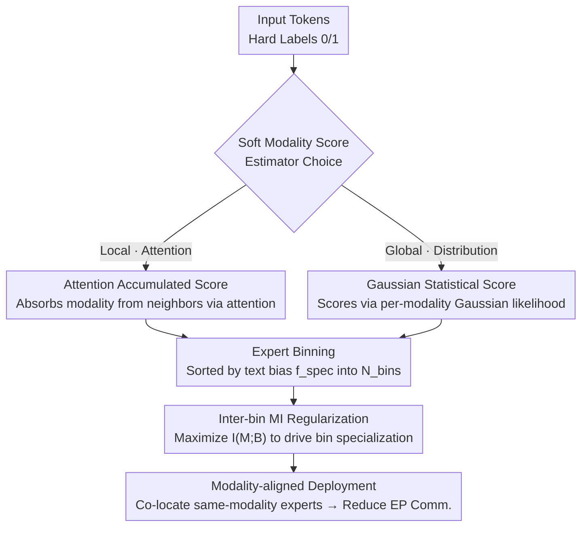

# SMoES: Soft Modality-Guided Expert Specialization in MoE-VLMs

**Conference**: CVPR 2026  
**arXiv**: [2604.23996](https://arxiv.org/abs/2604.23996)  
**Code**: None  
**Area**: Multimodal VLM / MoE Routing / Inference Efficiency  
**Keywords**: MoE-VLM, Modality Specialization, Soft Modality Scores, Expert Binning, Mutual Information Regularization, Expert Parallelism

## TL;DR
Addressing the overlooked issue of "whether and how experts should specialize by modality" in MoE-VLMs, this paper proposes SMoES. It uses layer-wise dynamic **soft modality scores** to characterize the actual vision/text fusion degree of tokens, **bins** experts into groups aligned with deployment devices, and drives specialization through **inter-bin mutual information regularization**. Across 4 MoE-VLMs and 16 benchmarks, it achieves average gains of 0.9%/4.2% on multimodal/language tasks while reducing expert parallelism (EP) communication overhead by 56.1% and increasing throughput by 12.3%.

## Background & Motivation

**Background**: MoE has become the mainstream backbone for large VLMs (DeepSeek-VL2, Kimi-VL, GLM-4.5V, InternVL-3.5, etc.). By increasing capacity via conditional computation while minimally increasing per-token compute, it is naturally suited for fusing heterogeneous vision/text modalities. However, how "modality signals (vision vs. text)" should guide expert routing has not been systematically studied.

**Limitations of Prior Work**: Current routing falls into three categories, each with flaws. **Hard routing** pre-assigns experts to specific modalities, offering strong specialization but rigid boundaries that fail to account for cross-modal features and the natural mixing of representations across layers. **Soft routing** (the mainstream approach) allows any expert to process any token but relies on heuristic priors or auxiliary losses decoupled from modality distributions, leading to either over-mixing or under-specialization. **Hybrid routing** manually splits experts into "modality-specific + shared" groups, but this human-defined static split cannot track the evolution of features with depth.

**Key Challenge**: Analysis of modality fusion in LLaVA-1.5 and DeepSeekMoE-based VLMs (Fig. 2) reveals that fusion is **multi-scale and heterogeneous**. Macroscopically, vision-text JS divergence trajectories vary significantly across different models and layers. Microscopically, within the same layer and modality, some tokens remain unimodal while others become cross-modal. Thus, **rigid priors** like hard separation or uniform mixing fail to align with actual modality interactions.

**Efficiency Pain Points**: Vision tokens are numerous but have low information density (spatial redundancy), whereas text tokens are few but semantically concentrated. This asymmetry causes two efficiency problems: ① Standard routing + basic load balancing allocates most experts to the "high volume but sparse" vision modality, squeezing specialization; ② Under **Expert Parallelism (EP)** deployment, modality-agnostic routing scatters tokens across devices, causing a spike in All-to-All communication overhead. Conversely, establishing clear expert-modality affinity allows for scheduling same-modality experts on the **same device**, significantly saving communication while maintaining load balance.

**Core Idea**: Use "soft" signals that respect the layer-wise evolution of modality structures to guide MoE experts to **spontaneously** form dynamic modality specialization, improving both accuracy and communication efficiency.

## Method

### Overall Architecture
SMoES performs three sequential operations at each MoE layer: first, it refines binary "hard modality labels (0=vision/1=text)" into continuous **soft modality scores** $M \in [0, 1]$ to characterize the true vision/text components of tokens. Next, it **bins** the $N_e$ experts of the layer into $N_{\text{bins}}$ groups (aligned with the number of deployment devices) based on their historical "text vs. vision" load. Finally, **inter-bin mutual information regularization** $I(M; \mathbf{B})$ is used to drive different bins to specialize in different modalities. These components synergize: soft scores provide a reference for the token's true modality, binning provides a "specializable and deployable" structural unit, and mutual information binds them to allow bin-level specialization to emerge naturally. Post-specialization, experts of the same modality can be co-located on devices to save EP communication.

Two complementary estimators are provided for soft modality scores: **Attention Accumulated Score** (local, sequence-dependent) and **Gaussian Statistical Score** (global, distribution-dependent).

### Key Designs

**1. Dynamic Soft Modality Score: Replacing Binary Labels with Continuous Fusion State**

To address the failure of hard labels in capturing smooth fusion evolution, the paper defines soft scores $M_{ij,m}^{(l)} \in [0, 1]$ for each token, modality $m \in \{\text{text}, \text{vision}\}$, and layer $l$, where $\sum_m M_{ij,m}^{(l)} = 1$. Two paths estimate this:

**Attention Accumulated Score** captures "local cross-token interaction": The intuition is that a token absorbs modality characteristics from others proportional to its attention weights. Layer 0 is initialized with hard labels $M_{ij,m}^{\text{attn},(0)} = \mathbf{1}\{m = m(\mathbf{x}_{ij})\}$. Subsequent layers use a two-step update: first, aggregate scores of attended tokens $\tilde{M}_{ij,m}^{\text{attn},(l)} = \sum_{j'} \text{Attn}_{j,j'}^{(l)} \cdot M_{ij',m}^{\text{attn},(l)}$, then apply residual weighting using feature norms:

$$M_{ij,m}^{\text{attn},(l+1)} = \frac{\|\mathbf{x}_{\text{attn},ij}^{(l)}\| \cdot \tilde{M}_{ij,m}^{\text{attn},(l)} + \|\mathbf{x}_{ij}^{(l)}\| \cdot M_{ij,m}^{\text{attn},(l)}}{\|\mathbf{x}_{\text{attn},ij}^{(l)}\| + \|\mathbf{x}_{ij}^{(l)}\|}$$

This aligns with the Transformer residual structure $\mathbf{x}^{(l+1)} = \mathbf{x}^{(l)} + \mathbf{x}_{\text{attn}}^{(l)}$, using norms to measure the relative contribution of the attention and residual paths.

**Gaussian Statistical Score** captures "global distribution patterns": Modalities occupy different regions in the embedding space. The model maintains a diagonal-covariance Gaussian (mean $\boldsymbol{\mu}_m$, variance $\boldsymbol{\sigma}_m^2$) per layer/modality, updated online using an EMA variant of Welford's algorithm (decay $\beta$). At inference, it calculates log-likelihood $\text{LL}_{ij,m} = -\frac{1}{2}\sum_d \left(\log\sigma_{m,d}^2 + \frac{(x_{ij,d}-\mu_{m,d})^2}{\sigma_{m,d}^2} \right)$ and yields soft scores via temperature-scaled softmax $M_{ij,m}^{\text{gauss}} = \frac{\exp(\text{LL}_{ij,m}/\tau)}{\sum_{m'} \exp(\text{LL}_{ij,m'}/\tau)}$. This provides immediate modality attribution per layer without dependency on layer 0 initialization.

**2. Expert Binning: A Shared Structural Unit for Specialization and Deployment**

To reduce communication explosions in EP, $N_e$ experts per layer are partitioned into $N_{\text{bins}}$ bins $\mathbf{B} = \{\mathbf{B}_1, \dots, \mathbf{B}_{N_{\text{bins}}}\}$, each containing $N_B = N_e / N_{\text{bins}}$ experts. By **aligning the number of bins with the number of devices**, bins become dual-purpose structures for specialization and deployment.

Instead of fixed slicing, **Momentum-Adaptive Binning** is used: EMA tracks the per-modality load of each expert $\bar{C}_{m,e,t} = \beta \bar{C}_{m,e,t-1} + (1-\beta) C_{m,e}$, calculating a **text bias score** $f_{\text{spec}}(e) = \frac{\bar{C}_{\text{text},e}}{\bar{C}_{\text{text},e} + \bar{C}_{\text{vision},e}}$. Experts are sorted by $f_{\text{spec}}$ and sliced into $N_{\text{bins}}$ continuous bins, grouping experts with similar modality preferences together to facilitate device co-location.

**3. Inter-bin MI Regularization: Harmonizing Specialization and Load Balance**

To resolve the tension between specialization and load balancing, the paper maximizes the mutual information $I(M; \mathbf{B})$ between soft modality scores $M$ and selected bins $\mathbf{B}$. High MI implies that knowing the selected bin strongly predicts the token's modality. The implementation calculates average gating scores per sample-modality-bin $\bar{S}_{i,m,\mathbf{B}_k} = \frac{\sum_{e \in \mathbf{B}_k} \sum_j M_{ij,m} \cdot g_{ij,e}}{N_B \sum_j M_{ij,m}}$, normalizes them into joint probabilities $P_i(m, \mathbf{B}_k)$, and minimizes the negative MI: $\mathcal{L}_{\text{MI}} = -\sum_l \frac{1}{N_{\text{batch}}} \sum_i I_i(M; \mathbf{B})$.

Unlike KL-divergence-based regularization (e.g., SMAR) which forces routing toward "modality-exclusive modes" and conflicts with load balancing, MI only requires **bin-level correlation**. It does not dictate which specific expert is picked, allowing it to coexist with load balancing and align naturally with EP device placement.

### Loss & Training
The total objective is Task Loss + Bin-level Load Balancing + Inter-bin MI: $\mathcal{L} = \mathcal{L}_{\text{task}} + \alpha_{\text{bal}}\mathcal{L}_{\text{bal}} + \alpha_{\text{MI}}\mathcal{L}_{\text{MI}}$. $\mathcal{L}_{\text{bal}}$ is modified to be an **intra-bin** version $\mathcal{L}_{\text{bal}} = \sum_l \sum_k N_B \sum_{e \in \mathbf{B}_k} f_e P_e$, ensuring balance within each EP device. Training uses 8×A800, $N_{\text{bins}}=8$, Gaussian temperature $\tau=0.5D$, EMA decay $\beta=0.99$, weights $\alpha_{\text{bal}}=0.001$, $\alpha_{\text{MI}}=0.0001$. LLaVA protocol is followed: Pretrain-558K + Instruct-665K.

## Key Experimental Results

**MSI (Modality Specialization Index)**: A custom metric measuring the deviation of expert routing from a uniform modality distribution. $\text{MSI} \in [0, 1]$, where 0 = no specialization and 1 = perfect specialization.

### Main Results
Relative gains across 4 backbones and 16 benchmarks. Table below shows DeepSeekMoE (A3B/16B, top-6/64) and OLMoE (A1B/7B, top-8/64) relative to a non-specialized soft routing baseline (100%).

| Backbone | Method | MSI | Multimodal (10) | Language (6) | Overall |
| :--- | :--- | :--- | :--- | :--- | :--- |
| DeepSeekMoE | No Specialization | .177 | 100% | 100% | 100% |
| DeepSeekMoE | Hard Routing (t32-v32) | 1.0 | -3.9% | -26.2% | -12.3% |
| DeepSeekMoE | MoIIE (Hybrid) | .504 | -1.5% | -13.1% | -5.8% |
| DeepSeekMoE | SMAR (KL) | .543 | +0.6% | -11.3% | -3.9% |
| DeepSeekMoE | **SMoES attention-soft** | .487 | **+1.8%** | **+6.2%** | **+3.5%** |
| DeepSeekMoE | SMoES gaussian-soft | .440 | +1.3% | +4.2% | +2.4% |
| OLMoE | No Specialization | .205 | 100% | 100% | 100% |
| OLMoE | Hard Routing (t32-v32) | 1.0 | -6.1% | -34.1% | -16.6% |
| OLMoE | **SMoES attention-soft** | .620 | +0.5% | **+6.7%** | **+2.9%** |

Average across 4 backbones: SMoES improves by +2.2% overall (+0.9% multimodal, +4.2% language). Hard routing and hybrid routing (MoIIE) significantly underperform the baseline, confirming that "rigid specialization cannot be forced."

### EP Efficiency (OLMoE, 2×Orin GPU, 10Gb Ethernet)

| Metric | Baseline | SMoES | Change |
| :--- | :--- | :--- | :--- |
| Prefill Vision X-device Rate (MMMU) | 97.7% | 15.0% | ↓84.6% |
| Prefill Total Trans. Rate (MMMU) | 98.0% | 31.1% | ↓68.3% |
| TTFT (MMMU, bs=8) | 7.949s | 6.203s | ↓22.0% |
| TPOT (MMMU, bs=1) | 0.786s | 0.703s | ↓10.5% |

Overall: EP communication reduced by 56.1%; throughput increased by 12.3%.

### Ablation Study

| Configuration | MSI | Multimodal | Language | Overall |
| :--- | :--- | :--- | :--- | :--- |
| No Specialization | .177 | 100% | 100% | 100% |
| Hard-score + MI | .904 | -0.8% | +0.5% | -0.3% |
| Inter-bin **KL** | .724 | -1.5% | -8.5% | -4.1% |
| **MI-attention (full)** | .487 | +1.8% | +6.2% | +3.5% |
| Attention-soft + fixed bin | .450 | +2.0% | +0.2% | +1.3% |

### Key Findings
- **Soft vs. Hard Scores**: Hard-score achieves high MSI (.904) but fails to improve performance, while soft scores provide real gains.
- **MI vs. KL**: For bin specialization, KL degrades performance due to conflict with load balancing, whereas MI succeeds.
- **Adaptive Binning is Crucial**: Switching from fixed to momentum-adaptive binning significantly boosts language task performance.
- **Layer Patterns**: MSI is high in shallow layers (sharp separation) and decreases in deep layers (more fusion), aligning with the natural evolution of tokens.

## Highlights & Insights
- **Soft scores as fusion-aligned signals**: Using residual norms in the attention accumulated score provides clear physical intuition. This "local + global" dual estimation approach is transferable to any scenario requiring gradated token attributes.
- **Binning as a dual-purpose abstraction**: Using the same structure for both algorithmic specialization and system deployment is a highly effective design for actual deployment.
- **Resolving specialization conflicts via MI**: MI requires bin-modality correlation without locking specific experts, allowing it to work where KL fails in modern MoEs with many small experts.
- **MSI High $\neq$ Performance**: The failure of hard routing/scores serves as a reminder not to rely solely on specialization metrics.

## Limitations & Future Work
- **Ours**: Currently uses single-peak diagonal Gaussian for efficiency; more complex density models remain an open question.
- **Observations**: ① Only differentiates two modalities; doesn't utilize sub-clusters within modalities. ② EP efficiency was tested in 2×Orin edge scenarios; larger clusters might face different load skew risks. ③ Attention accumulated scores require access to the attention matrix, potentially complicating integration with some FlashAttention implementations.

## Related Work & Insights
- **vs. Hard/Hybrid Routing**: SMoES allows specialization to be **learned** and adaptive, maintaining load balance.
- **vs. SMAR (KL Regularization)**: SMAR conflicts with load balancing in small-expert settings; SMoES uses bin-level MI to circumvent this.
- **vs. MI on Tasks/Modules**: SMoES focuses specifically on **modalities** and aligns them with EP deployment granularity.
- **vs. MoE Deployment Optimization**: Unlike pure system work, SMoES leverages modality fusion characteristics to guide expert partitioning, representing a hardware-algorithm co-design approach.

## Rating
- Novelty: ⭐⭐⭐⭐⭐ 
- Experimental Thoroughness: ⭐⭐⭐⭐⭐ 
- Writing Quality: ⭐⭐⭐⭐ 
- Value: ⭐⭐⭐⭐⭐ 

<!-- RELATED:START -->

## Related Papers

- [\[CVPR 2026\] DeepAlign: Mitigating Modality Conflict through Modality-Specific Alignment](deepalign_mitigating_modality_conflict_through_modality-specific_alignment.md)
- [\[ICLR 2026\] CogMoE: Signal-Quality–Guided Multimodal MoE for Cognitive Load Prediction](../../ICLR2026/multimodal_vlm/cogmoe_signal-qualityguided_multimodal_moe_for_cognitive_load_prediction.md)
- [\[CVPR 2026\] Camouflage-aware Image-Text Retrieval via Expert Collaboration](camouflage-aware_image-text_retrieval_via_expert_collaboration.md)
- [\[ICLR 2026\] Enhancing Geometric Perception in VLMs via Translator-Guided Reinforcement Learning](../../ICLR2026/multimodal_vlm/enhancing_geometric_perception_in_vlms_via_translator-guided_reinforcement_learn.md)
- [\[CVPR 2026\] ArtiMuse: Fine-Grained Image Aesthetics Assessment with Joint Scoring and Expert-Level Understanding](artimuse_fine-grained_image_aesthetics_assessment_with_joint_scoring_and_expert-.md)

<!-- RELATED:END -->
