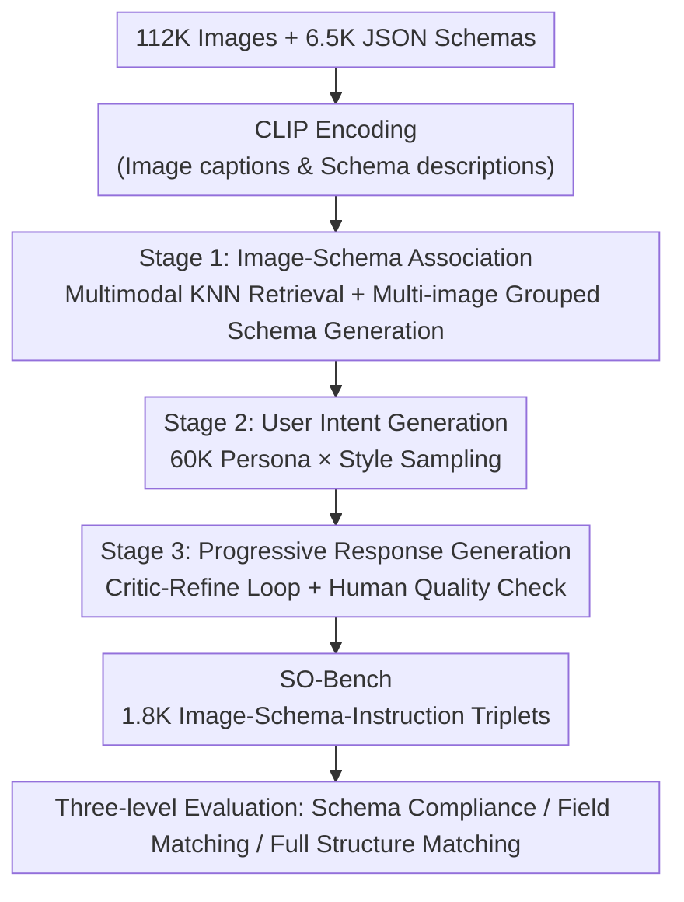

# SO-Bench: A Structural Output Evaluation of Multimodal LLM

**Conference**: CVPR 2026  
**Paper**: [CVF Open Access](https://openaccess.thecvf.com/content/CVPR2026/html/Feng_SO-Bench_A_Structural_Output_Evaluation_of_Multimodal_LLM_CVPR_2026_paper.html)  
**Code**: https://github.com/apple/ml-sobench  
**Area**: Multimodal VLM  
**Keywords**: Structured output, JSON Schema, Multimodal evaluation benchmark, Information extraction, Agentic tool calling

## TL;DR
This is the first benchmark proposed by Apple to systematically evaluate the capability of Multimodal Large Language Models (MLLMs) to convert visual inputs into structured outputs conforming to predefined JSON Schemas. Using a three-stage automated annotation pipeline, SO-Bench constructs 1.8K "Image–Schema–Instruction" triplets from 112K images across four domains and 6.5K JSON Schemas. Accompanied by a three-level evaluation metric, it reveals a significant performance gap where even the strongest model, Gemini-2.5-Pro, achieves an exact match accuracy of only 18.9%.

## Background & Motivation

**Background**: MLLMs are increasingly deployed in agentic scenarios (web automation, data extraction, tool calling) where the model's output is not intended for human reading but for consumption by downstream systems, controllers, or APIs. The output must strictly conform to a predefined JSON Schema; otherwise, downstream programs cannot parse it. OpenAI, Gemini, and Anthropic have already launched "Structured Output Modes" to enforce this constraint.

**Limitations of Prior Work**: Benchmarks like StructEval, JSONSchemaBench, and StructBench already evaluate structured output for pure text, but systematic evaluation for **visual** structured output is nearly non-existent. Existing visual structured works have limitations: Pix2Struct and Image2Struct focus on screenshot-to-HTML or semantic parsing of rendered images, which are narrow in domain and lean towards captioning; IR3D-Bench only tests purely synthetic 3D scene reconstruction; Key Information Extraction (KIE) tasks in document analysis target flat, predefined keywords and single-layer dictionaries, lacking the nested, complex structures of real-world Schemas.

**Key Challenge**: Real-world downstream applications require Schemas that are **multi-layered, diverse in field types, and customized by application** (reaching depths of 22 layers and over 2K fields). Conversely, existing evaluations either lack image inputs, cover very narrow visual domains, or use Overly simplistic Schemas. No research has quantified the true capability of MLLMs to produce Schema-compliant outputs under visual evidence grounding.

**Goal**: (1) Create a high-quality benchmark covering diverse real-world Schemas across four visual domains; (2) Systematically measure the gap in existing MLLMs; (3) Verify whether targeted training can bridge this gap.

**Core Idea**: Formalize "Visual Structured Output" as $p(Y|I,X,S)$—given an image $I$, a JSON Schema $S$, and a user instruction $X$, the model autoregressively generates a structured output $Y$ that is both **syntactically compliant** with $S$ and **semantically reflective** of $I$ and $X$. This is achieved through a scalable "multimodal embedding retrieval + multi-image grouped schema generation + human-in-the-loop critic-refinement" automated annotation pipeline.

## Method

### Overall Architecture

SO-Bench is an infrastructure for "data + evaluation" rather than a single model. The core challenge is associating an image with a representative JSON Schema and efficiently generating accurate structured output annotations. The authors solve this with a **three-stage automated annotation pipeline (with expert human quality control at each stage)**: ① Schema Generation — pairing images with Schemas (retrieved from a repository or generated from image groups); ② User Intent Generation — adding user instructions that simulate real human-computer interaction; ③ Response Generation — producing and verifying structured annotations via a "critic-refine" iterative loop. All images and Schemas are encoded via CLIP to support embedding retrieval. The final evaluation pipeline decomposes performance into "Schema Compliance / Structural Fidelity / Value Accuracy."

### Key Designs

**1. Visual Structured Output Task Definition: Formalizing "Form Filling" as Schema-Constrained Conditional Generation**

The paper formalizes the task as a clear probabilistic form $p(Y|I,X,S)$: given image $I$, nested JSON Schema $S$ (specifying keys, data types, object hierarchies), and user instruction $X$ (ranging from precise descriptions to vague requests like "save this poster"), the output $Y$ must **simultaneously** satisfy two orthogonal constraints—strict syntactic conformity to $S$ and semantic accuracy in reflecting information extracted from $I$ and $X$. This definition is crucial as it upgrades "KIE flat field extraction" to "application-driven Schema adaptation with arbitrary nesting." The difficulty is explicitly split into "visual information extraction" and "hierarchical structure alignment," which are measured by the three-level metrics. Benchmarking diversity is sustained by both images (domain coverage, visual representation) and Schemas (structural complexity, field types).

**2. Three-stage Human-in-the-Loop Automated Pipeline: Generating data with frontier models, ensuring relevance with CLIP, and quality with critic-refiners**

This is the engine for scaling the benchmark, addressing the high cost of manual nested JSON labeling and the irrelevance of random Schema pairing. **Stage 1 (Image–Schema Association)**: GPT-4o generates dense captions for images, and CLIP extracts embeddings for images, captions, and Schemas. For each image, multimodal nearest neighbor retrieval is performed on the Schema repository using weighted cosine similarity: $\text{sim}(I,S)=w_1\cos(E_I,E_S)+w_2\cos(E_T,E_S)$ (where $E_I, E_T, E_S$ are image, caption, and Schema embeddings). From the top-$k$ ($k=20$), GPT-5 selects the best match, with random selection mixed in for diversity. If no suitable Schema exists, it performs **multi-image grouping**: it takes the top-$m$ ($m=3$) neighbor images and feeds the cluster to a Schema generator to distill a unified nested Schema (e.g., multi-item menus, multi-section forms). Image-to-image similarity uses four weighted cosine terms: $\text{sim}(I_i,I_j)=w_1\cos(E_{I_i},E_{I_j})+w_2\cos(E_{I_i},E_{T_j})+w_3\cos(E_{T_i},E_{I_j})+w_4\cos(E_{T_i},E_{T_j})$. **Stage 2 (User Intent Generation)**: Using persona-based prompting, 60,000 user profiles diverse in age, occupation, and region are synthesized. Each image-schema pair is assigned a random persona and chat style to produce conversational, direct, vague, or dialect-based instructions. **Stage 3 (Progressive Response Generation and Refinement)**: Gemini-2.5-Pro produces initial outputs (assisted by OCR, ground-truth values, layout metadata, or UI HTML if necessary). An LLM validator workgroup (critic-refiner) checks Schema validity and semantic consistency, providing improvement suggestions. Non-compliant or suboptimal outputs are regenerated up to three times, with GPT-5 handling refinements. Eight human experts perform quality control at each stage before proceeding.

**3. Three-level Decomposed Evaluation Metrics: Splitting "Correctness" into Schema Compliance, Field Matching, and Full Structure Matching with Exact/Fuzzy/Ignore levels**

To address the non-binary nature of structured output correctness, the authors follow the AST evaluation logic of BFCL, recursively comparing model outputs and the ground truth dictionary per key. Performance is split into three progressive metrics. ① **Schema Validation Accuracy**: The ratio of samples whose output is valid relative to the Schema definition (purely syntax-based). ② **Field Matching Accuracy (FMA)**: Let $F(D)$ be the set of all fields (including intermediate and leaf nodes) in nested dictionary $D$:

$$\text{FMA}=\frac{\sum_{k=1}^{N}\big|\{f\in F(G^{(k)}):\exists f'\in F(O^{(k)}),\ \text{Match}(f,f')\}\big|}{\sum_{k=1}^{N}\big|F(G^{(k)})\big|}$$

A nested structure matches only if all its sub-fields match. ③ **Full Structure Matching Accuracy (FSMA)**: A score of 1 only if all fields in the output match:

$$\text{FSMA}=\frac{1}{N}\sum_{k=1}^{N}\mathbb{1}\big[\forall f\in F(G^{(k)}),\ \exists f'\in F(O^{(k)}):\text{Match}(f,f')\big]$$

The $\text{Match}$ function itself has three modes: **exact** (default for primitives); **fuzzy** (normalized edit distance for strings, relative error for numeric values) when ground truth contains non-explicit text; and **ignore** for optional fields irrelevant to user intent. To support this, a "Evaluation Label Generation" step is added to the pipeline—feeding the image, Schema, intent, and ground truth to an MLLM to assign {exact, fuzzy, ignore} types to each primitive field.

## Key Experimental Results

### Main Results

The table below excerpts performance across 1.8K test samples for both open-source and closed-source models (Fuzzy versions):

| Model | Schema Compliance | Field Matching (Fuzzy) | Full Matching (Fuzzy) |
|------|-------------|-----------------|-----------------|
| Gemini-2.5-Pro | 97.74 | **73.14** | **18.91** |
| GPT-5 | 96.38 | 62.74 | 11.60 |
| Gemini-2.5-Flash | 91.69 | 66.32 | 11.31 |
| Claude-4.5-Sonnet | 96.50 | 62.67 | 8.74 |
| Qwen2.5-VL (3B) | 60.71 | 41.59 | 2.68 |
| Phi-4-Vision (5.6B) | 22.04 | 27.78 | 0.72 |

The strongest, Gemini-2.5-Pro, nears 98% Schema compliance, indicating frontier models "know how to fill the blanks within a Schema." However, none exceed 20% on **Full Structure Matching Accuracy** (highest 18.9%), highlighting "getting all fields correct" as a major challenge. Small models (3B/7B) show a massive gap compared to closed-source models, with Schema compliance often only at 50%–70%. The authors found that the drop between field and full matching often stems from outputs being **semantically correct but failing the fuzzy match criteria**—a recognized metric limitation.

### Ablation Study

| Dimension | Key Findings |
|----------|----------|
| Correlation with external benchmarks (Table 2) | SO-Bench is strongly correlated with **BFCL (r=0.79), MMMU (r=0.79), MIABench (r=0.88), and LiveBench-Coding**. This suggests structured output capability is tied to agentic tool calling, general visual knowledge, and instruction following; it shows almost no correlation with IFEval or RefCOCO. |
| Schema Depth (Fig. 6) | Performance decreases monotonically as depth increases; GPT-5/Gemini-2.5-Pro maintain >95% Schema compliance even at depth >6, whereas Intern3.5-VL (4B) drops by ~40%. |
| Structured API vs. Instruction Following (Table 3) | GPT-4o variants show slightly higher Schema compliance via structured APIs but lower Field Matching; GPT-5/Gemini series actually perform better with instruction prompts—suggesting Schema API constraints might **sacrifice value accuracy**. |

### Loss & Training

The authors used the same pipeline (excluding manual verification) to generate 114K training samples, performing SFT and RLVR on an internal 3B dense model (ViTDet-L visual encoder + AnyRes):

| Configuration | Schema Compliance | Field Matching (Fuzzy) | Full Matching (Fuzzy) |
|------|-------------|-----------------|-----------------|
| Baseline 3B | 58.7 | 45.6 | 4.4 |
| +RLVR | 72.0 | 47.1 | 4.9 |
| +SFT | **81.3** | **54.9** | **6.5** |

SFT boosts Schema compliance by ~20 points and Field Matching by ~13 points. After full-scale training, the 3B model matches models 10x its size, with performance continuing to scale without a plateau.

### Key Findings
- "Filling blanks within a Schema frame" and "getting every field right" are capabilities of vastly different difficulty—models reach 95%+ in the former but fail to exceed 20% in the latter.
- The strong correlation between structured output capability and agentic tool calling (BFCL) or visual instruction following (MIABench) implies the core challenge is "multimodal structural reasoning" rather than simple OCR.
- Rigid structured output APIs are not a free lunch: they ensure syntactic compliance but may suppress content generation and reduce value accuracy.

## Highlights & Insights
- **Decomposing vague structured output correctness into three-level orthogonal metrics + three match modes** allows for fair comparisons across different Schema responses while decoupling "syntax compliance" from "value accuracy." This protocol is more reusable than the data itself.
- **The persona × style instruction sampling** is a clever trick: using 60,000 user profiles with random chat styles expands simple "extraction" into conversational, vague, or dialect-heavy instructions, approximating real-world agent noise.
- **Multi-image grouping for Schema generation** solves the "shallow single-image template" problem. Distilling shared nested structures from a cluster of similar images naturally creates deep Schemas (up to 22 layers) like multi-item menus or multi-section forms.
- The correlation analysis provides a transferable insight: to improve structured output, rather than just stacking OCR power, one should enhance agentic reasoning and visual instruction following.

## Limitations & Future Work
- The authors acknowledge the evaluation **only uses exact/fuzzy matching rather than semantic matching** (for simplicity and reproducibility), leading to "semantically correct but differently phrased" fields being marked wrong. Flexible matching functions are a clear future direction.
- Data is biased toward English and the test set is downsampled; multilingual and long-tail domain capabilities are not yet covered.
- The annotation pipeline relies heavily on GPT-5 / Gemini-2.5-Pro as generators and critics; the ground truth carries the bias of these frontier models. ⚠️ Human-in-the-loop oversight mitigates but does not fully eliminate the circular dependency of "strong models evaluating strong models."
- Training experiments were conducted on a single internal 3B model; whether SFT/RLVR gains generalize to larger models or different architectures remains unverified.

## Related Work & Insights
- **vs. Text Structured Benchmarks (StructEval / JSONSchemaBench / StructBench)**: These only test format fidelity under text input. SO-Bench moves the challenge to visual input, adding "extracting evidence from images and aligning it with nested Schemas."
- **vs. Visual Structured Predecessors (Pix2Struct / Image2Struct / IR3D-Bench)**: These focus narrowly on HTML-conversion, semantic parsing of rendered images, or synthetic 3D reconstruction. SO-Bench covers UI, natural images, documents, and charts with real custom Schemas.
- **vs. Document KIE / OCR Benchmarks (OCRBenchV2 / CC-OCR / OmniDocBench)**: These perform flat keyword extraction. SO-Bench emphasizes application-driven JSON Schema adaptation with nested structures.
- **vs. Agentic Tool Calling Benchmarks (BFCL / Tau-Bench / ToolVQA)**: These focus on text APIs or limited tools. SO-Bench bridges perception and structural reasoning using large-scale diverse JSON Schemas, with confirmed strong correlation between the two.

## Rating
- Novelty: ⭐⭐⭐⭐⭐ The first system to evaluate visual structured output, filling gaps in task definition, data pipeline, and metrics.
- Experimental Thoroughness: ⭐⭐⭐⭐⭐ 22 models tested + external correlations + depth analysis + API comparisons + SFT/RLVR experiments.
- Writing Quality: ⭐⭐⭐⭐ Clear task definitions and pipeline; math formulas are comprehensive, though some detailed analysis requires the appendix.
- Value: ⭐⭐⭐⭐⭐ Directly addresses a core requirement for agent deployment; the protocol and pipeline are highly reusable and open-sourced.

<!-- RELATED:START -->

## Related Papers

- [\[CVPR 2026\] HAVE-Bench: Hierarchical Audio-Visual Evaluation from Perception to Interaction](have-bench_hierarchical_audio-visual_evaluation_from_perception_to_interaction.md)
- [\[CVPR 2026\] StructXLIP: Enhancing Vision-Language Models with Multimodal Structural Cues](structxlip_enhancing_vision-language_models_with_multimodal_structural_cues.md)
- [\[CVPR 2026\] CrossHOI-Bench: A Unified Benchmark for HOI Evaluation across Vision-Language Models and HOI-Specific Methods](crosshoi-bench_a_unified_benchmark_for_hoi_evaluation_across_vision-language_mod.md)
- [\[CVPR 2026\] Breaking Multimodal LLM Safety via Video-Driven Prompting](breaking_multimodal_llm_safety_via_video-driven_prompting.md)
- [\[CVPR 2026\] Structural Graph Probing of Vision-Language Models](structural_graph_probing_of_vision-language_models.md)

<!-- RELATED:END -->
